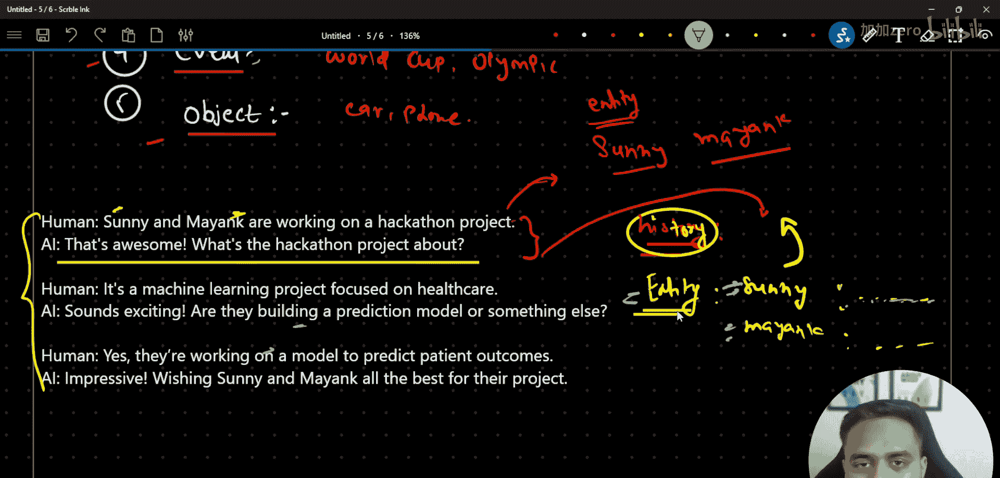
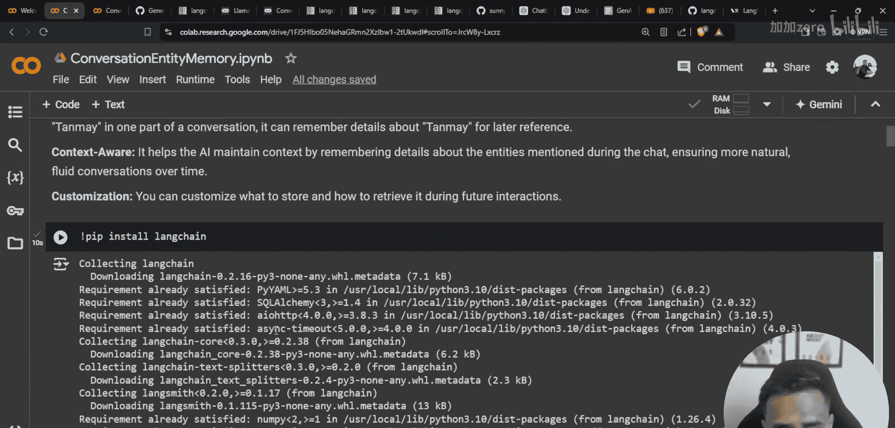

# Langchain 教程：P55：对话实体记忆

在本节课中，我们将学习 Langchain 中的 `ConversationEntityMemory` 类。这是一种高级的记忆机制，它能够从对话历史中识别并提取特定实体（如人名、地点、组织等）的信息，并为每个实体维护独立的记忆摘要。这使得 AI 能够记住与特定实体相关的上下文，从而在后续对话中提供更连贯和个性化的回应。

上一节我们介绍了 `ConversationBufferMemory` 和 `ConversationBufferWindowMemory`，它们分别用于存储完整对话和最近几轮对话。本节中我们来看看如何基于对话中的实体来组织和维持记忆。

## 核心概念：实体记忆

`ConversationEntityMemory` 的核心思想是**基于实体来组织记忆**。它首先会从对话历史中识别出实体，然后为每个实体生成并维护一个独立的摘要。


以下是实体的一些常见例子：
*   **人物**：如 “Sunny”、“Myang”。
*   **地点**：如 “巴黎”、“纽约”、“新德里”。
*   **组织**：如 “谷歌”、“微软”、“NASA”。
*   **事件**：如 “奥运会”、“板球世界杯”。
*   **物体**：如 “汽车”、“手机”。

这个类内部的工作原理可以简化为创建一个字典结构：
```python
{
    “history”: “完整的对话历史”,
    “entities”: {
        “实体A”: “关于实体A的摘要”,
        “实体B”: “关于实体B的摘要”,
        # ... 更多实体
    }
}
```

## 示例解析

为了更好地理解，让我们分析一个简单的对话示例：
*   **人类**：Sunny 和 Myang 都在为黑客松项目工作。
*   **AI**：太棒了！这个黑客松项目是关于什么的？
*   **人类**：这是一个医疗健康领域的机器学习项目。
*   **AI**：听起来很令人兴奋。他们是在构建预测模型还是其他东西？
*   **人类**：是的，他们正在构建一个预测患者结果的模型。

在这个对话中，`ConversationEntityMemory` 会：
1.  存储完整的对话作为 `history`。
2.  识别出实体，例如 **“Sunny”**、**“Myang”**、**“黑客松项目”**。
3.  为每个实体生成摘要。例如，关于 **“Sunny”** 的摘要可能是“正在与 Myang 合作一个医疗健康领域的机器学习黑客松项目”。

当后续对话中提到 “Sunny 的项目进展如何？” 时，AI 就可以参考 “Sunny” 实体的记忆摘要来给出相关回答，而无需重新分析整个冗长的历史记录。

## 实践步骤

接下来，我们将在 Google Colab 中实现 `ConversationEntityMemory`。以下是所需的步骤和库。

首先，我们需要安装并导入必要的库：
```python
# 安装 Langchain 和 OpenAI 库（如果尚未安装）
!pip install langchain openai

# 导入所需模块
from langchain.memory import ConversationEntityMemory
from langchain.chains import ConversationChain
from langchain_openai import ChatOpenAI
import os

# 设置你的 OpenAI API 密钥
os.environ[“OPENAI_API_KEY”] = “你的-api-密钥-在这里”
```

然后，初始化大语言模型、实体记忆和对话链：
```python
# 1. 初始化 LLM
llm = ChatOpenAI(temperature=0)

# 2. 初始化 ConversationEntityMemory
memory = ConversationEntityMemory(llm=llm)

# 3. 创建对话链，将记忆和LLM结合起来
conversation = ConversationChain(
    llm=llm,
    memory=memory,
    verbose=True # 设置为 True 可以看到内部过程
)
```

现在，我们可以开始进行对话了：
```python
# 第一轮对话
response1 = conversation.predict(input=“Sunny 和 Myang 都在为黑客松项目工作。”)
print(“AI:”, response1)

# 第二轮对话
response2 = conversation.predict(input=“这是一个医疗健康领域的机器学习项目。”)
print(“AI:”, response2)
```

运行上述代码后，如果你将 `verbose` 设置为 `True`，你可能会在输出中看到 Langchain 识别出的实体以及为它们更新的记忆。你可以通过以下方式查看当前记忆内容：
```python
# 打印当前存储的实体记忆
print(memory.entity_store.store)
```



## 总结



本节课中我们一起学习了 Langchain 的 `ConversationEntityMemory`。我们了解了它的核心功能是基于对话中识别出的实体（如人、地点、事件）来创建和维护独立的记忆摘要。这种方法使得 AI 能够更精准地记住与特定实体相关的上下文信息，从而在复杂的多轮对话中保持更好的连贯性和相关性。通过实践，我们掌握了如何初始化并使用这个记忆类来构建一个具备实体记忆能力的对话系统。在后续课程中，我们将继续探讨其他类型的记忆机制。