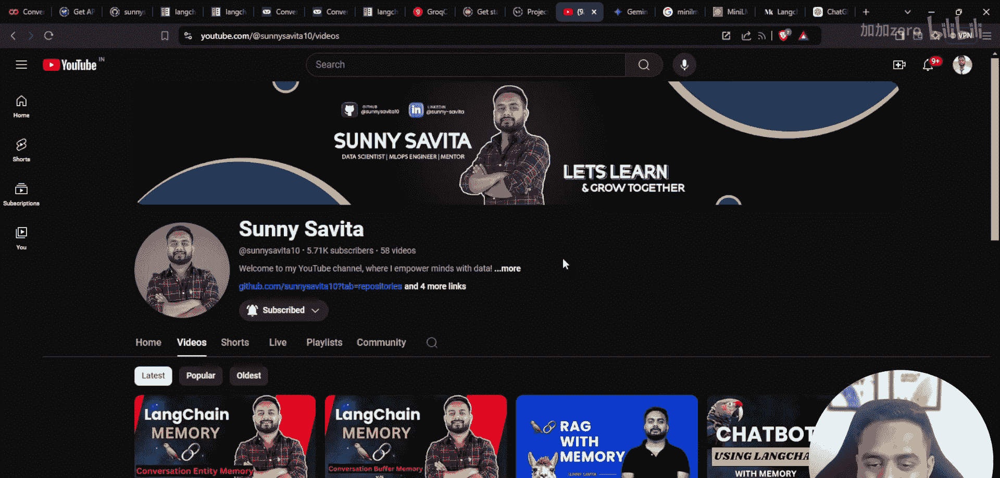
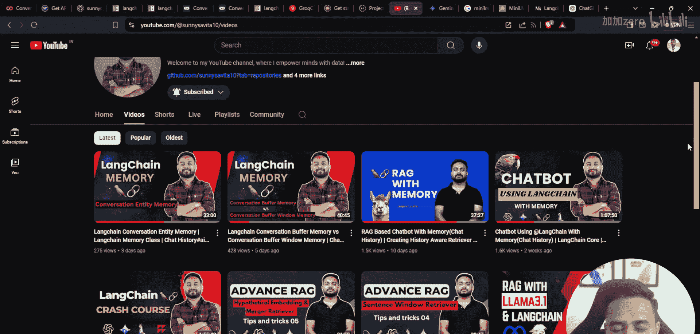
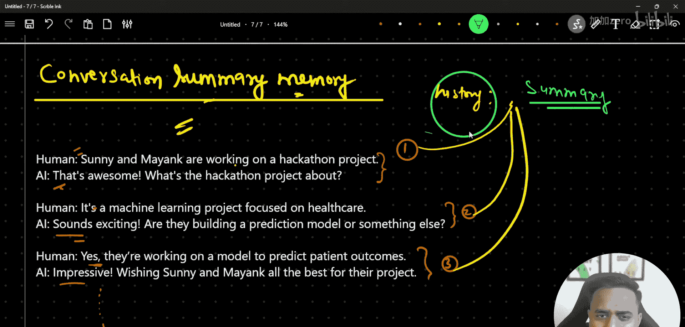
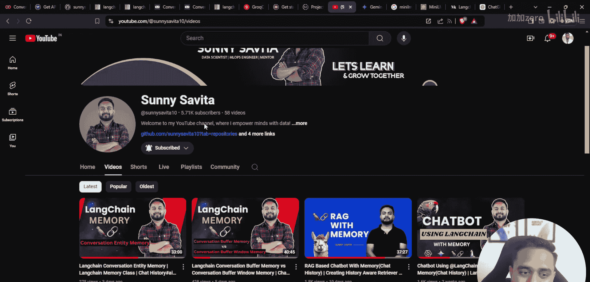
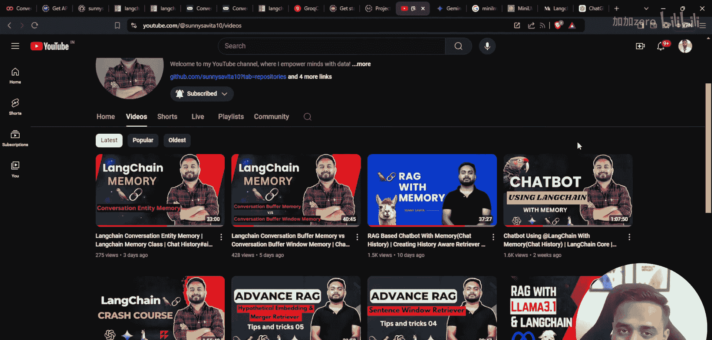
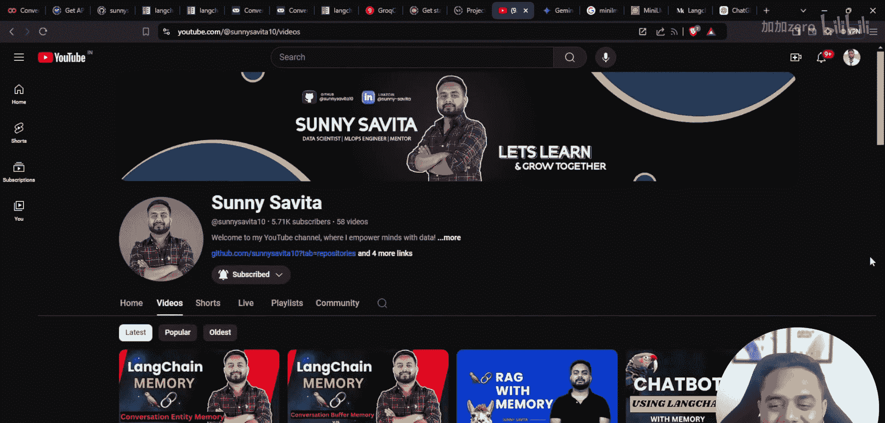
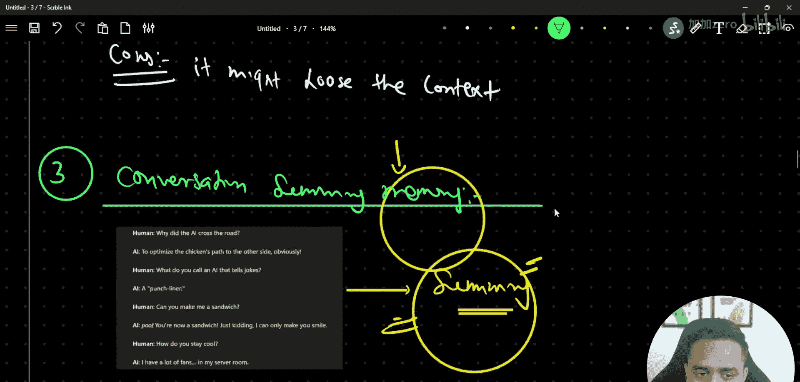
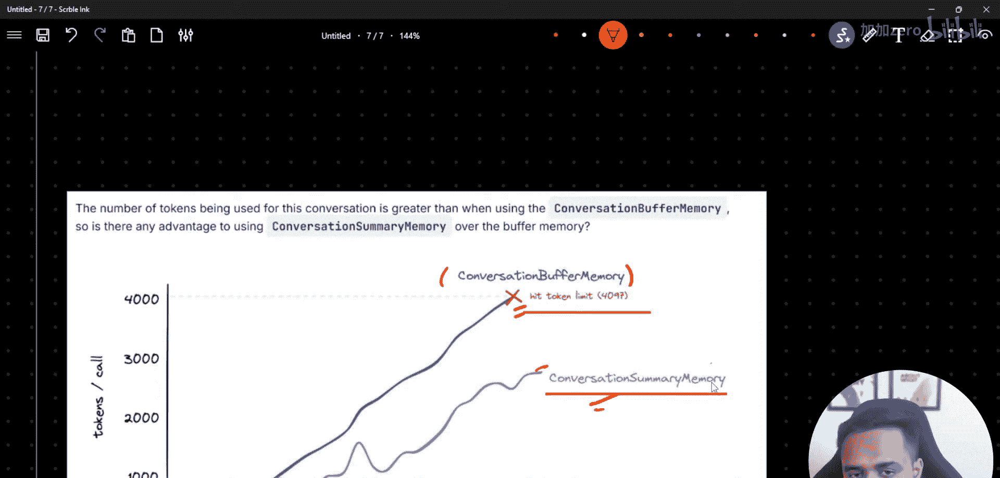
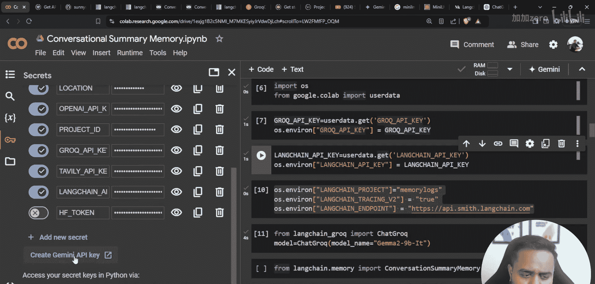

# LangChain 记忆系统详解：P56：对话摘要记忆与对话摘要缓冲记忆 🧠

在本节课中，我们将学习 LangChain 中两种高级记忆管理类：**ConversationSummaryMemory** 和 **ConversationSummaryBufferMemory**。我们将了解它们与之前学过的简单缓冲记忆的区别，理解其核心概念，并通过代码示例掌握其使用方法。

---

## 课程概述

在之前的课程中，我们介绍了如何在基于大语言模型的应用中维持对话状态，包括聊天机器人和 RAG 应用中的记忆管理。我们学习了 `ConversationBufferMemory` 和 `ConversationBufferWindowMemory` 等类。本节课，我们将深入探讨另外两个更高级的记忆类，它们通过生成对话摘要来优化长对话的记忆处理。

---



## 核心概念：为何需要摘要记忆？



上一节我们介绍了直接存储完整对话历史的缓冲记忆。本节中我们来看看，当对话变得非常长时，直接存储所有历史记录会面临什么问题。

核心问题在于，大语言模型通常有上下文长度限制。如果无限制地存储所有对话，最终会触及这个上限，导致模型无法处理或性能下降。

`ConversationSummaryMemory` 的核心思想是：**不存储原始对话，而是存储对话的摘要**。这个摘要由另一个 LLM 生成。通过这种方式，我们可以用固定长度的文本来概括任意长度的对话历史，从而避免触及上下文长度上限。

其优势可以用一个简单的对比来理解：
*   **`ConversationBufferMemory`**: 存储所有对话原文。随着对话轮次 `n` 增加，存储的文本长度线性增长，最终会达到模型上限。
*   **`ConversationSummaryMemory`**: 存储对话摘要。摘要的长度 `m` 是可控且相对固定的，不会随对话轮次 `n` 无限增长。

以下是两种记忆方式随对话轮次增加的存储量对比示意图：







---

## 实践准备：环境配置

在开始编写代码之前，我们需要安装必要的库并配置环境。以下是实现所需的关键步骤：

1.  **安装核心库**：我们需要 `langchain` 框架和社区集成包。
2.  **配置模型**：为了快速推理和演示，我们可以从云端（如 `Ollama`）拉取模型，而不是在本地部署。
3.  **设置追踪**：为了便于调试和观察内部过程，我们将配置 LangSmith 来记录日志。

以下是具体的安装和配置代码：

```python
# 安装必要的Python库
!pip install langchain langchain-community



# 配置环境变量（示例，请替换为你的实际信息）
import os
os.environ["LANGCHAIN_TRACING_V2"] = "true"
os.environ["LANGCHAIN_ENDPOINT"] = "https://api.smith.langchain.com"
os.environ["LANGCHAIN_API_KEY"] = "your_langchain_api_key_here"
os.environ["LANGCHAIN_PROJECT"] = "your_project_name_here"

# 注意：本示例使用Ollama的云端模型进行快速推理。
# 如果你希望使用其他模型（如Google Gemini），需要安装相应的包并配置API密钥。
```

---

## 类一：ConversationSummaryMemory

现在，让我们具体看看 `ConversationSummaryMemory` 是如何工作的。这个类会在每次对话交互后，自动调用一个LLM来生成当前所有对话历史的摘要，并只将这个摘要保存在记忆中。

### 工作原理



假设我们有以下三轮对话：
1.  人类：你好，我叫小明。
2.  AI：你好小明，很高兴认识你。
3.  人类：我喜欢编程和音乐。
4.  AI：很棒的兴趣爱好。
5.  人类：你能推荐一些学习Python的资源吗？

使用 `ConversationBufferMemory`，记忆中将完整保存这5条消息。
而使用 `ConversationSummaryMemory`，记忆中保存的可能是类似这样的摘要：
**“用户小明打招呼并介绍了自己。他提到了喜欢编程和音乐。现在他正在询问学习Python的推荐资源。”**

### 代码示例

以下是如何创建和使用 `ConversationSummaryMemory` 的示例：

```python
from langchain.memory import ConversationSummaryMemory
from langchain.llms import Ollama
from langchain.chains import ConversationChain

# 1. 初始化一个用于生成摘要的LLM
# 注意：通常建议使用一个专门、高效的模型来生成摘要，以节省主模型的token。
summary_llm = Ollama(model="llama3.2")

# 2. 创建 ConversationSummaryMemory 实例
memory = ConversationSummaryMemory(llm=summary_llm, return_messages=True)

# 3. 创建用于对话的主LLM
conversation_llm = Ollama(model="llama3.2")

# 4. 将记忆和LLM组合成对话链
conversation = ConversationChain(
    llm=conversation_llm,
    memory=memory,
    verbose=True # 开启详细日志，观察摘要生成过程
)

# 5. 进行对话
print(conversation.predict(input="你好，我叫小明。"))
print(conversation.predict(input="我喜欢编程和音乐。"))
print(conversation.predict(input="你能推荐一些学习Python的资源吗？"))

# 6. 查看当前记忆中的内容（此时是摘要，而非原始对话）
print("\n--- 当前记忆摘要 ---")
print(memory.buffer)
```

运行上述代码，你会在日志中看到模型如何生成摘要，并且 `memory.buffer` 中存储的是不断更新的对话摘要。

---

## 类二：ConversationSummaryBufferMemory


了解了基础的摘要记忆后，我们来看一个更灵活的变体：`ConversationSummaryBufferMemory`。它结合了“缓冲”和“摘要”两种策略。

### 核心机制

`ConversationSummaryBufferMemory` 的行为是：
1.  它会保留最近 `k` 轮对话的**原始消息**（缓冲部分）。
2.  对于 `k` 轮之前的更早对话，它则使用 `ConversationSummaryMemory` 的机制，将其压缩成一份**摘要**。
3.  最终，提供给模型的上下文 = **最近 `k` 轮原始对话 + 更早对话的摘要**。

这种方式既保证了模型能获得最近对话的精确细节，又通过摘要保留了长期背景，同时严格控制了上下文的总长度。

其工作流程可以概括为以下公式：
**最终上下文 = `buffer`(最近N条消息) + `summary`(更早的消息)**

### 代码示例

以下是 `ConversationSummaryBufferMemory` 的使用方法：

```python
from langchain.memory import ConversationSummaryBufferMemory

# 1. 创建 ConversationSummaryBufferMemory 实例
# max_token_limit 参数定义了保留在缓冲区的最大token数量。
# 当新消息加入导致总token数超过此限制时，最早的对话会被移出缓冲区并合并到摘要中。
buffer_memory = ConversationSummaryBufferMemory(
    llm=summary_llm, # 用于生成摘要的LLM
    max_token_limit=100, # 设置缓冲区最大token数
    return_messages=True
)

# 2. 创建新的对话链
conversation_with_buffer = ConversationChain(
    llm=conversation_llm,
    memory=buffer_memory,
    verbose=True
)

# 3. 进行多轮对话，观察记忆如何管理
for i in range(10):
    user_input = f"这是第{i+1}条测试消息。"
    print(f"\n用户: {user_input}")
    response = conversation_with_buffer.predict(input=user_input)
    print(f"AI: {response}")



# 4. 查看最终的记忆状态
# 此时，buffer_memory.buffer 里包含的是“最近原始对话 + 早期摘要”的混合体。
print("\n--- 最终混合记忆 ---")
# 注意：直接打印buffer可能显示为LangChain的消息对象列表
# 可以使用 memory.load_memory_variables({}) 来查看
print(buffer_memory.load_memory_variables({}))
```

---

## 两种记忆类的对比与选择

我们已经学习了两种摘要记忆类，现在来总结一下它们的特点和适用场景。

以下是 `ConversationSummaryMemory` 和 `ConversationSummaryBufferMemory` 的关键区别：

*   **存储内容**：
    *   `ConversationSummaryMemory`：仅存储由LLM生成的对话摘要。
    *   `ConversationSummaryBufferMemory`：存储“最近原始对话 + 早期对话摘要”的混合体。
*   **细节保留**：
    *   `ConversationSummaryMemory`：可能会丢失具体细节，因为摘要是一个概括。
    *   `ConversationSummaryBufferMemory`：能保留最近对话的完整细节。
*   **上下文长度控制**：
    *   两者都能有效控制长对话的上下文长度。
    *   `ConversationSummaryBufferMemory` 的控制更精细，通过 `max_token_limit` 参数调节。
*   **计算开销**：
    *   `ConversationSummaryMemory`：每次交互后都需要调用LLM生成摘要，开销恒定。
    *   `ConversationSummaryBufferMemory`：仅在缓冲区溢出、需要将消息移入摘要时才调用LLM，通常开销更低。
*   **适用场景**：
    *   `ConversationSummaryMemory`：适用于对历史细节要求不高，但需要维持长期背景的通用聊天场景。
    *   `ConversationSummaryBufferMemory`：适用于既需要长期背景，又对最近交互细节有要求的场景，如技术支持、复杂任务对话等。

选择建议：在大多数需要处理长对话的应用中，`ConversationSummaryBufferMemory` 是更优、更实用的选择。

---

## 课程总结

本节课中我们一起学习了 LangChain 中两种高级的记忆管理策略。

我们首先回顾了长对话带来的上下文长度挑战，然后深入探讨了 `ConversationSummaryMemory` 如何通过将完整历史压缩成摘要来解决这个问题。接着，我们学习了更强大的 `ConversationSummaryBufferMemory`，它巧妙地结合了保留最近原始对话和摘要早期对话的优点，提供了对上下文长度和细节保留的平衡控制。

通过本课的学习，你现在应该能够：
1.  理解在LLM应用中管理长对话记忆的必要性。
2.  解释 `ConversationSummaryMemory` 和 `ConversationBufferMemory` 的根本区别。
3.  在代码中正确初始化和使用 `ConversationSummaryMemory`。
4.  理解 `ConversationSummaryBufferMemory` 的混合缓冲机制。
5.  根据应用场景，在几种记忆类中做出合适的选择。



掌握这些记忆技术，将使你能够构建出更健壮、更能处理复杂多轮交互的智能对话应用。