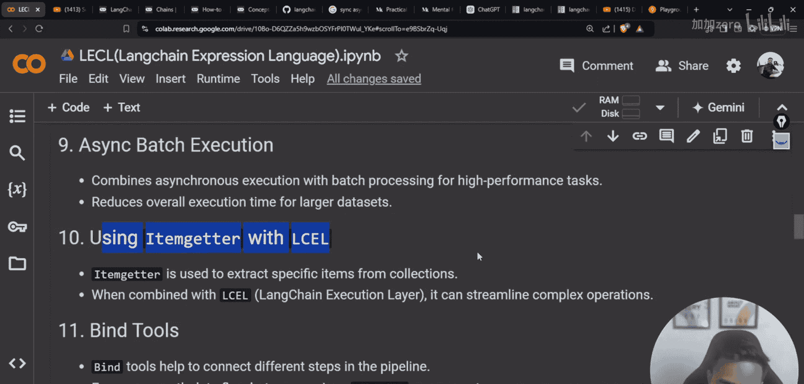
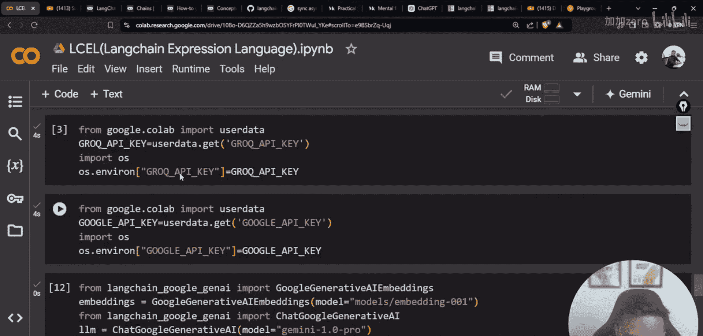
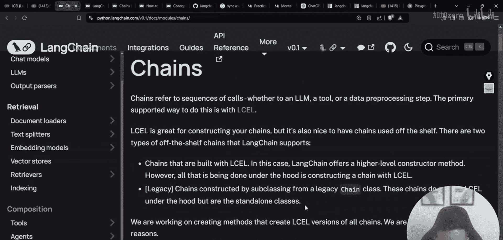
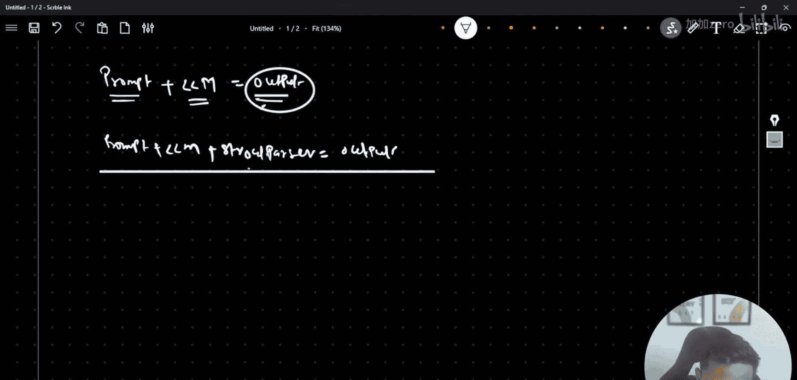
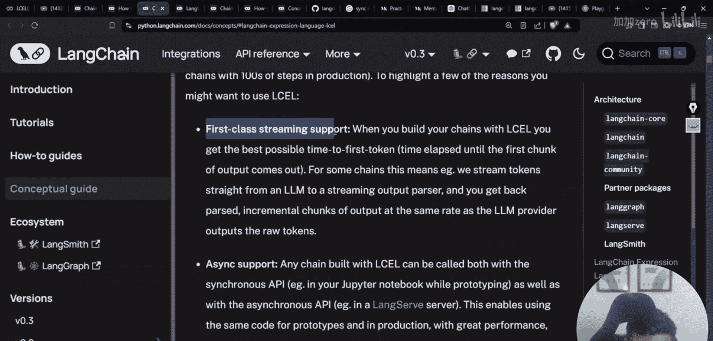
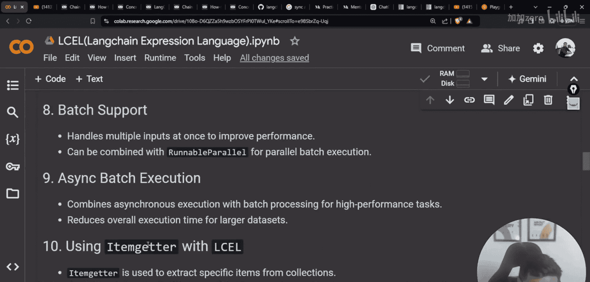

# 生成式AI：从初学者到专家：P57：使用LangChain表达式语言（LCEL）链接组件

在本节课中，我们将学习LangChain表达式语言（LCEL）。LCEL是一种用于声明式地链接不同组件（如提示模板、大语言模型和输出解析器）以构建复杂应用的方法。我们将了解其基本概念、语法以及如何利用它来创建高效的应用链。

## 概述

LangChain表达式语言（LCEL）旨在简化构建基于大语言模型应用的过程。它提供了一种使用管道操作符（`|`）连接组件的直观方式，取代了早期版本中较为复杂的类继承方法。本节将介绍LCEL的核心概念、优势以及实际应用。


## 从传统链式方法到LCEL

上一节我们介绍了构建应用链的基本概念。在LangChain的早期版本中，开发者需要使用特定的类（如 `LLMChain`、`ConversationChain`）来创建链。这些类虽然功能强大，但有时显得不够灵活。

本节中我们来看看LCEL如何提供一种更简洁、更声明式的替代方案。LCEL允许你使用类似 `prompt | llm | output_parser` 的语法来构建链，这使得代码更易读、更易维护。

以下是LCEL与传统链式方法的一些关键区别：
*   **声明式语法**：使用管道操作符 `|` 连接组件，代码意图更清晰。
*   **统一接口**：所有可链接的组件都实现了 `Runnable` 接口，保证了接口的一致性。
*   **内置优化**：LCEL链自动支持流式输出、异步调用和并行处理等高级功能。

## LCEL的核心：Runnable对象

LCEL的基础是所有组件都实现了 `Runnable` 接口。这意味着任何可以作为链一部分的对象（如提示模板、模型、函数）都必须遵循这个通用协议。

以下是几种常见的 `Runnable` 类型：
*   **`RunnableParallel`**：用于并行执行多个 `Runnable` 对象，并将结果合并。
*   **`RunnablePassthrough`**：一个特殊的 `Runnable`，它将其输入原封不动地传递下去，或者分配一个新的值。常用于在链中传递中间数据。
*   **`RunnableLambda`**：允许你将普通的Python函数包装成 `Runnable` 对象，从而集成自定义逻辑。

## 构建你的第一个LCEL链

理解了 `Runnable` 的概念后，我们现在可以动手构建一个简单的链。一个最基本的链通常包含三个部分：提示模板、大语言模型和输出解析器。




以下是一个使用LCEL构建简单问答链的代码示例：

```python
from langchain.prompts import ChatPromptTemplate
from langchain.chat_models import ChatOpenAI
from langchain.schema.output_parser import StrOutputParser

# 1. 定义提示模板
prompt = ChatPromptTemplate.from_template("请用一句话回答：{question}")

# 2. 初始化大语言模型
model = ChatOpenAI(model="gpt-3.5-turbo")



# 3. 定义输出解析器（这里简单地将输出转换为字符串）
output_parser = StrOutputParser()

# 4. 使用 LCEL 的管道操作符构建链
chain = prompt | model | output_parser

# 5. 调用链
response = chain.invoke({"question": "天空为什么是蓝色的？"})
print(response)
```



## 使用 `RunnableParallel` 和 `itemgetter` 处理复杂输入

在实际应用中，我们经常需要处理来自多个来源的输入。LCEL提供了 `RunnableParallel` 和 `itemgetter` 来优雅地处理这种情况。

假设我们的提示模板需要用户问题和一些上下文信息，我们可以这样构建链：

```python
from langchain.schema.runnable import RunnableParallel, RunnablePassthrough

# 假设我们有一个函数用于检索相关上下文
def retrieve_context(question):
    # 这里是模拟的检索逻辑
    return f"与'{question}'相关的上下文信息。"

# 构建一个并行处理输入的子链
input_processor = RunnableParallel({
    "question": RunnablePassthrough(), # 直接传递原始问题
    "context": lambda x: retrieve_context(x["question"]) # 根据问题检索上下文
})

# 定义提示模板，它现在期待 `question` 和 `context` 两个变量
prompt = ChatPromptTemplate.from_template("基于以下上下文：{context}\n\n请回答问题：{question}")

# 构建完整的链
chain = input_processor | prompt | model | output_parser

# 调用链
response = chain.invoke({"question": "什么是机器学习？"})
print(response)
```

## 性能优化：异步与流式处理

LCEL链天然支持异步调用和流式输出，这能极大提升应用的响应速度和用户体验。

**异步调用**可以提高处理多个并发请求的效率：
```python
import asyncio



async def async_invoke():
    response = await chain.ainvoke({"question": "异步调用的优势是什么？"})
    print(response)

# 运行异步函数
asyncio.run(async_invoke())
```

**流式处理**允许我们逐步获取模型的输出，而不是等待全部生成完毕：
```python
for chunk in chain.stream({"question": "请解释一下流式输出。"}):
    print(chunk, end="", flush=True) # 逐块打印输出
```

## 在RAG管道中应用LCEL

检索增强生成（RAG）是LCEL的一个典型应用场景。我们可以轻松地将检索器、提示模板和语言模型链接起来。

以下是一个简化的RAG管道示例：

```python
from langchain.embeddings import OpenAIEmbeddings
from langchain.vectorstores import Chroma
from langchain.schema.runnable import RunnablePassthrough

# 1. 假设我们已经有一个加载了文档的向量数据库
vectorstore = Chroma(persist_directory="./my_db", embedding_function=OpenAIEmbeddings())
retriever = vectorstore.as_retriever()

# 2. 定义提示模板
prompt = ChatPromptTemplate.from_template("""
请根据以下上下文回答问题。如果上下文不包含答案，请说“我无法根据提供的信息回答这个问题”。

上下文：{context}

问题：{question}
""")

# 3. 构建RAG链
rag_chain = (
    {"context": retriever, "question": RunnablePassthrough()}
    | prompt
    | model
    | output_parser
)

# 4. 提问
answer = rag_chain.invoke("LangChain是什么？")
print(answer)
```

## 总结





本节课中我们一起学习了LangChain表达式语言（LCEL）。我们从其设计动机开始，了解了它如何通过声明式的管道语法简化组件链接。我们探讨了 `Runnable` 接口的核心地位，并实践了如何使用 `RunnableParallel`、`itemgetter` 等工具构建复杂的数据流。此外，我们还看到了LCEL在性能优化（异步、流式）和实际应用（如RAG）中的强大能力。掌握LCEL是构建高效、可维护LangChain应用的关键一步。