# 生成式AI：从初学者到专家：P58：LangGraph端到端课程大纲介绍 🗺️

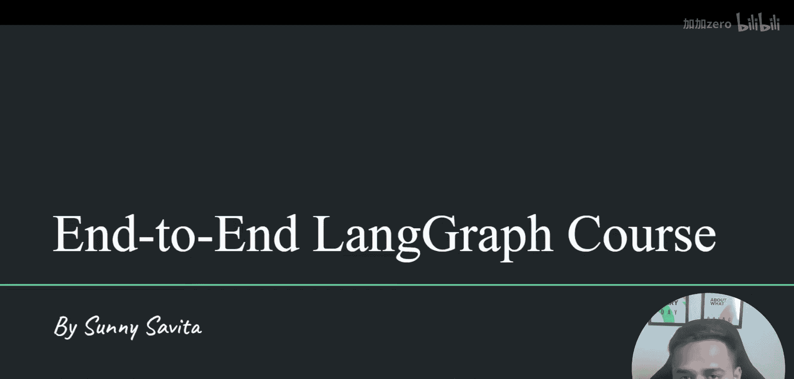

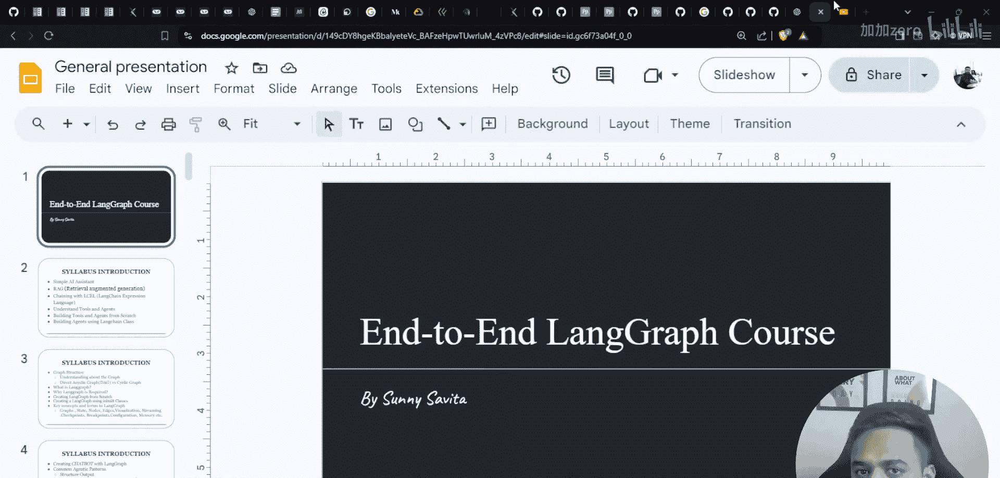

在本节课中，我们将介绍一个关于LangGraph的端到端课程。本课程旨在帮助您从基础概念开始，逐步掌握LangGraph的核心知识，并最终能够构建复杂的多智能体系统和实际项目。

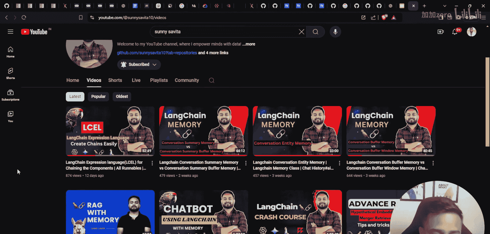

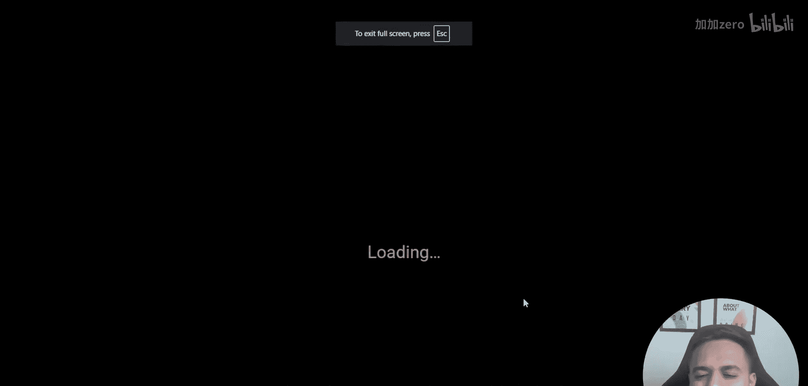

## 课程背景与现有资源

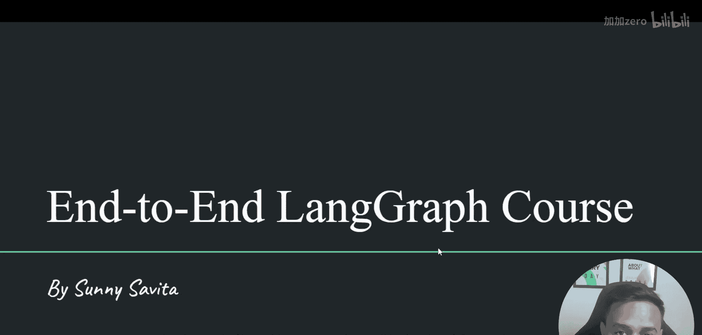

上一节我们介绍了课程的整体目标，本节中我们来看看课程开设的背景以及讲师已有的相关资源。

我已在YouTube频道上传了许多关于LangChain和RAG（检索增强生成）的视频。如果您访问我的频道并查看播放列表，会发现两个关于RAG的专题：一个基础版和一个高级版。此外，还有关于记忆管理、LangChain Expression Language（LCEL）等主题的视频。这些内容将帮助您学习和理解生成式AI的相关知识。

## 完整课程大纲

以下是本LangGraph端到端课程将涵盖的核心内容，预计通过10到15个视频完成。

1.  **基础概念与构建模块**
    *   **简单助手**：理解什么是简单的AI助手。
    *   **链与LCEL**：学习LangChain中的链（Chain）以及LangChain Expression Language。
    *   **智能体与工具**：深入探讨智能体（Agent）的概念，并使用Python从零开始构建智能体和工具。
    *   **LangChain类**：学习如何使用LangChain的内置类。这部分对于理解LangGraph至关重要，因为如果您不熟悉智能体、工具（如ReAct、Self-Ask等不同模式），将难以理解LangGraph的设计理念。

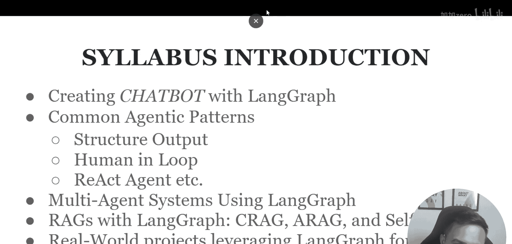

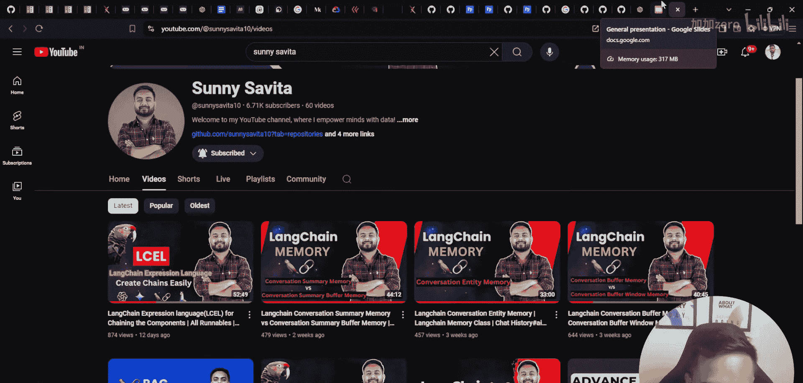

2.  **LangGraph核心**
    *   **图结构理论**：讨论图结构的需求，区分有环图和无环图，并明确LangGraph创建的是哪种图。
    *   **LangGraph理论详解**：通过详细的幻灯片讲解LangGraph的理论知识。
    *   **实践实现**：使用Python从零开始编写脚本创建LangGraph，并学习使用其内置类。
    *   **核心术语**：理解LangGraph引入的关键术语，例如：
        *   `Graph`
        *   `State`
        *   `Node`
        *   `Edge`
        *   `Visualization`
        *   `Streaming`
        *   `Checkpointing`
        *   `Configuration`
        *   `Memory`

3.  **高级应用与项目**
    *   **自定义聊天机器人**：使用LangGraph构建自定义的聊天机器人。
    *   **常见智能体模式**：详细讨论并编码实现结构化输出、人工循环、ReAct等常见的智能体模式。
    *   **多智能体系统**：深入探讨多智能体系统，这是非常重要的一部分。
    *   **多种RAG实现**：使用LangGraph创建不同类型的RAG系统，例如：
        *   纠正性RAG
        *   智能体RAG
        *   自省RAG
    *   **真实世界项目**：最终将所学知识应用于构建真实的项目。

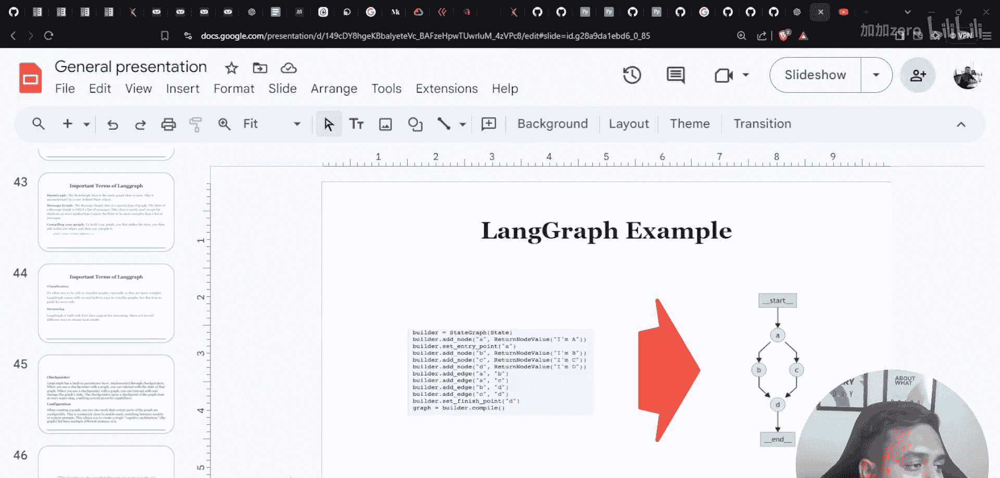

## 学习准备与环境设置

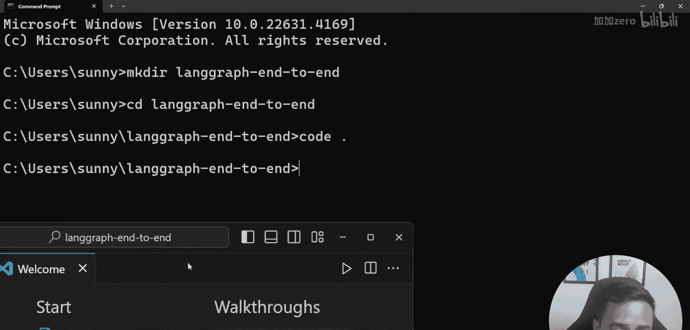

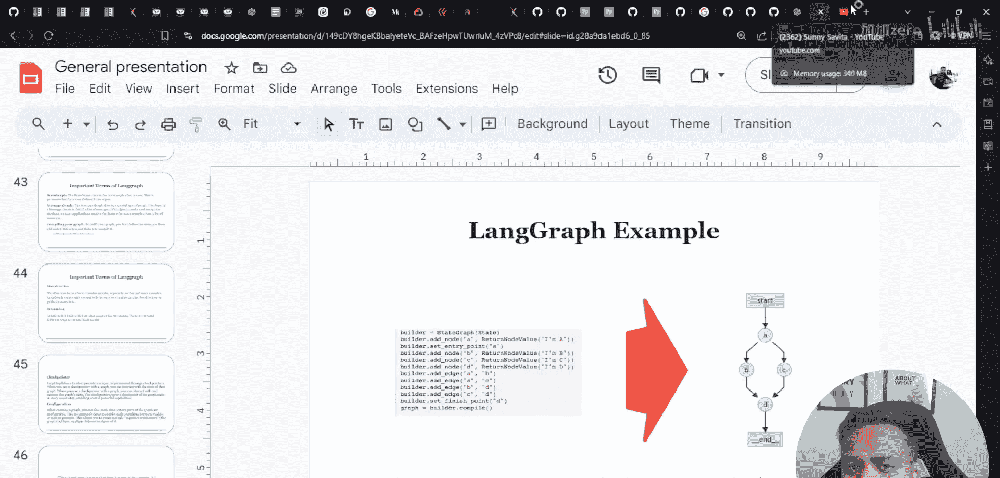

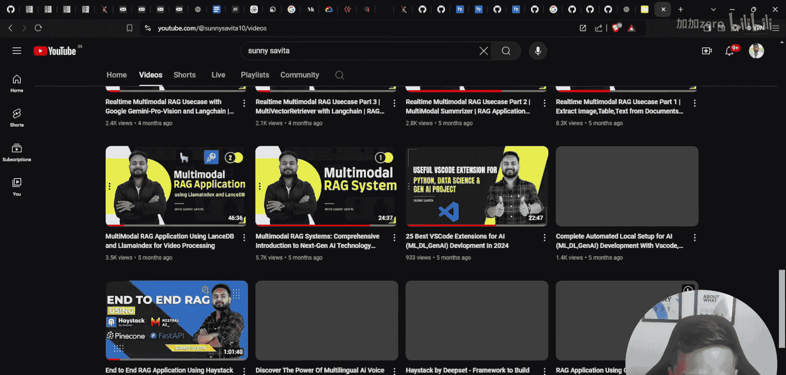

在开始观看下一个视频进行实际编码之前，建议您按照以下步骤设置好开发环境。

1.  **创建项目目录**：打开命令行，创建一个名为`langgraph`的目录，并进入该目录。
    ```bash
    mkdir langgraph
    cd langgraph
    ```
2.  **启动VS Code**：从该目录启动VS Code编辑器。
3.  **创建虚拟环境**：在VS Code中打开终端，创建一个Python虚拟环境。您可以使用Conda或Python内置的`venv`。
    *   **使用Conda**（示例）：
        ```bash
        conda create -p ./venv python=3.10
        ```
    *   **使用Python venv**：
        ```bash
        python -m venv venv
        ```
4.  **激活环境与准备依赖**：激活创建的环境，并创建一个`requirements.txt`文件。在后续课程中，将向您介绍需要安装的具体库和所需的Notebook文件。

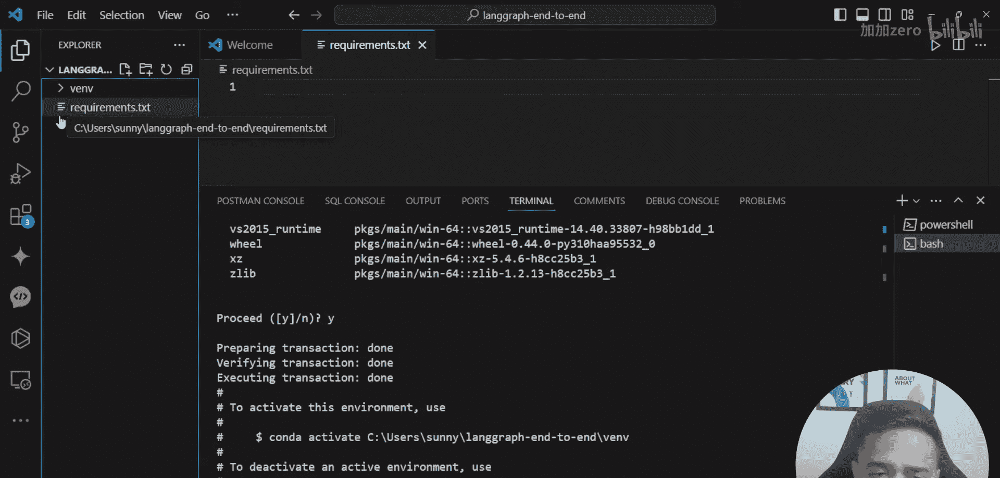

本节课中我们一起学习了即将开始的LangGraph端到端课程的完整大纲、学习背景以及初步的环境设置步骤。从基础概念到高级多智能体系统，本课程将为您提供全面的指导。请准备好环境，我们即将开始深入探索LangGraph的世界。