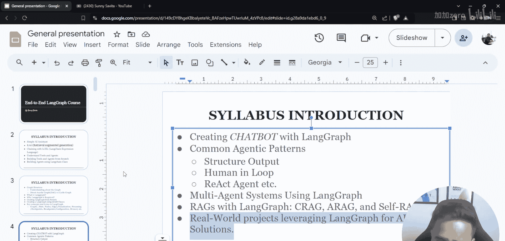
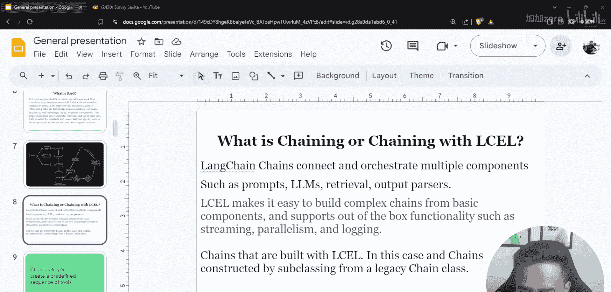
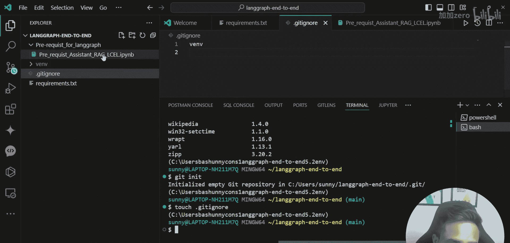
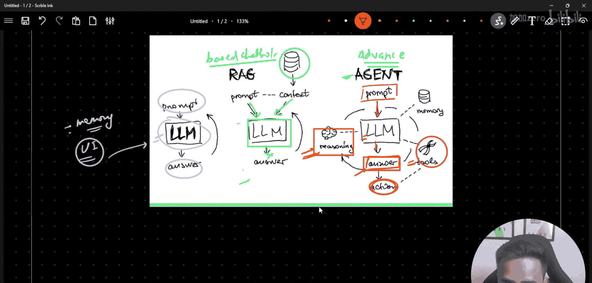
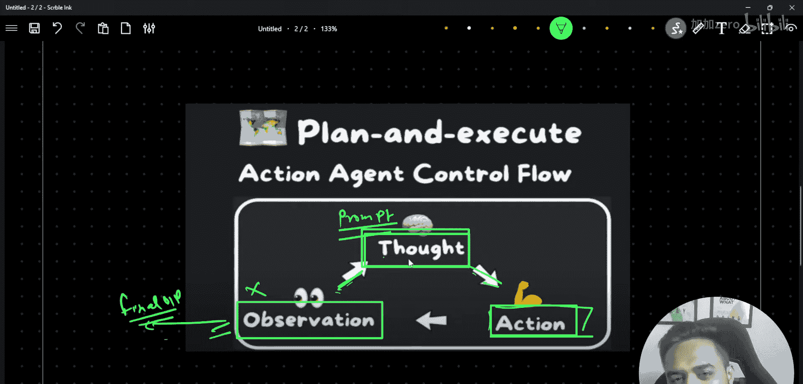
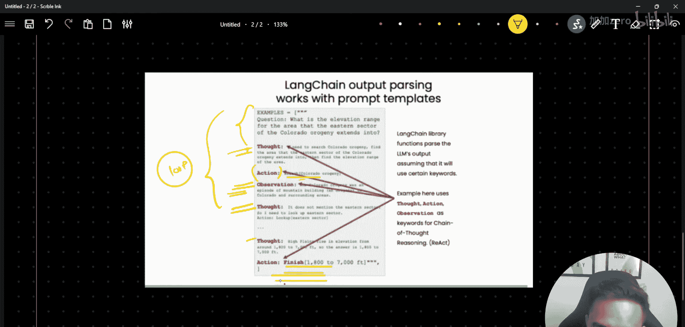
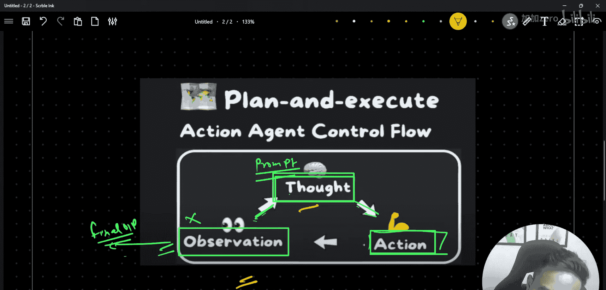
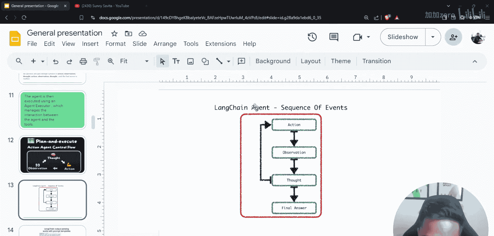

# LangGraph课程：01：课程预备知识概述 🚀

在本节课中，我们将学习LangGraph课程所需的预备知识。我们将介绍AI助手、RAG、LCEL和工具等核心概念，为后续深入学习LangGraph打下坚实基础。

## 环境设置 💻

上一节我们介绍了课程的整体目标，本节中我们来看看如何搭建开发环境。

首先，你需要创建一个虚拟环境并安装必要的库。以下是具体步骤：

以下是环境设置步骤：
1.  打开终端。
2.  激活虚拟环境：`source ./venv/bin/activate`。
3.  使用 `pip list` 命令检查已安装的库。

项目所需的库都列在 `requirements.txt` 文件中。

以下是 `requirements.txt` 文件中的核心库：
*   `langchain`
*   `langchain-community`
*   `tiktoken`
*   `langchainhub`
*   `chromadb`
*   `langgraph`
*   `tabulate`
*   `python-dotenv`

后续课程中我们会逐一介绍这些库的用途。此外，我们还初始化了Git仓库并创建了 `.gitignore` 文件，以避免将虚拟环境目录 `venv/` 提交到代码库。

## 三种AI助手类型 🤖

在开始编码之前，理解不同类型的AI助手至关重要。我们将依次介绍简单助手、RAG助手和智能体助手。

### 简单助手

简单助手是最基础的形态。其工作流程可以概括为：**用户输入 -> 大语言模型(LLM) -> 生成回答**。

你可以在此基础上添加用户界面(UI)、记忆功能或多模态输入（如图像），但它本质上仍是一个直接调用LLM的问答系统。

### RAG助手

RAG（检索增强生成）助手在简单助手的基础上连接了一个知识库。

其工作流程是：**用户输入 -> 从知识库检索相关信息 -> 将检索到的信息与用户输入一同传递给LLM -> 生成回答**。

当需要处理LLM本身不具备的领域特定知识时，RAG架构非常有用。公式可以表示为：`Answer = LLM(User_Query + Retrieved_Context)`。

### 智能体助手

智能体助手是一种更高级的助手，它引入了一个关键的循环机制。其核心思想是“思考-行动-观察”循环。

以下是智能体的工作流程：
1.  **思考**：LLM分析用户输入，决定下一步行动。
2.  **行动**：根据思考结果执行动作，例如调用一个外部工具（Tool）进行计算、搜索或查询。
3.  **观察**：获取行动的结果（例如工具返回的数据）。
4.  **循环**：基于观察结果，再次进行“思考”，决定是继续行动还是给出最终答案。

这个循环会持续进行，直到智能体认为已经获得了令人满意的结果，然后输出最终答案。因此，智能体能够通过工具使用和迭代推理来处理更复杂的任务。

## 总结 📝

本节课中我们一起学习了LangGraph课程的预备知识。我们完成了开发环境的设置，并重点区分了三种AI助手：直接应答的**简单助手**、利用外部知识库的**RAG助手**，以及能够通过“思考-行动-观察”循环使用工具解决复杂问题的**智能体助手**。理解这些基础概念对于后续学习LangGraph框架至关重要。