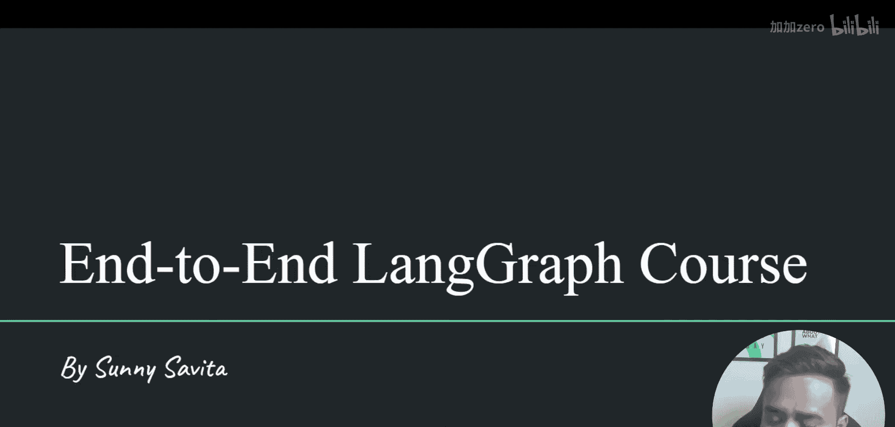
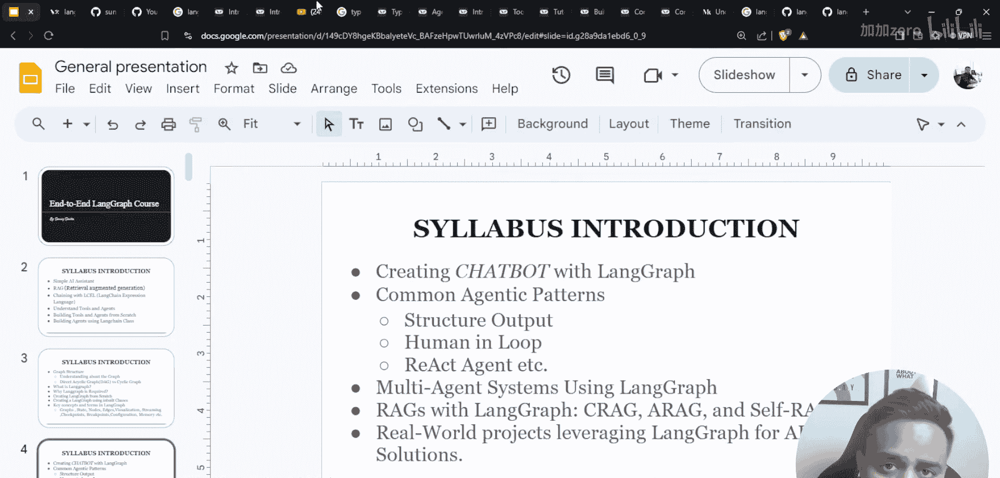
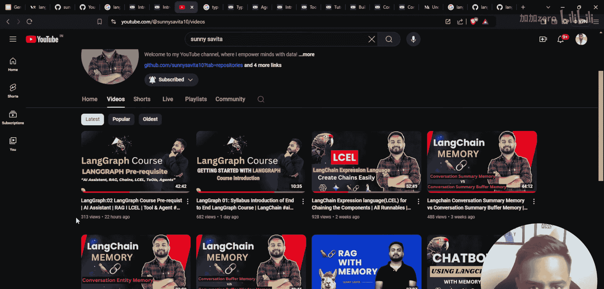
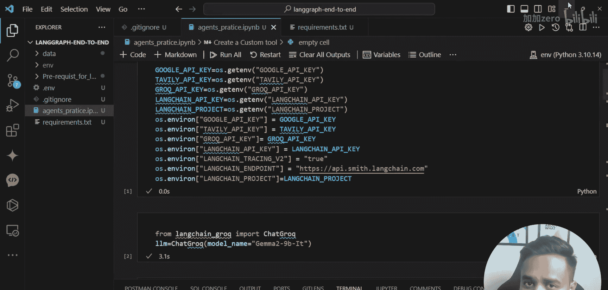
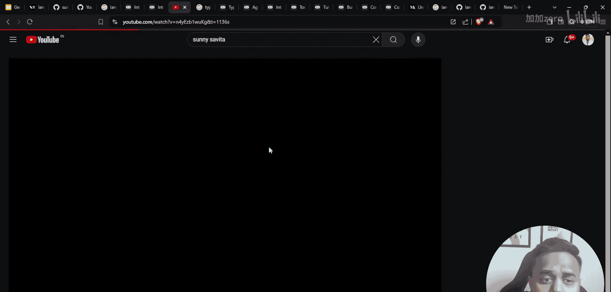
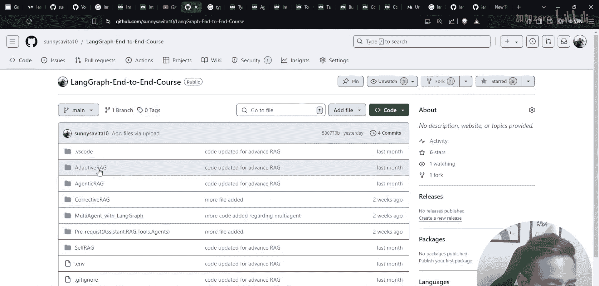
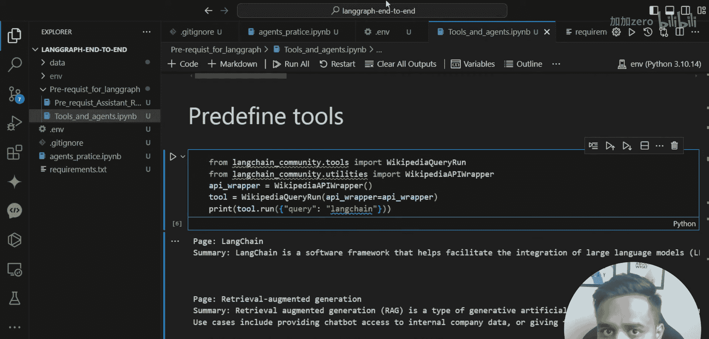

# LangGraph课程：03：LangChain AI代理、工具与ReAct代理

## 概述

在本节课中，我们将学习LangChain中的AI代理、工具以及ReAct代理的核心概念。我们将从理解代理的基本定义开始，逐步探索如何创建和使用工具，并最终构建一个能够自主推理和行动的智能代理系统。课程内容设计得简单直白，适合初学者理解。

## 什么是AI代理？

上一节我们介绍了LangGraph课程的整体结构。本节中，我们来看看AI代理的核心概念。

代理本质上是一个智能助手。与简单的执行链不同，代理能够在循环内部进行自主思考和推理，并根据推理结果做出决策。在LangChain的最新版本中，传统的代理类已直接整合到LangGraph框架中。

## 工具：代理的“双手”

代理需要通过工具来执行具体操作。工具是预定义的功能模块，为代理提供与外界交互和执行任务的能力。

以下是创建一个自定义工具的步骤：



1.  **定义工具函数**：首先，创建一个能完成特定任务的Python函数。
2.  **使用`@tool`装饰器**：使用LangChain提供的`@tool`装饰器来包装这个函数，使其成为一个标准的工具。
3.  **描述工具功能**：为工具提供清晰的名称和描述，以便代理理解何时以及如何使用它。

```python
from langchain.tools import tool

@tool
def get_weather(city: str) -> str:
    """根据城市名称查询天气信息。"""
    # 这里可以接入真实的天气API
    return f"{city}的天气是晴朗的，25摄氏度。"
```

## 构建代理：从理论到实践

理解了工具之后，我们就可以开始构建代理了。我们将使用LangChain提供的类来快速创建一个具备工具调用能力的代理。

以下是使用`create_react_agent`函数构建一个ReAct代理的关键步骤：



1.  **准备模型**：初始化一个大语言模型，例如通过Groq或OpenAI API。
2.  **准备工具列表**：将我们定义好的工具放入一个列表中。
3.  **创建代理**：调用`create_react_agent`函数，传入模型和工具列表。
4.  **运行代理**：通过代理执行器来运行代理，处理用户的查询。



```python
from langchain import hub
from langchain.agents import create_react_agent, AgentExecutor

# 1. 拉取ReAct提示词模板
prompt = hub.pull("hwchase17/react")

# 2. 创建代理
agent = create_react_agent(llm, tools, prompt)





# 3. 创建代理执行器
agent_executor = AgentExecutor(agent=agent, tools=tools, verbose=True)



# 4. 运行代理
result = agent_executor.invoke({"input": "北京现在的天气怎么样？"})
print(result["output"])
```

## ReAct代理框架详解

我们刚刚快速构建了一个代理。现在，让我们深入了解一下其背后的ReAct框架。

ReAct（Reasoning + Acting）是一个让代理协同进行**推理**和**行动**的框架。其核心思想是让模型生成可解释的推理步骤和具体的行动指令。

**公式表示**：`ReAct = 内部推理链 + 外部工具调用`

代理的工作流程是一个循环：
1.  **思考**：分析当前情况和目标。
2.  **行动**：决定调用哪个工具，并生成调用参数。
3.  **观察**：获取工具执行的结果。
4.  **循环**：基于观察结果，再次进行思考，直到问题解决或达到终止条件。

## 从零开始编码ReAct代理

为了更深刻地理解代理的机制，我们将暂时抛开高级框架，尝试用Python从零开始实现一个简化版的ReAct代理逻辑。

以下是实现核心循环的关键代码结构：

```python
def simple_react_agent(question, tools, max_steps=5):
    context = ""
    for step in range(max_steps):
        # 1. 推理阶段：生成思考步骤和下一步行动
        prompt = f"""
        上下文：{context}
        问题：{question}
        请思考下一步该做什么。你可以选择：
        - 使用工具：格式为 ‘Action: 工具名 参数‘
        - 最终回答：格式为 ‘Final Answer: 你的答案‘
        你的响应：
        """
        response = llm.invoke(prompt)

        # 2. 解析响应，判断是执行工具还是给出最终答案
        if "Final Answer:" in response:
            return response.split("Final Answer:")[-1].strip()
        elif "Action:" in response:
            # 解析出工具名和参数
            # 找到对应的工具函数并执行
            # 将执行结果作为新的‘观察‘添加到context中
            context += f"\nObservation: {tool_result}"
        else:
            # 处理意外响应
            break
    return "未能找到答案。"
```

## 总结



本节课中我们一起学习了LangChain中AI代理的核心知识。我们首先定义了代理作为智能助手的概念，然后学习了如何创建和使用工具来扩展代理的能力。接着，我们使用LangChain的高级API快速构建了一个ReAct代理，并深入剖析了ReAct框架协同推理与行动的机制。最后，为了巩固理解，我们还从零开始编写了一个简化版的代理逻辑循环。掌握这些基础是后续学习更复杂的多代理系统和LangGraph高级模式的关键。