# LangGraph课程：04：LangChain ReAct智能体与自定义工具及Self-Ask智能体

## 概述

在本节课中，我们将学习LangChain中的两种重要智能体模式：ReAct智能体与Self-Ask智能体。我们将了解如何为智能体创建自定义工具，并探索如何将检索增强生成（RAG）系统作为工具集成到智能体中。课程将从基础概念开始，逐步过渡到代码实现，确保初学者能够跟上。

---

## 智能体基础概念

上一节我们介绍了工具调用智能体，本节中我们来看看智能体的核心架构。智能体本质上是一个由大型语言模型驱动的系统。它接收包含各种指令的提示词作为输入。当语言模型自身无法直接回答问题时，智能体可以调用外部工具来获取信息或执行操作，并基于工具的返回结果生成最终答案。

智能体的基本组件可以用以下伪代码表示：

```python
智能体 = 语言模型 + 工具集 + 提示词 + （可选）记忆
```

此外，我们还可以为智能体连接记忆模块，使其能够记住对话的上下文和历史状态。目前，LangChain支持多种智能体模式，包括工具调用、结构化聊天、ReAct和Self-Ask with Search等。

---


## 课程议程与准备工作

以下是本节课将要完成的主要内容：

1.  为现有的工具调用智能体添加一个新的RAG工具。
2.  编码实现一个使用自定义工具的ReAct智能体。
3.  探讨LangChain最新版本中对智能体类的支持情况。
4.  实现并理解Self-Ask with Search智能体。

在开始编码之前，请确保你已经查看了本系列课程的前三个视频，并下载了相关的代码和演示文稿。你可以在视频描述中找到GitHub仓库的链接，其中包含了完整的代码和本课程使用的幻灯片。

---

## 扩展工具调用智能体：添加RAG工具

在之前的代码中，我们已经实现了几个工具，例如维基百科搜索工具、YouTube搜索工具和网页爬取工具。现在，我们将创建一个自定义工具，并将一个RAG系统集成进去。

首先，回顾一下我们已有的工具设置代码框架：

```python
# 示例结构：初始化工具
from langchain.tools import WikipediaQueryRun, YouTubeSearchTool

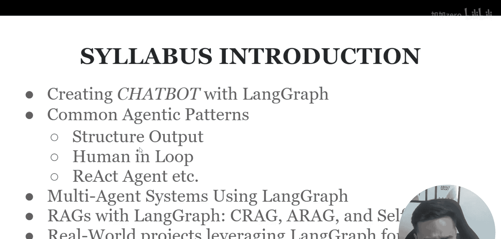

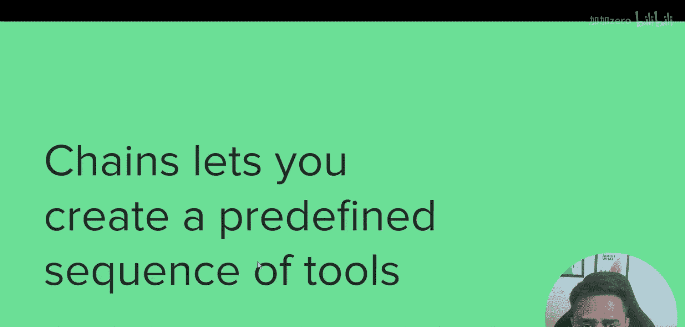

# 1. 维基百科工具
wikipedia_tool = WikipediaQueryRun(...)
# 2. YouTube工具
youtube_tool = YouTubeSearchTool(...)
# 3. 自定义工具（例如网页爬虫）
custom_tool = create_custom_tool(...)
```


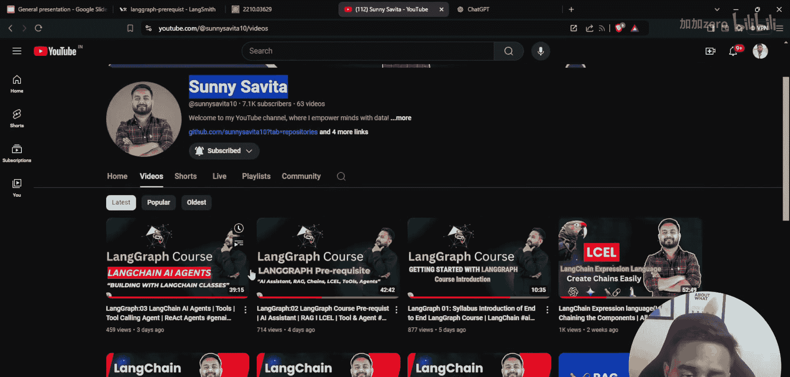

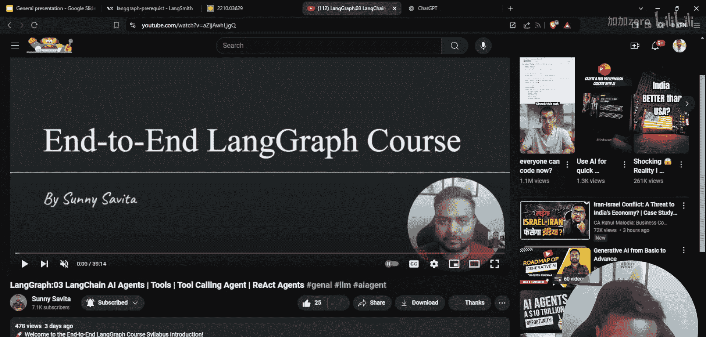

接下来，我们将在此框架内添加第四个工具：一个RAG工具。这个工具能够从我们自定义的知识库中检索相关信息来回答问题。

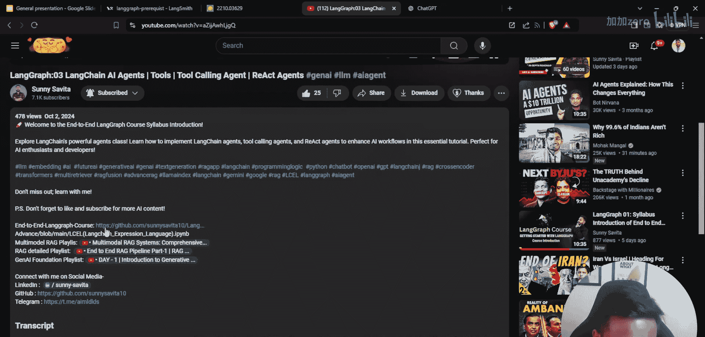

---


## 实现ReAct智能体与自定义工具

ReAct（Reasoning + Acting）是一种智能体模式，它通过循环进行“思考-行动-观察”的步骤来解决问题。现在，我们将构建一个使用自定义工具的ReAct智能体。

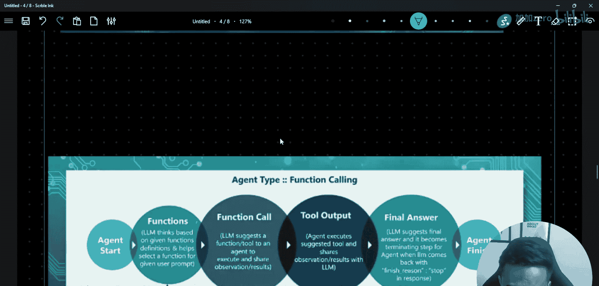

以下是构建ReAct智能体的关键步骤：

1.  **定义工具**：确保你的自定义工具（包括新的RAG工具）已准备就绪。
2.  **创建工具包**：将多个工具组合成一个工具包。
3.  **初始化智能体**：使用特定的ReAct提示模板和语言模型来创建智能体。
4.  **运行智能体**：向智能体提问，观察其调用工具并推理的过程。

代码示例如下：

```python
from langchain.agents import create_react_agent
from langchain.agents import AgentExecutor

# 假设 tools 是一个包含所有工具（含RAG工具）的列表
toolkit = [...， rag_tool， ...]

# 创建ReAct智能体
agent = create_react_agent(llm=your_llm， tools=toolkit， prompt=react_prompt)

# 创建执行器
agent_executor = AgentExecutor(agent=agent， tools=toolkit， verbose=True)

# 运行智能体
response = agent_executor.invoke({"input": "你的问题是什么？"})
print(response["output"])
```

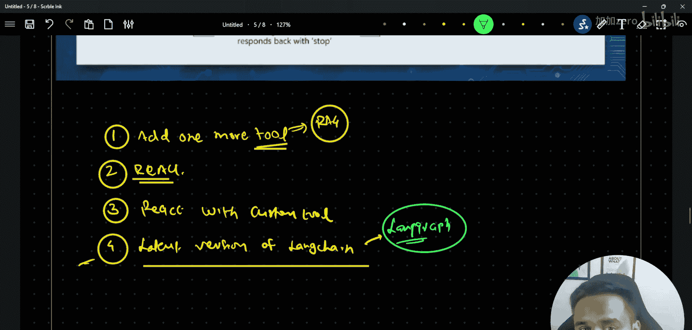


通过这个过程，智能体会根据问题决定是否需要调用我们的RAG工具或其他工具，并综合所有信息给出最终答案。

---

## LangChain最新版本与智能体演进

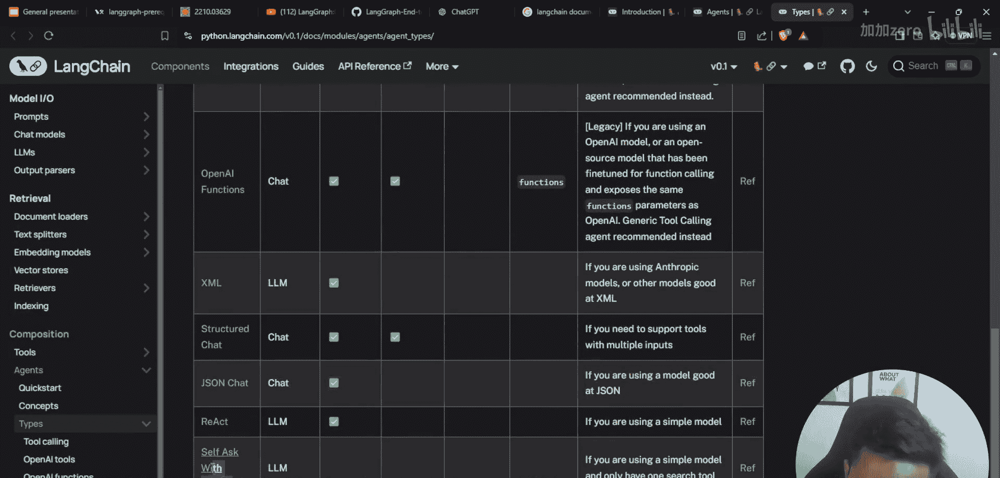

在探索了具体的智能体实现后，我们需要了解LangChain框架本身的发展。LangChain的最新版本（v1.x）引入了一些变化。

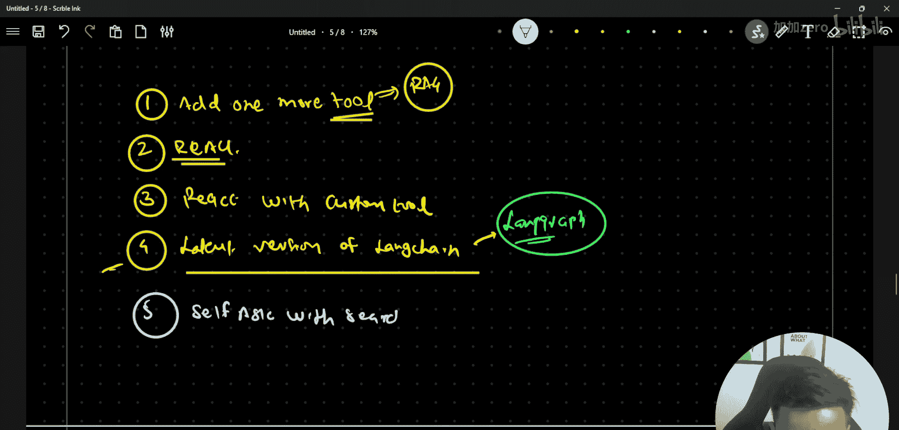

关键点在于：许多旧版本（v0.x）中的智能体类已被标记为“弃用”。官方建议开发者将重心转向**LangGraph**来构建更复杂、更强大的智能体工作流。

这意味着：
*   对于基础学习和理解核心概念（如本节课内容），查阅v0.x文档和代码仍然非常有价值。
*   当你要开始构建生产级、涉及复杂状态管理和多步骤推理的应用程序时，应该学习并使用LangGraph。

你可以通过LangChain官方文档查看不同版本的说明。在v0.x文档的“Agents”部分，你仍然可以找到关于Tool Calling、Structured Chat、ReAct和Self-Ask with Search等模式的详细说明，这些是我们本节课的理论基础。

---

## 实现Self-Ask with Search智能体

最后，我们来学习Self-Ask with Search智能体。这种模式的特点是智能体能够将复杂问题分解成多个子问题，并通过搜索工具（如我们的RAG工具或维基百科工具）逐个寻找答案，最终合成最终结果。

以下是实现Self-Ask智能体的要点：

1.  **智能体策略**：它使用一种特定的提示策略，引导语言模型主动提出需要搜索的中间问题（即“自问”）。
2.  **依赖搜索工具**：它必须与一个搜索工具（如`WikipediaQueryRun`或我们自建的RAG搜索工具）结合使用。
3.  **分步解答**：智能体通过“提问 -> 搜索 -> 获得答案 -> 继续提问”的循环，逐步逼近复杂问题的答案。

代码结构如下：

```python
from langchain.agents import create_self_ask_with_search_agent

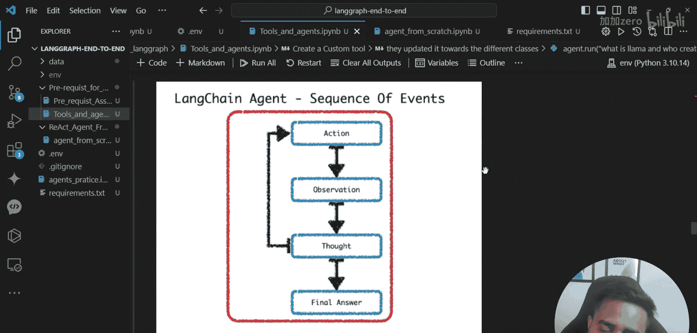

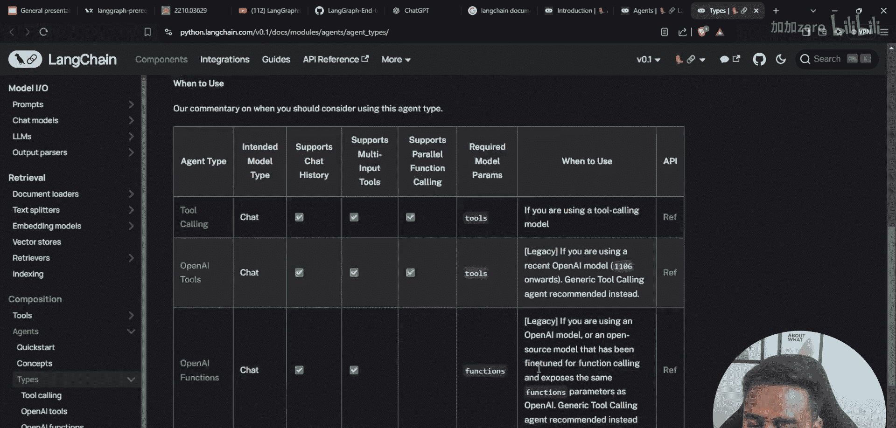

# 创建Self-Ask智能体，需要指定一个搜索工具作为核心工具
search_agent = create_self_ask_with_search_agent(
    llm=your_llm，
    search_tool=wikipedia_tool， # 或 rag_tool
    prompt=self_ask_prompt
)

# 同样，使用AgentExecutor来运行
executor = AgentExecutor(agent=search_agent， tools=[wikipedia_tool]， verbose=True)
result = executor.invoke({"input": "需要分解回答的复杂问题"})
```

这种模式非常适合回答那些需要多步骤事实核查或信息整合的复杂问题。

---

## 总结

本节课中我们一起学习了LangChain智能体的关键知识。我们首先回顾了智能体的基本架构，然后通过代码实践，完成了为智能体添加RAG工具、构建使用自定义工具的ReAct智能体以及实现Self-Ask with Search智能体。同时，我们也了解了LangChain版本迭代的情况，明确了基础智能体模式与高级框架LangGraph之间的关系。

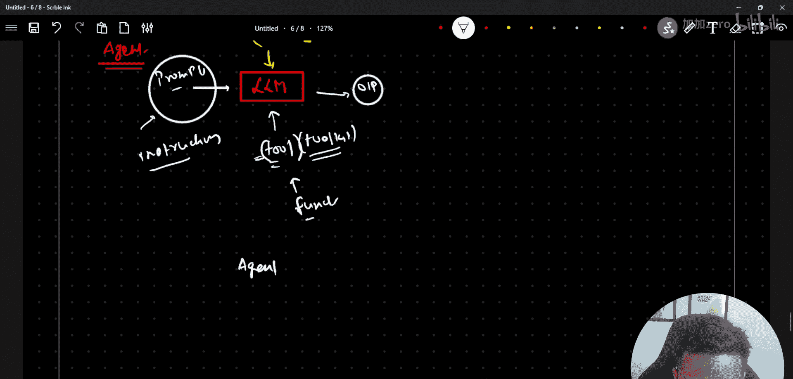

通过本课的学习，你应该能够理解不同智能体模式的工作原理，并掌握使用LangChain v0.x API构建基础智能体的能力。这是你迈向使用LangGraph构建更复杂AI应用系统的重要一步。