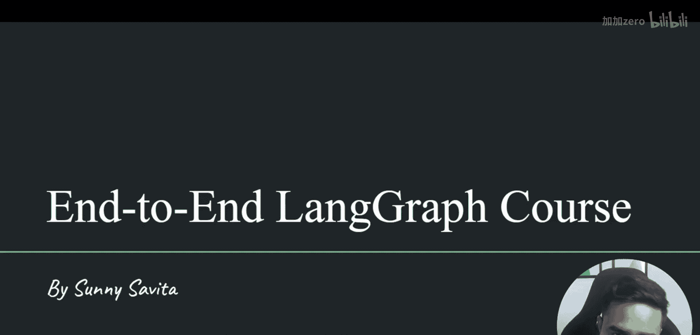
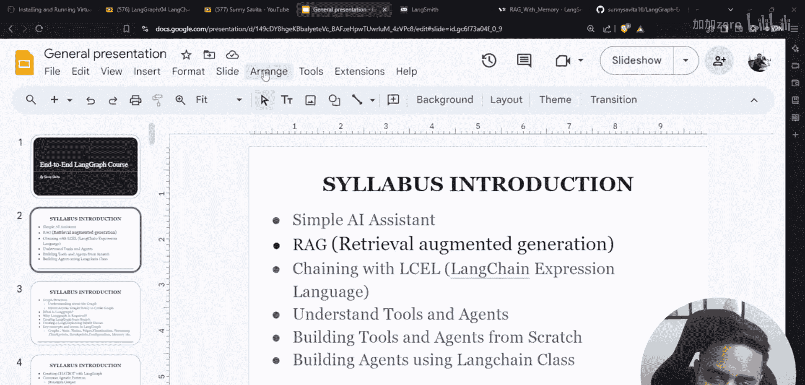
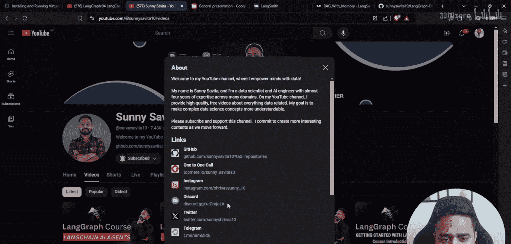
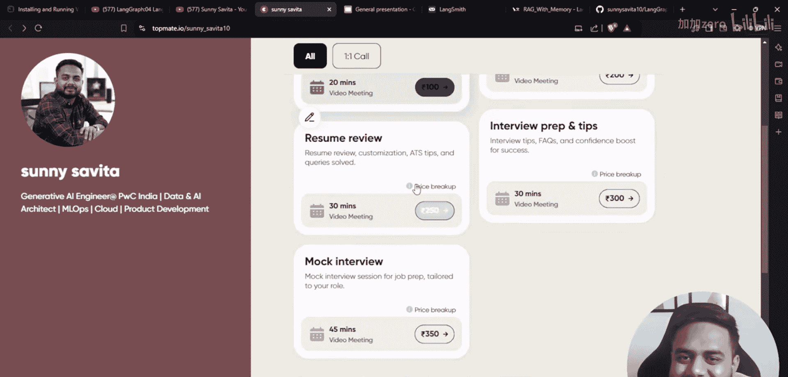
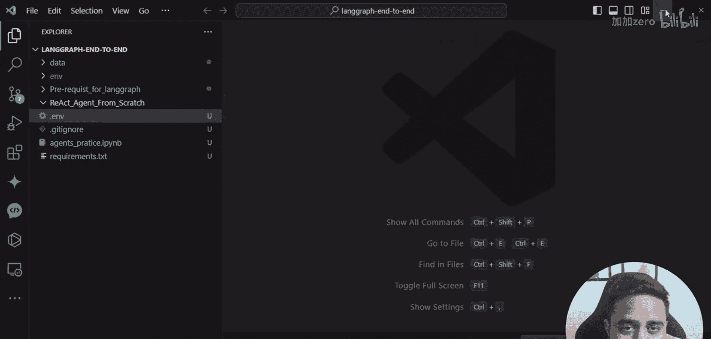
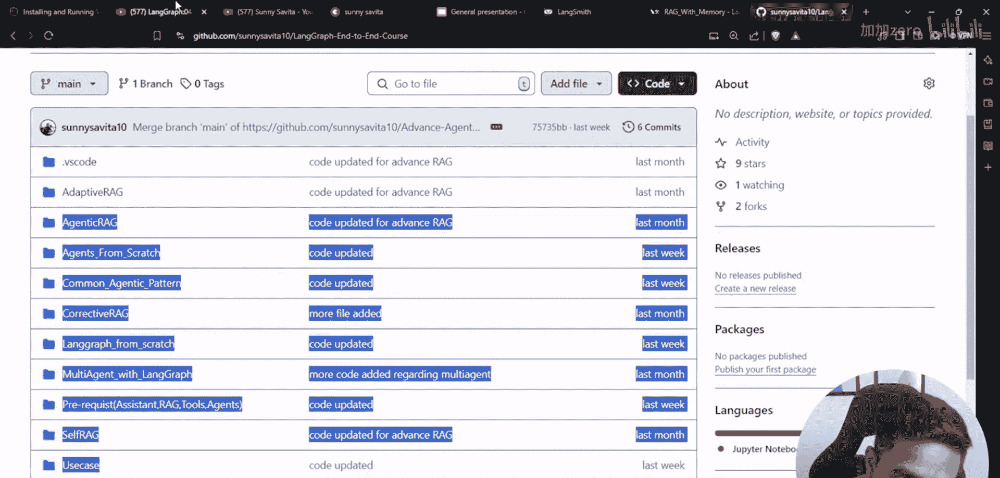
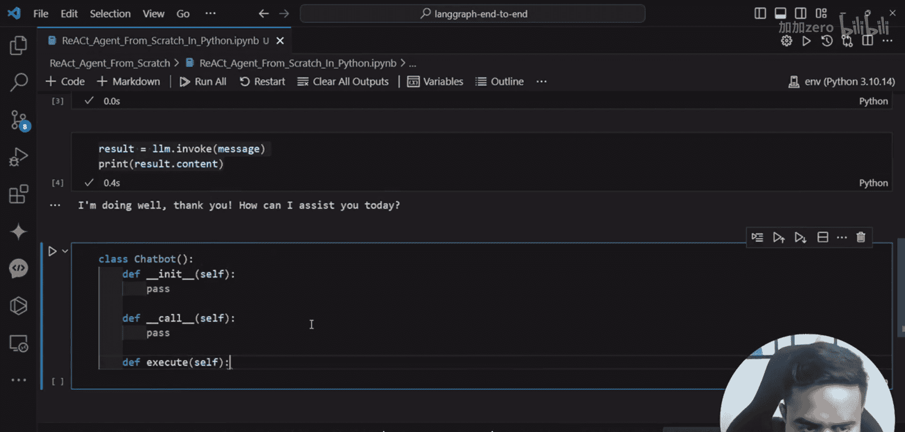

# LangGraph课程：05：使用Python与自定义工具从零构建AI智能体 🛠️

在本节课中，我们将学习如何仅使用Python和自定义工具，从零开始构建一个AI智能体。我们将深入理解智能体的核心工作原理，为后续学习更高级的框架（如LangGraph）打下坚实基础。

## 课程概述

上一节我们介绍了LangChain智能体的基本概念。本节中，我们将抛开现成的框架，手动构建一个智能体。通过这个过程，你将清晰地理解智能体如何思考、如何选择工具以及如何执行动作。这能让你在未来使用任何AI框架时都充满信心。

## 准备工作



在开始编码之前，我们需要设置环境并测试核心组件。

首先，导入必要的库并配置API密钥，用于访问大语言模型和日志记录服务。

```python
import os
# 配置API密钥（示例，请使用您自己的密钥）
os.environ[“GOOGLE_API_KEY”] = “your_google_api_key”
os.environ[“LANGSMITH_API_KEY”] = “your_langsmith_api_key”
os.environ[“LANGSMITH_PROJECT”] = “your_project_name”
```

接下来，我们测试大语言模型是否能正常工作。我们使用Groq平台提供的Llama 3模型。

```python
from langchain_groq import ChatGroq

llm = ChatGroq(model_name=“Llama3-8b-8192”)
response = llm.invoke(“Hello, how are you?”)
print(response.content)
```

模型响应正常。我们也可以用更结构化的方式（系统消息和用户消息）来测试。

```python
messages = [
    {“role”: “system”, “content”: “You are a helpful assistant.”},
    {“role”: “user”, “content”: “What is the capital of France?”}
]
response = llm.invoke(messages)
print(response.content)
```

测试通过，模型可以理解指令并生成回答。现在，我们可以进入核心的智能体构建环节。

## 构建智能体类

我们将创建一个名为 `ChatBot` 的类来封装智能体的所有功能。

首先，定义类的初始化方法 `__init__`。这里我们会初始化大语言模型。

```python
class ChatBot:
    def __init__(self, llm):
        self.llm = llm  # 传入初始化好的大语言模型
        self.conversation_history = []  # 用于存储对话历史
```



智能体需要能够被“调用”。我们定义一个 `__call__` 方法，它接收用户输入并触发智能体的执行流程。




```python
    def __call__(self, user_input):
        # 将用户输入加入历史
        self.conversation_history.append({“role”: “user”, “content”: user_input})
        # 调用执行引擎
        final_response = self._execute()
        # 将助手的回复也加入历史
        self.conversation_history.append({“role”: “assistant”, “content”: final_response})
        return final_response
```

智能体的核心是“思考-行动”循环。我们创建一个 `_execute` 私有方法来处理这个逻辑。

```python
    def _execute(self):
        # 这是一个简化的执行框架
        # 1. 根据历史，让LLM思考下一步该做什么
        # 2. 判断是否需要使用工具
        # 3. 如果使用工具，则执行工具并更新历史
        # 4. 如果不需使用工具或工具执行完毕，则生成最终回复
        # 此处我们先实现一个最简单的版本：直接让LLM根据历史生成回复
        prompt = self._format_history()
        response = self.llm.invoke(prompt)
        return response.content
```

我们需要一个方法来格式化对话历史，以便输入给大语言模型。

```python
    def _format_history(self):
        formatted_messages = []
        for msg in self.conversation_history[-6:]:  # 只保留最近6条消息作为上下文
            formatted_messages.append({“role”: msg[“role”], “content”: msg[“content”]})
        return formatted_messages
```

## 为智能体添加工具

一个真正的智能体需要能使用工具。我们来定义几个简单的工具。

以下是两个示例工具：一个计算器和一个网络搜索工具（模拟）。

```python
# 自定义工具1：计算器
def calculator(expression: str) -> str:
    """计算一个数学表达式。例如：’3 + 5 * 2‘"""
    try:
        # 警告：使用eval有安全风险，此处仅用于演示。
        result = eval(expression)
        return f“计算结果: {result}”
    except Exception as e:
        return f“计算错误: {e}”

# 自定义工具2：模拟网络搜索
def web_search(query: str) -> str:
    """模拟网络搜索，返回模拟结果。"""
    # 在实际应用中，这里会调用真实的搜索API
    return f“关于 ‘{query}’ 的模拟搜索结果：相关文章1，相关文章2。”
```

现在，我们需要修改 `ChatBot` 类，让它知道这些工具并学会使用它们。







首先，在初始化时注册工具。

```python
class ChatBot:
    def __init__(self, llm, tools=None):
        self.llm = llm
        self.conversation_history = []
        self.tools = tools if tools else {}  # 工具字典，格式：{‘tool_name’: function}
        # 为LLM描述可用的工具
        self.tool_descriptions = self._create_tool_descriptions()
```

创建一个方法，生成给LLM看的工具描述。

```python
    def _create_tool_descriptions(self):
        descriptions = []
        for name, func in self.tools.items():
            # 获取函数的文档字符串作为描述
            doc = func.__doc__ or “No description available.”
            descriptions.append(f“工具名: {name}\n描述: {doc}”)
        return “\n\n”.join(descriptions)
```

接下来，增强 `_execute` 方法，实现完整的ReAct（推理+行动）模式。

```python
    def _execute(self, max_steps=5):
        for step in range(max_steps):
            # 步骤1：思考
            prompt = self._create_react_prompt()
            response = self.llm.invoke(prompt)
            thought = response.content

            # 步骤2：解析思考，判断是否需要行动
            if “最终答案:” in thought:
                # 如果模型直接给出了最终答案，则提取并返回
                final_answer = thought.split(“最终答案:”)[-1].strip()
                return final_answer
            elif “行动:” in thought:
                # 解析要使用的工具和输入
                action_line = thought.split(“行动:”)[-1].strip()
                # 简单解析，假设格式为“工具名(输入)”
                if “(” in action_line and “)” in action_line:
                    tool_name = action_line.split(“(”)[0].strip()
                    tool_input = action_line.split(“(”)[1].split(“)”)[0].strip().strip(“‘\”“)
                    # 步骤3：执行工具
                    if tool_name in self.tools:
                        tool_result = self.tools[tool_name](tool_input)
                        # 将工具执行结果加入历史，供下一轮思考使用
                        self.conversation_history.append({“role”: “system”, “content”: f“工具 {tool_name} 返回结果: {tool_result}”})
                    else:
                        self.conversation_history.append({“role”: “system”, “content”: f“错误: 未知工具 {tool_name}”})
                else:
                    self.conversation_history.append({“role”: “system”, “content”: “错误: 无法解析行动指令。”})
            else:
                # 如果既没有最终答案也没有行动指令，可能出错了，返回思考内容
                return thought
        return “达到最大思考步数，未能解决问题。”
```

最后，创建驱动ReAct流程的提示词模板。

```python
    def _create_react_prompt(self):
        # 这是一个简化的ReAct提示词模板
        history_text = “\n”.join([f“{msg[‘role’]}: {msg[‘content’]}” for msg in self.conversation_history[-4:]])
        prompt = f“””
你是一个AI助手，可以访问以下工具：
{self.tool_descriptions}

请遵循以下格式进行思考：
思考: 分析用户目标和可用工具，决定下一步。
行动: 工具名(工具输入) # 如果需要使用工具
最终答案: 你的最终回复 # 如果可以直接回答

之前的对话：
{history_text}

现在开始：
思考:“””
        return prompt
```

## 运行你的第一个智能体

所有部件都已就位，现在让我们实例化并运行这个智能体。

首先，初始化工具字典和大语言模型。

```python
# 1. 定义工具集
my_tools = {
    “calculator”: calculator,
    “web_search”: web_search
}

# 2. 初始化LLM (使用之前测试过的模型)
llm = ChatGroq(model_name=“Llama3-8b-8192”)

# 3. 创建智能体
agent = ChatBot(llm=llm, tools=my_tools)
```

现在，向智能体提问。

```python
# 4. 提问
question = “请先计算 (15 + 27) * 3 等于多少，然后搜索一下‘人工智能的最新发展’。”
answer = agent(question)
print(“智能体回复:”, answer)
```

智能体会展示其思考过程：先调用计算器工具，再调用搜索工具，最后综合信息给出答案。

## 总结

本节课中，我们一起学习了如何从零开始构建一个AI智能体。

我们首先设置了开发环境并测试了大语言模型。然后，我们创建了一个 `ChatBot` 类作为智能体的骨架，实现了基本的对话历史管理。接着，我们为智能体定义了自定义工具（计算器和模拟搜索），并改进了智能体的核心引擎，使其能够遵循ReAct模式进行“思考-行动-观察”的循环。最后，我们整合所有部分，运行了一个完整的智能体示例。



通过这个手动的构建过程，你应当对智能体内部的运作机制——如何解析问题、决定使用工具、执行工具并整合结果——有了深刻的理解。这种理解是有效使用LangChain、LangGraph等高级框架的关键。在下一节课中，我们将正式进入LangGraph的世界，学习如何用这个强大的框架更高效、更灵活地构建复杂智能体。