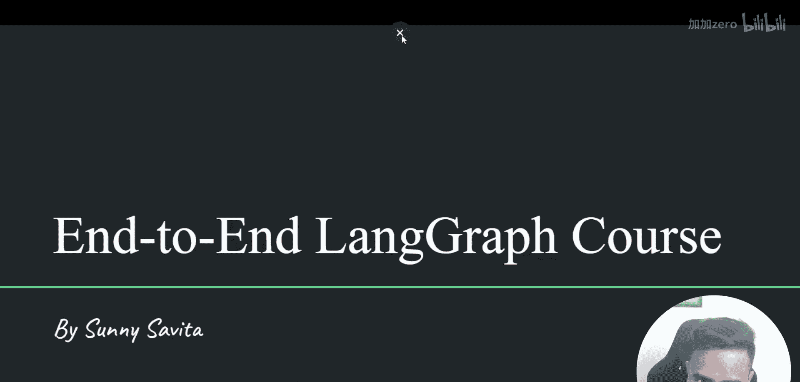
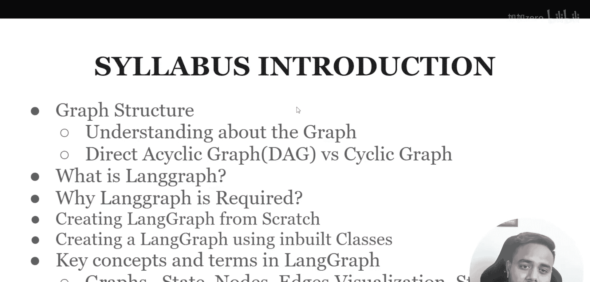
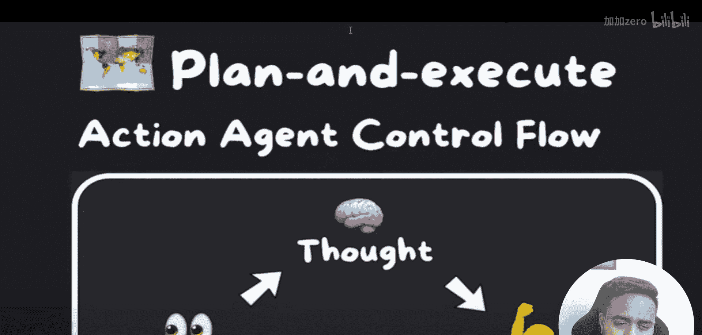
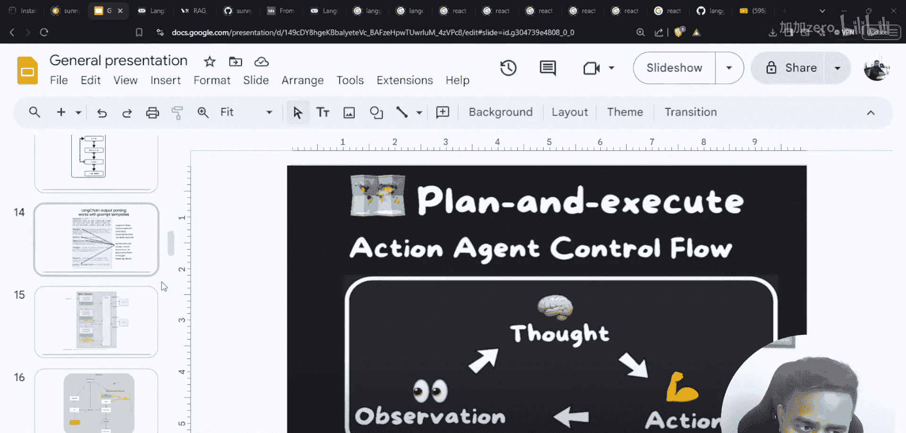
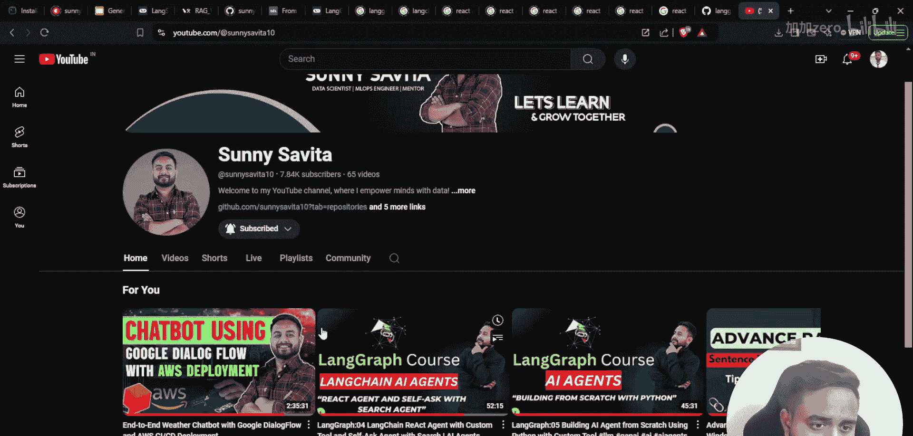
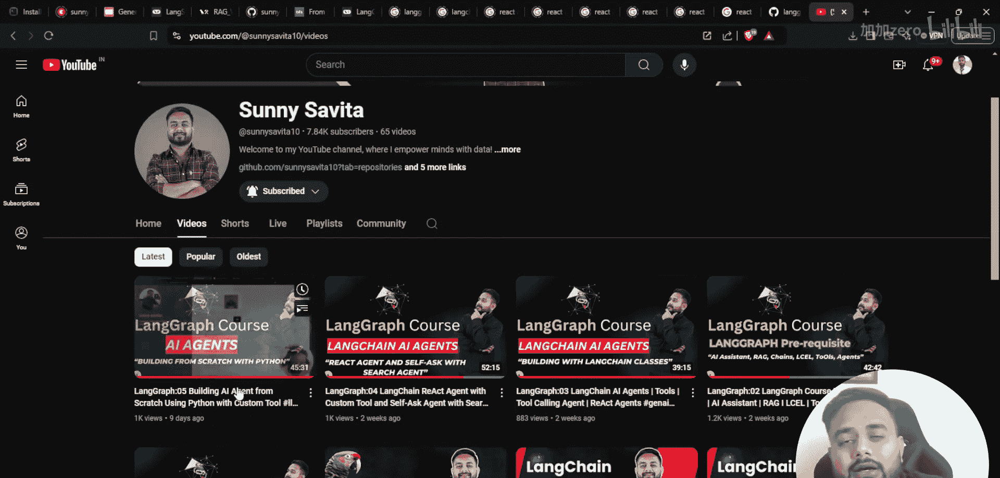
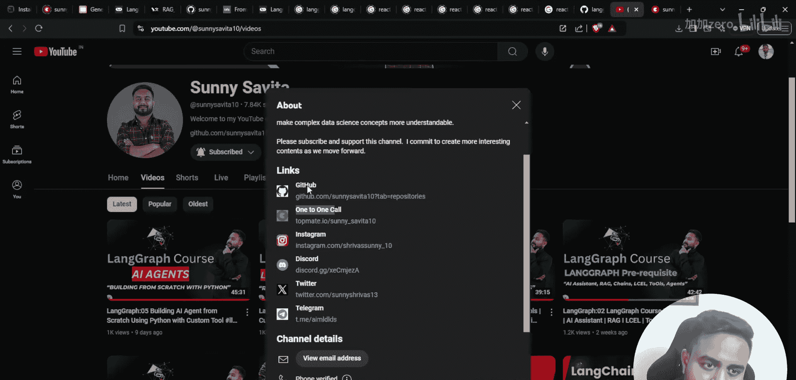
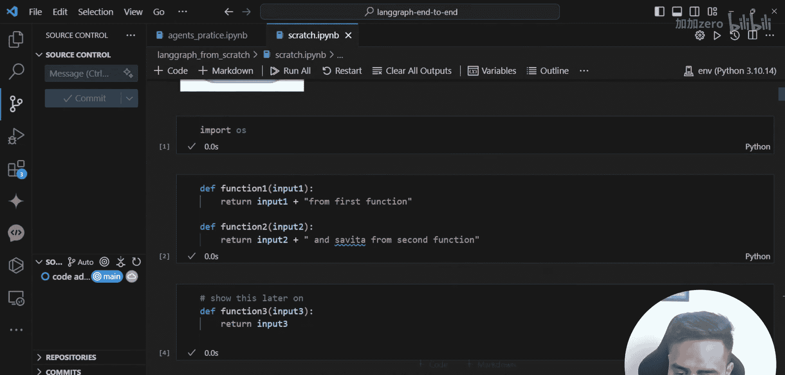
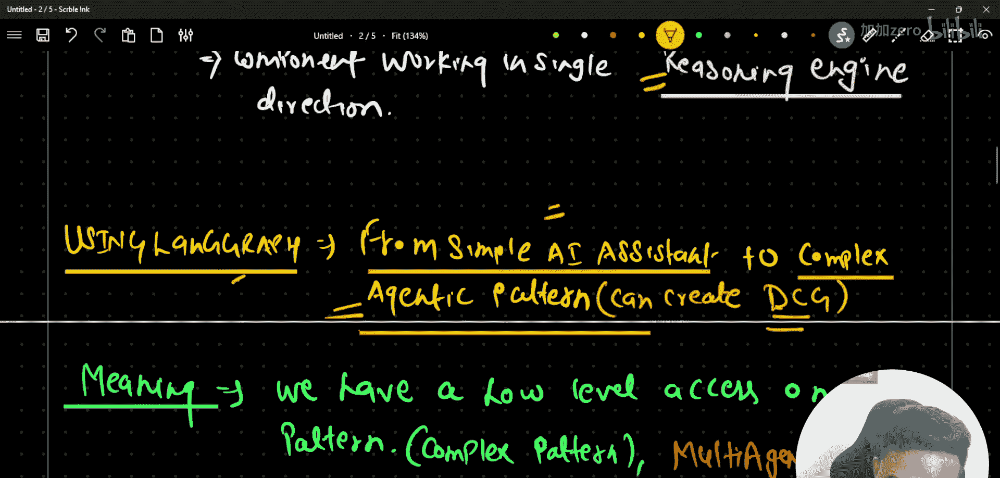

生成式AI：从零到精通：06：LangGraph 详细入门指南 🚀

在本节课中，我们将深入探讨 LangGraph 的核心概念。我们将了解什么是 LangGraph、为什么需要它，以及它能帮助我们构建何种类型的应用模式。通过本指南，你将建立起对 LangGraph 的全面理解，为后续构建复杂工作流打下坚实基础。

---

### LangChain 生态系统概览

在深入了解 LangGraph 之前，让我们先回顾一下 LangChain 的生态系统。LangChain 提供了多个核心组件来帮助我们构建基于大语言模型的应用。

以下是 LangChain 的主要组件及其作用：

*   **LangChain**：这是核心框架。它提供了构建 LLM 应用所需的各种基础模块，例如**提示词模板**、**模型集成**、**输出解析器**、**数据加载器**、**链** 以及**记忆**功能。
*   **LangSmith**：这是一个用于**日志记录和追踪**的工具。它帮助开发者监控和调试应用在运行过程中的状态和信息。
*   **LangServe**：这是一个用于**模型服务**的组件。它允许你将构建好的应用轻松部署为云服务。
*   **LangGraph**：这是我们本节课的重点。它是一个用于创建**工作流**的框架。

### 什么是 LangGraph？

上一节我们介绍了 LangChain 的各个组件，本节中我们来看看 LangGraph 到底是什么。

LangGraph 是 LangChain 框架中用于创建**工作流**的库。它的核心思想是**图**。图由**节点**和**边**构成。通过定义节点（代表处理步骤）和边（代表步骤间的流转逻辑），我们可以构建出复杂的工作流程。

其定义可以概括为：LangGraph 是一个用于创建**有状态、多参与者工作流**的库。这里的“工作流”可以理解为**编排**或**管道**。更技术化地说，它允许我们创建**有向循环图**。

### 为什么需要 LangGraph？

我们已经了解了 LangGraph 的基本定义，那么它解决了什么问题呢？

使用基础的 LangChain，我们可以创建简单的 AI 助手、具备记忆功能的应用程序、链式调用以及基础的智能体模式。LangChain 本身也提供了多种智能体类，例如工具调用智能体、ReAct 智能体等。

然而，当我们想要构建更复杂的、涉及多个步骤循环或条件分支的**复杂智能体模式**时，基础 LangChain 的编排能力就显得有限。这正是 LangGraph 的用武之地。

使用 LangGraph，我们不仅能创建简单的 AI 助手，更能轻松构建复杂的、基于**有向循环图**的智能体系统。它特别擅长处理需要循环、分支、并行或涉及多个“参与者”的复杂逻辑。

### 课程计划与资源

在结束本节的介绍之前，让我们了解一下整个课程的计划和可用的学习资源。

以下是本 LangGraph 课程的详细大纲：

1.  **先决条件**：学习 LangGraph 所需的基础知识。
2.  **图结构基础**：理解图（节点和边）的概念。
3.  **LangGraph 详解**：深入探讨 LangGraph 的核心机制（本节课内容）。
4.  **从零创建 LangGraph**：动手实践构建第一个图。
5.  **高级主题**：使用 LangGraph 创建聊天机器人、实现常见智能体模式。
6.  **复杂系统构建**：创建多智能体系统，并将 LangGraph 与 RAG 技术集成。
7.  **项目实战**：通过实际项目应用所学知识。

我已经为所有学习者准备了完整的课程笔记和幻灯片，你可以在视频描述中找到相关链接。此外，如果你需要一对一的技术咨询、职业指导、简历评估或模拟面试等服务，也可以通过描述栏中的链接与我联系。

---

本节课中，我们一起学习了 LangGraph 的定位及其在 LangChain 生态系统中的重要性。我们明确了 LangGraph 的核心是用于构建基于图的工作流，它特别适用于创建复杂的、有状态的智能体应用。从下一节课开始，我们将进入实战环节，从零开始编写代码，探索 LangGraph 的各种强大模式。