# LangGraph 从入门到精通：P64：从零开始编写 LangGraph 代码

在本节课中，我们将开始学习如何使用 LangGraph 模块进行编码。我们将从零开始创建一个基本的图，并理解其核心概念，为后续学习更复杂的模式打下基础。

## 课程概述


上一节我们介绍了 LangGraph 的理论概念。本节中，我们将动手实践，学习如何创建图、添加节点和边。我们将从最简单的模式开始，逐步构建更复杂的结构。

## 准备工作

首先，我们需要导入必要的模块并创建一些基础函数。以下是两个简单的函数，它们将作为我们图中的节点。

```python
def function_one(input_str):
    return input_str + " concatenated with a string."

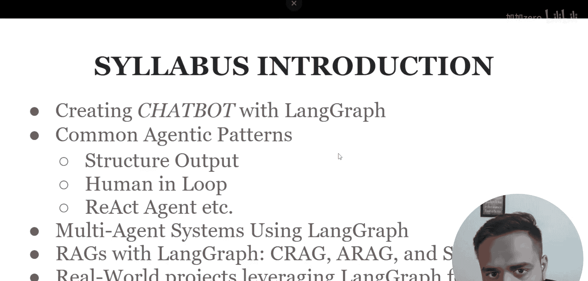


def function_two(input_str):
    return input_str + " concatenated with the is string."
```

## 创建图对象

LangGraph 提供了两种主要的图类：`Graph` 和 `StateGraph`。我们将从基础的 `Graph` 类开始。

```python
from langgraph.graph import Graph


# 创建一个图对象，并命名为 workflow_1
workflow_1 = Graph()
```

## 添加节点

节点是图中的基本执行单元，通常对应一个函数。我们将把之前定义的两个函数添加为节点。

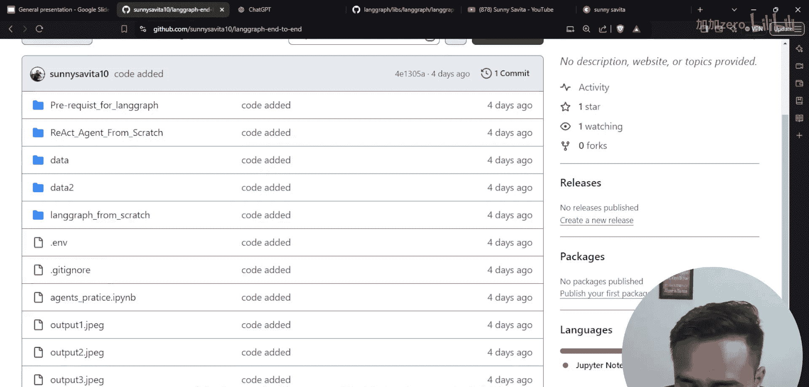

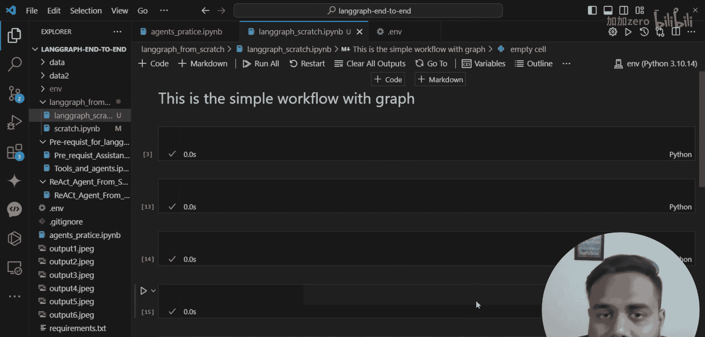

以下是添加节点的步骤：

1.  使用 `add_node` 方法。
2.  为节点指定一个唯一的名称。
3.  将函数作为该节点的执行逻辑。

```python
# 将 function_one 添加为名为 “function_one” 的节点
workflow_1.add_node(“function_one”, function_one)

# 将 function_two 添加为名为 “function_two” 的节点
workflow_1.add_node(“function_two”, function_two)
```

## 添加边

边定义了节点之间的执行顺序和数据流向。我们需要指定从哪个节点开始，以及执行完成后接下来进入哪个节点。

以下是添加边的步骤：

1.  使用 `add_edge` 方法。
2.  指定起始节点。
3.  指定目标节点。

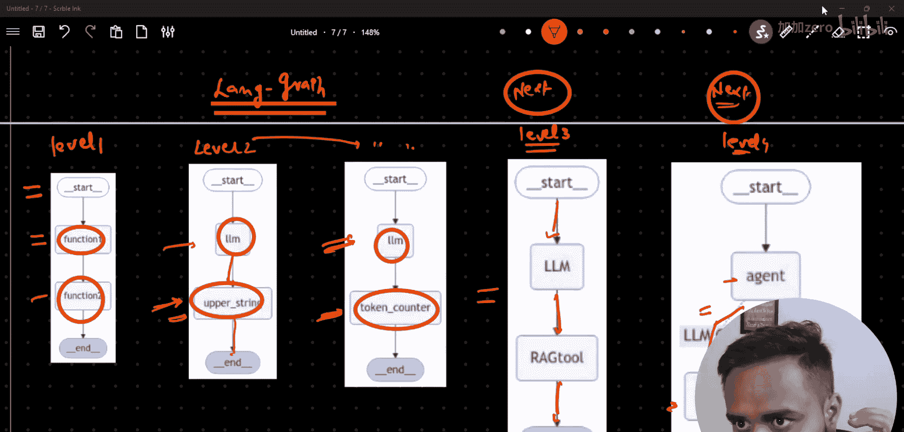

```python
# 添加一条从 “function_one” 指向 “function_two” 的边
workflow_1.add_edge(“function_one”, “function_two”)
```

## 设置入口点

一个图需要有明确的起始位置。我们需要设置一个入口节点，告诉 LangGraph 从何处开始执行。

```python
# 设置 “function_one” 为整个工作流的入口点
workflow_1.set_entry_point(“function_one”)
```

## 编译并运行图

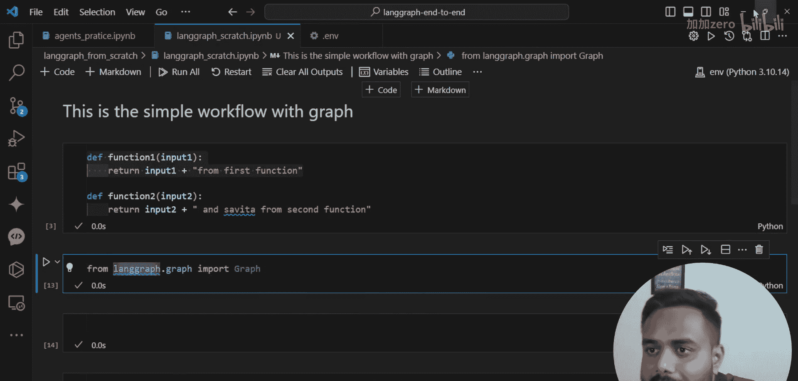

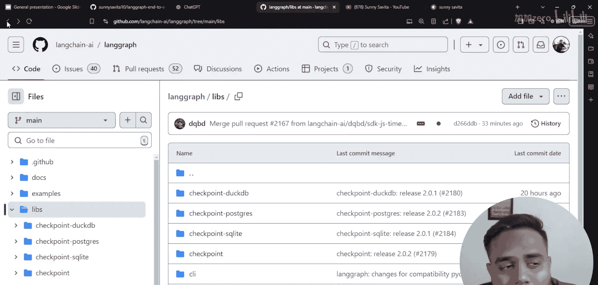


在定义好节点和边之后，我们需要将图“编译”成一个可执行的对象，然后传入初始输入来运行它。

```python
# 编译图，生成一个可执行的应用
app = workflow_1.compile()

# 定义初始输入
initial_input = “Hello”

# 运行图，从入口点开始执行
result = app.invoke({“input_str”: initial_input})
print(result)  # 输出: Hello concatenated with a string. concatenated with the is string.
```

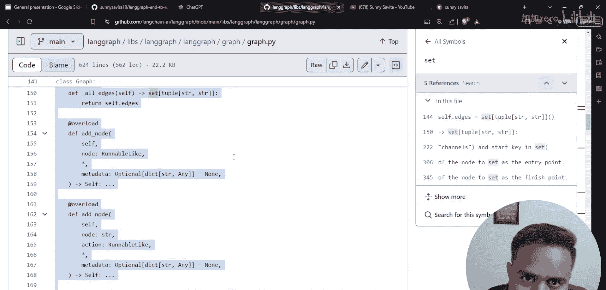

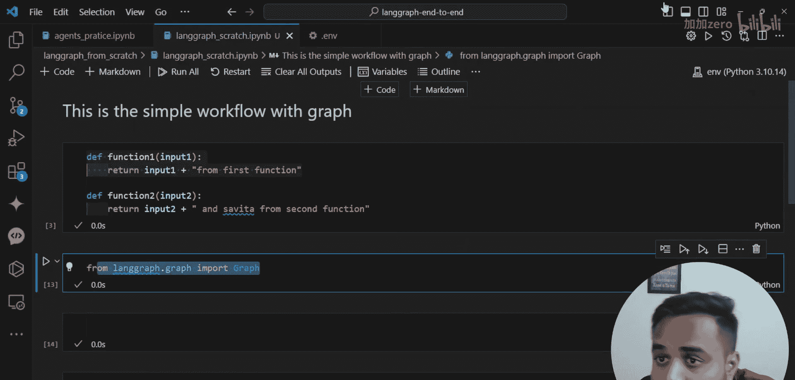

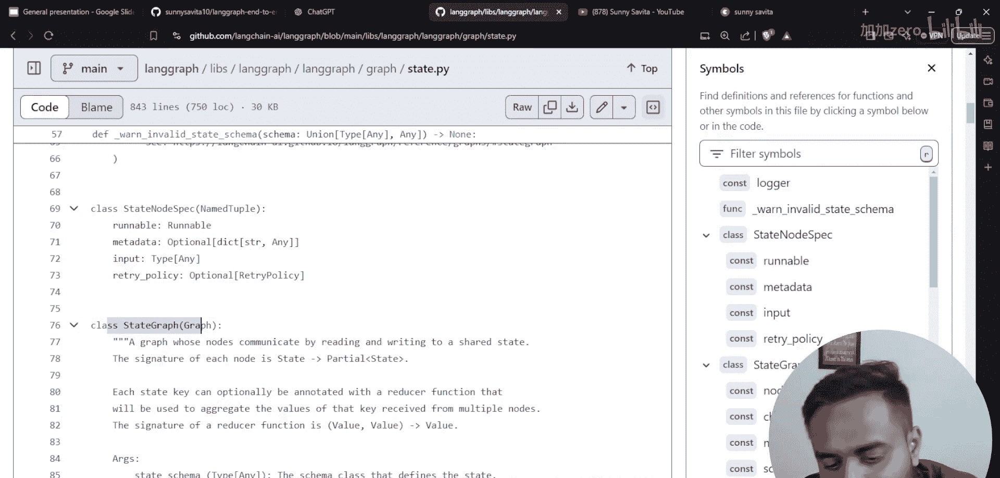

## 核心概念总结

本节课中我们一起学习了 LangGraph 编码的基础：

1.  **图（Graph）**：由节点和边组成的工作流框架。
2.  **节点（Node）**：执行具体任务的单元，对应一个函数。使用 `add_node(name, function)` 添加。
3.  **边（Edge）**：连接节点，定义执行路径。使用 `add_edge(start_node, end_node)` 添加。
4.  **入口点（Entry Point）**：图的起始节点。使用 `set_entry_point(node_name)` 设置。
5.  **编译与执行**：通过 `compile()` 方法将图转换为可执行应用，使用 `invoke(initial_state)` 运行。

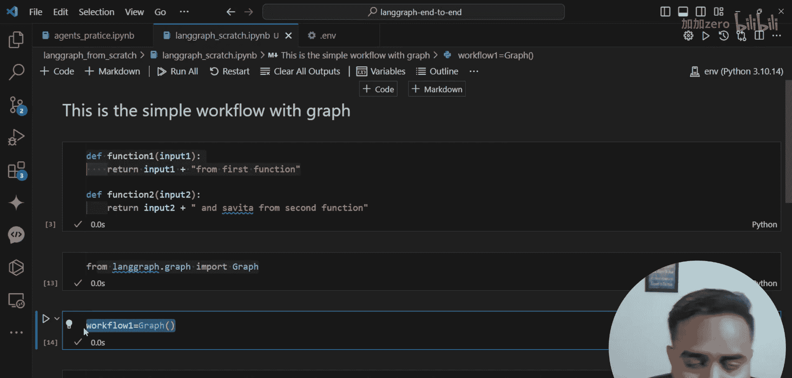

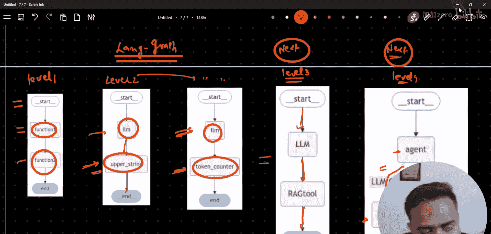

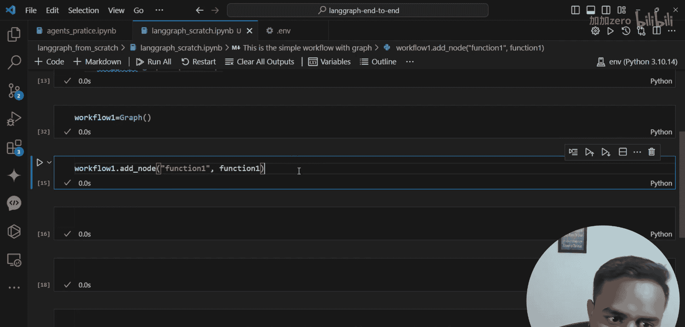

我们创建了一个简单的线性图，数据从 `function_one` 流向 `function_two`。在下一节中，我们将引入更复杂的模式，包括条件边和 LLM 节点。