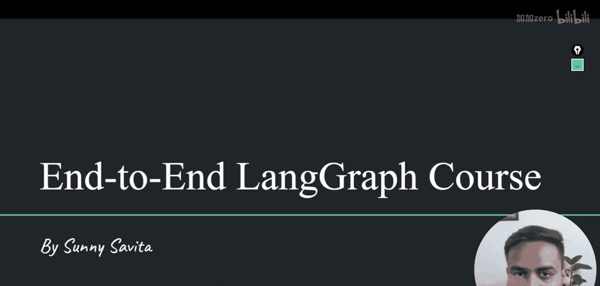
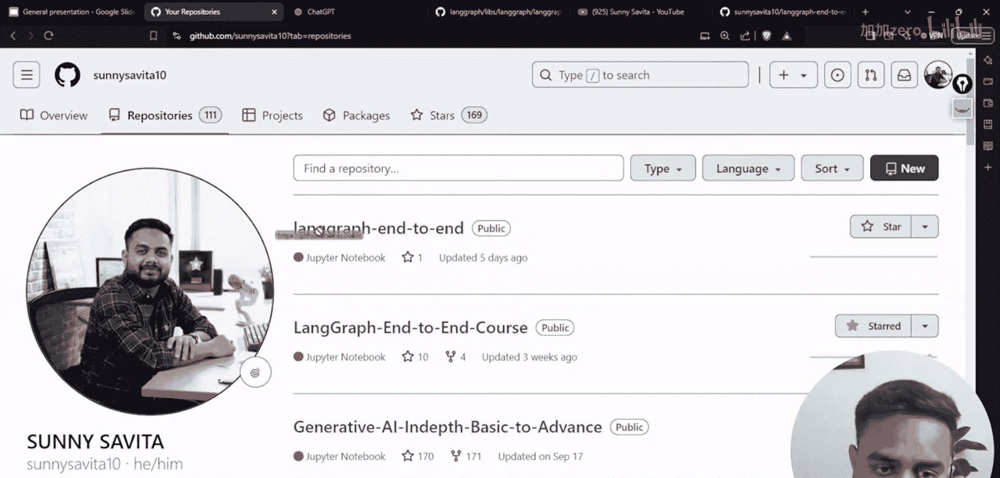
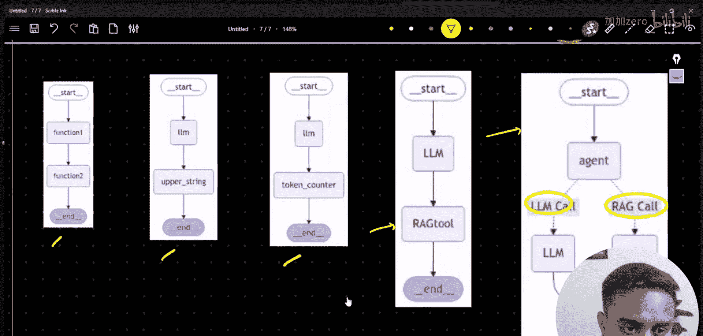
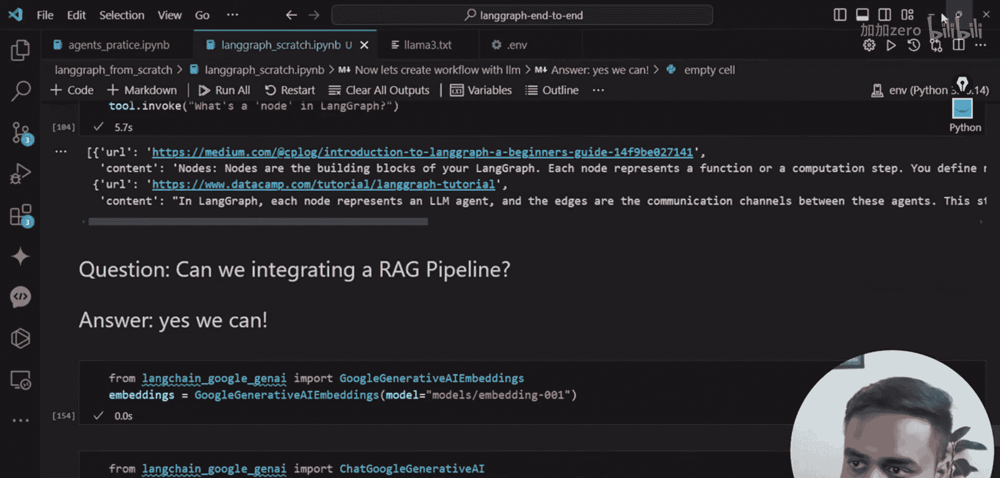
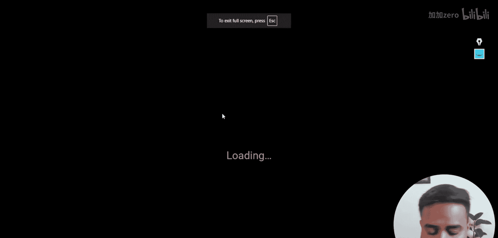
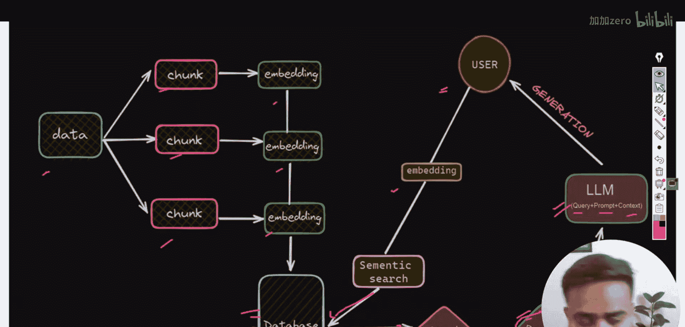
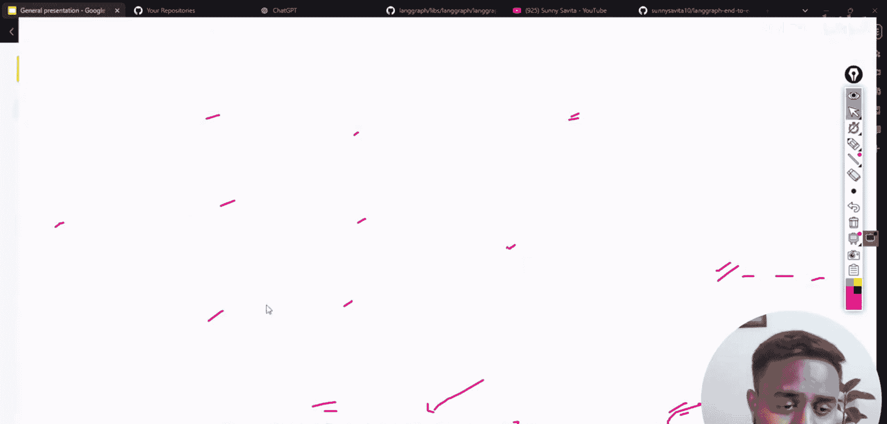
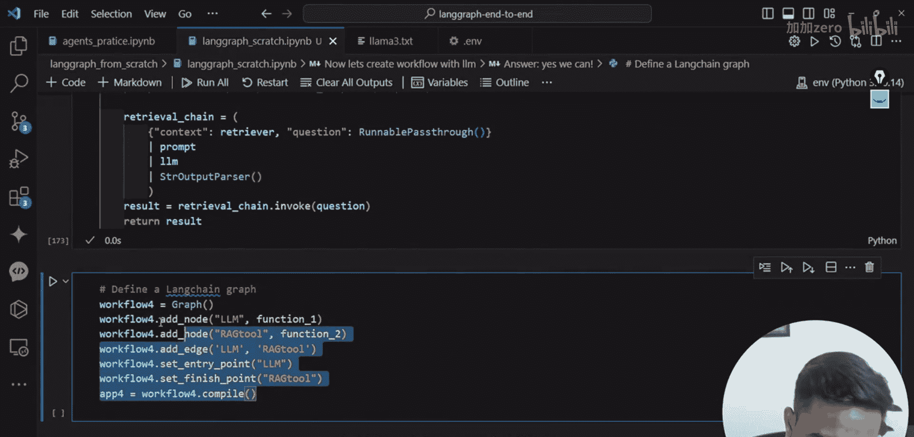

# LangGraph 课程：08：在 LangGraph 工作流中添加 RAG

在本节课中，我们将学习如何将检索增强生成（RAG）系统集成到 LangGraph 工作流中。我们将构建一个包含两个节点的简单图：一个用于标准语言模型响应，另一个用于通过 RAG 检索上下文后的响应，并对比两者的结果。

## 概述

上一节我们介绍了 LangGraph 的基础知识并构建了简单的图。本节中，我们将扩展应用，创建一个结合了 RAG 管道的工作流。我们将使用一个关于 Meta Llama 3 的文本数据集，通过 RAG 检索相关信息，并与直接调用语言模型的结果进行比较。

## 准备工作



首先，我们需要导入必要的库并设置环境。以下是核心的导入语句和初始化步骤。

```python
from langchain_community.document_loaders import TextLoader
from langchain.text_splitter import RecursiveCharacterTextSplitter
from langchain_community.vectorstores import Chroma
from langchain_huggingface import HuggingFaceEmbeddings
from langchain.prompts import PromptTemplate
from langchain_community.llms import HuggingFaceHub
from langgraph.graph import Graph
```

接下来，我们加载嵌入模型和语言模型，并验证它们是否工作正常。

```python
# 初始化嵌入模型
embeddings = HuggingFaceEmbeddings(model_name="sentence-transformers/all-MiniLM-L6-v2")

# 初始化语言模型（例如使用 HuggingFace Hub）
llm = HuggingFaceHub(repo_id="google/flan-t5-large", model_kwargs={"temperature":0, "max_length":512})
```




## 构建 RAG 系统

在将 RAG 集成到图之前，我们需要先构建一个独立的 RAG 管道。这个过程分为数据加载、分块、向量化存储和检索器创建几个步骤。

以下是构建 RAG 管道的步骤：



1.  **加载数据**：从本地文件加载文本数据。
2.  **分割文本**：将长文本分割成更小的、可管理的块。
3.  **创建向量存储**：将文本块转换为向量并存入向量数据库。
4.  **创建检索器**：基于向量数据库构建一个检索器，用于根据查询查找相关文档。



```python
# 1. 加载数据
loader = TextLoader("./data/llama3.txt")
documents = loader.load()

# 2. 分割文本
text_splitter = RecursiveCharacterTextSplitter(chunk_size=500, chunk_overlap=50)
texts = text_splitter.split_documents(documents)



# 3. 创建向量存储
db = Chroma.from_documents(texts, embeddings)

# 4. 创建检索器
retriever = db.as_retriever(search_kwargs={"k": 3})
```

现在，我们可以测试检索器。例如，询问“What is Meta Llama 3?”，检索器将返回最相关的三个文本块。

```python
query = "What is Meta Llama 3?"
docs = retriever.get_relevant_documents(query)
for doc in docs:
    print(doc.page_content[:200]) # 打印每个文档的前200个字符
```

## 设计 LangGraph 工作流



我们的目标是创建一个包含两个节点的图。第一个节点直接调用语言模型回答问题。第二个节点则利用我们刚刚构建的 RAG 检索器，先获取相关上下文，再让语言模型基于上下文生成答案。

首先，我们定义图的状态。在这个简单示例中，状态主要包含用户的输入消息和模型生成的响应。

```python
from typing import TypedDict, List, Annotated
import operator



class AgentState(TypedDict):
    messages: Annotated[List[str], operator.add]
    response: str
```

接下来，我们定义两个节点函数。

**节点一：直接调用 LLM**
此函数接收用户输入，直接让语言模型生成回答。

```python
def call_llm(state: AgentState):
    user_input = state['messages'][-1] # 获取最新用户消息
    # 直接使用LLM生成响应
    llm_response = llm.invoke(user_input)
    return {"response": llm_response}
```

**节点二：调用 RAG 管道**
此函数也接收用户输入，但会先通过检索器获取相关文档，然后将文档作为上下文与问题一起提交给语言模型。

```python
def call_rag(state: AgentState):
    user_input = state['messages'][-1]
    # 1. 检索相关文档
    relevant_docs = retriever.get_relevant_documents(user_input)
    context = "\n".join([doc.page_content for doc in relevant_docs])
    # 2. 构建包含上下文的提示词
    prompt_template = PromptTemplate.from_template(
        "基于以下上下文回答问题。\n上下文：{context}\n问题：{question}\n答案："
    )
    formatted_prompt = prompt_template.format(context=context, question=user_input)
    # 3. 调用LLM生成基于上下文的响应
    rag_response = llm.invoke(formatted_prompt)
    return {"response": rag_response}
```

## 构建并运行图

现在，我们将这两个节点组合成一个图，并指定执行流程。

```python
# 创建图实例
workflow = Graph()

# 添加节点
workflow.add_node("llm_node", call_llm)
workflow.add_node("rag_node", call_rag)

# 设置入口点
workflow.set_entry_point("llm_node")

# 定义边：从 llm_node 指向 rag_node
workflow.add_edge("llm_node", "rag_node")

# 编译图
app = workflow.compile()
```

图构建完成后，我们可以将其可视化，并传入用户查询来执行。

```python
# 可视化图（需要安装 graphviz）
from IPython.display import Image, display
try:
    display(Image(app.get_graph().draw_mermaid_png()))
except:
    print("请安装 graphviz 以查看图表。")

# 执行图
initial_state = AgentState(messages=["What is Meta Llama 3?"], response="")
final_state = app.invoke(initial_state)

print("直接LLM响应:", final_state["llm_node"]["response"])
print("\n---\n")
print("RAG增强响应:", final_state["rag_node"]["response"])
```

## 总结



本节课中，我们一起学习了如何将 RAG 系统集成到 LangGraph 工作流中。我们首先回顾了 RAG 的基本架构，然后逐步构建了一个包含数据加载、向量检索的管道。接着，我们定义了一个具有两个节点（标准LLM和RAG增强LLM）的 LangGraph，并成功运行了该工作流，对比了两种方式生成的回答。通过这个实例，你可以看到 LangGraph 如何清晰地编排包含不同组件的复杂 AI 应用逻辑。在下一节，我们将探索更复杂的图结构，例如使用 `StateGraph` 和条件边来构建动态工作流。