# LangGraph 课程：09：使用 LangGraph 构建具备记忆功能的端到端聊天机器人

在本节课中，我们将学习如何使用 LangGraph 模块创建一个端到端的聊天机器人，并重点讲解如何在其中实现和维持记忆功能。我们将从简单的架构开始，逐步构建更复杂的带条件和循环的对话流。

## 概述

在之前的课程中，我们已经介绍了 LangGraph 的基本概念，学习了如何使用 `Graph` 和 `StateGraph` 类从零开始构建图，并探讨了可视化、流式传输等功能。从本节课开始，我们将进入 LangGraph 的高级部分。

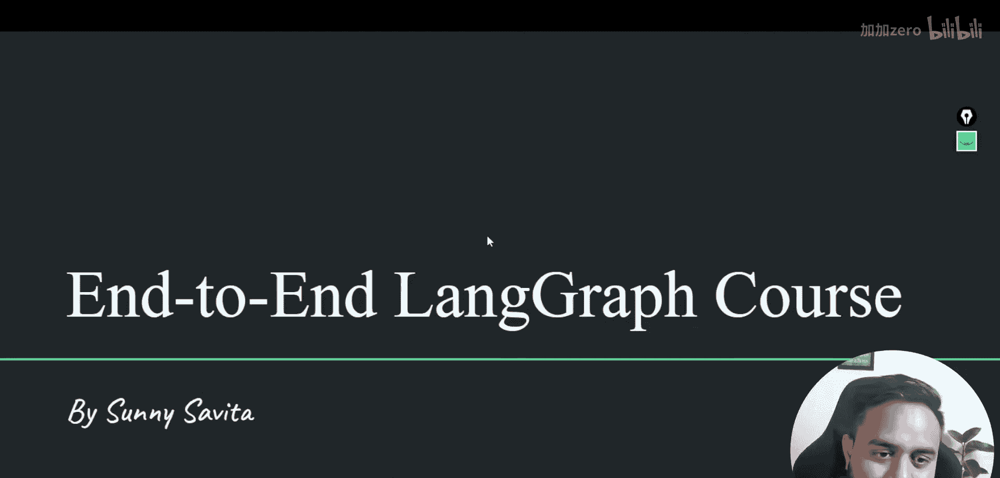

本节课的核心目标是构建一个具备记忆功能的聊天机器人。我们将实现三种不同的架构：
1.  一个简单的、直接调用模型的聊天节点。
2.  一个包含条件边的架构，让代理（Agent）决定是直接回答还是调用工具。
3.  一个包含循环的架构，允许代理在调用工具后再次处理信息，最终生成回答。

我们将使用 `MessageState` 类来管理对话状态，并引入 `MemorySaver` 来实现对话记忆的持久化。

## 准备工作

在开始编码之前，请确保你已经设置了开发环境。我们将在 VS Code 中编写代码，并且所有代码都已同步到 GitHub 仓库中。你可以在视频描述中找到代码仓库的链接。

以下是需要导入的核心模块：

```python
from langgraph.graph import StateGraph, END
from langgraph.checkpoint.memory import MemorySaver
from langchain_core.messages import HumanMessage, AIMessage
from langchain_community.chat_models import ChatOllama # 示例，可使用其他模型
```

## 架构一：基础聊天机器人节点

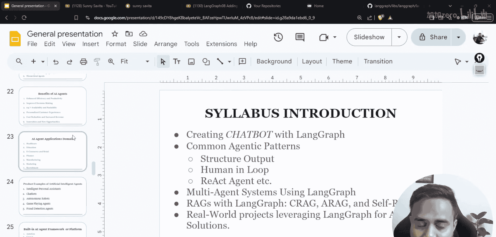

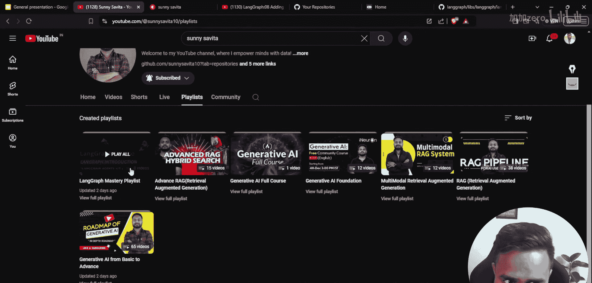

首先，我们构建一个最简单的聊天机器人架构。它接收用户输入，通过一个函数（节点）调用语言模型，然后直接返回输出。

我们定义一个名为 `call_model` 的函数作为聊天节点。这个函数接收一个状态（State），从中获取用户消息，调用语言模型，并将模型的回复添加到状态中。

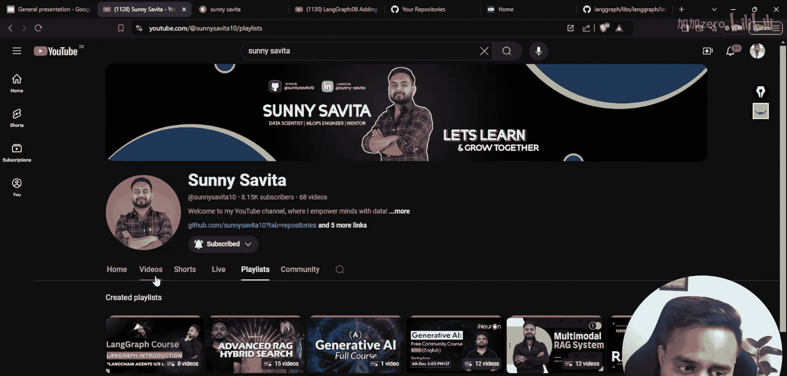

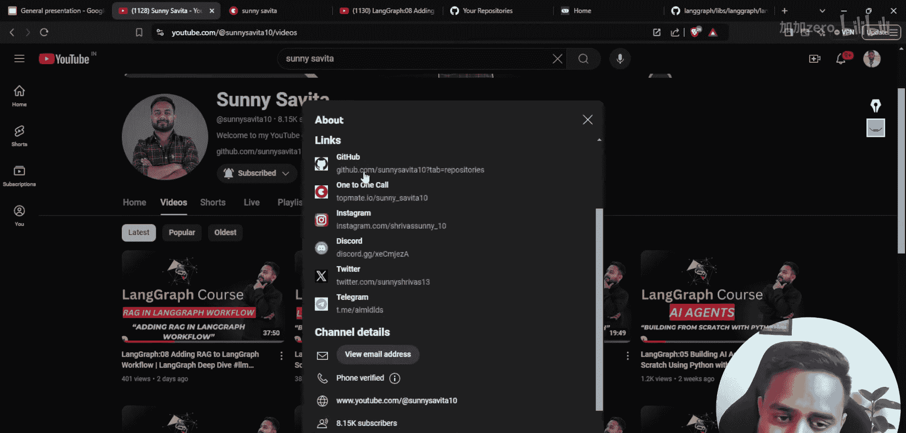

```python
def call_model(state):
    # 从状态中获取最新的用户消息
    user_input = state["messages"][-1].content
    # 调用语言模型生成回复
    ai_message = llm.invoke(user_input)
    # 将AI的回复添加到消息历史中
    return {"messages": [ai_message]}
```

接下来，我们使用 `StateGraph` 来构建图。我们指定状态的结构为 `MessageState`，它包含一个 `messages` 键，其值是消息列表。

```python
# 定义图，并指定状态结构
graph_builder = StateGraph(MessageState)

# 添加节点，节点名为“chatbot”，其功能是call_model函数
graph_builder.add_node("chatbot", call_model)

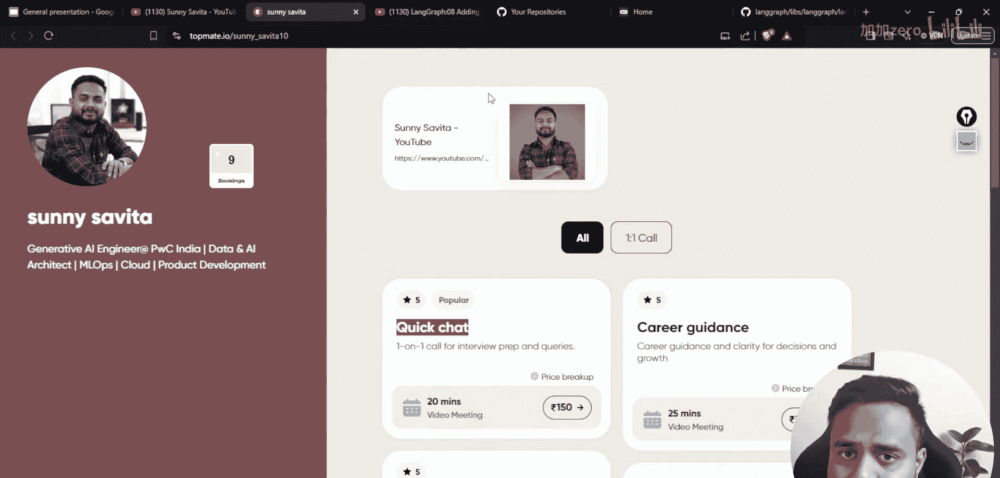

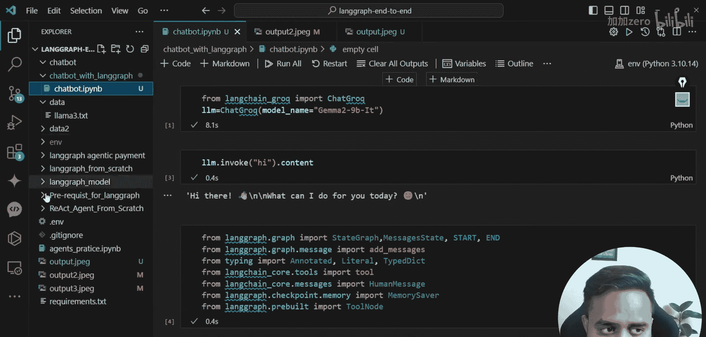

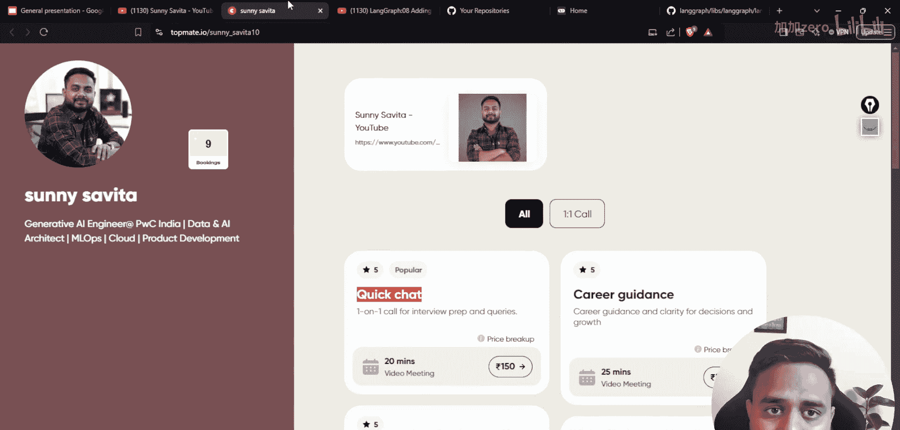

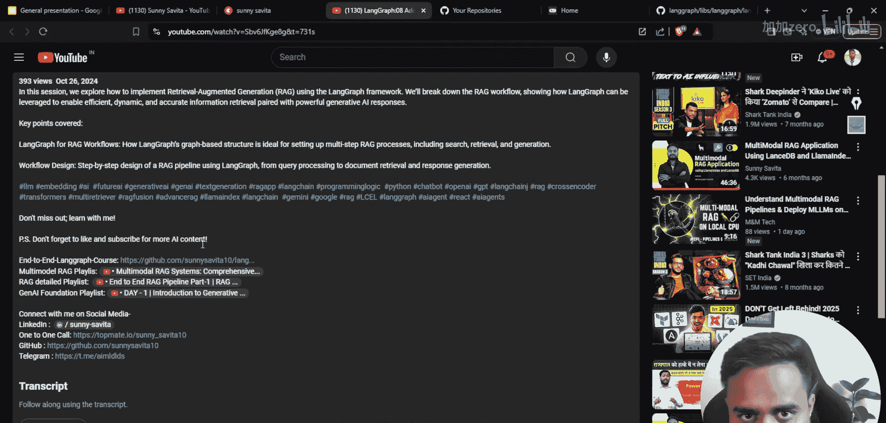

# 设置入口点：整个图的对话从“chatbot”节点开始
graph_builder.set_entry_point("chatbot")

# 设置出口点：“chatbot”节点执行完毕后，对话结束
graph_builder.add_edge("chatbot", END)

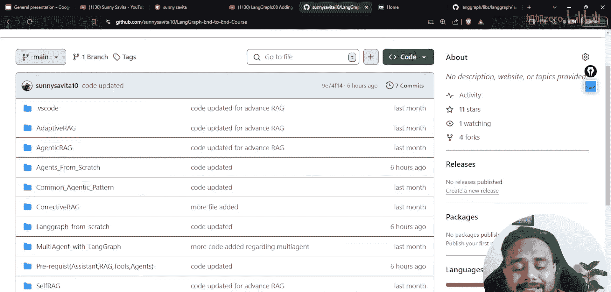

# 编译图，生成可执行的对象
graph = graph_builder.compile()
```

现在，我们可以运行这个基础的聊天机器人了。每次调用时，我们需要传入当前的对话历史。

```python
# 初始化对话，第一条是用户消息
initial_state = {"messages": [HumanMessage(content="你好！")]}
# 运行图
final_state = graph.invoke(initial_state)
# 打印AI的回复
print(final_state["messages"][-1].content)
```

## 架构二：引入条件边的代理

上一节我们构建了一个简单的响应模型。本节中，我们来看看如何创建一个更智能的“代理”。代理能够根据用户的问题，决定是直接回答还是需要调用外部工具（例如查询天气、计算器等）。

以下是实现此功能的关键步骤：

1.  **定义工具**：首先，我们定义一个或多个工具函数。例如，一个计算器工具。
    ```python
    import operator
    tools = [
        {
            "name": "calculator",
            "func": lambda a, b: str(operator.add(int(a), int(b))),
            "description": "计算两个数字的和。输入格式：'数字1, 数字2'"
        }
    ]
    ```

2.  **创建工具节点**：我们创建一个节点，专门用于执行被选中的工具。
    ```python
    def tool_node(state):
        # 假设状态中有一个‘tool_to_use’字段，存储了要使用的工具名和参数
        tool_name = state[“tool_to_use”][“name”]
        args = state[“tool_to_use”][“args”]
        # 找到对应的工具并执行
        for tool in tools:
            if tool[“name”] == tool_name:
                result = tool[“func”](*args)
                # 将工具执行结果以AI消息格式返回
                return {“messages”: [AIMessage(content=f“工具执行结果：{result}”)]}
    ```

3.  **创建代理节点**：代理节点的功能是分析用户输入，并决定下一步行动。它返回一个字典，指示应该去往哪个节点。
    ```python
    def agent_node(state):
        latest_message = state[“messages”][-1].content
        # 简单的逻辑判断：如果消息中包含“计算”或数字，则调用工具
        if “计算” in latest_message or any(char.isdigit() for char in latest_message):
            # 这里简化处理，实际应用中应使用LLM或更复杂的逻辑来解析参数
            return {“next_node”: “tool”, “tool_to_use”: {“name”: “calculator”, “args”: [“5”, “3”]}}
        else:
            # 否则，直接调用模型生成回复
            ai_response = llm.invoke(latest_message)
            return {“next_node”: “end”, “messages”: [ai_response]}
    ```

4.  **构建带条件边的图**：我们使用 `StateGraph` 的 `add_conditional_edges` 方法来创建条件路由。
    ```python
    graph_builder = StateGraph(MessageState)
    graph_builder.add_node(“agent”, agent_node)
    graph_builder.add_node(“tool”, tool_node)
    graph_builder.set_entry_point(“agent”)
    # 添加条件边：根据agent_node返回的‘next_node’值决定下一步
    graph_builder.add_conditional_edges(
        “agent”,
        lambda state: state.get(“next_node”, “end”), # 根据状态决定下一个节点
        {“tool”: “tool”, “end”: END} # 映射关系
    )
    graph_builder.add_edge(“tool”, END) # 工具执行完后结束
    graph = graph_builder.compile()
    ```

在这个架构中，`agent_node` 是决策中心。它分析输入后，并不直接返回对话内容，而是返回一个指令，告诉图下一步应该去 `tool` 节点还是直接结束。`add_conditional_edges` 方法实现了这种动态路由。

## 架构三：实现循环与记忆

在架构二中，工具调用后对话就结束了。但在真实对话中，我们经常需要在得到工具结果后，让代理再次理解这个结果，并组织成最终回答给用户。这就需要引入循环。

同时，为了让聊天机器人能记住之前的对话内容，我们需要引入记忆功能。LangGraph 提供了 `MemorySaver` 检查点（checkpoint）来实现这一点。

以下是实现循环和记忆的步骤：

1.  **修改代理节点**：代理节点现在需要处理两种输入：用户的原始问题，以及工具返回的结果。它需要决定是调用工具，还是生成最终答案。
    ```python
    def advanced_agent_node(state):
        messages = state[“messages”]
        # 将最近的几条消息组合成上下文
        context = “\n”.join([msg.content for msg in messages[-3:]])
        # 使用LLM分析上下文，决定下一步行动。这里用伪代码表示LLM调用。
        # 假设LLM返回一个JSON：{“action”: “tool”/“final_answer”, “content”: “...”}
        llm_decision = llm.decide(context)
        if llm_decision[“action”] == “tool”:
            # 需要调用工具，返回工具信息和参数
            return {“next”: “use_tool”, “tool_call”: llm_decision[“content”]}
        else:
            # 生成最终答案
            return {“next”: “end”, “messages”: [AIMessage(content=llm_decision[“content”])]}
    ```

2.  **构建循环图**：关键点在于，工具节点执行完毕后，不是走向 `END`，而是返回到 `agent` 节点，形成 `agent -> tool -> agent` 的循环。
    ```python
    graph_builder = StateGraph(MessageState)
    graph_builder.add_node(“agent”, advanced_agent_node)
    graph_builder.add_node(“tool”, tool_node) # 复用之前的工具节点
    graph_builder.set_entry_point(“agent”)
    # 代理节点后可能是工具节点，也可能是结束
    graph_builder.add_conditional_edges(
        “agent”,
        lambda state: state.get(“next”, “end”),
        {“use_tool”: “tool”, “end”: END}
    )
    # 工具节点执行后，必须返回到代理节点，让代理处理结果
    graph_builder.add_edge(“tool”, “agent”)
    graph = graph_builder.compile()
    ```

3.  **添加记忆（MemorySaver）**：为了实现跨对话轮次的记忆，我们在编译图时传入 `MemorySaver`。
    ```python
    memory = MemorySaver()
    graph = graph_builder.compile(checkpointer=memory)
    ```
    现在，每次调用图时，都需要关联一个唯一的 `thread_id`。系统会自动保存和加载该对话线程的状态。
    ```python
    # 第一次对话，thread_id 为 “user_123”
    config = {“configurable”: {“thread_id”: “user_123”}}
    graph.invoke({“messages”: [HumanMessage(content=“我的名字是小明。”)]}, config)
    # 第二次对话，使用相同的thread_id，图会记住上次的状态
    result = graph.invoke({“messages”: [HumanMessage(content=“我叫什么名字？”)]}, config)
    print(result[“messages”][-1].content) # 输出应该包含“小明”
    ```
    `MemorySaver` 确保了对话上下文在同一个 `thread_id` 下的持续性。

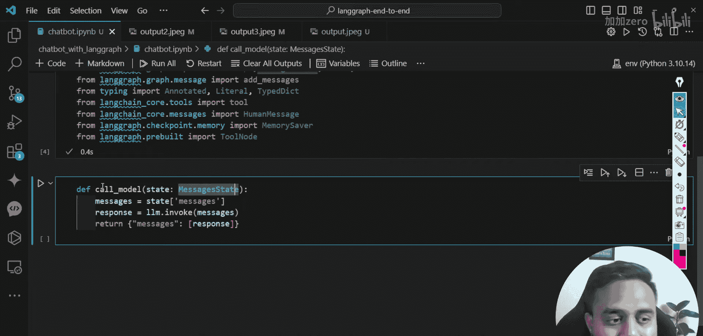

## 总结

本节课中，我们一起学习了如何使用 LangGraph 构建端到端的聊天机器人，并逐步增加了其复杂性和智能。

*   我们首先创建了一个**基础聊天节点**，它直接连接用户输入和模型输出。
*   接着，我们引入了**条件边**，构建了一个**代理架构**。代理能够判断用户意图，并决定是否调用外部工具，实现了初步的决策能力。
*   最后，我们通过创建从工具节点回到代理节点的**循环边**，实现了更复杂的多步推理流程。同时，我们利用 **`MemorySaver` 检查点**为聊天机器人赋予了**记忆功能**，使其能够跨轮次记住对话内容。

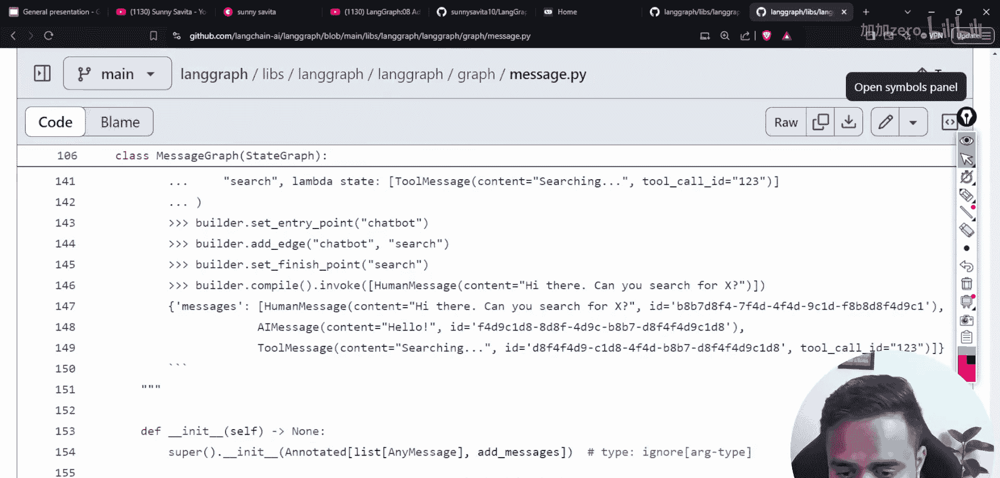

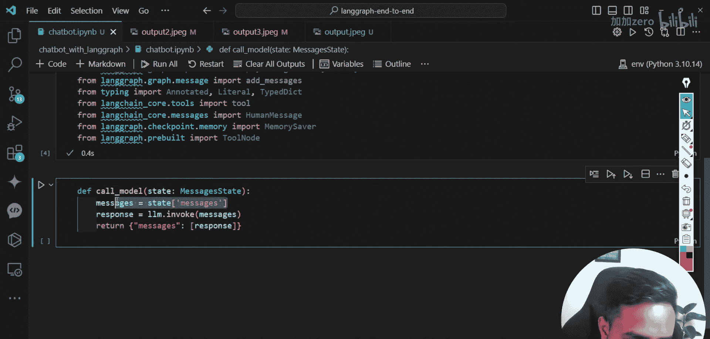

这三种架构展示了 LangGraph 在编排复杂对话流方面的灵活性。通过组合节点、边（包括条件边和循环边）以及检查点，我们可以设计出适应各种场景的智能对话系统。在接下来的课程中，我们将探索多代理系统、与检索增强生成（RAG）的结合等更高级的模式。