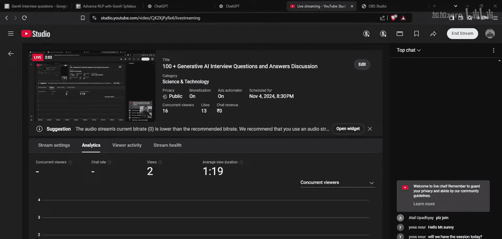
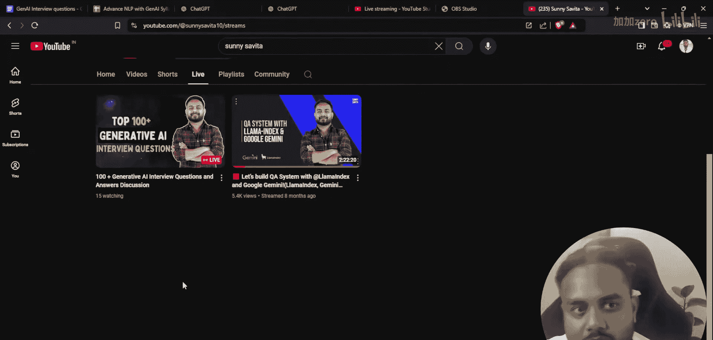
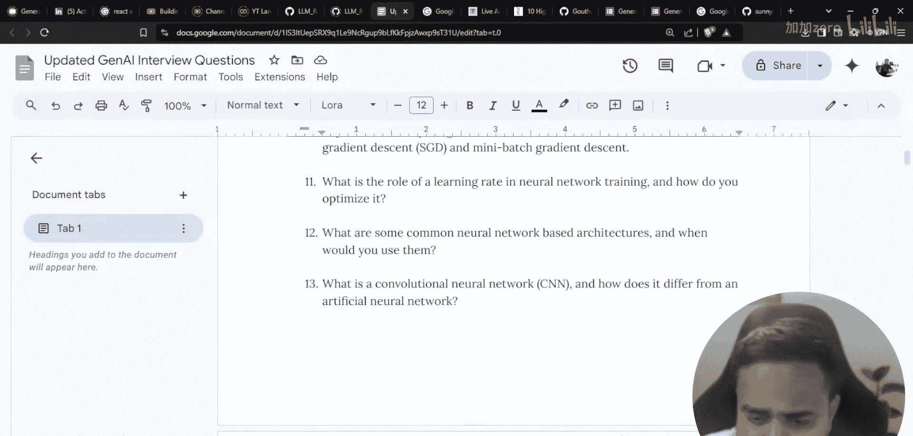
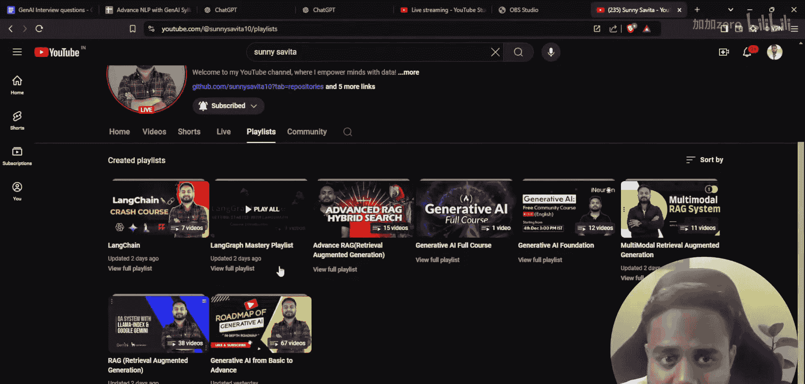
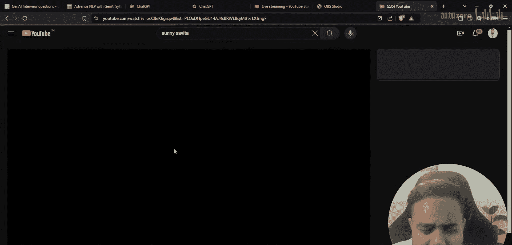
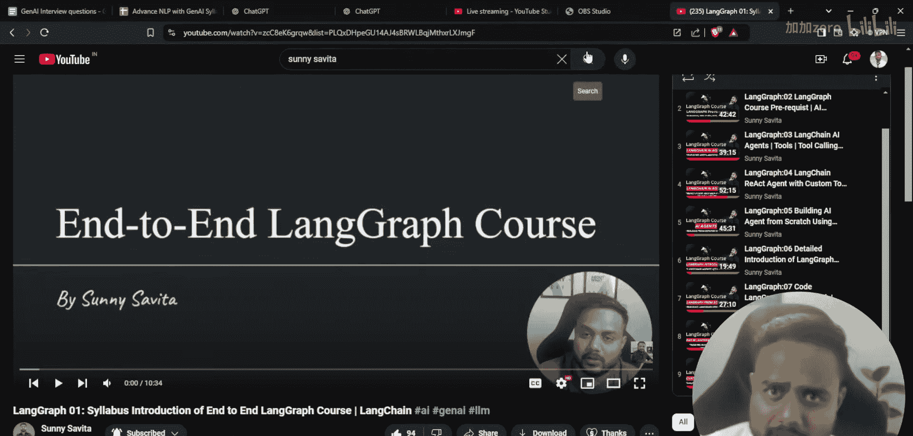

# 生成式AI：P67：100+面试问题与答案讨论 🟥

## 概述
在本节课中，我们将讨论超过100个生成式AI领域的面试问题。本次课程旨在帮助你准备相关面试，并规划未来的学习路径。我们将概述问题类别，并为你提供后续学习和练习的方向。

## 课程内容

上一节我们介绍了本次课程的目标，本节中我们来看看具体的议程安排。

以下是本次直播课程的主要议程：
*   讨论生成式AI面试问题。
*   分享我的YouTube频道内容更新与未来直播计划。
*   收集大家的反馈，让课程更具互动性。

---

现在，让我们开始讨论生成式AI的面试问题。我计划在本节课中涵盖各类问题。

以下是我准备的问题类别示例：
*   与大语言模型和LangGraph相关的问题。
*   与检索增强生成相关的问题。
*   与多模态RAG系统相关的问题。
*   涉及不同工具、组件和框架的项目实践问题。

---

上一节我们列出了问题类别，本节中我们来看看我的教学计划。

关于这些问题，我的计划是：本次直播主要聚焦于问题本身，而非详细解答每个答案（以免课程过长）。我会针对这些问题给大家布置任务，并阐述我对于这些面试题以及未来YouTube频道课程的整体规划。

---

我计划增加直播频率，以便更好地与大家交流和学习。

以下是我未来的直播安排构想：
*   每周进行两次直播课程。
*   一次安排在工作日，一次安排在周末。
*   讨论最新技术话题和项目实践。
*   除了生成式AI，也会涵盖机器学习、深度学习等更广泛的领域。

---

除了直播，我的YouTube频道已有系统的视频教程，我将继续完善它们。

目前，我正在更新LangGraph的教程播放列表。我已经上传了9个相关视频，并计划尽快完成剩余内容。完成这个系列后，我将开始新的主题。

在教程更新间隙，我会通过直播讨论热点项目、面试问题，甚至如何构建简历。

---

## 总结
本节课中，我们一起学习了本次生成式AI面试问题讨论课的核心议程。我们明确了问题范围，了解了未来的直播学习计划，并回顾了频道现有的教程体系。我的目标是帮助大家从初学者成长为专家，敬请期待后续更详细的内容。