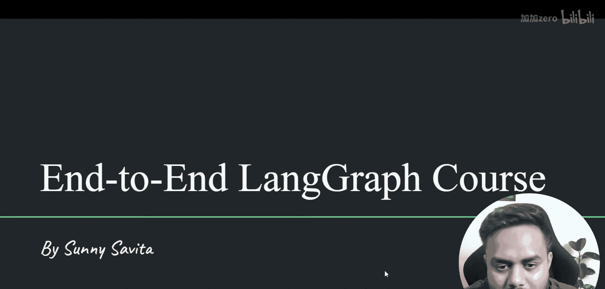
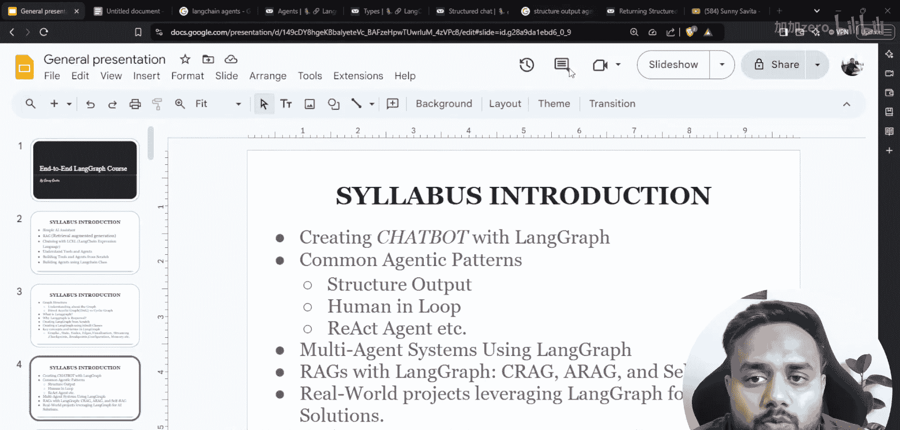
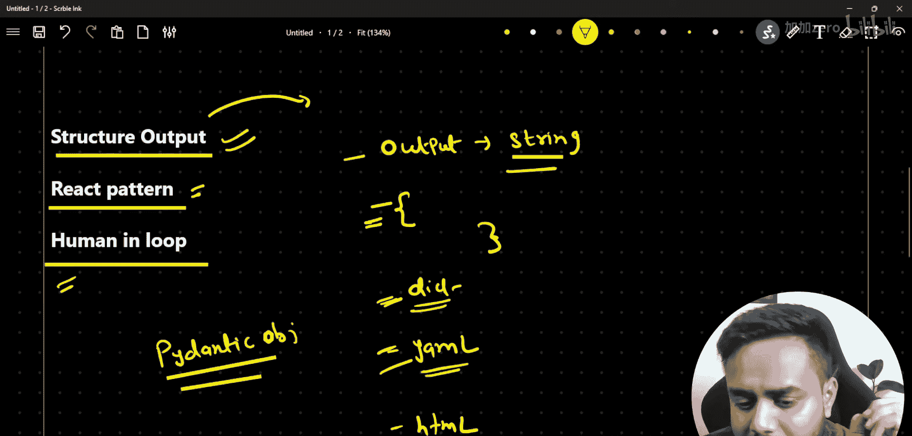
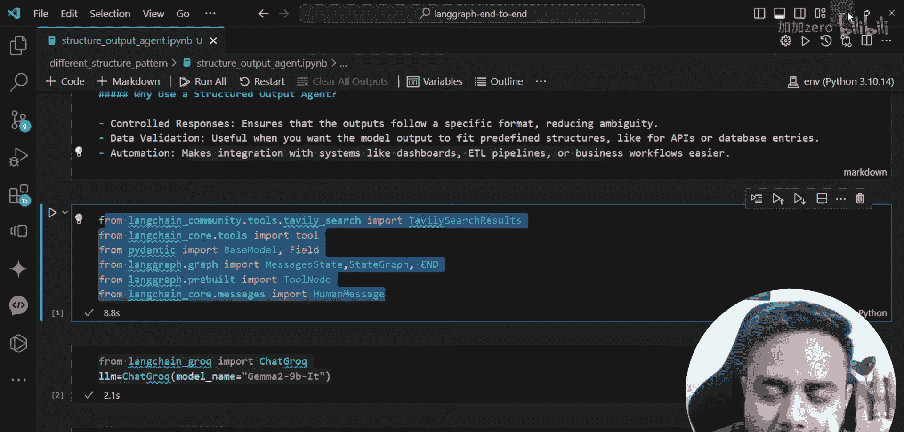
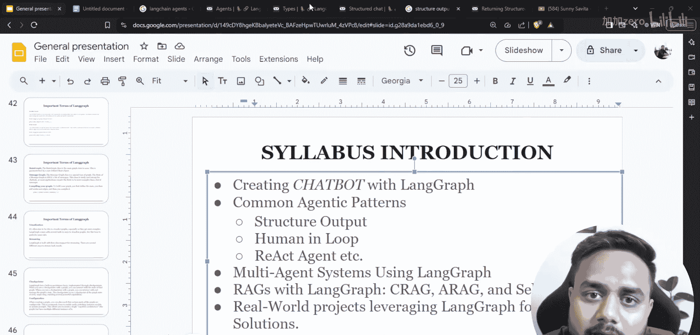
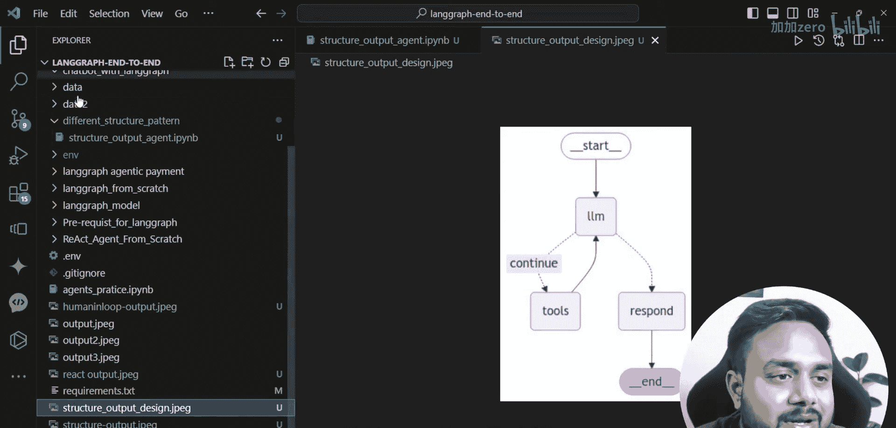
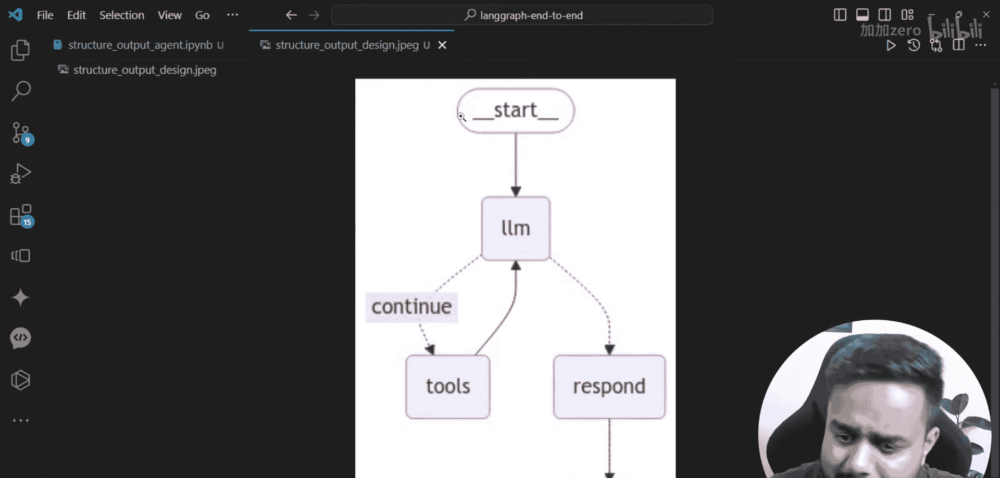

# LangGraph课程：10：结构化输出代理模式 🧱

在本节课中，我们将学习如何使用LangGraph构建一个能够生成结构化输出的智能体。我们将了解其必要性，并通过一个实际例子来演示如何让AI代理返回字典或JSON格式的数据，而不仅仅是普通文本。

---

## 概述



在之前的课程中，我们学习了如何使用LangGraph创建聊天机器人。从本节课开始，我们将深入探讨几种常见的智能体模式。首先介绍的是**结构化输出模式**。这种模式允许我们控制AI代理的响应格式，使其能够返回如字典、JSON等结构化数据，而不仅仅是字符串。这对于数据验证、API集成和自动化流程至关重要。

## 为什么需要结构化输出？

上一节我们介绍了课程的整体安排，本节中我们来看看为什么需要结构化输出。通常，大型语言模型（LLM）的输出是纯文本字符串。但在实际应用中，我们往往需要更规整的数据格式。

以下是结构化输出的主要优势：

*   **控制响应**：可以精确指定输出数据的字段和结构。
*   **数据验证**：结构化的数据更容易进行格式和内容的校验。
*   **便于集成**：生成的数据（如JSON）可以直接传递给其他API、存入数据库或用于自动化仪表板，无需复杂的解析。

例如，询问“印度总理的信息”，我们不仅可以得到一段文字描述，还可以得到一个结构化的字典，包含`姓名`、`所属国家`、`首都`等键值对。

## 实现步骤




现在，让我们进入实践环节，看看如何用LangGraph实现一个结构化输出代理。

### 1. 导入依赖与初始化模型

首先，我们需要导入必要的库并加载语言模型。这里我们使用Google的Gemma 2开源模型。

```python
# 导入所需模块
from langchain_community.tools import TavilySearchResults
from langchain_google_genai import ChatGoogleGenerativeAI
from langgraph.graph import StateGraph, END
from typing import TypedDict, Annotated
import operator

# 加载LLM模型
llm = ChatGoogleGenerativeAI(model="gemma-2")
```

### 2. 定义工具与状态

我们需要一个工具来获取实时信息，这里使用Tavily进行网络搜索。同时，我们需要定义智能体运行时的状态结构。

```python
# 初始化搜索工具
search_tool = TavilySearchResults(max_results=2)

# 定义状态结构
class AgentState(TypedDict):
    question: str
    structured_answer: dict
```

### 3. 构建智能体节点



智能体节点的核心是调用LLM并指导其生成结构化输出。我们通过系统提示词来明确要求输出格式。

```python
def agent_node(state: AgentState):
    # 系统提示词，要求以特定JSON格式回答
    system_prompt = """你是一个信息提取助手。请严格使用以下JSON格式回答用户问题：
    {
        "answer": {
            "key1": "value1",
            "key2": "value2",
            ...
        }
    }
    确保所有值都是字符串。"""
    
    # 构建包含系统提示和用户问题的消息
    messages = [
        ("system", system_prompt),
        ("human", state["question"])
    ]
    
    # 调用LLM获取响应
    response = llm.invoke(messages)
    
    # 这里通常需要解析响应内容为字典，假设响应已是合规JSON
    # 在实际代码中，可能需要使用`json.loads()`进行解析和错误处理
    import json
    try:
        structured_output = json.loads(response.content)
    except:
        structured_output = {"answer": {"raw_response": response.content}}
    
    # 返回更新后的状态
    return {"structured_answer": structured_output}
```

### 4. 创建工作流图

最后，我们将所有节点组合成一个可执行的工作流。

```python
# 创建图
workflow = StateGraph(AgentState)

# 添加节点
workflow.add_node("agent", agent_node)

# 设置入口点
workflow.set_entry_point("agent")

# 设置结束点
workflow.add_edge("agent", END)

# 编译图
app = workflow.compile()
```

### 5. 运行与测试

现在，我们可以运行这个智能体来获取结构化信息。





```python
# 定义问题
question = "印度总理是谁？他属于哪个国家？该国的首都是什么？"

# 初始化状态
initial_state = AgentState(question=question, structured_answer={})

# 执行图
final_state = app.invoke(initial_state)

# 打印结构化结果
print(final_state["structured_answer"])
```
**预期输出示例：**
```json
{
    "answer": {
        "姓名": "纳伦德拉·莫迪",
        "所属国家": "印度",
        "首都": "新德里"
    }
}
```

## 总结

本节课中我们一起学习了LangGraph中的**结构化输出代理模式**。我们了解了强制AI代理返回字典、JSON等格式数据的重要性，它能带来更好的控制性、验证性和集成便利性。通过定义清晰的状态、使用特定的系统提示词构建智能体节点，我们成功创建了一个能够将自然语言查询转换为结构化数据的工作流。这是构建复杂、可靠AI应用的基础一步。





在接下来的课程中，我们将继续探索其他强大的智能体模式，如ReAct模式和人在回路模式。