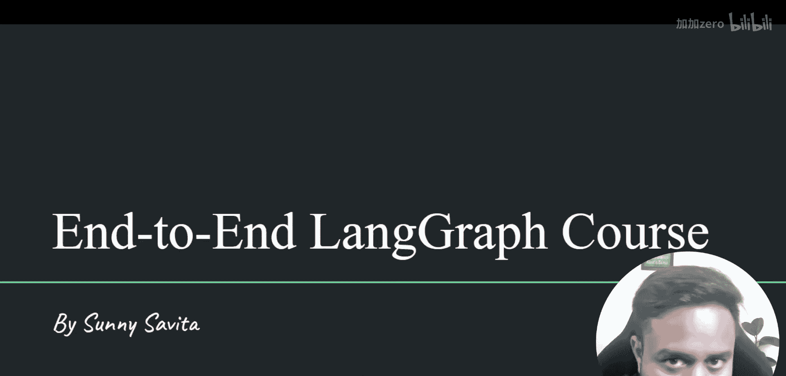
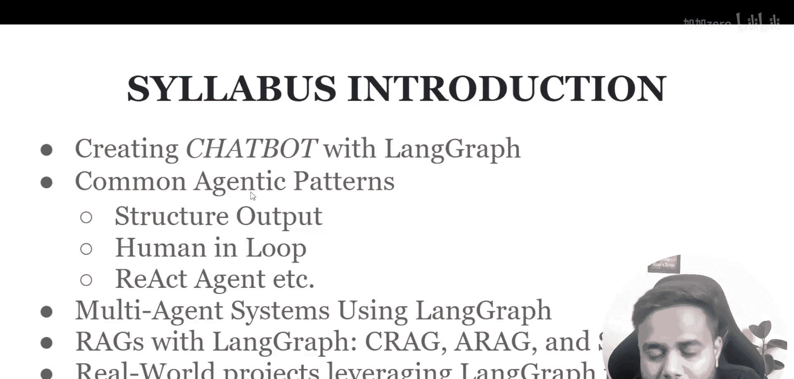
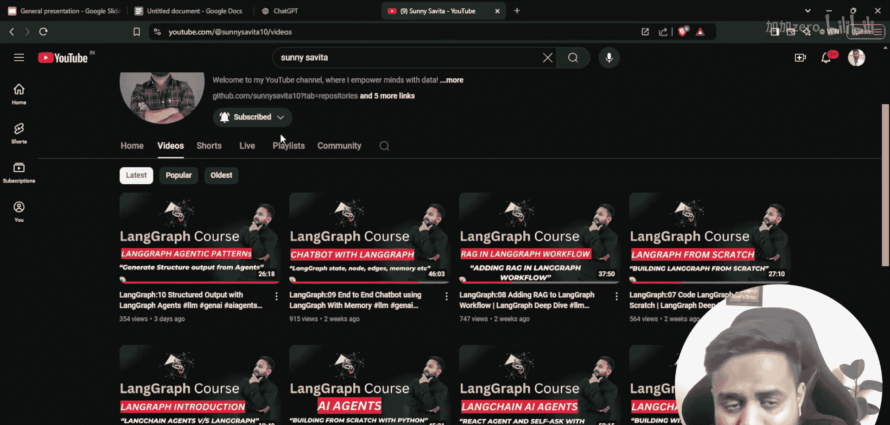
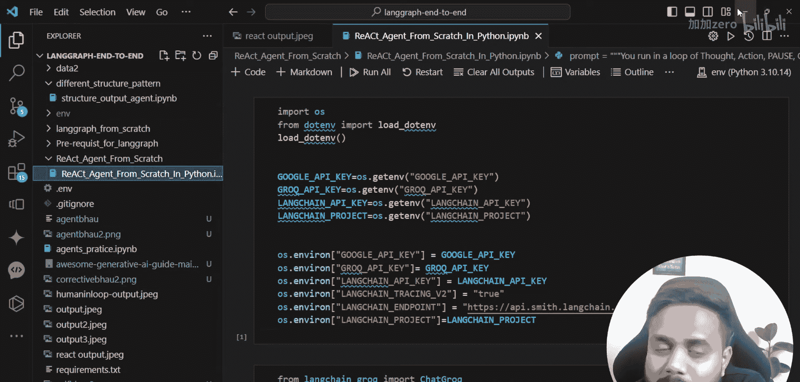
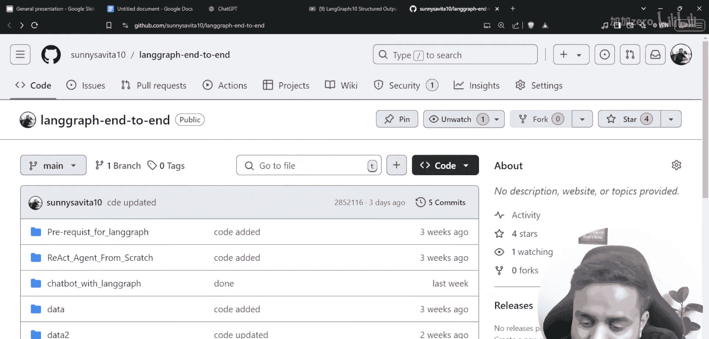
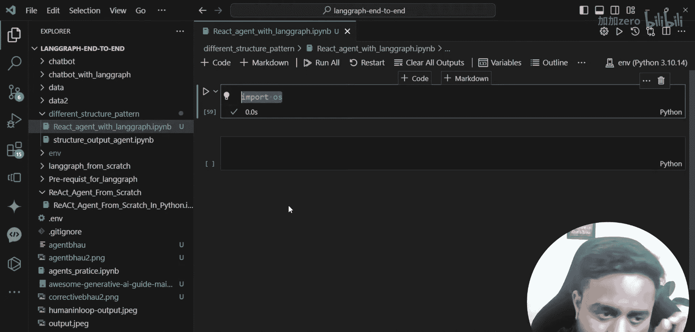
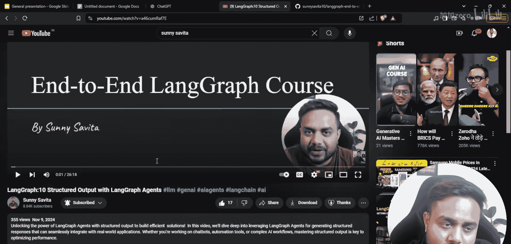
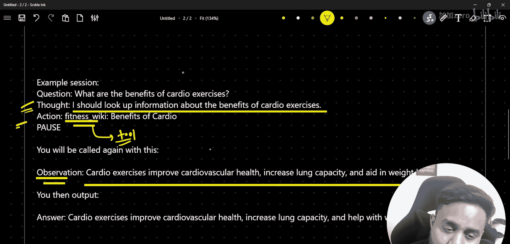

# LangGraph课程：11：使用LangGraph的ReAct智能体构建金融机器人

在本节课中，我们将学习如何使用LangGraph框架构建一个ReAct智能体，并应用它来创建一个金融机器人。我们将从ReAct的基本概念开始，逐步深入到具体的代码实现。

## 概述

ReAct（推理-行动）是一种智能体模式，它通过结合推理和与环境交互来完成任务。在本节中，我们将探讨ReAct的工作流程，并学习如何在LangGraph中实现它。



## ReAct工作流程解析

上一节我们介绍了智能体的基本概念，本节中我们来看看ReAct的具体工作流程。




ReAct的工作流程可以概括为以下几个步骤：
1.  **输入**：接收用户的问题或指令。
2.  **思考**：智能体对输入进行推理，分析需要做什么。
3.  **行动**：根据思考结果，调用一个工具（如搜索API、计算器）来执行具体操作。
4.  **观察**：获取工具执行后的结果。
5.  **循环判断**：判断观察结果是否足以回答问题。如果不足，则回到“思考”步骤，形成“思考 -> 行动 -> 观察”的循环。
6.  **输出**：当获得足够信息后，生成最终答案。

这个流程可以用以下伪代码描述：
```python
while not task_complete:
    thought = reason(input, history)
    action, parameters = decide_action(thought)
    observation = execute_tool(action, parameters)
    history.append((thought, action, observation))
answer = generate_final_output(history)
```




## 构建ReAct智能体的准备工作


在开始编码之前，需要确保开发环境已正确设置。以下是必要的准备工作：

*   **安装依赖**：确保已安装`langgraph`、`langchain`等相关库。
*   **导入模块**：在代码开头导入必要的类和方法。
*   **工具准备**：定义智能体可以使用的工具，例如金融数据查询、计算等。





## 使用LangGraph实现ReAct智能体

理解了原理并做好准备后，我们现在开始使用LangGraph构建ReAct智能体。

以下是构建智能体的核心步骤：



1.  **定义状态**：创建一个`StateGraph`，并定义智能体运行过程中需要维护的状态，通常包括用户消息、思考过程、工具调用记录等。
    ```python
    from typing import TypedDict, List
    class AgentState(TypedDict):
        messages: List
        next: str
    ```

2.  **创建节点**：根据ReAct流程，创建对应的节点函数。通常包括：
    *   `agent_node`: 负责“思考”和决定下一步“行动”。
    *   `tool_node`: 负责执行“行动”，即调用工具并返回“观察”结果。
    *   `router`: 负责判断流程是继续循环还是结束。





3.  **构建图结构**：将节点添加到图中，并按照`agent -> tool -> router -> (agent或end)`的顺序连接边，以形成循环。

4.  **编译与运行**：编译图，并传入初始状态来运行智能体。

## 创建金融机器人实例

我们将把构建好的ReAct智能体应用于金融领域，创建一个能回答金融问题的机器人。

这个机器人可以集成多种工具，例如：
*   `get_stock_price`: 获取股票实时价格。
*   `calculate_interest`: 计算复利。
*   `search_financial_news`: 搜索相关财经新闻。

智能体在回答诸如“苹果公司当前股价是多少？过去一年的趋势如何？”等问题时，会先思考需要调用哪些工具（获取股价、获取历史数据），然后依次执行，最后综合所有观察结果给出回答。

## 总结



本节课中我们一起学习了ReAct智能体的核心概念及其在LangGraph中的实现方法。我们解析了“思考-行动-观察”的循环工作流程，逐步完成了从定义状态、创建节点到构建循环图的代码实践，并最终创建了一个具备实际工具调用能力的金融机器人示例。掌握ReAct模式是构建复杂、可靠智能体应用的关键一步。