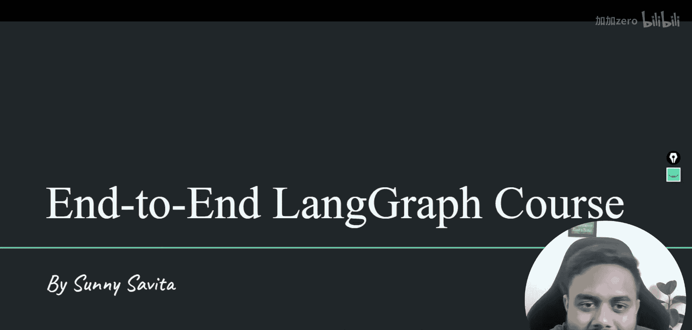
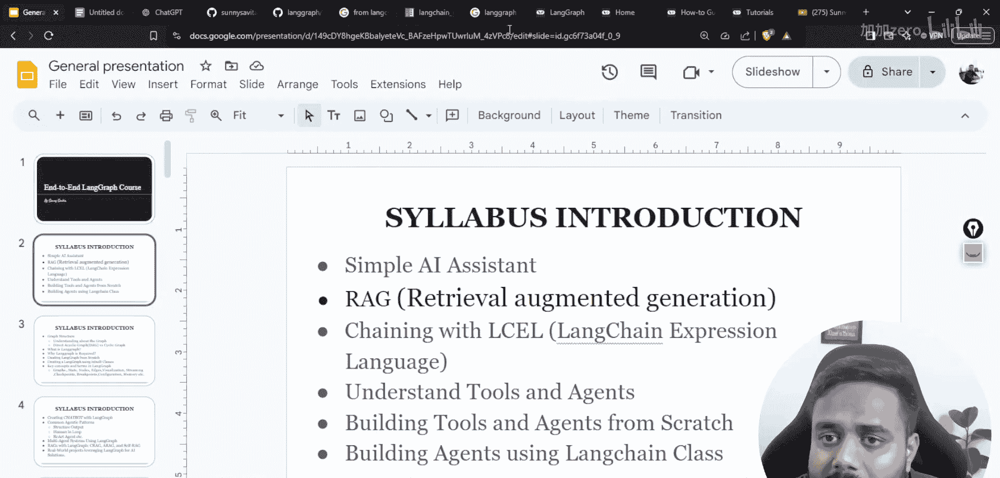
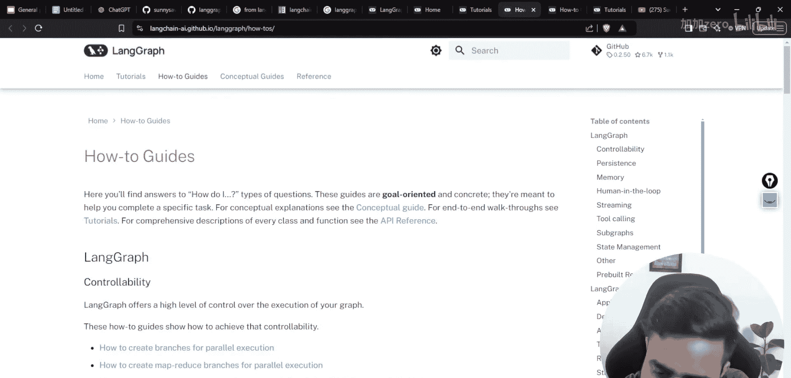
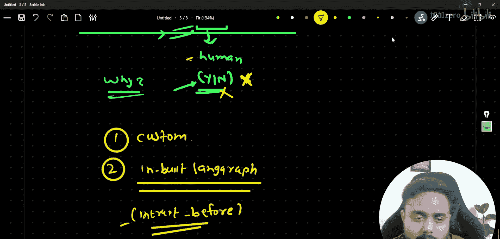
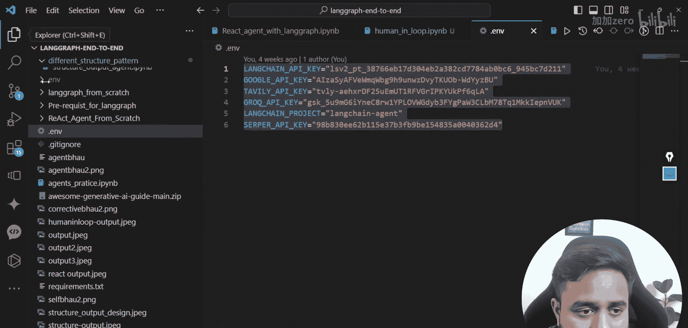

# LangGraph课程：P70：带有人工干预、检查点和断点的LangGraph智能体 🧠

在本节课中，我们将学习LangGraph中一个非常重要的概念：带有人工干预（Human-in-the-Loop）的智能体。我们将探讨如何让人类在智能体执行流程中进行干预，并理解与之相关的检查点（Checkpointing）和断点（Breakpointing）机制。内容将力求简单直白，便于初学者理解。

## 概述

首先，我们来理解什么是“人工干预”。顾名思义，它指的是在智能体的自动化执行流程中，插入一个需要人类进行判断或提供输入的环节。例如，在一个工作流中，某个步骤可能需要调用一个付费工具，此时系统可以暂停并询问用户“是否继续？”，根据用户的回答（是或否）来决定后续的执行路径。

上一节我们介绍了ReAct智能体模式，本节中我们来看看如何将人类决策融入智能体工作流。

## 人工干预的实现方式

实现人工干预主要有两种方法：
1.  自定义逻辑。
2.  利用LangGraph的内置功能（通过 `interrupt_before` 参数）。

接下来，我们将通过实践来具体了解这两种方式。

## 环境准备与代码实现

我们将在一个简单的LangGraph工作流中实现人工干预。首先，确保已导入必要的库并设置好语言模型。



```python
# 导入必要的库
from langgraph.graph import StateGraph, END
from typing import TypedDict
from langchain_google_genai import ChatGoogleGenerativeAI

# 初始化语言模型（此处使用免费的Gemini模型）
llm = ChatGoogleGenerativeAI(model="gemini-pro")
```

我们定义工作流的状态，它包含一个记录对话历史的 `messages` 列表。

```python
class AgentState(TypedDict):
    messages: list
```




现在，我们创建两个简单的节点函数。第一个节点 `node_one` 负责生成问候语。

```python
def node_one(state: AgentState):
    # 模拟第一个节点的处理，例如生成问候
    response = "你好！我是智能体。我已处理完第一步。"
    return {"messages": state["messages"] + [{"role": "assistant", "content": response}]}
```

第二个节点 `node_two` 模拟一个需要决策的复杂或付费操作。

```python
def node_two(state: AgentState):
    # 模拟第二个节点的处理，例如一个复杂任务
    response = "这是一个模拟的复杂或付费操作。"
    return {"messages": state["messages"] + [{"role": "assistant", "content": response}]}
```


## 方法一：自定义人工干预逻辑

在这种方法中，我们创建一个专门的 `human_intervention` 节点。该节点会暂停图执行，等待外部输入（例如通过命令行），然后将用户的决定注入到状态中，从而影响后续流程。


以下是该节点的实现：

```python
def human_intervention(state: AgentState):
    # 这里模拟人工干预，例如询问用户是否继续
    print("系统提示：下一步将执行一个模拟的付费操作。是否继续？(yes/no)")
    human_input = input().strip().lower()

    if human_input == "yes":
        decision = "用户同意继续。"
    else:
        decision = "用户决定停止。"
        # 可以在这里添加逻辑，直接跳转到结束或其它节点

    return {"messages": state["messages"] + [{"role": "user", "content": decision}]}
```

接着，我们构建图，并将自定义的人工干预节点插入到 `node_one` 和 `node_two` 之间。

```python
# 创建图
workflow = StateGraph(AgentState)

# 添加节点
workflow.add_node("node_one", node_one)
workflow.add_node("human_check", human_intervention) # 自定义人工干预节点
workflow.add_node("node_two", node_two)

# 设置边
workflow.set_entry_point("node_one")
workflow.add_edge("node_one", "human_check")
# 根据人工干预节点的输出决定下一步
workflow.add_conditional_edges(
    "human_check",
    # 一个简单的路由函数：如果用户输入包含“同意”，则前往node_two，否则结束
    lambda x: "node_two" if "同意" in x["messages"][-1]["content"] else END,
    {"node_two": "node_two", END: END}
)
workflow.add_edge("node_two", END)

# 编译图
app = workflow.compile()
```

现在，我们可以运行这个图。执行到 `human_check` 节点时，程序会在控制台暂停，等待你的输入。

```python
# 初始化状态
initial_state = AgentState(messages=[])
# 运行图
final_state = app.invoke(initial_state)
print("最终消息历史：", final_state["messages"])
```

## 方法二：使用LangGraph内置的Interrupt功能

LangGraph提供了更优雅的内置方式来实现人工干预，即通过 **检查点（Checkpoint）** 和 **断点（Breakpoint）**。



*   **检查点**：图执行过程中的状态快照。它允许我们从任意保存过的检查点恢复执行，而不是每次都从头开始。
*   **断点**：在特定节点执行前设置的中断。当图执行到该节点时，它会暂停，并将控制权交还给调用者，同时保存一个检查点。调用者可以审查状态、注入人工输入，然后决定是否继续执行。

这通过 `interrupt_before` 参数来实现。我们修改图的构建方式：

```python
# 重新构建图，这次不使用自定义干预节点，而是依赖内置中断
workflow_v2 = StateGraph(AgentState)

workflow_v2.add_node("node_one", node_one)
workflow_v2.add_node("node_two", node_two) # 我们将在执行此节点前中断

workflow_v2.set_entry_point("node_one")
workflow_v2.add_edge("node_one", "node_two")
workflow_v2.add_edge("node_two", END)

app_v2 = workflow_v2.compile()

# 现在，我们以支持检查点的方式运行图。
# 我们需要一个检查点存储器（Checkpointer），这里为了示例使用内存存储。
from langgraph.checkpoint.memory import MemorySaver

memory = MemorySaver()
app_v2_with_checkpoints = workflow_v2.compile(checkpointer=memory)

# 创建初始配置
config = {"configurable": {"thread_id": "thread_1"}}

# 运行到第一个节点
initial_state = AgentState(messages=[])
result = app_v2_with_checkpoints.invoke(initial_state, config)
print("执行node_one后：", result["messages"])

# 现在，我们希望在执行node_two之前中断。
# 我们需要在调用时指定 `interrupt_before`。
# 注意：通常我们会在定义图时通过 `app_v2.update_state(...)` 或配置来实现更精细的控制。
# 以下演示一种概念：在调用invoke时，如果系统支持，可以指定在某个节点前暂停。
# 更常见的做法是使用 `app_v2.stream(...)` 并监听中断事件。

print("\n--- 模拟内置中断流程 ---")
print("系统已到达‘node_two’（模拟付费操作）前的断点。")
print("请决定是否继续执行 node_two？(yes/no)")
human_decision = input().strip().lower()




if human_decision == "yes":
    # 继续执行，从上一个检查点（即node_one之后）恢复，并执行node_two
    # 在实际使用中，LangGraph的流式（stream）接口会返回一个迭代器，当遇到中断时会产出特定事件。
    # 开发者捕获该事件，与用户交互后，再调用 `graph.resume(...)` 继续执行。
    print("用户决定继续。恢复执行...")
    # 假设我们在这里恢复执行
    final_result = app_v2_with_checkpoints.invoke(
        {"messages": result["messages"]}, # 从之前的状态继续
        config
    )
    print("最终结果：", final_result["messages"])
else:
    print("用户决定停止。流程终止于断点。")
    print("当前状态已保存为检查点，可供后续恢复。")
```

**核心概念解释**：
*   **`interrupt_before`**：这是一个图配置选项，告诉LangGraph在进入指定节点前暂停执行并保存检查点。
*   **恢复执行**：当人工干预完成后，程序可以从保存的检查点恢复图执行，无需重做之前的所有步骤。

## 总结

本节课中我们一起学习了如何在LangGraph智能体中实现人工干预。

我们首先解释了人工干预的概念，即在自动化流程中引入人类决策点。接着，我们探讨了两种实现方法：第一种是创建自定义节点来模拟决策输入；第二种是利用LangGraph内置的检查点和断点机制，通过 `interrupt_before` 在指定节点前暂停流程，等待外部输入后再决定是否继续。



检查点和断点机制为构建复杂、可交互、状态可持久化的智能体工作流提供了强大支持，使得开发需要人工审核或决策的应用程序变得更加容易。在接下来的课程中，我们将进入RAG（检索增强生成）相关主题的学习。