# LangGraph 课程：13：实时 AI 应用中的纠正型 RAG 🛠️

在本节课中，我们将学习如何构建一个“纠正型检索增强生成”系统。该系统能够检测传统 RAG 给出的答案是否准确，并在答案不准确时，自动从外部知识源（如互联网）获取信息进行纠正，从而生成更可靠的最终答案。

## 概述：什么是 RAG？


在深入纠正型 RAG 之前，我们需要先理解基础的 RAG 架构。RAG 的全称是“检索增强生成”。它的工作流程主要分为三个阶段：

1.  **数据引擎**：从各种来源收集数据，将其分割成多个文本块，为每个块生成向量表示，并存储到向量数据库中。
2.  **检索**：当用户提出查询时，将查询也转换为向量，并在向量数据库中进行相似度搜索，检索出最相关的文档片段。
3.  **生成**：将检索到的相关文档、用户的原始查询以及特定的指令提示一起输入给大语言模型，由模型生成最终的答案。

这个架构简单直接，但存在一个潜在问题：如果检索到的文档本身不准确或不相关，那么生成的答案也可能是错误的。

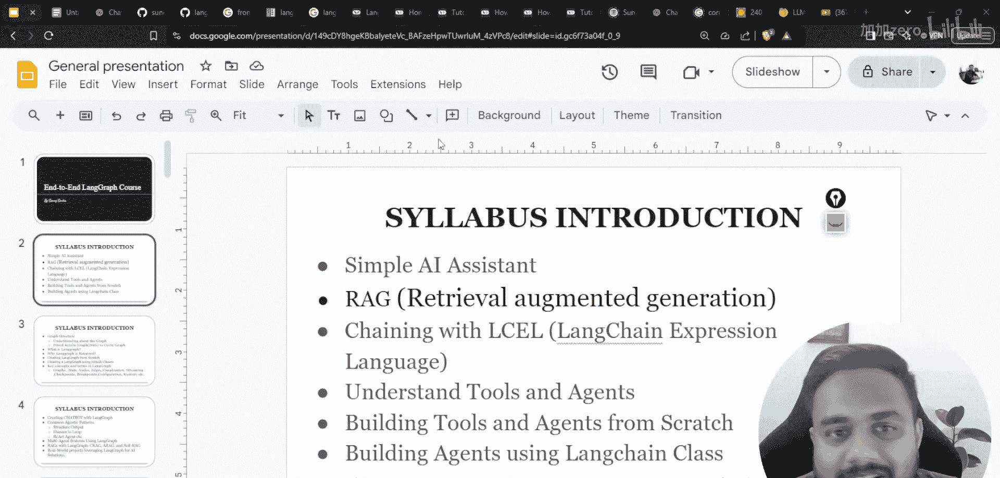


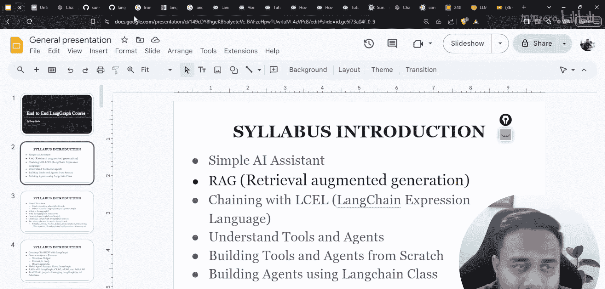


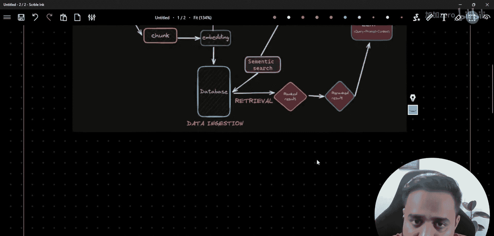

## 从 RAG 到纠正型 RAG

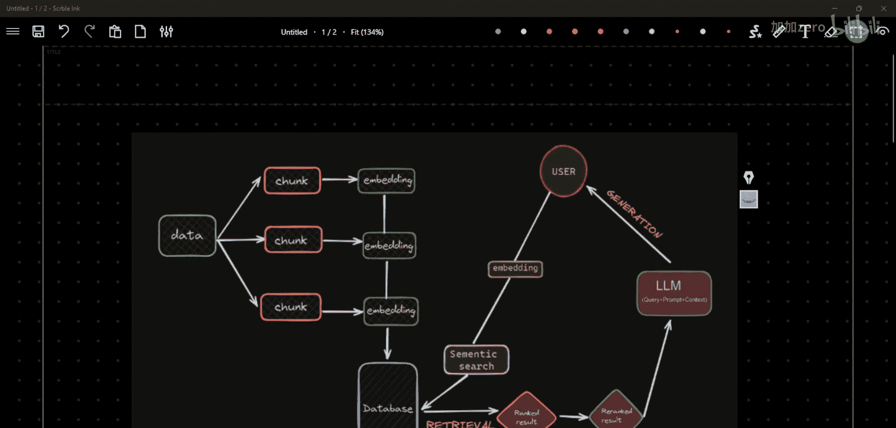

上一节我们介绍了基础 RAG 的流程。本节中，我们来看看如何对其进行增强，使其具备“纠正”能力。

“纠正”在这里指的是知识纠正。当 RAG 系统给出错误答案时，我们希望能够自动修正它。我们选择使用 LangGraph 来实现这个系统，因为它提供了极大的灵活性。

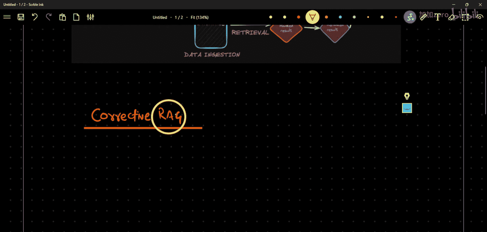

LangGraph 允许我们将功能定义为节点，并用边连接这些节点。更重要的是，它支持创建循环图。这意味着我们可以设计一个流程：如果某个节点（如答案评估节点）判断结果不理想，流程可以循环回到之前的节点或跳转到新的纠正路径，而不是直接结束。

在纠正型 RAG 中，这个循环能力至关重要。如果系统判断从自身知识库检索到的答案不可靠，它可以转而从互联网等外部知识源获取信息，并用这些新信息来生成或修正答案。

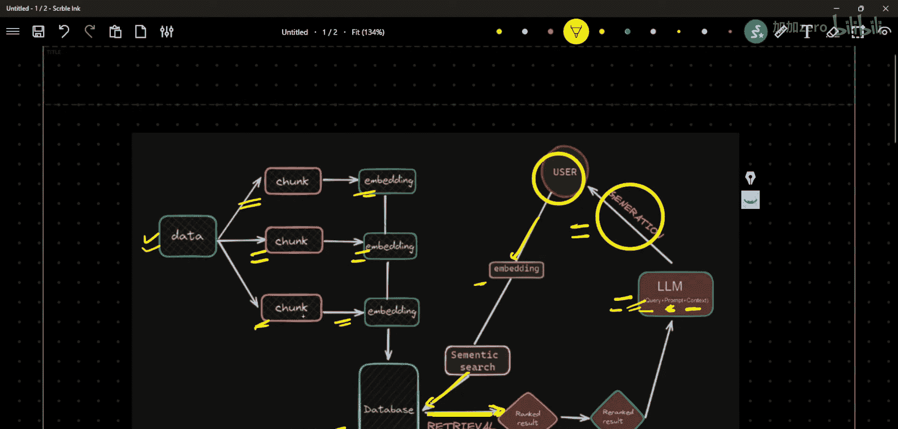

## 纠正型 RAG 架构详解

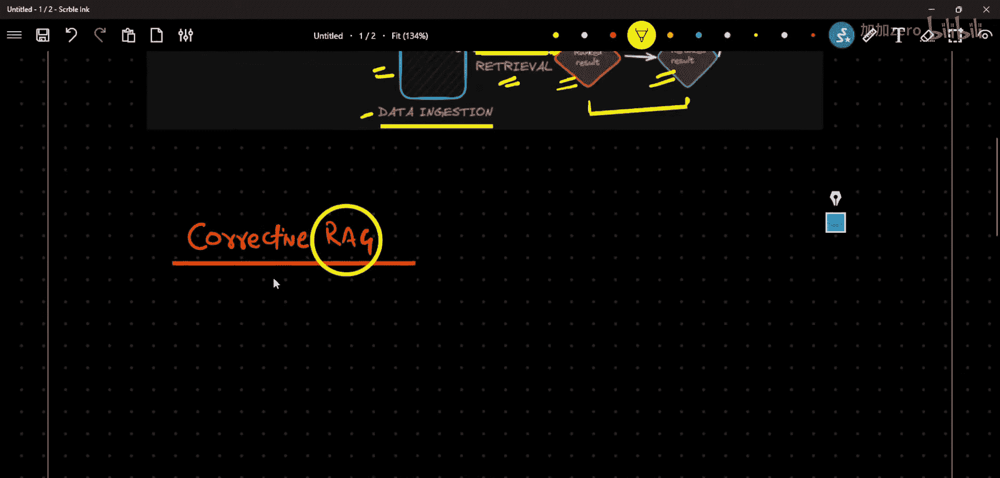

现在，让我们详细剖析一下我们将要构建的纠正型 RAG 系统架构。整个架构将在 LangGraph 中实现。

以下是该架构的核心流程图：

```
[用户提问] -> [检索节点] -> [评估节点] -> {判断}
                                     |
                                     |-- (是/相关) -> [生成节点] -> [最终答案]
                                     |
                                     |-- (否/不相关) -> [重写查询节点] -> [网络搜索节点] -> [生成节点] -> [最终答案]
```

**流程逐步解析：**

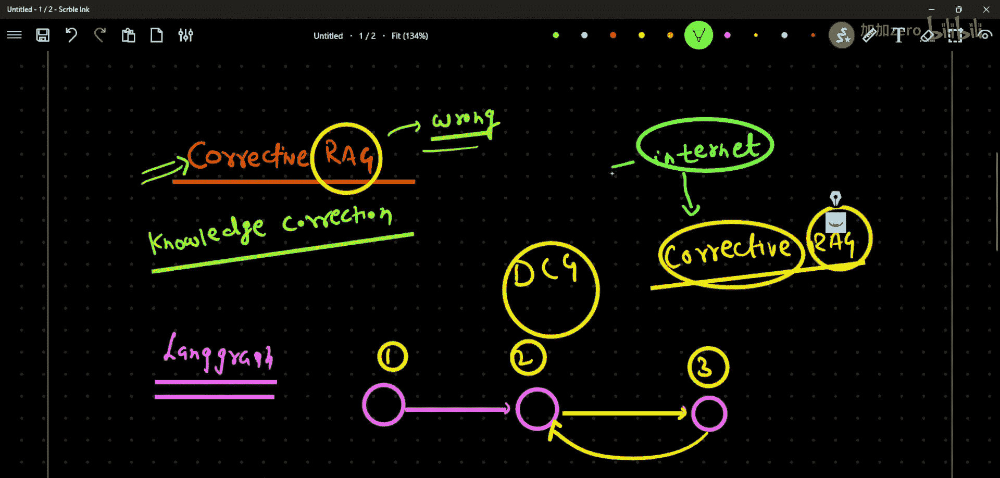

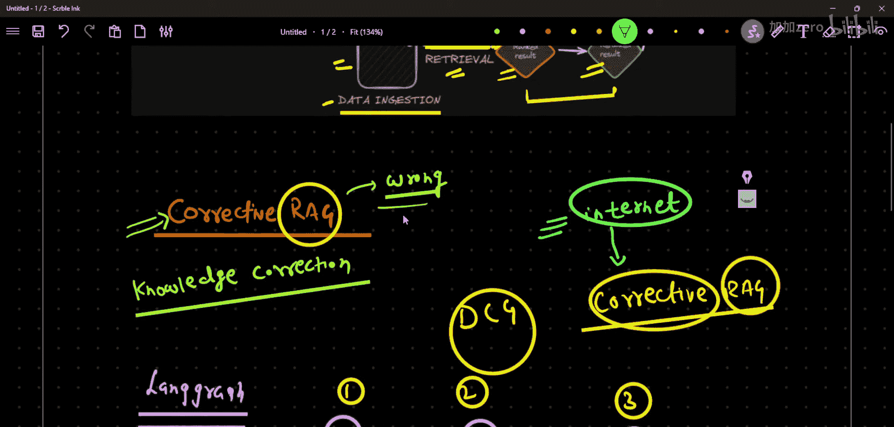

1.  **检索节点**：接收用户的问题，从我们预先构建的向量数据库中检索出最相关的文档。
2.  **评估节点**：这是一个关键决策点。它负责判断检索到的文档是否足以正确回答问题。其输出是一个简单的二元判断：`是`（相关/正确）或 `否`（不相关/错误）。
3.  **分支路径**：
    *   **如果评估为“是”**：流程直接进入**生成节点**。该节点将检索到的文档、用户问题和提示模板组合，交给 LLM 生成最终答案。
    *   **如果评估为“否”**：流程进入纠正循环：
        a. **重写查询节点**：首先优化或重写原始查询，使其更适合进行网络搜索。
        b. **网络搜索节点**：使用重写后的查询，调用搜索引擎 API 从互联网获取最新、最相关的信息。
        c. **生成节点**：将网络搜索得到的新信息（替代或补充原有的检索文档）与用户问题结合，生成最终答案。

**核心概念**：在这个设计中，“网络搜索”是实现“纠正”的主要途径。当内部知识库无法提供可靠答案时，系统转向外部知识源寻求正确答案。在实际应用中，这个“纠正源”可以是任何可信的数据源，例如另一个专业数据库、特定的知识图谱或某个权威 API。

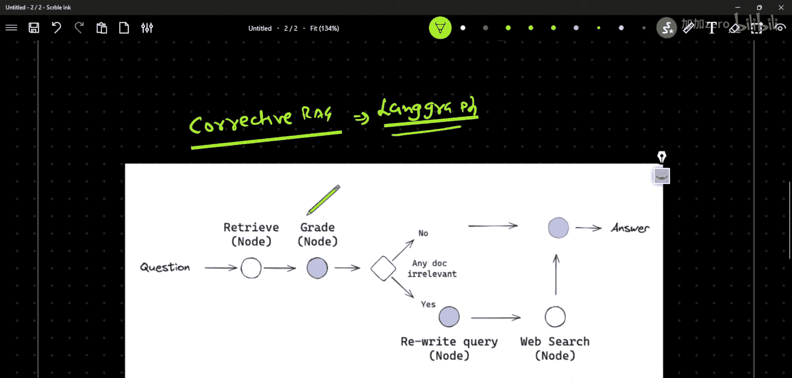

## 技术实现要点

理解了架构之后，我们来看看实现这个系统需要哪些关键组件。以下是构建纠正型 RAG 所需的核心元素列表：

*   **向量数据库与检索器**：用于存储和检索内部知识。例如，可以使用 `ChromaDB` 或 `FAISS`。
*   **大语言模型**：用于生成答案、评估文档相关性以及重写查询。例如，可以使用 `OpenAI` 的 GPT 系列或 `Anthropic` 的 Claude。
*   **评估机制**：需要一个提示模板让 LLM 判断文档相关性。例如：
    ```python
    grade_prompt = “””你是一个评估助手。请判断以下文档是否直接回答了问题。只回答‘是’或‘否’。
    问题：{question}
    文档：{document}
    判断：”””
    ```
*   **网络搜索工具**：需要集成一个搜索 API，如 `Tavily Search API` 或 `SerpAPI`。
*   **LangGraph 图构建**：需要定义各个节点函数，并按照上述架构使用条件边连接它们，特别是要创建从“评估节点”到“重写查询节点”的循环路径。

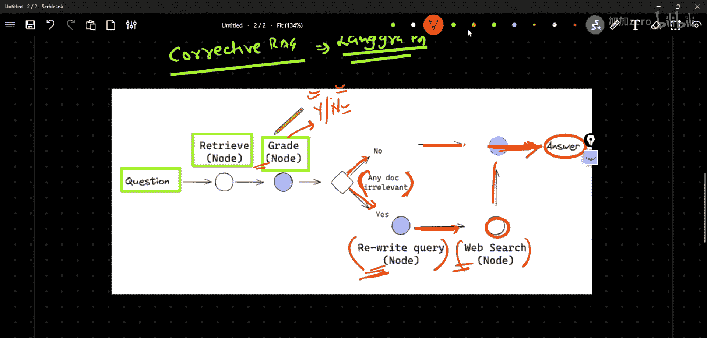

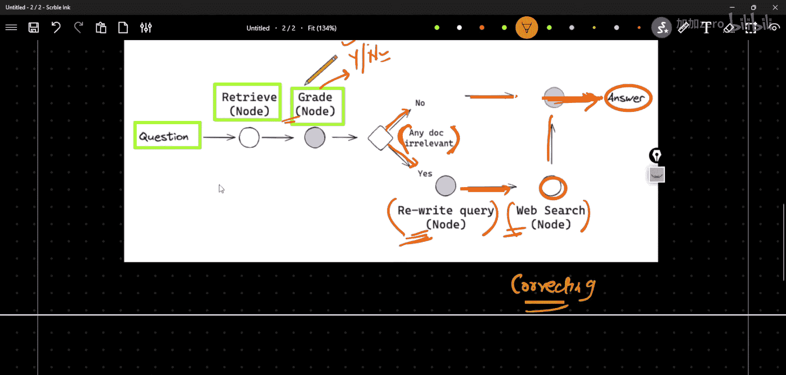

## 总结

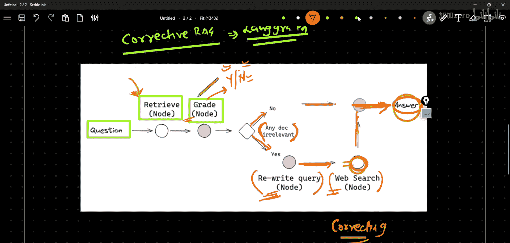

本节课中，我们一起学习了纠正型 RAG 系统的设计与原理。

我们首先回顾了基础 RAG 的三阶段流程，并指出了其依赖检索文档质量的局限性。接着，我们引入了“纠正”的概念，即当系统发现自身知识不足或答案不可靠时，能够主动从外部获取信息进行修正。

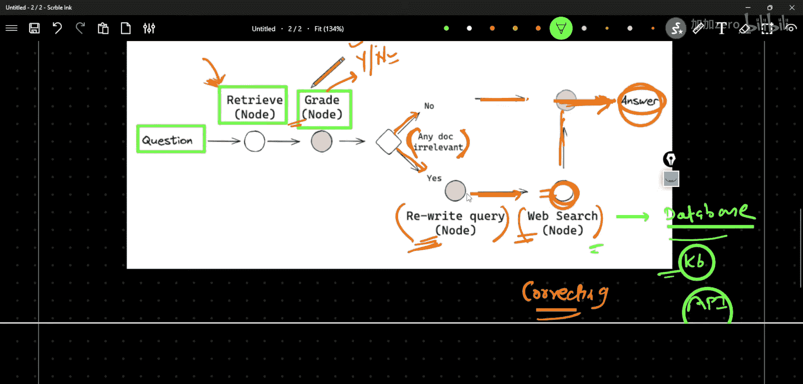

我们详细讲解了基于 LangGraph 实现的纠正型 RAG 架构，它通过**检索节点**、**评估节点**、**重写查询节点**、**网络搜索节点**和**生成节点**的协同工作，形成了一个具备自我检查和修正能力的智能循环。这个架构的核心优势在于其决策与循环能力，使其能够更稳健地处理复杂或知识库中未涵盖的问题。

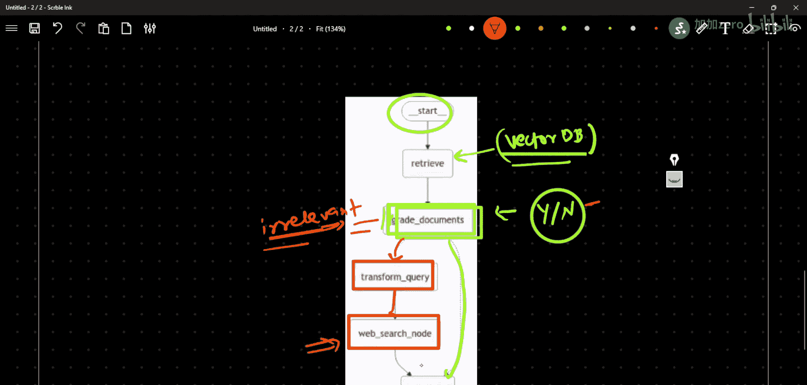

通过本课的学习，你应该对如何构建一个更健壮、更可靠的问答系统有了初步的认识。在接下来的课程中，我们将进一步探索其他高级的智能体模式。