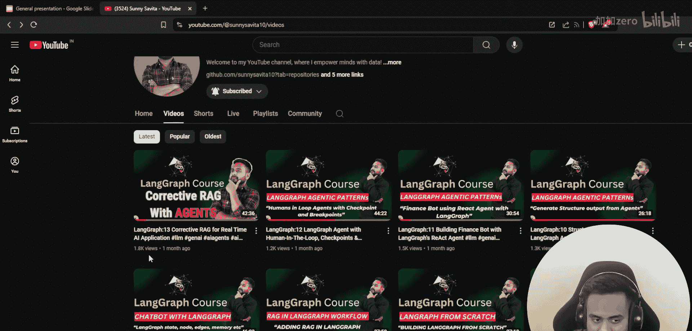
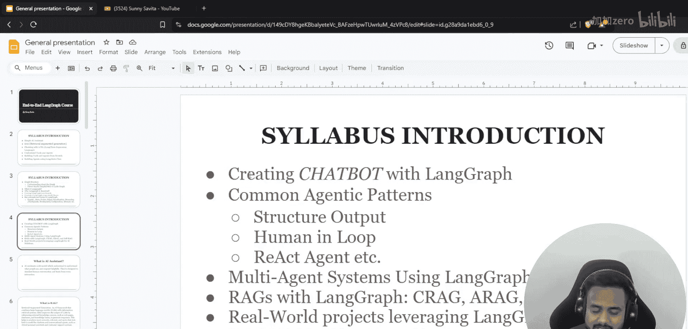
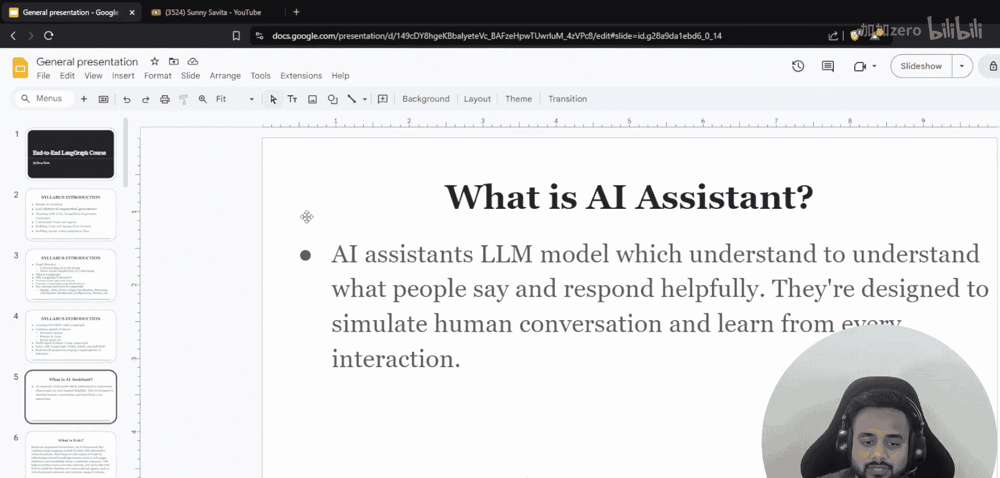
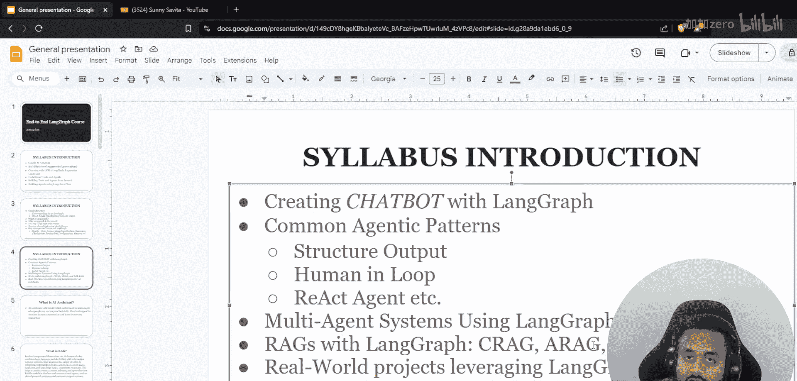
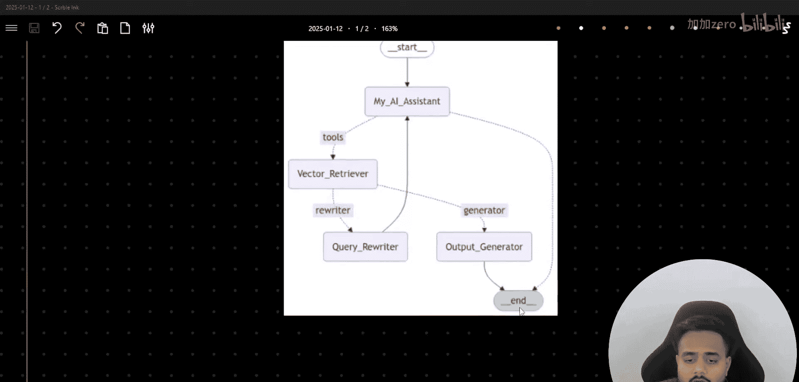
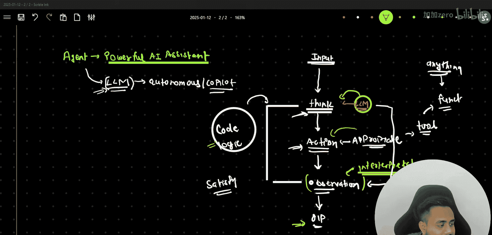
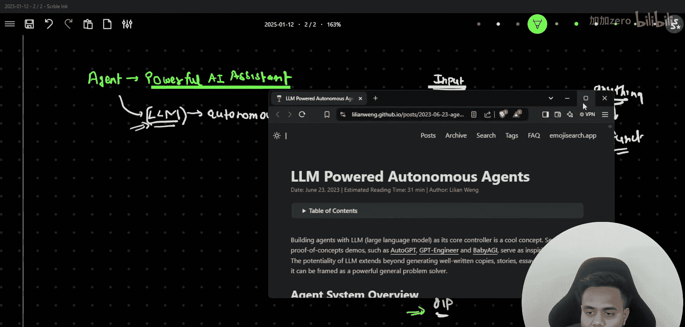
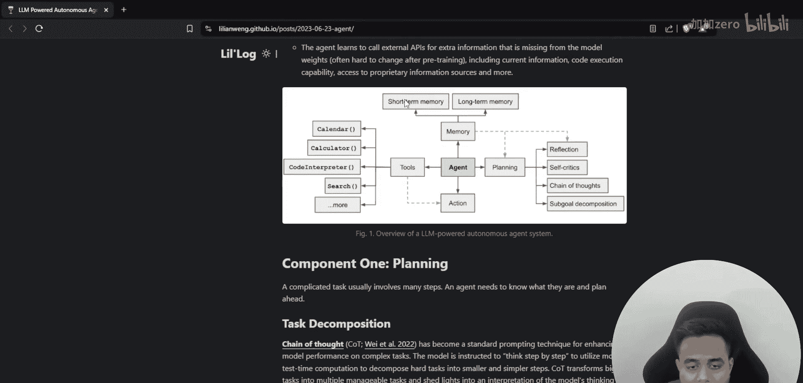
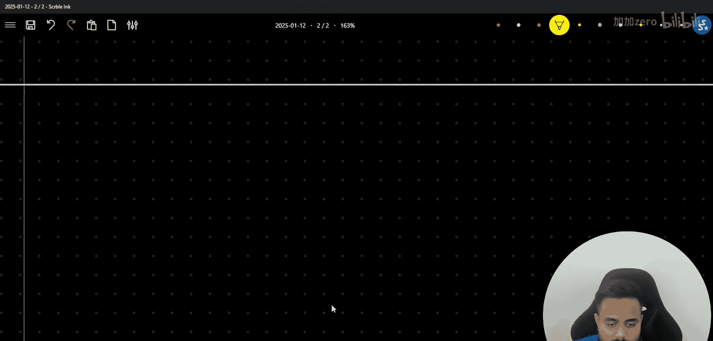
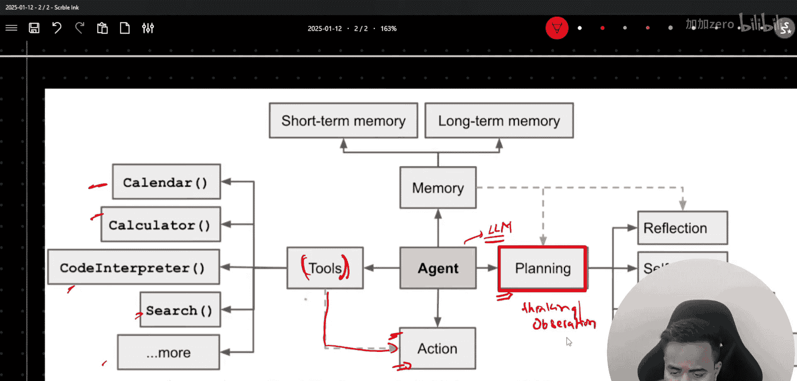

# LangGraph 课程：P72：Agentic RAG 与实时智能体应用 🚀

在本节课中，我们将学习如何构建一个基于智能体的检索增强生成系统。我们将从回顾智能体的基本概念开始，然后深入探讨 Agentic RAG 的架构，并最终实现一个能够自主思考、行动和观察的实时 AI 应用。

---

大家好，欢迎回到我的频道。我是 Sunny Savita。过去一个半月，由于家庭事务和其他工作，我暂停了视频更新。现在，我回来了，并将继续之前的 LangGraph 课程。

在上一节视频中，我们讨论了 Corrective RAG。按照计划，我将完成这个 LangGraph 课程，并讨论不同的多智能体系统。目前，多智能体 AI 或智能体技术是一个热门且重要的领域。因此，我选择了这门课程，并希望你们能从中学习到关于智能体、工具链以及如何创建智能体的知识。

在开始之前，我们先快速回顾一下。上一节视频我们讲到了 Corrective RAG，它是 LangGraph 课程中 RAG 部分的内容。我们已经完成了前两部分，讨论了 LangGraph 的基础知识，如图状态、节点、边、跟踪点、断点、流和内存。接着，我们讨论了不同的智能体模式，如如何搜索输出、创建 ReAct 智能体、在循环中加入人工干预，甚至演示了如何使用 LangGraph 创建聊天机器人。

现在，是时候讨论基于智能体的 RAG 了。我已经从 Corrective RAG 开始讲解。完成 RAG 部分后，我们将进入多智能体系统。我不想草草结束这个话题，而是希望详细讨论，并尝试解决几个项目。因此，你们可以期待我发布大约 10 到 15 个相关视频。此外，我还计划开始一个关于微调的新系列。

感谢你们的信任和支持。我的频道最近达到了 10000 名订阅者，现在正向 11000 迈进。期间我收到了很多询问我为何停更的消息。请放心，我并没有离开 YouTube，只是因家庭责任需要暂时休息。现在，我将恢复更新，从上次中断的地方继续。

今天，我们将讨论 Agentic RAG。在讲解了 Corrective RAG 之后，我们将探讨 Agentic RAG，以及另一种 RAG 类型：Self-RAG。完成这三种 RAG 的学习后，我们将尝试完成一个基于 SQL 智能体的项目。

首先，让我展示 Agentic RAG 的架构，然后逐步演示其完整实现。

## 智能体基础回顾 🤖

在深入 Agentic RAG 之前，让我们先快速回顾一下什么是智能体。如果你希望了解更详细的内容，可以查看我之前的视频。

智能体本质上是强大的 AI 助手。我之所以称其为“强大”，是因为我们将以某种方式编写代码，利用大语言模型的能力，使其能够自主思考。简而言之，智能体就是**利用 LLM 能力创建自主系统或副驾驶系统**。

让我用一个基本例子来说明。假设我们向 LLM 传递任何输入。首先，输入会到达 LLM。基于这个输入，LLM 会进行“思考”。然后，基于这个思考，它会采取“行动”。接着，基于行动产生的输出，它会进行“观察”，即对输出进行解释。这个过程会循环进行，直到我们获得可靠的输出。我们编写代码和逻辑的目的，就是让这个循环持续运行。

一旦条件满足——即 LLM 能够思考问题、采取适当行动并正确解释输出——我们就会生成最终结果。这样，我们就赋予了 LLM 思考、推理、根据给定逻辑采取行动以及解释生成输出的能力。

为了帮助你们更好地理解，我推荐一篇来自 LangChain 博客的优秀文章，标题是“LLM Powered Autonomous Agents”。文章中的一张图很好地概括了智能体的核心思想。

智能体本质上就是具备特定能力的 LLM。它能进行“规划”（即思考），能采取“行动”（通常通过调用工具实现）。这里的“工具”可以是任何自定义功能。它还能进行“观察”（即解释）。整个过程循环往复，直到任务完成。

---

本节课中，我们一起学习了智能体的核心概念，回顾了其“思考-行动-观察”的循环工作模式，并引出了我们将要构建的 Agentic RAG 系统的架构。在下一节中，我们将开始具体实现这个架构。