# 生成式AI：73：LangGraph中的Self-RAG实时智能体应用 🚀

在本节课中，我们将学习如何在RAG管道中实现一种重要的智能体模式——Self-RAG。我们将从回顾已学的知识开始，逐步理解Self-RAG的架构和工作原理，并最终了解如何将其应用于实时AI应用。

---


## 课程概述与回顾

大家好，欢迎回到我的频道。我是Sunny Savita。

在本系列关于LangGraph的深入教程中，我们已经探讨了多个主题。首先，我们介绍了理解智能体所需的基础知识，包括AI、RAG、工具和智能体的概念。如果你错过了这些内容，建议查看频道中的相关视频或课程列表。

接着，我们深入学习了LangGraph的基础知识，展示了如何从零开始使用它创建智能体模式。随后，我们进入了一些高级主题，例如结构化输出生成、人在回路、著名的ReAct（推理与行动）智能体以及聊天机器人。

目前，我们正专注于RAG与LangGraph的结合，即RAG管道中的智能体模式。在此之前，我们已经讨论了纠正式RAG和纯智能体RAG。本节课，我们将重点讨论Self-RAG。在这之后，本课程还将涵盖多智能体模式、实践项目，以及CrewAI和AutoGen等其他框架，以确保你能掌握创建各种智能体模式的能力。

---

## 智能体模式的核心支柱

在深入Self-RAG之前，有必要理解智能体模式的核心。智能体模式本质上是让大语言模型处于循环之中。

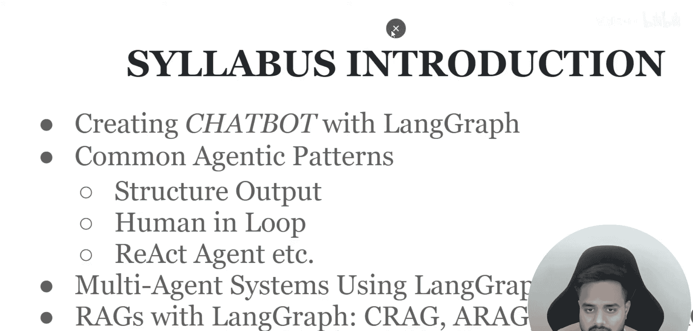

智能体可以被视为高级的AI助手。无论我们创建何种智能体，它们都建立在三个核心支柱之上：

1.  **思考**：智能体对给定的输入进行思考。
2.  **行动**：基于思考，智能体采取行动，例如调用工具或第三方功能。
3.  **观察**：智能体对行动产生的输出进行解释和观察。

这三个步骤在一个循环中持续进行，直到获得可靠、最终的输出。因此，大语言模型的能力（如思考、内容生成和推理）被用于驱动这个“思考-行动-观察”的循环。简而言之，智能体是一个能够思考、行动、观察并生成更可靠输出的高级AI系统。

---


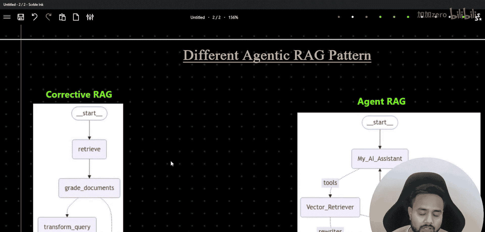

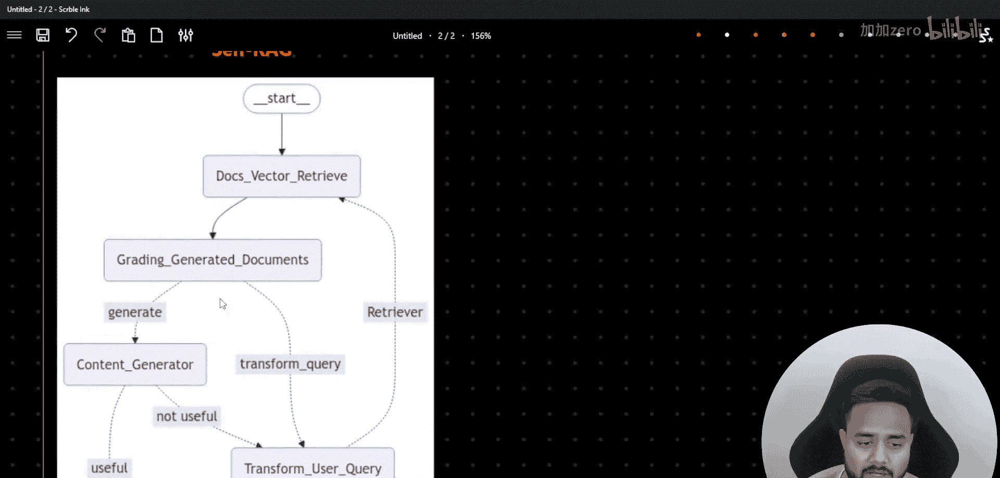

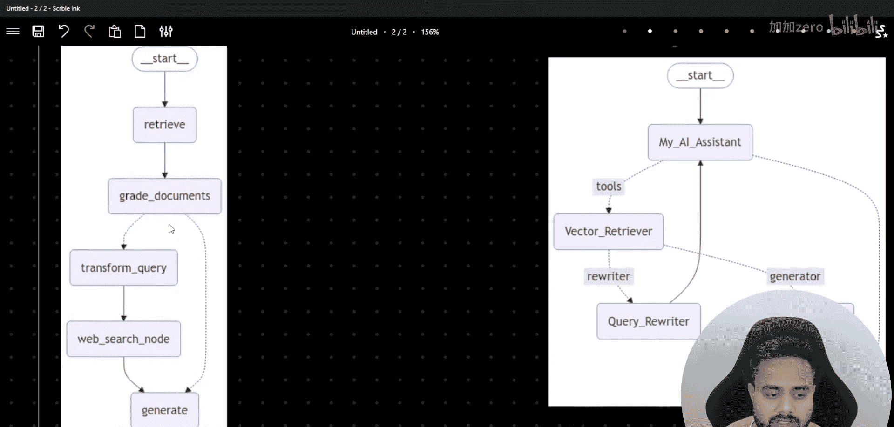

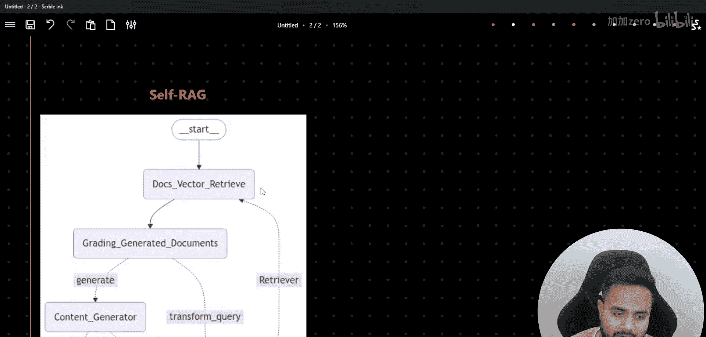

## RAG架构快速回顾

为了理解如何将智能体模式引入RAG，我们先快速回顾一下标准的RAG架构。

标准的RAG流程如下：
1.  **数据输入**：收集数据，将其分割成块。如果数据量很大，则为其创建嵌入向量，并存储到向量数据库等数据存储中。
2.  **用户查询**：用户提出一个问题。
3.  **检索**：将用户查询转换为嵌入向量，在向量数据库中进行相似性搜索或语义搜索，以获取相关的数据片段。
4.  **精炼与排名**：检索到的结果可能经过进一步处理，例如结果排序和重排序，以确保最高质量的相关信息被传递给大语言模型。
5.  **生成**：将所有积累的相关信息作为参考上下文，传递给大语言模型，由模型生成最终的答案。

这是一个完整的检索增强生成管道。我们的目标是在这个管道中引入不同的智能体模式，以增强其能力和可靠性。

---

## 已探讨的智能体RAG模式：纠正式RAG

在介绍Self-RAG之前，我们先看一下已讨论过的一种模式：纠正式RAG。这有助于我们理解智能体如何与RAG结合。

在纠正式RAG架构中：
1.  系统首先检索出与查询相关的文档。
2.  这些相关文档不会直接用于生成答案，而是先被传递给一个“评分器”。
3.  这个评分器本身通常也是一个LLM，它的任务是评估这些检索到的文档是否真正有用和可靠。
4.  如果评分器判断文档是**有用的**，则将其传递给“生成器”LLM来生成最终答案。
5.  如果评分器判断文档**不够有用**，流程可能会触发重新检索或其他纠正措施（图中“No”路径），然后再尝试生成。

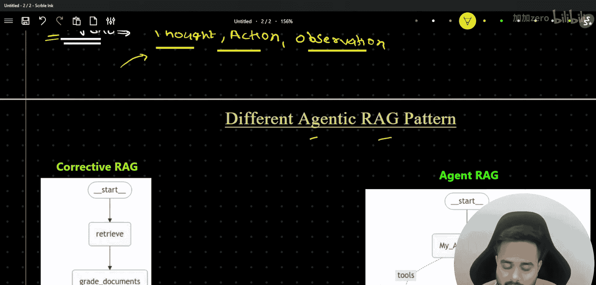

这个过程可以看作是将标准的“检索”和“生成”两步，通过一个智能体（评分器）进行连接和质检，从而在生成前增加一层可靠性检查。

---

## 本节核心：Self-RAG 模式 🧠

现在，让我们进入本节课的核心——Self-RAG模式。Self-RAG旨在让智能体在生成过程中进行自我评估和调整，以实现更实时、更自主的决策。

以下是Self-RAG工作流程的关键步骤：

1.  **初始检索与生成**：系统从向量数据库中检索出相关文档，并基于这些文档由LLM生成一个初始答案或“草稿”。
2.  **自我批评与评估**：生成的答案不会直接输出。相反，系统会启动一个自我评估循环。在这个循环中，另一个（或同一个）LLM扮演“批评者”的角色，对刚生成的答案进行多维度评估，例如：
    *   **相关性**：答案是否与原始问题相关？
    *   **完整性**：答案是否基于提供的上下文？
    *   **事实性**：答案中的事实是否与检索到的文档一致？
3.  **决策与迭代**：根据批评者的评估结果：
    *   如果答案被评估为**高质量且可靠**，则将其作为最终输出。
    *   如果答案存在**问题**（如不相关、不完整、或与事实不符），系统会基于批评意见决定下一步行动。这可能包括：
        *   **重新生成**：要求生成器根据同样的上下文，但结合批评意见，生成一个更好的答案。
        *   **重新检索**：如果问题源于上下文不足或不准，则触发新的检索，获取更相关的文档，然后基于新文档再次生成和评估。
4.  **循环直至满意**：这个“生成 -> 评估 -> 决策（重新生成/重新检索）-> 再生成”的循环会持续进行，直到批评者对答案的质量感到满意，或者达到预设的迭代次数限制。

**核心公式/逻辑描述**：
```
While (答案未达到质量标准 AND 未超迭代次数):
    1. 答案 = LLM_生成器(查询， 检索到的上下文)
    2. 评估结果 = LLM_批评者(查询， 检索到的上下文， 答案)
    3. If 评估结果 == “通过”:
           返回 答案
       Else:
           根据评估结果，选择 行动 ∈ {重新生成， 重新检索}
           如果 行动 == “重新检索”:
               检索到的上下文 = 向量数据库.搜索(查询)
```

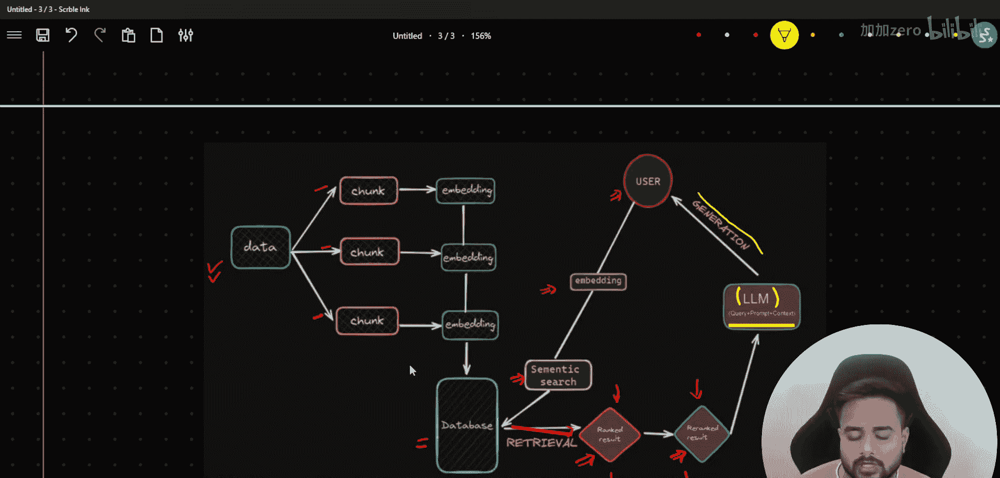

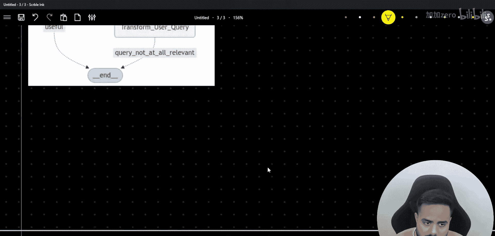

### Self-RAG的优势
*   **更高的输出质量**：通过多次迭代和自我修正，最终答案的准确性、相关性和完整性通常更高。
*   **实时适应性**：智能体能够在生成过程中实时发现问题并尝试解决，无需人工干预。
*   **增强的可靠性**：内置的评估机制减少了大语言模型“幻觉”或生成无关内容的风险。

---

## 总结

本节课中，我们一起学习了如何将智能体思维融入RAG管道，重点介绍了Self-RAG模式。

我们首先回顾了智能体模式的三大支柱：**思考**、**行动**和**观察**。接着，我们快速重温了标准RAG的工作流程。然后，我们分析了已学的**纠正式RAG**，它通过一个评分器智能体在生成前检查检索结果。

最后，我们深入探讨了本节课的核心——**Self-RAG**。在这种模式中，智能体在生成答案后，会启动一个自我评估和迭代的循环。通过“生成器”和“批评者”的协作，系统能够不断优化输出，直至达到预设的质量标准，从而实现更强大、更可靠的实时AI应用。

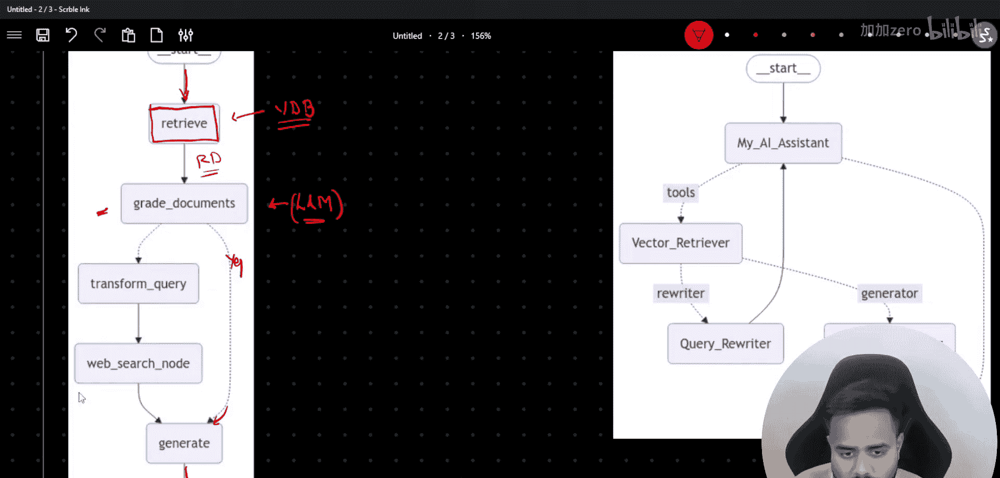

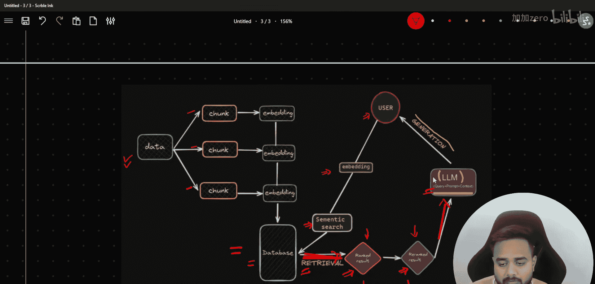

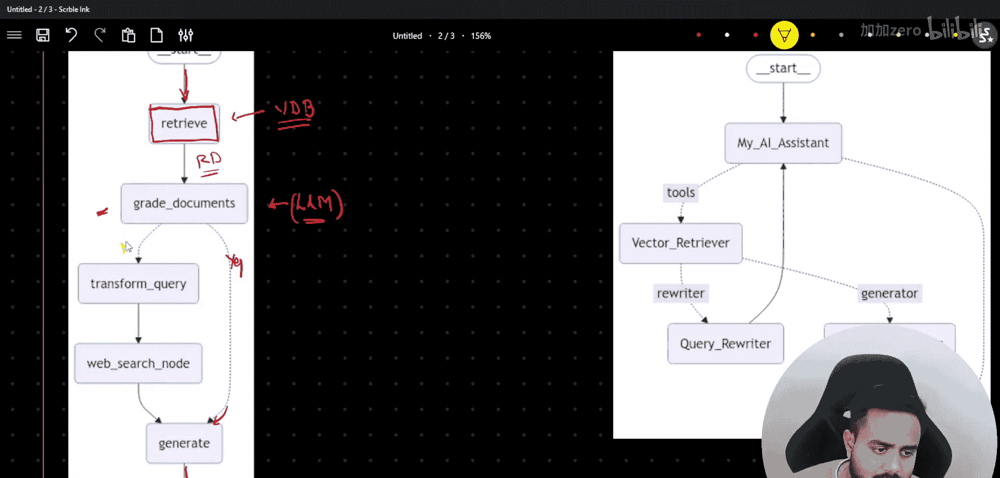

理解Self-RAG是构建高级、自主AI智能体的关键一步。在接下来的课程中，我们将继续探索更复杂的多智能体模式和实践项目。