生成式AI学习路线图：P74：智能体AI与生成式AI路线图及150+面试题答案

在本节课中，我们将学习生成式AI与智能体AI的完整学习路线图，并获取一份包含150多个面试问题及其答案的宝贵资源。课程将涵盖从深度学习基础到前沿智能体模式的核心知识体系。

欢迎回到我的频道。我是Sunny Savita。本视频将讨论生成式AI的快速学习路线，并提供全面的生成式AI面试资源。我的频道专注于生成式AI内容，未来也将涵盖深度学习、机器学习与Python等主题，旨在成为您的一站式学习平台。

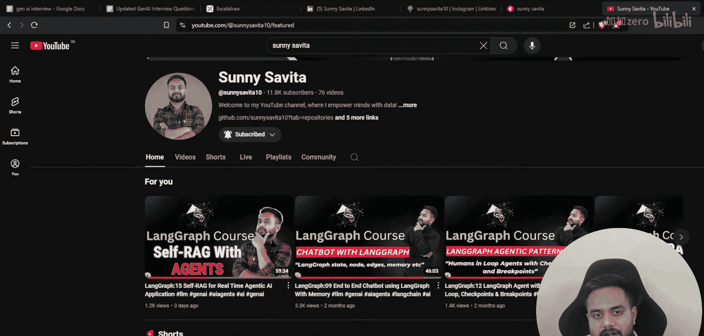

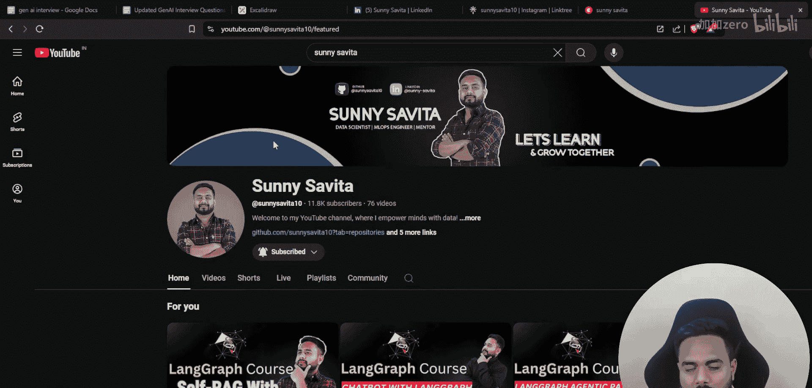

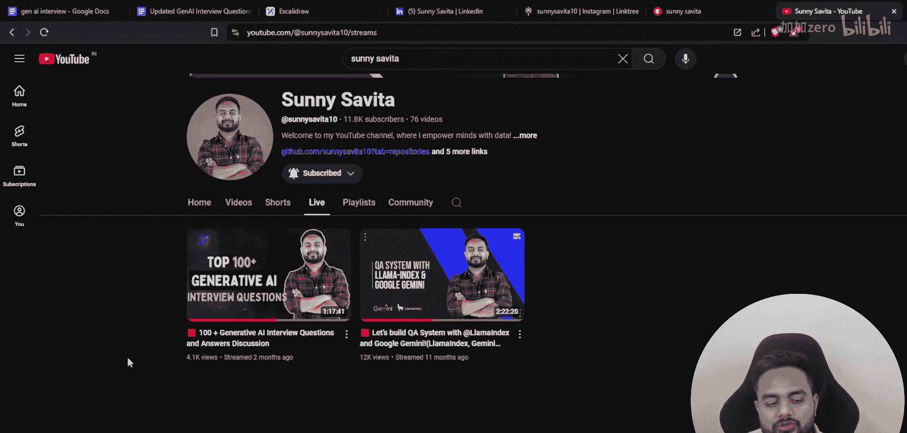

在我的频道直播部分，我发布了一个视频，专门讨论生成式AI面试。该视频涵盖了生成式AI的各个核心类别。

以下是所涵盖的面试问题类别：
*   人工神经网络：深度学习与生成式AI的基础。
*   自然语言处理：同样属于基础范畴。
*    Transformer架构相关问题。
*   大语言模型相关问题。
*   语言建模相关问题。
*   微调技术相关问题。
*   检索增强生成相关问题。
*   大语言模型运维相关问题。

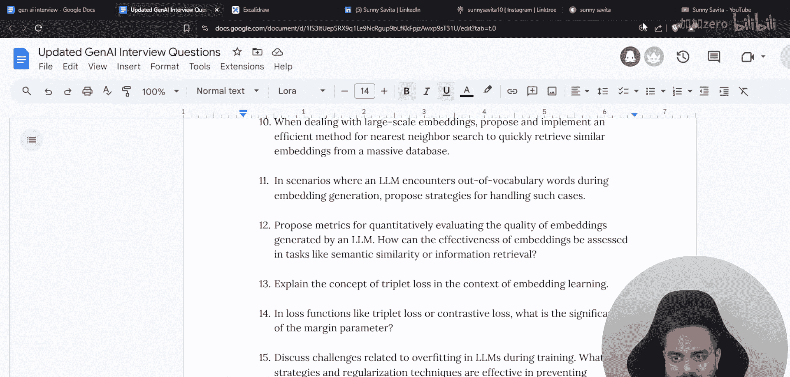

在该视频中，我讨论了约150个面试问题，但当时并未提供全部答案。本视频将提供所有这些问题的答案。我曾发起一项挑战，完成这些问题的人将获得奖励，获奖者将在后续视频中揭晓。

在展示答案之前，让我们先讨论生成式AI的快速学习路线图。

您可以在屏幕上方看到生成式AI的快速路线图。我将其划分为多个类别。我的频道上曾有一个关于生成式AI路线图的视频，获得了超过4万次观看。本部分是对生成式AI及当前热门话题——智能体AI的快速回顾，旨在说明学习路径、需要涵盖的主题以及如何掌握智能体AI。

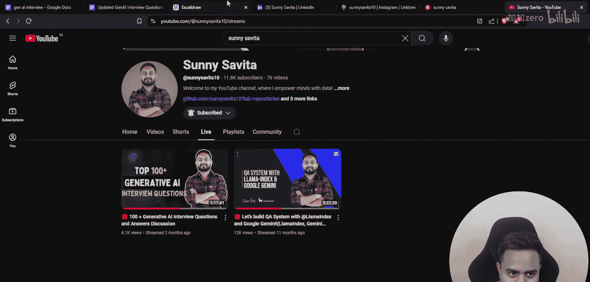

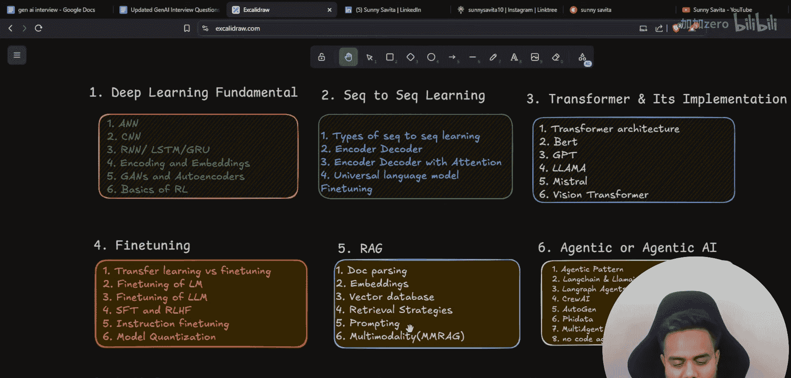

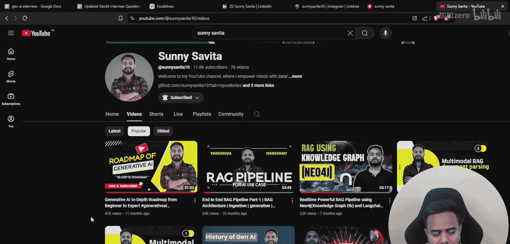

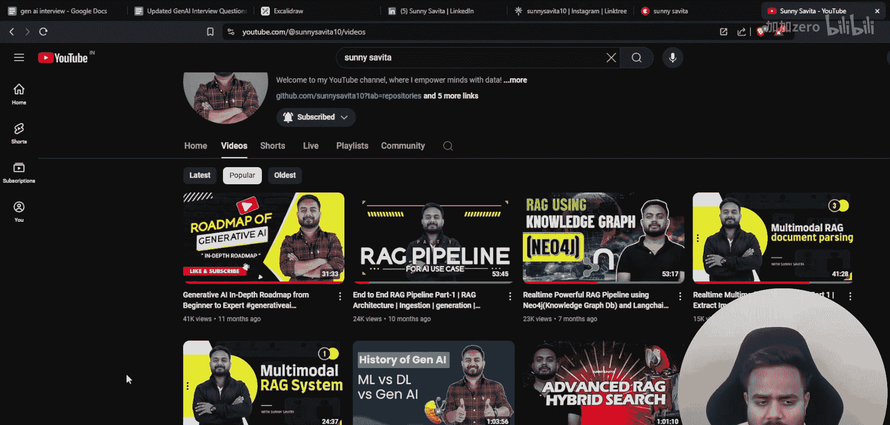

首先，我们需要从深度学习基础开始。

以下是深度学习基础需要关注的核心内容：
*   人工神经网络与卷积神经网络。
*   循环神经网络、长短期记忆网络、门控循环单元：它们是RNN模型的变体。
*   嵌入技术：这是一个非常重要的话题。
*   自编码器。
*   强化学习基础。

以上所有内容都属于深度学习基础范畴。

掌握了深度学习基础后，可以转向序列到序列学习。这本身也属于深度学习的一部分，通常在自然语言处理领域的RNN学习中涉及。

以下是序列到序列学习需要掌握的内容：
*   序列到序列学习的类型。
*   编码器-解码器架构。
*   带注意力机制的编码器-解码器架构。
*   通用语言模型微调：这是一个非常重要的模型。要理解序列到序列学习，必须学习这个主题。

接下来是核心且非常重要的主题：Transformer及其架构实现。

以下是Transformer及其相关架构需要学习的内容：
*   Transformer架构：需要理解并能够编码实现整个架构。
*   BERT：需要理解掩码语言模型和生成式预训练模型的工作原理，以及语言模型在实时中如何运作。
*   LLaMA架构与GPT架构：包含这两个架构是为了帮助理解最先进的模型。
*   视觉Transformer：了解如何将视觉信息融入Transformer模型至关重要。因为当前许多模型都是多模态的，此架构能提供多模态模型工作的全面概念。

接下来是微调技术。

以下是微调技术需要掌握的内容：
*   迁移学习。
*   微调基础。
*   语言模型的微调：如BERT、T5。
*   大语言模型的微调：如GPT、LLaMA。
*   监督微调、基于人类反馈的强化学习、直接偏好优化：如DPO、PPO、KTO等。这些都是微调领域非常重要的主题。
*   针对GPT类模型的指令微调：当我们无法直接访问模型时，可以使用指令微调技术。只需在JSON文件中定义指令并提供给模型，结合开发者编写的特定机制，即可直接微调模型。
*   模型量化：这是一项与微调并行学习的重要技术。

然后是当前极为重要的主题：检索增强生成。

以下是RAG需要理解的内容：
*   文档处理：如何解析文档、网站，以及如何从不同数据库获取数据。这涉及数据收集和创建索引管道。
*   嵌入技术：对于检索生成至关重要。
*   向量数据库。
*   检索策略：不同检索策略及其背后的数学原理。
*   提示工程：虽然是一个子主题，但绝不能忽视。要构建稳健的RAG应用，零样本提示、少样本提示、思维链等技术非常重要。
*   多模态RAG：如何使用不同的LLM和视觉模型，如何处理图像、音频、文本等多模态数据并从中获取嵌入表示。这非常重要，因为大多数应用都涉及多模态RAG。

接下来是智能体AI。这是当前非常热门的话题。

智能体AI之所以热门，是因为它能最大限度地利用LLM的能力。通过将LLM置于某种循环或模式中，LLM可以自行决策、思考、观察、生成正确答案并进行解释。在智能体模式中，即使LLM无法直接回答问题，我们也可以从多种来源获取答案，并确保其可靠性。智能体还可以与RAG架构结合实现，这正是其魅力所在，也是当前热门的原因。

以下是智能体AI需要学习的内容：
*   智能体模式：如ReAct、Self-Ask等。
*   工具调用智能体。
*    LangChain智能体。
*   LangGraph智能体。
*   CrewAI智能体。
*   AutoGen智能体。
*   多智能体系统。
*   无代码/低代码智能体构建：例如使用LangFlow，无需大量编码。

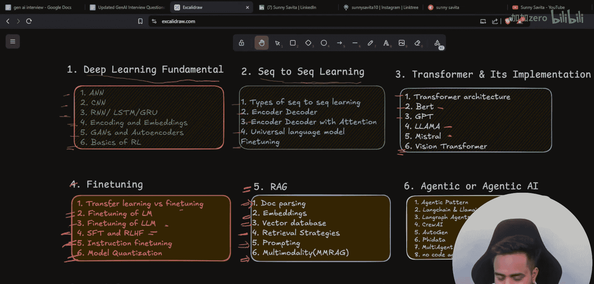

首先，理解不同的智能体模式，然后尝试使用上述框架实现。这些框架中包含一些自定义类。尝试评估每个框架，并创建多智能体系统。很多人询问是否应该学习智能体AI，答案是肯定的。但这是通往智能体AI的完整路径：从基础开始，到序列到序列学习，再到Transformer，然后是微调，接着是至关重要的RAG，最后是智能体AI。

现在您明白了智能体AI在整个知识体系中的位置。

当您熟练掌握智能体AI后，可以转向LLM运维领域。这需要您具备云计算基础，并了解不同的云AI服务。

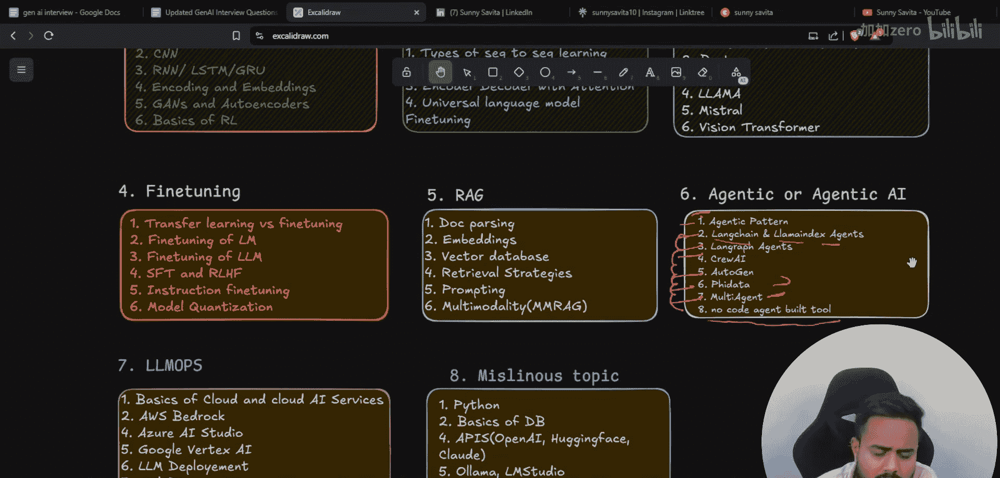

以下是主要的云AI服务平台：
*   AWS Bedrock。
*   Azure AI Studio。
*   谷歌云Vertex AI。

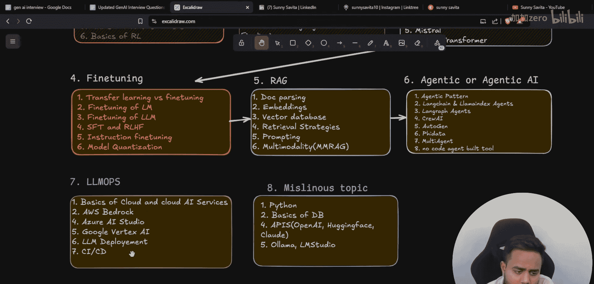

本节课中，我们一起学习了生成式AI与智能体AI的完整学习路线图，从深度学习基础、序列到序列模型、Transformer架构，到微调技术、检索增强生成，最终抵达智能体AI。同时，我们获得了一份包含150多个面试问题及答案的宝贵资源，可用于巩固知识和准备面试。遵循此路线图，您将能够系统性地构建生成式AI知识体系，并跟上当前最热门的智能体AI发展趋势。