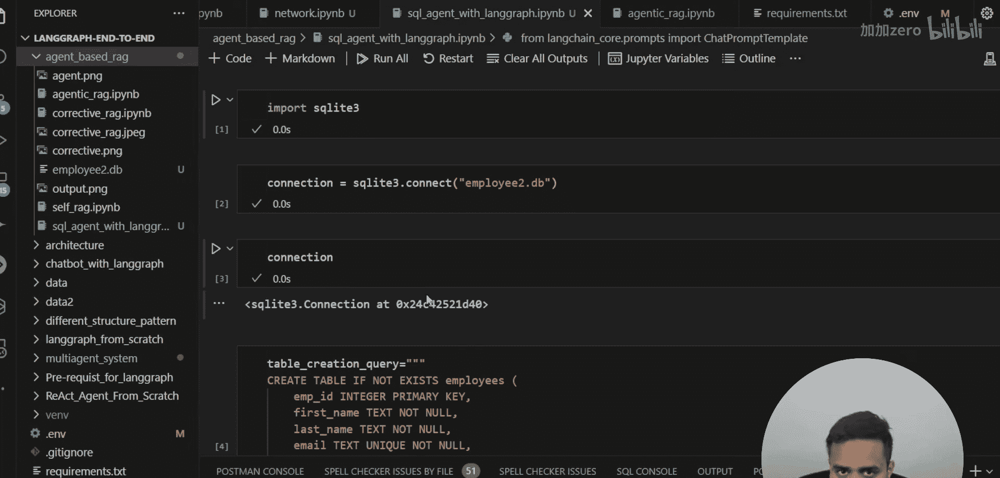
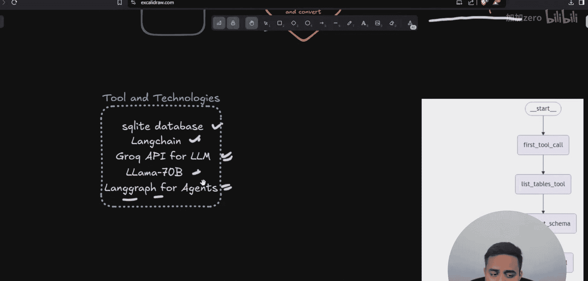
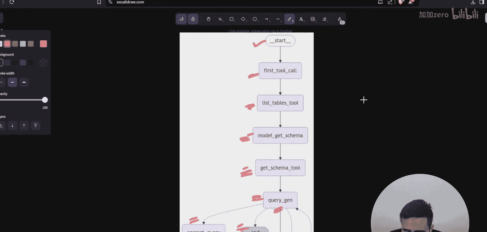
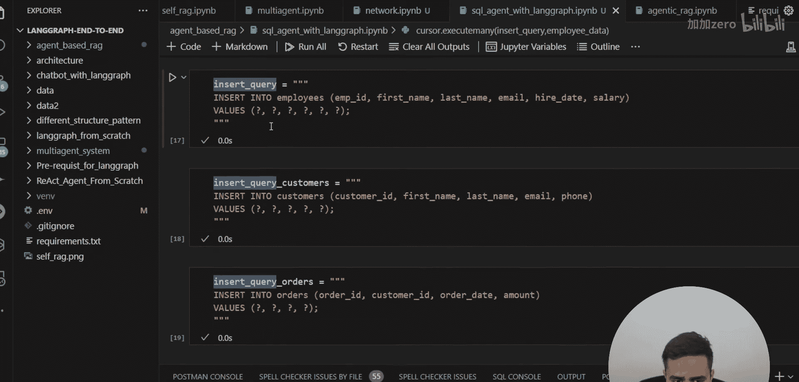

# LangGraph 课程：P75：基于 LangGraph 的高级 SQL 数据库代理

## 概述

在本节课中，我们将学习如何使用 LangGraph 构建一个高级的 SQL 数据库代理。这个代理能够理解自然语言查询，将其转换为 SQL 语句，执行查询，并将数据库返回的结果再次转换为易于理解的文本回答。我们将从项目架构开始，逐步讲解代码实现。


上一节我们介绍了 RAG 与 LangGraph 的结合应用，本节中我们来看看如何构建一个能够与数据库交互的智能代理。

## 项目架构与问题陈述

首先，我们来理解我们要解决的问题和整体架构。


我们有一个 SQL 数据库。用户通过自然语言（文本）提出问题。代理需要完成以下步骤：
1.  将文本查询转换为正确的 SQL 查询语句。
2.  在 SQL 数据库中执行该查询。
3.  将数据库返回的行和列格式的结果，再次转换为自然语言文本作为最终响应。

这个流程不是一个简单的检索或检查，而是一个完整的智能代理工作流。

以下是本项目将使用的工具和技术：
*   **数据库**：SQLite（演示用，可替换为 PostgreSQL、MySQL 等）。
*   **框架**：LangChain，用于聊天模板和工具调用。
*   **大语言模型**：Gemini API 的 `gemini-1.5-pro` 模型。
*   **代理编排**：LangGraph，用于创建和管理代理的工作流。


接下来，我们看一下具体的架构图，它描述了代理的内部工作流程。


整个流程以用户输入（`start`）开始，以生成最终答案（`end`）结束。中间包含多个功能模块（节点）：
*   **`list_tables` 工具**：用于获取数据库中的所有表名。
*   **`get_schema` 工具**：用于获取指定表的模式（Schema）信息。
*   **`query` 节点**：负责生成并尝试执行 SQL 查询。
*   **`correct_query` 节点**：如果查询执行出错，此节点负责修正 SQL 语句。
*   **`execute_query` 节点**：执行修正后或确认无误的 SQL 查询。
*   **`generate_answer` 节点**：将查询结果转换为自然语言答案。

这个架构确保了代理能够稳健地处理各种查询，并在出错时进行自我修正。接下来，我们将开始准备数据库环境。



## 准备数据库环境

在编写代理逻辑之前，我们需要先设置一个用于演示的 SQL 数据库。这里我们使用 SQLite 内存数据库，它简单快捷。

首先，执行必要的导入语句并建立数据库连接。

```python
import sqlite3

# 建立与 SQLite 内存数据库的连接
connection = sqlite3.connect(‘:memory:‘)
cursor = connection.cursor()
```

然后，我们创建三张示例表：`employees`、`customers` 和 `orders`。

以下是创建这些表的 SQL 语句：

```sql
-- 创建员工表
CREATE TABLE employees (
    employee_id INTEGER PRIMARY KEY,
    first_name TEXT,
    last_name TEXT,
    email TEXT,
    hire_date TEXT,
    salary REAL
);



-- 创建客户表
CREATE TABLE customers (
    customer_id INTEGER PRIMARY KEY,
    first_name TEXT,
    last_name TEXT,
    email TEXT,
    phone TEXT
);

-- 创建订单表
CREATE TABLE orders (
    order_id INTEGER PRIMARY KEY,
    customer_id INTEGER,
    order_date TEXT,
    amount REAL,
    FOREIGN KEY (customer_id) REFERENCES customers(customer_id)
);
```



使用游标执行上述建表语句。

```python
cursor.execute(create_employee_table_query)
cursor.execute(create_customer_table_query)
cursor.execute(create_order_table_query)
```

表创建完成后，我们需要向其中插入一些示例数据，以便后续进行查询。

以下是向各表插入数据的代码。我们为每张表插入4行数据。

```python
# 员工数据
employee_data = [
    (1, ‘John‘, ‘Doe‘, ‘john.doe@email.com‘, ‘2020-01-15‘, 75000.0),
    (2, ‘Jane‘, ‘Smith‘, ‘jane.smith@email.com‘, ‘2019-03-22‘, 82000.0),
    (3, ‘Bob‘, ‘Johnson‘, ‘bob.johnson@email.com‘, ‘2021-07-30‘, 68000.0),
    (4, ‘Alice‘, ‘Williams‘, ‘alice.williams@email.com‘, ‘2018-11-05‘, 90000.0)
]
cursor.executemany(‘INSERT INTO employees VALUES (?, ?, ?, ?, ?, ?)‘, employee_data)

# 客户数据
customer_data = [
    (101, ‘Mike‘, ‘Brown‘, ‘mike.brown@email.com‘, ‘123-456-7890‘),
    (102, ‘Sarah‘, ‘Davis‘, ‘sarah.davis@email.com‘, ‘234-567-8901‘),
    (103, ‘Tom‘, ‘Wilson‘, ‘tom.wilson@email.com‘, ‘345-678-9012‘),
    (104, ‘Emma‘, ‘Taylor‘, ‘emma.taylor@email.com‘, ‘456-789-0123‘)
]
cursor.executemany(‘INSERT INTO customers VALUES (?, ?, ?, ?, ?)‘, customer_data)

# 订单数据
order_data = [
    (1001, 101, ‘2023-10-01‘, 250.75),
    (1002, 102, ‘2023-10-02‘, 120.50),
    (1003, 103, ‘2023-10-03‘, 499.99),
    (1004, 104, ‘2023-10-04‘, 75.25)
]
cursor.executemany(‘INSERT INTO orders VALUES (?, ?, ?, ?)‘, order_data)

# 提交事务
connection.commit()
```

现在，我们的数据库已经准备就绪，包含了三张有关系的表和示例数据。在下一节中，我们将开始构建 LangGraph 代理的核心组件。

## 总结



本节课中我们一起学习了基于 LangGraph 构建 SQL 数据库代理的初始步骤。我们首先明确了代理的目标：将自然语言查询转换为 SQL 操作并返回易懂的结果。接着，我们了解了项目的整体架构，它包含了多个工具和节点来确保查询的准确性和鲁棒性。最后，我们成功设置了一个 SQLite 内存数据库，并创建了 `employees`、`customers` 和 `orders` 三张表，并填充了示例数据，为后续代理的开发打下了基础。在接下来的课程中，我们将深入编码环节，实现架构图中的各个功能模块。