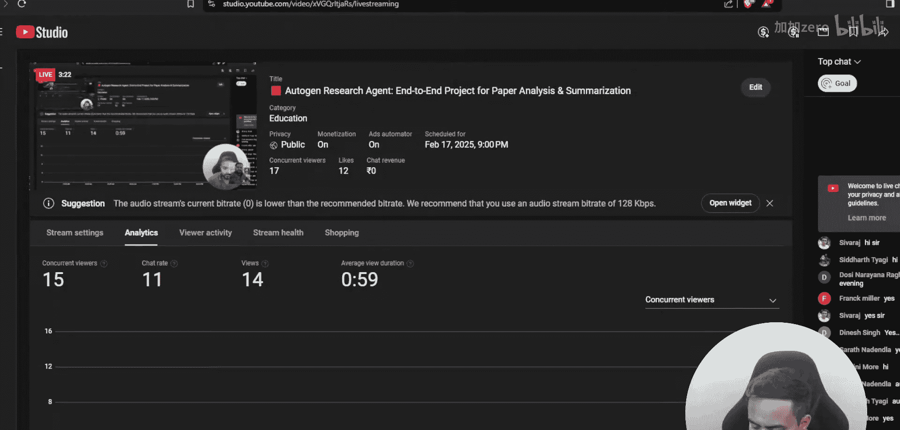
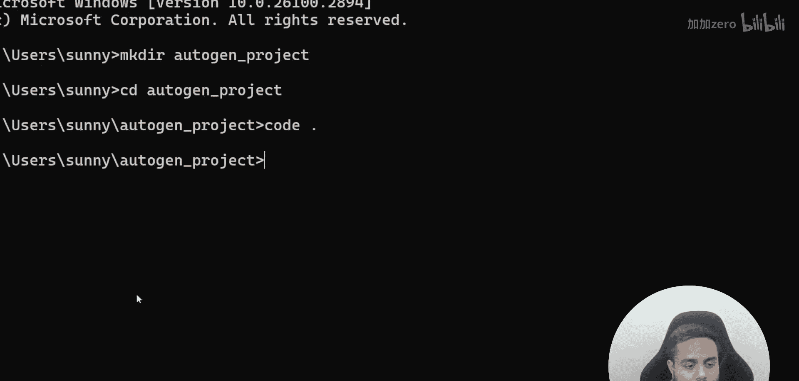
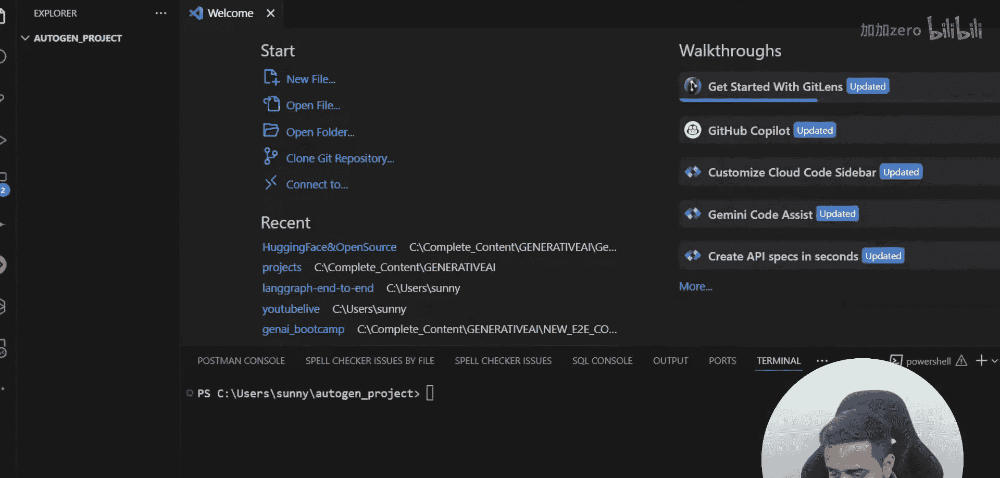

# 生成式AI：P76：Autogen研究智能体：端到端论文分析与总结项目

## 概述

在本节课中，我们将学习如何使用Autogen框架构建一个基于大型语言模型的智能体，来完成端到端的学术论文分析与总结项目。我们将从环境配置开始，逐步讲解核心概念与代码实现。

上一节我们介绍了课程的整体安排，本节中我们来看看如何具体搭建一个Autogen智能体项目。

## 环境配置与项目初始化



首先，我们需要创建一个项目目录并配置Python环境。

以下是创建项目目录和初始化环境的步骤：

1.  打开命令行工具。
2.  创建一个名为 `autogen_project` 的目录。
3.  进入该目录。
4.  在目录中打开代码编辑器（如VS Code）。

对应的命令行操作如下：
```bash
mkdir autogen_project
cd autogen_project
code .
```

## 理解Autogen与智能体

Autogen是一个用于简化基于大型语言模型（LLM）的多智能体应用开发的框架。其核心是创建可以相互协作、执行特定任务（如研究、分析、总结）的智能体。

一个基础的Autogen智能体可以通过以下代码结构定义：
```python
from autogen import AssistantAgent, UserProxyAgent

# 配置LLM
config_list = [...]
llm_config = {"config_list": config_list}

# 创建助理智能体
assistant = AssistantAgent(
    name="assistant",
    llm_config=llm_config,
)

# 创建用户代理智能体
user_proxy = UserProxyAgent(
    name="user_proxy",
    human_input_mode="NEVER",
    max_consecutive_auto_reply=10,
)
```

## 构建论文分析智能体工作流

接下来，我们将设计智能体协作的工作流程，以完成论文分析任务。

以下是构建智能体工作流的关键步骤：

1.  **定义角色**：明确每个智能体的职责（例如，一个负责检索，一个负责分析，一个负责总结）。
2.  **配置通信**：设置智能体之间的对话和消息传递规则。
3.  **集成工具**：为智能体配备必要的工具，如网络搜索、文档读取或代码执行能力。
4.  **编排任务**：将论文分析的子任务（查找、阅读、提取要点、生成摘要）分配给相应的智能体。

## 核心代码实现

现在，我们来看一个简化的论文总结智能体组的实现示例。

```python
import autogen

# 1. 配置LLM（此处需替换为你的API密钥和模型）
config_list = [
    {
        'model': 'gpt-4',
        'api_key': 'YOUR_OPENAI_API_KEY',
    }
]

# 2. 创建智能体
research_assistant = autogen.AssistantAgent(
    name="Research_Assistant",
    system_message="你是一个研究助理，负责从给定的论文内容中提取关键信息。",
    llm_config={"config_list": config_list},
)

summarizer = autogen.AssistantAgent(
    name="Summarizer",
    system_message="你是一个总结专家，负责将研究助理提取的信息整理成结构清晰、语言简洁的摘要。",
    llm_config={"config_list": config_list},
)


user_proxy = autogen.UserProxyAgent(
    name="User_Proxy",
    human_input_mode="TERMINATE", # 在任务结束时请求人类输入
    max_consecutive_auto_reply=2,
    code_execution_config=False,
)


# 3. 注册智能体之间的对话
groupchat = autogen.GroupChat(
    agents=[user_proxy, research_assistant, summarizer],
    messages=[],
    max_round=10
)
manager = autogen.GroupChatManager(groupchat=groupchat, llm_config={"config_list": config_list})

# 4. 发起任务
user_proxy.initiate_chat(
    manager,
    message="请分析并总结这篇关于深度强化学习的论文。"
)
```

## 运行与测试

在代码实现完成后，我们需要运行脚本并观察智能体之间的交互，确保它们能正确协作完成任务。

你可以通过运行Python脚本并检查控制台输出的对话日志来验证智能体的行为是否符合预期。

## 总结





本节课中我们一起学习了如何使用Autogen框架构建一个用于论文分析与总结的智能体系统。我们从项目初始化开始，理解了Autogen智能体的基本概念，并逐步实现了包含研究助理和总结专家的多智能体工作流。通过本教程，你掌握了创建基于LLM的协作式AI应用的基础方法。