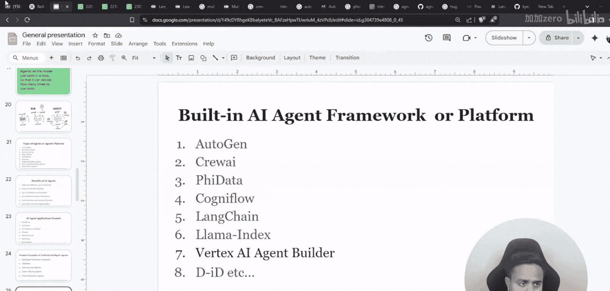
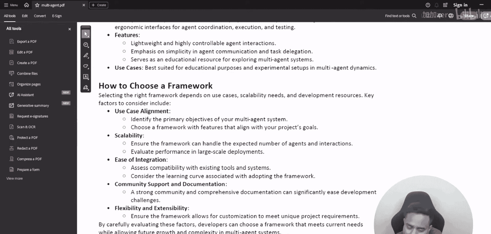
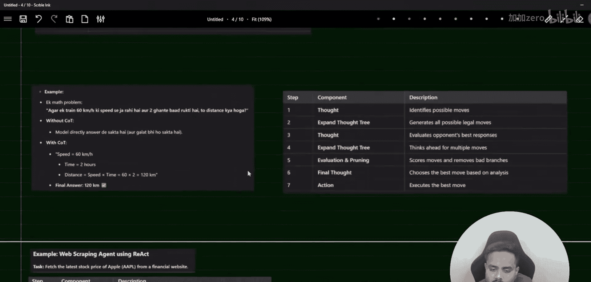
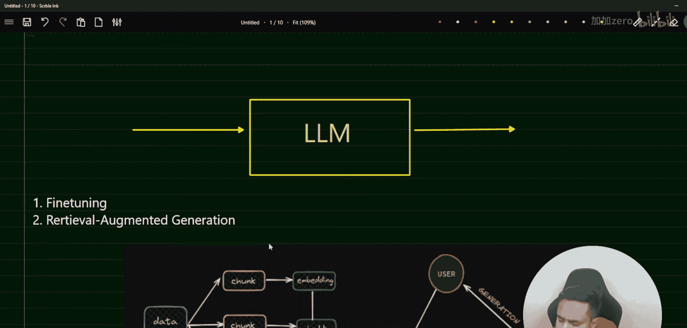
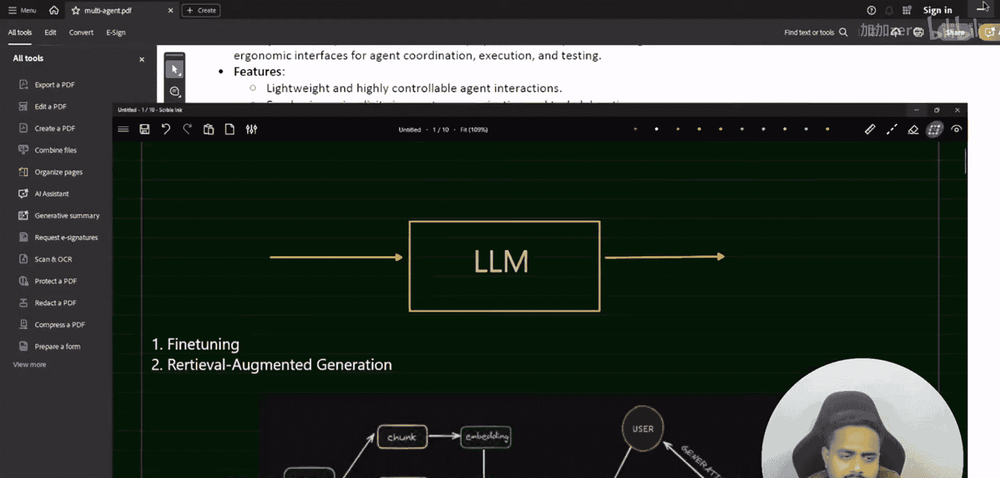
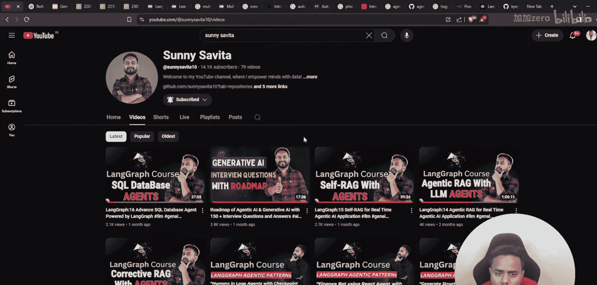
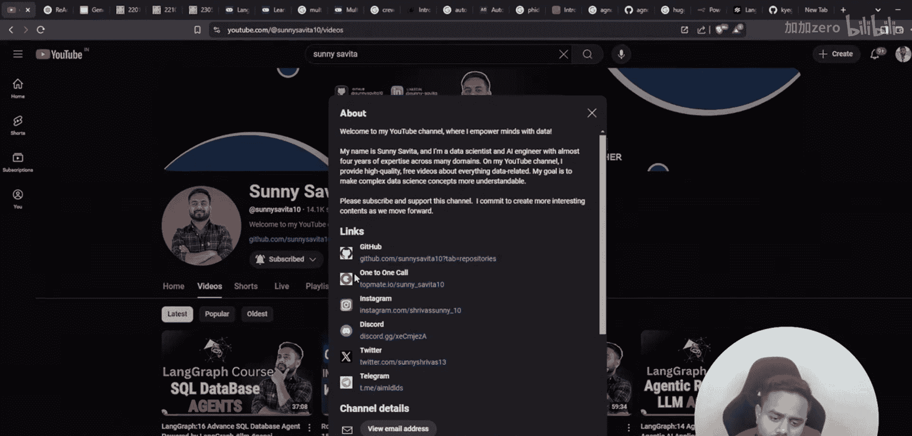
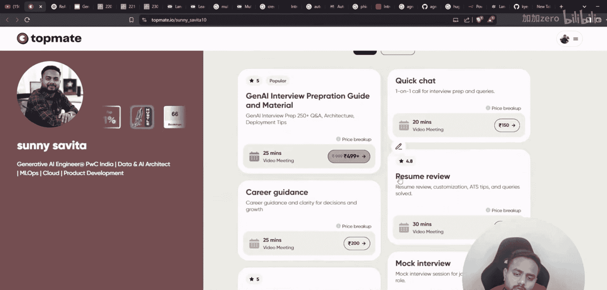
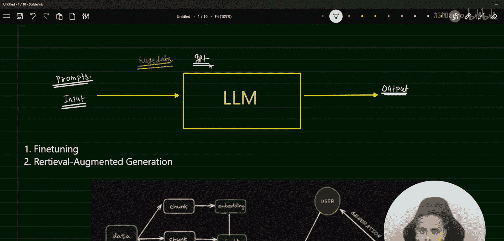

# LangGraph课程：17：多智能体系统入门 🧠🤖

在本节课中，我们将要学习多智能体系统的基础知识。这是一个理论介绍课程，旨在帮助你理解从基础LLM到智能体，再到多智能体系统的演进脉络。

## 课程概述

在之前的课程中，我们介绍了LangGraph的基础、智能体模式以及RAG应用。本节我们将进入一个新的重要主题：多智能体系统。我们将从最基本的概念开始，逐步构建理解。

## 从LLM到智能体

上一节我们介绍了SQL数据库智能体，本节我们来看看智能体系统的基础构成。首先，我们需要理解其核心组件。

### 大型语言模型

大型语言模型是经过海量数据训练的模型。我们向LLM提供输入，这个输入被称为**提示词**。LLM根据提示词生成输出。

**公式表示：**
`输出 = LLM(输入提示词)`

LLM可以是多模态的，这意味着它不仅能处理文本，还能处理图像、音频等其他类型的数据。模型的训练数据量没有严格定义，可能达到TB甚至PB级别，这取决于所使用的系统和基础设施配置。

目前，GPT系列模型非常流行，同时市场上也涌现出许多其他优秀模型。GPT-4系列模型表现卓越。我们将讨论OpenAI API和Claude API，以便你深入了解各种模型，并知道针对不同任务应选择哪种模型。

### 智能体系统演进

理解了LLM之后，我们来看看如何在其基础上构建更复杂的系统。

以下是智能体系统的演进步骤：

1.  **基础LLM**：接收提示词，生成回复。
2.  **工具增强型LLM**：LLM可以调用外部工具（如计算器、搜索引擎API）来获取信息或执行操作。
3.  **单智能体**：一个具备规划、执行、反思循环的自主实体，能够使用工具完成任务。
4.  **多智能体系统**：多个智能体协同工作，通过通信和协作解决更复杂的任务。

## 多智能体系统介绍

现在，让我们聚焦于本节课的核心——多智能体系统。

多智能体系统由多个相互交互的智能体组成。每个智能体可以具有不同的角色、专业知识和目标。它们通过传递消息进行协作，共同完成单个智能体难以处理的复杂任务。

### 多智能体系统的优势

以下是多智能体系统的主要优势：

*   **专业化**：不同智能体可以专注于特定子任务，提高效率和质量。
*   **可扩展性**：可以通过增加智能体来处理更庞大或更复杂的任务。
*   **鲁棒性**：一个智能体的故障不一定导致整个系统失败。
*   **并行处理**：多个智能体可以同时工作，加快任务完成速度。

### 应用场景

多智能体系统有广泛的应用前景：

*   **复杂问题求解**：如科学研究、金融建模。
*   **自动化工作流**：将企业流程分解，由不同智能体负责不同环节。
*   **模拟与游戏**：创建具有自主行为的虚拟角色或玩家。
*   **分布式系统**：管理网络资源、物联网设备集群等。

## 学习资源与后续安排

为了帮助你进行结构化学习，我准备了一份关于多智能体的PDF指南。这份资料涵盖了从基础概念到研究论文的多个方面，你可以从视频描述中下载。

从下一节课开始，我们将进入实践环节。我会通过实际项目演示如何构建多智能体系统。在完成更多核心内容后，我们还将探讨部署相关的话题，包括API、向量数据库和云服务基础。

## 课程总结

本节课中，我们一起学习了多智能体系统的入门知识。我们从LLM的基本原理出发，回顾了智能体的演进过程，并重点介绍了多智能体系统的概念、优势和应用场景。这是一个理论奠基课，为你后续的动手实践打下坚实基础。请记住，理解这些核心概念将帮助你在面试和实际项目中更加自信。