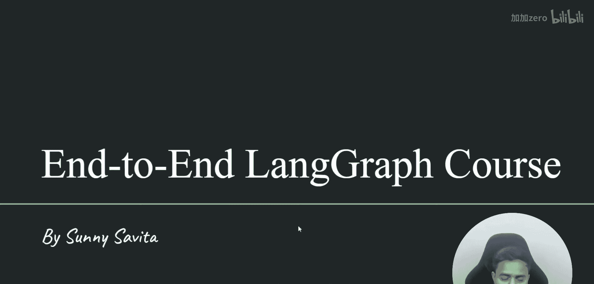
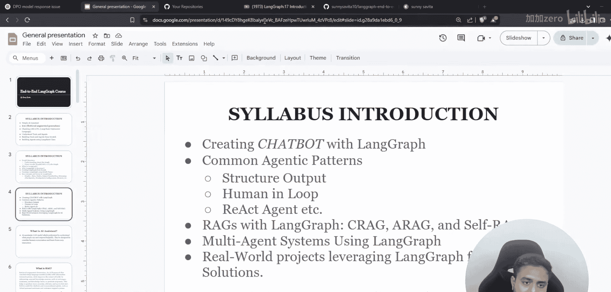
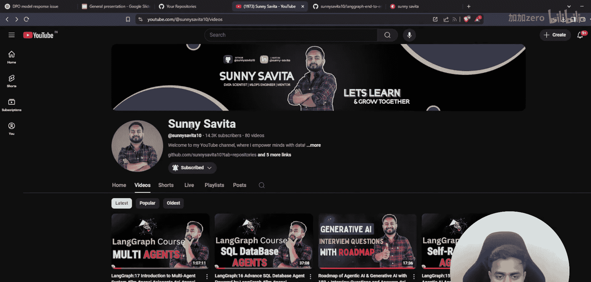
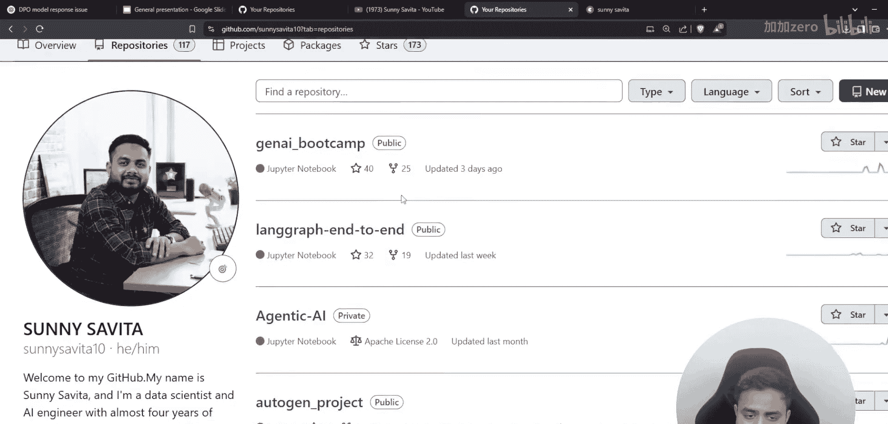
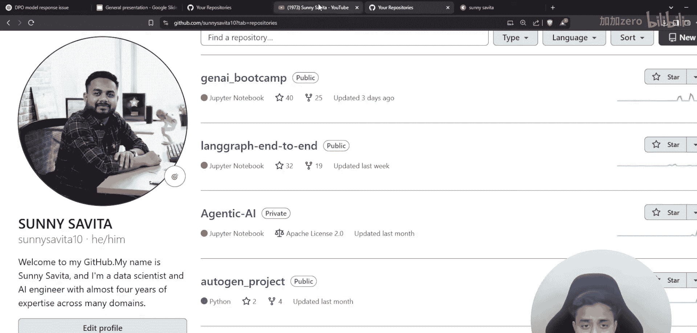
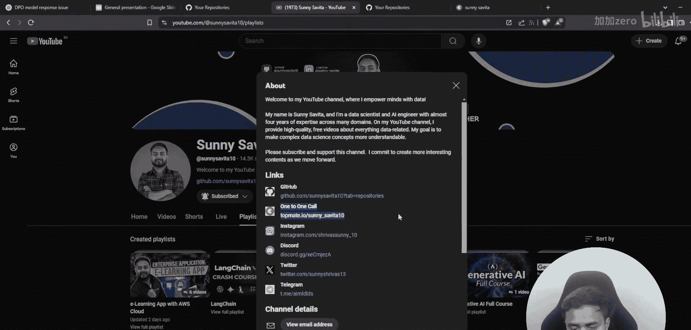
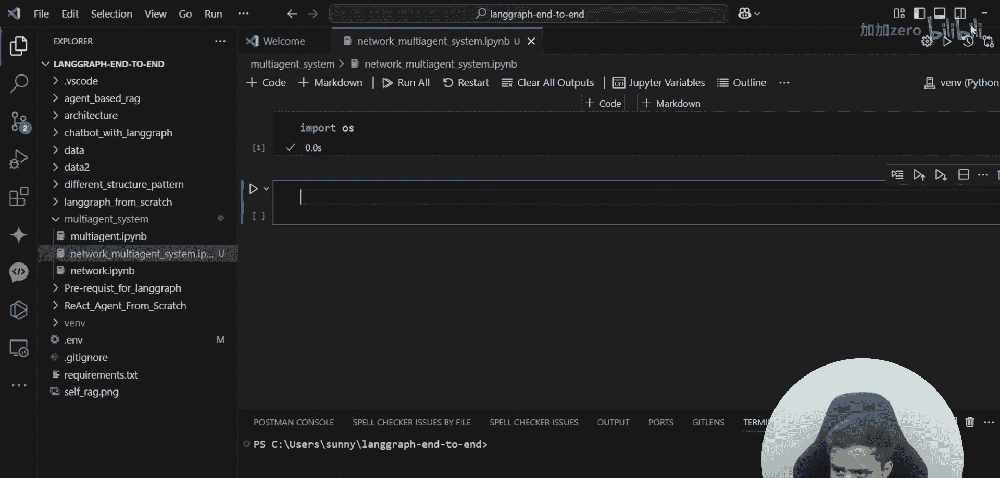
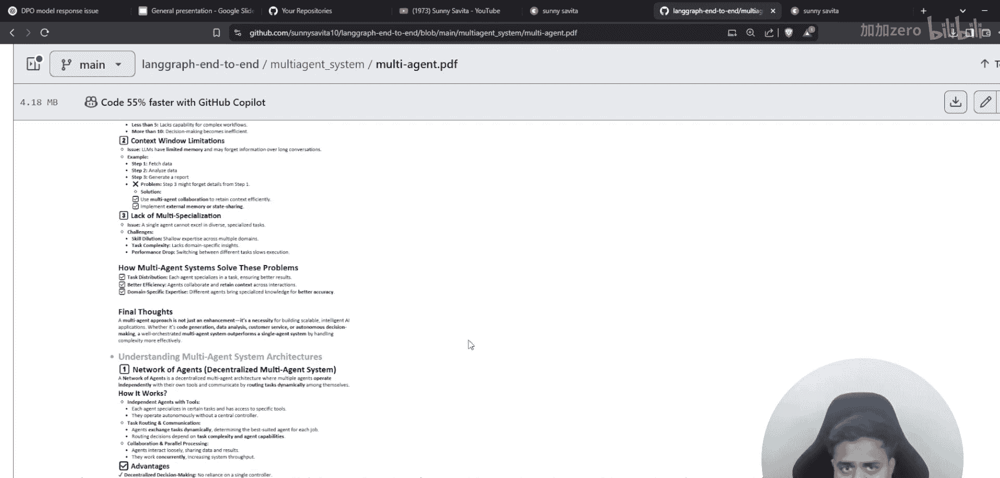
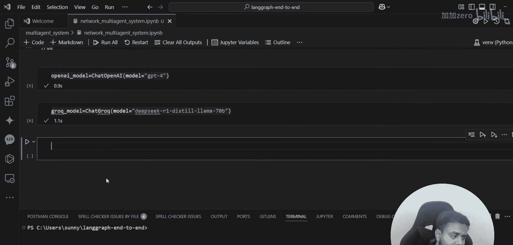

# LangGraph课程：P78：网络或协作多智能体系统实现 🏗️

在本节课中，我们将学习如何使用LangGraph实现一个网络或协作多智能体系统。我们将从基础概念开始，逐步构建一个由多个智能体协同工作的系统，每个智能体负责不同的任务，并通过协作完成复杂目标。

---

上一节我们介绍了多智能体系统的理论基础。本节中，我们来看看如何具体实现一个网络协作型多智能体系统。

首先，我们需要导入必要的库和设置环境。

```python
import os
from typing import TypedDict
from langchain.tools import tool
from langchain_google_genai import ChatGoogleGenerativeAI
from langgraph.graph import MessageGraph, StateGraph
from langgraph.checkpoint import MemorySaver
from langchain_openai import ChatOpenAI
from langchain_core.messages import HumanMessage
from langgraph.prebuilt import create_react_agent
from IPython.display import Image, display
from dotenv import load_dotenv
from langchain_experimental.utilities import PythonREPL
```



以下是导入语句的说明：
*   `os` 和 `TypedDict` 用于系统操作和定义数据类型。
*   `tool` 用于将函数转换为智能体可用的工具。
*   `ChatGoogleGenerativeAI` 和 `ChatOpenAI` 用于调用不同的语言模型。
*   `MessageGraph`, `StateGraph`, `MemorySaver` 是LangGraph构建工作流的核心组件。
*   `HumanMessage` 用于构建消息。
*   `create_react_agent` 是LangGraph内置的创建智能体的便捷类。
*   `Image`, `display` 用于可视化工作流图。
*   `load_dotenv` 用于加载环境变量。
*   `PythonREPL` 是一个可以执行字符串形式Python代码的工具。

接下来，加载环境变量并配置模型。

```python
# 加载环境变量（例如API密钥）
load_dotenv()

# 配置OpenAI模型（付费）
openai_model = ChatOpenAI(model="gpt-4")

# 配置Google Generative AI模型（免费，例如使用DeepSeek）
gemini_model = ChatGoogleGenerativeAI(model="gemini-2.0-flash-exp")
```






现在，我们开始定义系统的状态。状态是智能体之间共享的信息空间。

```python
class AgentState(TypedDict):
    messages: list
    problem_statement: str
    solution_plan: str
    code_snippet: str
    execution_result: str
```

`AgentState` 定义了我们的多智能体系统将维护的共享状态，包含消息历史、问题描述、解决方案计划、代码片段和执行结果。



接着，我们初始化工作流图并设置状态。


```python
# 初始化工作流图，指定状态结构
workflow = StateGraph(AgentState)

# 创建一个内存检查点管理器，用于保存对话历史
memory = MemorySaver()
checkpointer = memory
```





我们将创建多个智能体，每个扮演特定角色。首先是“分析者”智能体，负责理解问题。

```python
def analysis_agent(state: AgentState):
    """分析问题并制定初步计划的智能体"""
    problem = state['problem_statement']
    # 构建给模型的提示
    prompt = f"""
    你是一个资深软件架构师。请分析以下问题，并制定一个分步解决计划。
    问题：{problem}
    请输出一个清晰的计划大纲。
    """
    # 使用模型获取响应
    message = openai_model.invoke([HumanMessage(content=prompt)])
    # 更新状态中的解决方案计划字段
    new_state = state.copy()
    new_state['solution_plan'] = message.content
    new_state['messages'].append(HumanMessage(content=f"分析者计划：{message.content}"))
    return new_state
```


现在，将“分析者”智能体添加为工作流的一个节点。

```python
workflow.add_node("analyst", analysis_agent)
```

接下来是“编码者”智能体，它根据计划编写代码。




```python
def coder_agent(state: AgentState):
    """根据计划编写代码的智能体"""
    plan = state['solution_plan']
    prompt = f"""
    你是一名优秀的Python程序员。根据以下计划，编写实现代码。
    只输出代码，无需解释。
    计划：{plan}
    """
    message = gemini_model.invoke([HumanMessage(content=prompt)])
    new_state = state.copy()
    new_state['code_snippet'] = message.content
    new_state['messages'].append(HumanMessage(content=f"编码者代码：{message.content}"))
    return new_state

workflow.add_node("coder", coder_agent)
```

然后是“执行者”智能体，它负责运行代码并检查结果。

```python
# 初始化Python执行工具
python_repl = PythonREPL()

def executor_agent(state: AgentState):
    """执行代码并返回结果的智能体"""
    code = state['code_snippet']
    try:
        # 安全地执行代码
        result = python_repl.run(code)
    except Exception as e:
        result = f"执行出错：{e}"
    new_state = state.copy()
    new_state['execution_result'] = str(result)
    new_state['messages'].append(HumanMessage(content=f"执行结果：{result}"))
    return new_state

workflow.add_node("executor", executor_agent)
```



最后是“评审者”智能体，它评估整个结果并决定是否完成。

```python
def reviewer_agent(state: AgentState):
    """评审结果并决定下一步的智能体"""
    problem = state['problem_statement']
    result = state['execution_result']
    messages = state['messages']

    prompt = f"""
    你是项目评审员。请评估任务是否完成。
    初始问题：{problem}
    执行结果：{result}
    根据以上信息，判断问题是否已解决。
    如果已解决或无法进一步优化，请回复 'APPROVED'。
    如果未解决且需要另一个智能体重新处理，请回复需要哪个智能体（analyst, coder, executor）。
    """
    message = openai_model.invoke([HumanMessage(content=prompt)])
    decision = message.content.strip()

    new_state = state.copy()
    new_state['messages'].append(HumanMessage(content=f"评审决定：{decision}"))

    # 根据评审决定，返回下一个要执行的节点名称
    if "APPROVED" in decision.upper():
        return new_state # 结束
    elif "ANALYST" in decision.upper():
        return "analyst"
    elif "CODER" in decision.upper():
        return "coder"
    elif "EXECUTOR" in decision.upper():
        return "executor"
    else:
        return new_state # 默认结束

workflow.add_node("reviewer", reviewer_agent)
```

定义了所有智能体节点后，我们需要设置工作流的起点和边（即执行路径）。

```python
# 设置工作流的入口点
workflow.set_entry_point("analyst")

# 定义节点之间的默认流转顺序
workflow.add_edge("analyst", "coder")
workflow.add_edge("coder", "executor")
workflow.add_edge("executor", "reviewer")

# 为评审者节点设置条件边，根据其返回值动态决定下一步
workflow.add_conditional_edges(
    "reviewer",
    # 这是一个决策函数，它接收状态并返回下一个节点的名称
    lambda state: state['messages'][-1].content.split("：")[-1].strip() if state['messages'] else "analyst",
    {
        "analyst": "analyst",
        "coder": "coder",
        "executor": "executor",
        # 如果返回的不是上述节点名，则意味着结束
    }
)
```

现在，编译工作流并为其添加检查点功能。

```python
# 编译工作流
app = workflow.compile(checkpointer=checkpointer)

# 可视化工作流图（可选）
# display(Image(app.get_graph().draw_mermaid_png()))
```

工作流已构建完成。让我们用一个示例问题来测试它。

```python
# 定义初始状态
initial_state: AgentState = {
    "messages": [],
    "problem_statement": "编写一个Python函数，计算斐波那契数列的第n项。",
    "solution_plan": "",
    "code_snippet": "",
    "execution_result": ""
}

# 配置运行参数
config = {"configurable": {"thread_id": "test_thread_1"}}

# 运行工作流
final_state = None
for event in app.stream(initial_state, config=config, stream_mode="values"):
    node_name = list(event.keys())[0]
    print(f"\n--- 节点 [{node_name}] 执行完毕 ---")
    state = event[node_name]
    if node_name == 'reviewer':
        print(f"评审意见：{state['messages'][-1].content}")
    final_state = state

print("\n=== 工作流执行结束 ===")
if final_state:
    print(f"最终代码：\n{final_state.get('code_snippet', 'N/A')}")
    print(f"最终结果：\n{final_state.get('execution_result', 'N/A')}")
```

---



本节课中我们一起学习了如何使用LangGraph构建一个网络协作型多智能体系统。我们定义了分析、编码、执行和评审四个智能体角色，并通过状态图将它们连接成一个可以循环迭代、自我修正的工作流。这种架构允许复杂任务被分解，并由专门的智能体协作完成，展现了多智能体系统在解决分步骤问题上的强大能力。