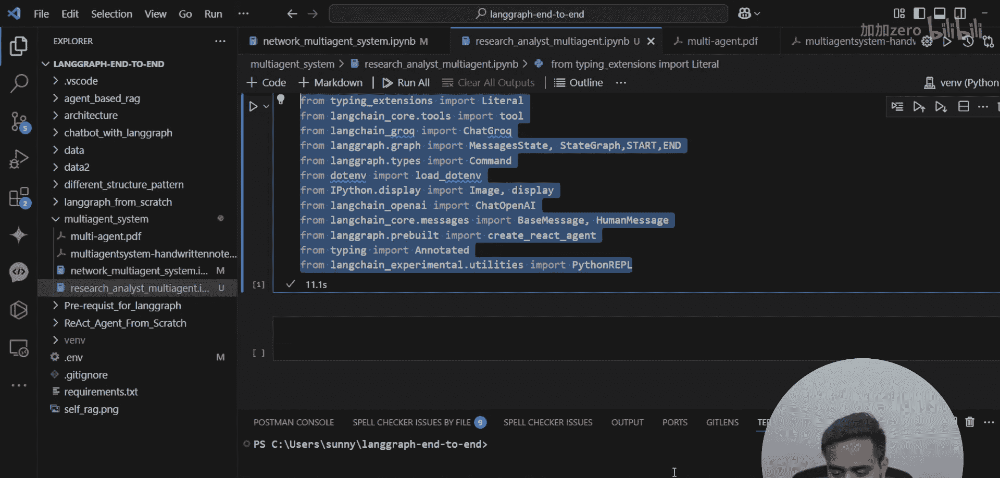
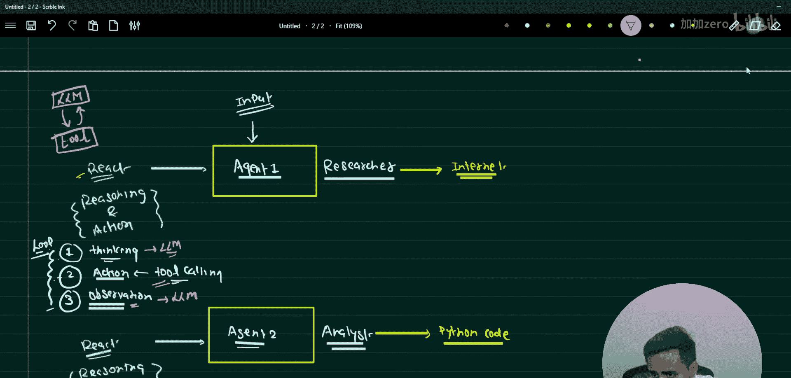

# LangGraph课程：P79：使用协作多智能体系统进行研究与分析 🔍

在本节课中，我们将学习如何构建一个协作多智能体系统，其中一个智能体负责研究，另一个智能体负责分析。我们将从理解架构开始，然后逐步实现代码。

## 概述

在上一节中，我们介绍了多智能体系统的基础，并学习了如何实现一个简单的协作网络，其中智能体之间可以传递控制权。本节我们将扩展这个概念，解决一个更具体的问题：研究分析多智能体系统。

我们将构建一个系统，其中第一个智能体（研究员）根据给定主题从互联网上获取信息，第二个智能体（分析师）则基于研究员收集的信息执行分析任务。

## 系统架构

在开始编码之前，让我们先理解整个系统的架构。这将帮助我们清晰地规划实现步骤。

以下是研究分析多智能体系统的架构图：


系统包含两个主要智能体：
1.  **研究员智能体**：负责从互联网上研究给定主题。
2.  **分析师智能体**：负责对研究员收集到的信息进行分析。


两个智能体都是 **ReAct 智能体**。ReAct 代表 **推理** 与 **行动**。每个 ReAct 智能体内部都包含一个循环过程：
*   **思考**：基于输入进行推理。
*   **行动**：调用工具（例如，搜索网络）。
*   **观察**：处理工具返回的结果。
这个循环会持续进行，直到任务完成。


从架构上看，每个 ReAct 智能体都由两个核心部分组成：
*   **LLM**：作为智能体的大脑，负责推理和决策。
*   **工具**：智能体执行具体操作（如网络搜索、运行代码）的手段。

工作流程如下：用户输入一个指令（例如，“研究并分析特斯拉的最新财报”）。该指令首先传递给研究员智能体。研究员智能体使用其工具（网络搜索）获取相关信息。然后，研究员智能体的输出作为输入传递给分析师智能体。分析师智能体使用其工具（可能是 Python 代码执行环境）对信息进行分析，并生成最终结果。

## 准备工作

在实现之前，我们需要设置开发环境并导入必要的模块。我们将基于上一节课的代码进行扩展。

以下是创建新文件并导入基础模块的步骤：

首先，在你的项目文件夹中创建一个新的 Python 文件。我们将基于上一节的代码开始构建。

```python
# 文件：research_analyst_multi_agent.ipynb
# 导入必要的模块
from langchain_openai import ChatOpenAI
from langchain.agents import Tool, AgentExecutor, create_react_agent
from langchain.memory import ConversationBufferMemory
from langgraph.graph import StateGraph, END
# 导入其他可能需要的模块，例如网络搜索工具
# from langchain_community.tools import DuckDuckGoSearchRun
# 注意：实际工具导入取决于你的选择
```

确保你的开发环境（如虚拟环境）已激活，并且上述导入语句能成功执行。本课程的所有代码材料都可以在相关的 GitHub 仓库中找到。

## 构建研究员智能体

上一节我们了解了架构，本节我们来具体构建第一个智能体——研究员智能体。它的核心任务是利用工具从互联网获取信息。

研究员智能体是一个 ReAct 智能体。我们需要为其配备一个 LLM 和一个或多个工具。最关键的工具是网络搜索工具。


以下是构建研究员智能体的关键步骤：

1.  **初始化 LLM**：选择一个语言模型作为智能体的“大脑”。
2.  **定义工具**：创建一个或多个工具。最基本的工具是网络搜索工具，它允许智能体查询实时信息。
3.  **创建智能体**：使用 `create_react_agent` 方法将 LLM 和工具结合起来，形成完整的 ReAct 智能体。
4.  **创建执行器**：使用 `AgentExecutor` 来运行智能体，处理其思考-行动-观察的循环。

代码结构示意如下：
```python
# 1. 初始化 LLM
llm = ChatOpenAI(model="gpt-4", temperature=0)

# 2. 定义搜索工具
search_tool = Tool(
    name="Internet Search",
    func=search_function, # 这里需要替换为实际的搜索函数，如 duckduckgo-search
    description="Useful for searching the internet for current information on a topic."
)

# 3. 创建 ReAct 智能体
researcher_agent = create_react_agent(
    llm=llm,
    tools=[search_tool],
    prompt=researcher_prompt # 需要定义提示词来指导智能体行为
)

# 4. 创建智能体执行器
researcher_agent_executor = AgentExecutor.from_agent_and_tools(
    agent=researcher_agent,
    tools=[search_tool],
    verbose=True,
    handle_parsing_errors=True
)
```
研究员智能体的提示词应指导它专注于“研究”任务，即理解用户问题，然后使用搜索工具查找相关信息，并整理出清晰、相关的发现。

## 构建分析师智能体

在研究员智能体构建完成后，我们需要构建第二个智能体——分析师智能体。它的职责是对研究员提供的信息进行深入分析。

分析师智能体同样是一个 ReAct 智能体。它的 LLM 可以与研究员智能体相同或不同。其工具集将侧重于分析任务，例如执行 Python 代码进行数据计算、生成图表或进行逻辑推理。

以下是构建分析师智能体的步骤：

1.  **初始化 LLM**：可以复用之前的 LLM，或根据分析任务的复杂性选择其他模型。
2.  **定义分析工具**：创建适合分析的工具。例如，一个 Python REPL 工具允许智能体执行代码片段来处理数据。
3.  **创建智能体**：使用 `create_react_agent` 将 LLM 和分析工具结合。
4.  **创建执行器**：为其创建 `AgentExecutor`。

代码结构示意如下：
```python
# 1. 初始化 LLM (可以复用)
analyst_llm = ChatOpenAI(model="gpt-4", temperature=0)

# 2. 定义分析工具，例如 Python 执行工具
python_tool = Tool(
    name="Python Code Interpreter",
    func=python_executor, # 需要替换为安全的代码执行函数
    description="Useful for performing data analysis, calculations, or generating summaries using Python code."
)

# 3. 创建分析师 ReAct 智能体
analyst_agent = create_react_agent(
    llm=analyst_llm,
    tools=[python_tool],
    prompt=analyst_prompt # 提示词应指导其进行“分析”
)



# 4. 创建智能体执行器
analyst_agent_executor = AgentExecutor.from_agent_and_tools(
    agent=analyst_agent,
    tools=[python_tool],
    verbose=True,
    handle_parsing_errors=True
)
```
分析师智能体的提示词应指导它接收研究员智能体的输出作为上下文，然后根据分析目标（例如，“总结关键点”、“计算增长率”、“指出风险”）来调用工具完成任务。

## 使用 LangGraph 编排工作流

现在我们已经有了两个独立的智能体，下一步是使用 LangGraph 将它们连接起来，形成一个协作的工作流。LangGraph 允许我们定义智能体之间的状态转移。

我们将创建一个有向图，其中节点代表智能体（或动作），边代表控制流的走向。

以下是使用 LangGraph 编排工作流的步骤：

1.  **定义状态**：首先定义一个状态类，用于在智能体之间传递信息。状态至少应包含用户最初的 `input` 和每个智能体产生的 `output`。
2.  **创建图**：初始化一个 `StateGraph` 对象。
3.  **添加节点**：将研究员智能体和分析师智能体的执行逻辑封装成函数，并作为节点添加到图中。
4.  **定义边**：设置节点之间的连接关系。通常流程是：开始 -> 研究员节点 -> 分析师节点 -> 结束。
5.  **编译图**：最后，编译图以创建可执行的工作流。

代码结构示意如下：
```python
from typing import TypedDict

# 1. 定义状态
class AgentState(TypedDict):
    input: str          # 用户原始输入
    researcher_output: str  # 研究员智能体的输出
    analyst_output: str     # 分析师智能体的输出
    final_output: str   # 最终输出

# 2. 创建图
workflow = StateGraph(AgentState)

# 3. 定义节点函数
def run_researcher(state: AgentState):
    # 调用研究员智能体执行器处理 state[‘input‘]
    result = researcher_agent_executor.invoke({"input": state["input"]})
    return {"researcher_output": result["output"]}

def run_analyst(state: AgentState):
    # 将研究员输出作为分析师的输入
    analysis_input = f"Based on the following research: {state['researcher_output']}. Now perform the analysis as originally requested: {state['input']}"
    result = analyst_agent_executor.invoke({"input": analysis_input})
    return {"analyst_output": result["output"], "final_output": result["output"]}

# 4. 添加节点和边
workflow.add_node("researcher", run_researcher)
workflow.add_node("analyst", run_analyst)

workflow.set_entry_point("researcher") # 设置入口
workflow.add_edge("researcher", "analyst") # 研究员完成后交给分析师
workflow.add_edge("analyst", END) # 分析师完成后结束

# 5. 编译图
app = workflow.compile()
```
现在，你可以通过调用 `app.invoke({"input": "你的研究问题"})` 来运行整个多智能体系统。

## 运行与测试示例

工作流构建完成后，我们需要对其进行测试，以确保它能按预期协作运行。让我们用一个具体的例子来演示。

假设我们想了解“特斯拉2023年第四季度的交付量和营收情况，并分析其同比增长率”。

以下是运行和测试系统的步骤：

1.  **调用工作流**：将上述问题作为输入传递给编译好的 LangGraph 应用。
2.  **观察执行过程**：由于我们在创建执行器时设置了 `verbose=True`，你可以在控制台看到每个智能体的“思考-行动-观察”步骤。
3.  **检查结果**：工作流将返回最终状态，其中包含研究员智能体的发现、分析师智能体的分析以及最终答案。

```python
# 测试工作流
test_input = “Research Tesla‘s Q4 2023 delivery numbers and revenue, then analyze the year-over-year growth rate.”
final_state = app.invoke({"input": test_input})

print("最终分析结果：")
print(final_state["final_output"])
```
在执行过程中，研究员智能体会调用搜索工具查找特斯拉的相关财报新闻和数据。然后，它将整理出的关键数据（如交付量、营收额）传递给分析师智能体。分析师智能体则会调用 Python 工具，计算同比增长率，并可能生成一个简短的文字总结。

通过这个测试，你可以验证两个智能体是否成功协作，以及分析结果是否准确合理。

## 总结

本节课中，我们一起学习了如何使用 LangGraph 构建一个用于研究与分析的协作多智能体系统。

我们首先回顾了多智能体系统的基础，然后详细阐述了一个由研究员智能体和分析师智能体组成的协作架构。接着，我们逐步实现了这两个 ReAct 智能体，分别为它们配备了网络搜索和代码分析工具。最后，我们使用 LangGraph 将这两个智能体连接成一个有序的工作流，并通过一个实际例子测试了系统的运行。



这个模式具有很强的扩展性。你可以通过增加更多的智能体（如数据可视化智能体、报告撰写智能体）或更复杂的工具来增强系统功能。当面临需要多步骤、多专业领域协作的复杂问题时，这种多智能体系统提供了一个强大而灵活的解决方案框架。