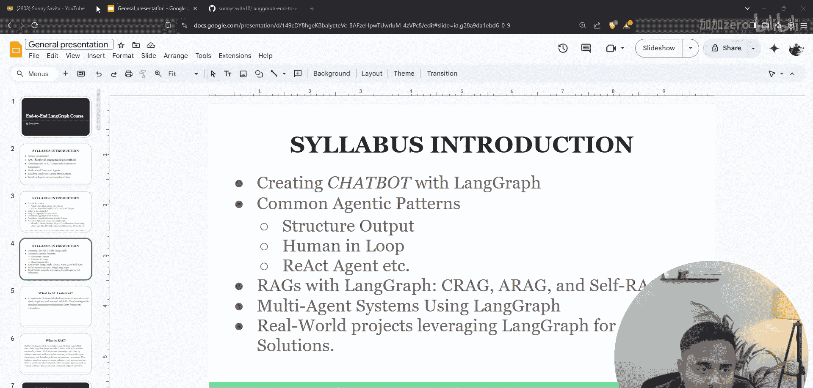
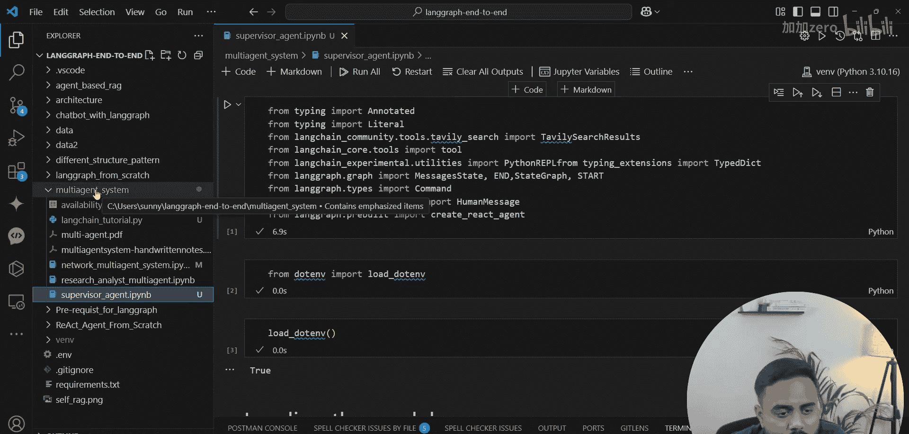
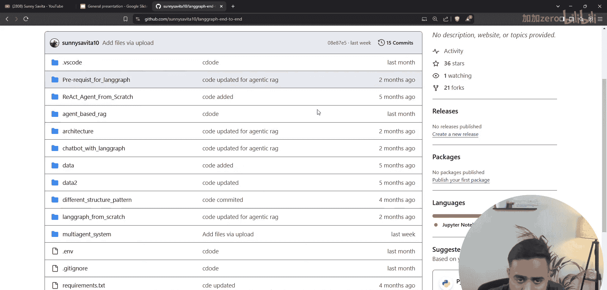
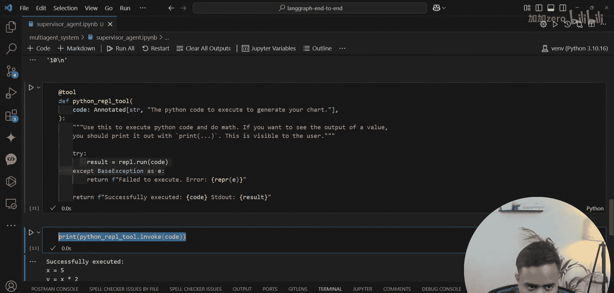

# LangGraph 智能体课程：P80：监督式多智能体系统 🧠

在本节课中，我们将学习如何使用 LangGraph 构建一个监督式多智能体系统。我们将通过代码逐步实现一个包含多个专业智能体和一个监督智能体的协作系统，并了解其核心概念和工作流程。

## 概述

上一节我们介绍了协作式智能体。本节中，我们将深入探讨监督式多智能体系统。在这种架构中，一个中央监督智能体负责接收用户问题，分析任务需求，并将子任务分配给不同的专业智能体执行，最后汇总结果。


## 环境与工具准备

首先，我们需要设置开发环境并导入必要的库。以下是实现监督式多智能体系统所需的核心模块。

```python
import os
import re
from typing import Annotated, Literal
from dotenv import load_dotenv
from langchain_community.tools.tavily_search import TavilySearchResults
from langchain_experimental.utilities import PythonREPL
from langgraph.graph import MessageGraph, StateGraph, START, END
from langgraph.prebuilt import create_react_agent
from langchain_core.messages import HumanMessage
from langchain_community.chat_models import ChatDeepSeek
```

我们导入了以下关键组件：
*   `Annotated` 和 `Literal` 用于类型提示。
*   `load_dotenv` 用于加载环境变量。
*   `TavilySearchResults` 是一个网络搜索工具。
*   `PythonREPL` 是一个可以执行 Python 代码的工具。
*   `MessageGraph`, `StateGraph` 等是构建 LangGraph 工作流的核心类。
*   `create_react_agent` 用于快速创建智能体节点。
*   `ChatDeepSeek` 是我们将使用的语言模型。

## 初始化模型与工具

在构建智能体之前，我们需要初始化语言模型和工具。这为后续的智能体创建提供了基础。



首先，加载环境变量，其中包含 API 密钥等敏感信息。

```python
load_dotenv()
```

接下来，初始化 DeepSeek 语言模型。我们将创建一个辅助函数来清理模型输出中的“思考”过程标记。

```python
# 初始化模型
model = ChatDeepSeek(model="deepseek-chat", api_key=os.getenv("DEEPSEEK_API_KEY"))


# 清理模型输出文本的函数
def clean_text(text: str) -> str:
    """移除响应中的 think 标签。"""
    return re.sub(r"【.*?】", "", text, flags=re.DOTALL).strip()

# 测试模型调用
test_response = model.invoke([HumanMessage(content="Hello")])
print(clean_text(test_response.content))
```

然后，初始化两个工具：网络搜索工具和 Python 代码执行工具。我们需要将 PythonREPL 包装成一个 LangChain 工具。

```python
# 初始化 Tavily 搜索工具
search_tool = TavilySearchResults(max_results=2, tavily_api_key=os.getenv("TAVILY_API_KEY"))

# 将 PythonREPL 包装成工具
python_repl = PythonREPL()

from langchain.tools import tool





@tool
def python_tool(code: Annotated[str, "The Python code to execute."]) -> str:
    """执行 Python 代码并返回结果。请确保以 markdown 格式返回。"""
    try:
        result = python_repl.run(code)
    except Exception as e:
        result = f"Error: {e}"
    return f"```python\n{code}\n```\n\n执行结果:\n```\n{result}\n```"
```

## 定义智能体团队

监督式系统的核心是拥有不同专长的智能体。我们将创建三个专业智能体：一个研究员、一个程序员和一个作家。

每个智能体都是一个独立的 React 智能体，拥有特定的工具和系统提示词。

```python
# 定义智能体团队
supervisor_name = "supervisor"
team_members = ["Researcher", "Coder", "Writer"]
agents = []

# 1. 研究员智能体 - 负责搜索信息
researcher_system_prompt = """你是一名研究员。你的任务是使用搜索工具查找最新、最准确的信息来回答问题。
只使用提供给你的工具。你的回答应基于搜索到的事实。"""
researcher_agent = create_react_agent(model, tools=[search_tool], prompt=researcher_system_prompt)
agents.append(("Researcher", researcher_agent))

# 2. 程序员智能体 - 负责编写和执行代码
coder_system_prompt = """你是一名程序员。你的任务是编写、分析和执行 Python 代码来解决计算、数据分析或自动化问题。
只使用提供给你的 Python 工具。确保代码安全且高效。"""
coder_agent = create_react_agent(model, tools=[python_tool], prompt=coder_system_prompt)
agents.append(("Coder", coder_agent))

# 3. 作家智能体 - 负责润色和总结
writer_system_prompt = """你是一名技术作家。你的任务是将技术信息、代码结果或研究摘要整理成清晰、流畅、结构化的最终报告。
你不使用搜索或代码工具，只进行文本处理和撰写。"""
writer_agent = create_react_agent(model, tools=[], prompt=writer_system_prompt) # 作家不需要工具
agents.append(("Writer", writer_agent))
```

## 构建监督智能体与工作流

智能体准备就绪后，我们需要创建监督智能体来管理它们，并使用 LangGraph 定义整个团队的工作流程。

监督智能体负责决定将任务的哪个部分分配给哪个专业智能体。

```python
# 定义系统状态
from typing import TypedDict, List
from langchain_core.messages import BaseMessage

class AgentState(TypedDict):
    messages: Annotated[List[BaseMessage], "对话消息历史"]
    next: str # 指示下一步由哪个智能体执行

# 创建监督智能体的提示词
supervisor_prompt = f"""你是一个监督员，管理一个包含以下成员的团队：{', '.join(team_members)}。
你的任务是分析用户问题，并决定由哪个团队成员来执行，或者是否需要结束对话。
研究员({team_members[0]})：擅长搜索和查找事实信息。
程序员({team_members[1]})：擅长编写、运行代码和解决计算问题。
作家({team_members[2]})：擅长总结、润色和撰写最终报告。

根据问题内容，只回复下一个应该行动的智能体名字，或者回复“FINISH”表示任务完成。
不要添加任何其他解释。"""

supervisor_chain = supervisor_prompt | model
```

现在，我们使用 LangGraph 的 `StateGraph` 来构建工作流。图由节点（智能体）和边（转移条件）组成。

```python
# 构建 LangGraph 工作流
workflow = StateGraph(AgentState)

# 添加团队智能体节点
for name, agent in agents:
    # 定义每个智能体的节点函数
    def agent_node(state: AgentState, agent=agent, name=name):
        result = agent.invoke(state)
        return {"messages": [result["messages"][-1]]} # 返回最新消息
    workflow.add_node(name, agent_node)

# 添加监督智能体节点
def supervisor_node(state: AgentState):
    messages = state['messages']
    # 监督智能体根据当前对话决定下一步
    result = supervisor_chain.invoke({"messages": messages})
    cleaned_decision = clean_text(result.content)
        return {"next": cleaned_decision}

workflow.add_node(supervisor_name, supervisor_node)
```

## 定义工作流路由逻辑

节点添加完毕后，我们需要定义它们之间的连接关系，即路由逻辑。这决定了任务执行的顺序。

```python
# 定义边：所有智能体执行完后都回到监督节点
for member in team_members:
    workflow.add_edge(member, supervisor_name)

# 定义条件边：监督节点决定下一步去哪里
def route_next(state: AgentState):
    next_step = state["next"]
    if next_step == "FINISH":
        return END
    elif next_step in team_members:
        return next_step
    else:
        # 如果返回了未知名称，默认回到监督节点重新判断
        return supervisor_name

workflow.add_conditional_edges(
    supervisor_name,
    route_next,
    {**{member: member for member in team_members}, "supervisor": supervisor_name, END: END}
)

# 设置入口点
workflow.set_entry_point(supervisor_name)

# 编译图
app = workflow.compile()
```

## 运行与测试系统

工作流编译完成后，我们就可以用它来处理用户查询了。让我们用一个复杂问题来测试整个系统。

```python
# 测试查询
test_query = "请帮我研究一下特斯拉最新的股价趋势，用Python画一个简单的走势图，并写一份简要的分析报告。"
inputs = {"messages": [HumanMessage(content=test_query)]}

print("开始执行监督式多智能体系统...")
print(f"用户问题: {test_query}")
print("-" * 50)

# 流式输出结果
for output in app.stream(inputs, stream_mode="values"):
    if "messages" in output and output["messages"]:
        last_message = output["messages"][-1]
        # 判断消息来自哪个节点并打印
        if hasattr(last_message, 'name'): # 来自工具或智能体的消息可能有 name 属性
            print(f"\n[{last_message.name or 'Supervisor'}]:")
        else:
            print(f"\n[System]:")
        print(clean_text(last_message.content))
        print("-" * 30)
```

系统将开始运行：监督智能体首先分析问题，它可能会先派研究员去搜索特斯拉股价信息，然后让程序员用获取的数据绘图，最后让作家汇总成报告。每一步的结果都会返回给监督智能体进行下一步决策，直到输出“FINISH”。

## 总结

本节课中我们一起学习了如何使用 LangGraph 构建一个监督式多智能体系统。我们实现了以下核心步骤：

1.  **环境与工具准备**：导入必要库，初始化语言模型（DeepSeek），并创建了搜索与代码执行工具。
2.  **定义智能体团队**：创建了三个各司其职的专业智能体：研究员、程序员和作家。
3.  **构建监督工作流**：定义了系统状态，创建了监督智能体，并使用 `StateGraph` 构建了包含所有节点和条件边的协作图。
4.  **系统运行**：通过一个综合性的用户查询测试了系统，观察了监督智能体如何路由任务以及多智能体如何协作完成复杂任务。



这种架构的优势在于，监督智能体作为“大脑”，可以协调多个“专家”智能体，处理涉及研究、计算和写作的复杂任务，比单一智能体更加强大和灵活。