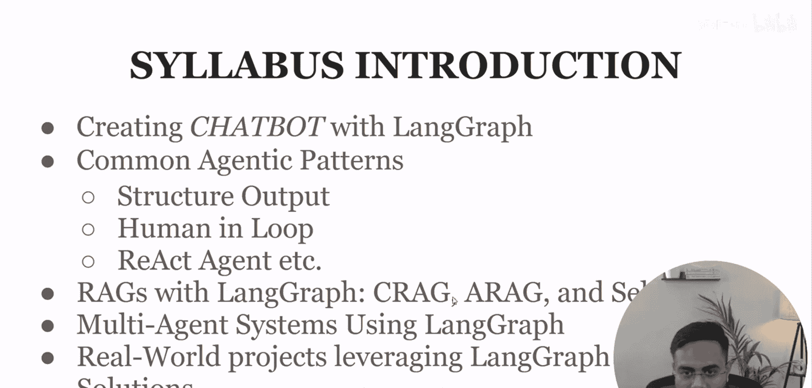
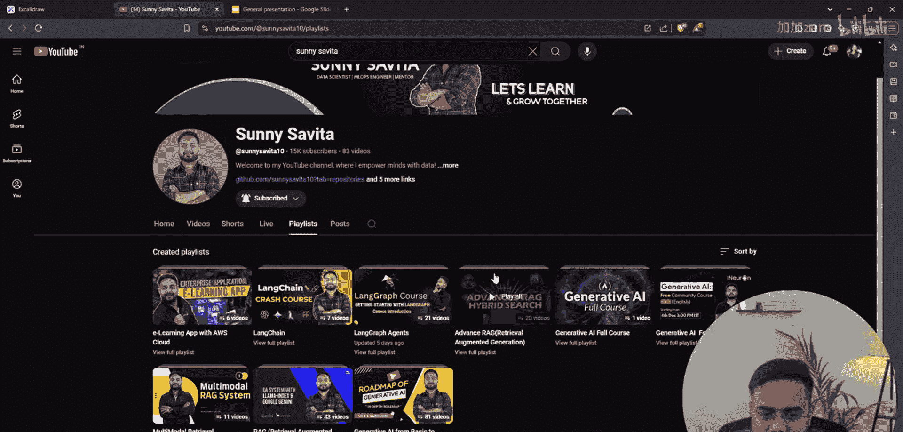
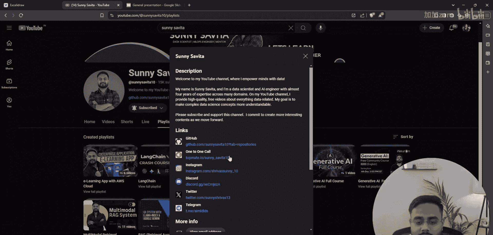
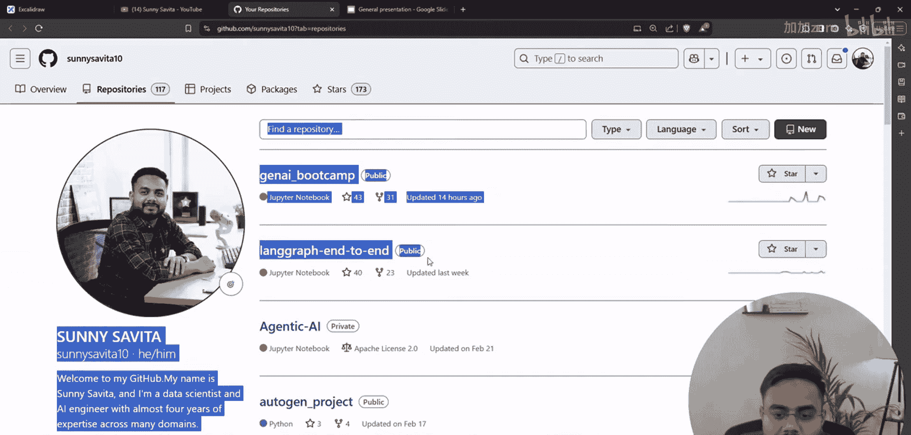
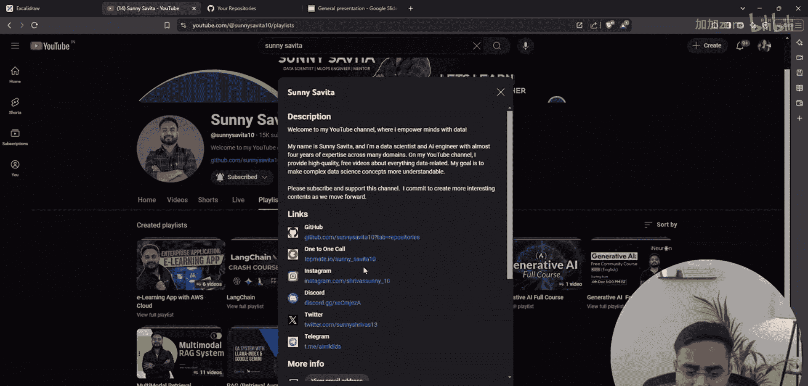
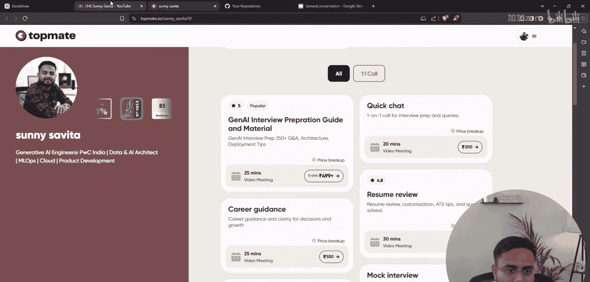
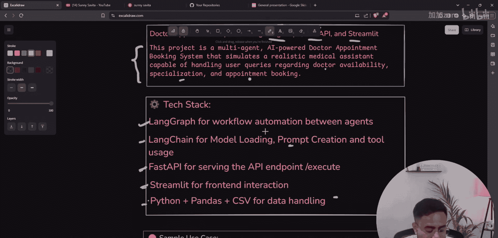
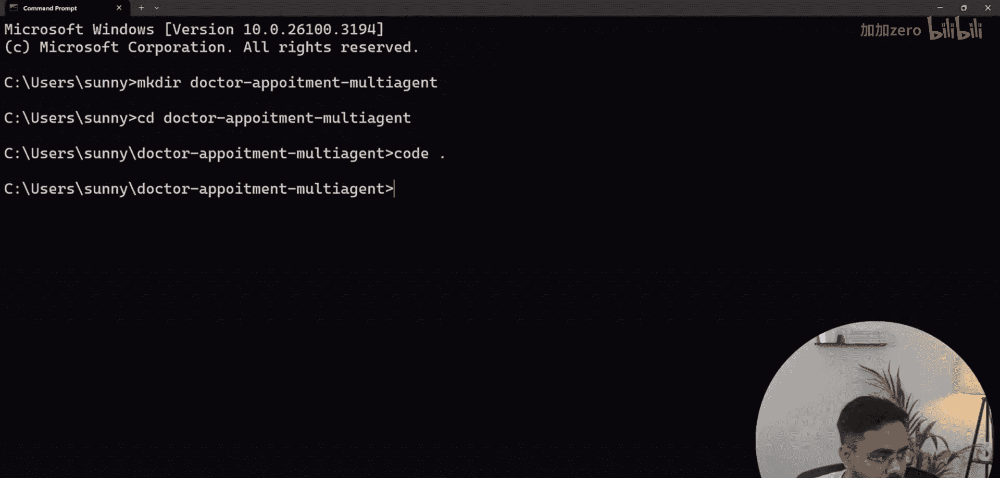
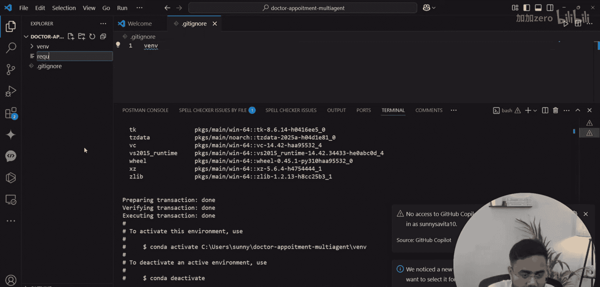

# LangGraph课程：P81：端到端监督式多智能体AI项目——医生预约系统

在本节课中，我们将学习如何使用LangGraph、FastAPI和Streamlit构建一个完整的端到端监督式多智能体AI项目。该项目是一个AI驱动的医生预约系统，能够处理用户关于医生可用性、专业领域和预约的查询。






## 项目概述



我们即将构建一个遵循监督式多智能体架构的医生预约系统。该系统将包含一个监督智能体，根据用户查询的类型，将任务委派给专门的信息查询智能体或预约智能体。项目将采用模块化编码，涵盖从数据处理、智能体工作流到前端界面的完整流程。





## 技术栈



以下是构建本项目所需的技术栈：
*   **LangGraph**：用于工作流自动化和智能体创建。
*   **LangChain**：用于模型加载、提示工程和工具创建。
*   **FastAPI**：用于提供API端点。
*   **Streamlit**：用于创建前端用户界面。
*   **Python Pandas/CSV**：用于数据处理。

## 系统架构

上一节我们介绍了项目的整体目标和技术栈，本节中我们来看看系统的核心架构。

这是一个监督式多智能体架构。其工作流程如下：
1.  用户输入查询。
2.  查询被发送到**监督智能体**。
3.  监督智能体分析查询内容：
    *   如果查询属于信息咨询（如医生可用性），则委派给**信息节点**处理。
    *   如果查询属于预约请求，则在收集必要信息后，可能再次通过监督智能体，委派给**预约节点**处理。
    *   如果查询不属于上述任何类别，则直接结束流程。
4.  信息节点或预约节点会调用工具（如查询数据库）来获取或修改数据。
5.  系统最终将结果返回给用户。

## 项目初始化



了解了架构之后，我们现在开始动手实现。首先需要设置项目开发环境。

以下是初始化步骤：
1.  创建项目目录。
    ```bash
    mkdir doctor_appointment_multi_agent
    ```
2.  进入项目目录并打开代码编辑器（如VSCode）。
    ```bash
    cd doctor_appointment_multi_agent
    code .
    ```
3.  创建并激活Python虚拟环境（以conda为例）。
    ```bash
    conda create -n doctor_agent_env python=3.10 -y
    conda activate doctor_agent_env
    ```
4.  初始化Git仓库并创建`.gitignore`文件，将虚拟环境目录（如`venv/`或`env/`）加入忽略列表。
5.  创建`requirements.txt`文件，用于管理项目依赖。



## 总结



本节课中我们一起学习了如何规划一个端到端的监督式多智能体AI项目。我们明确了项目目标——构建一个医生预约系统，介绍了所需的技术栈，并详细分析了监督式多智能体的工作架构。最后，我们完成了项目环境的初始化设置，为后续的编码工作做好了准备。在接下来的课程中，我们将开始实现具体的代码模块。