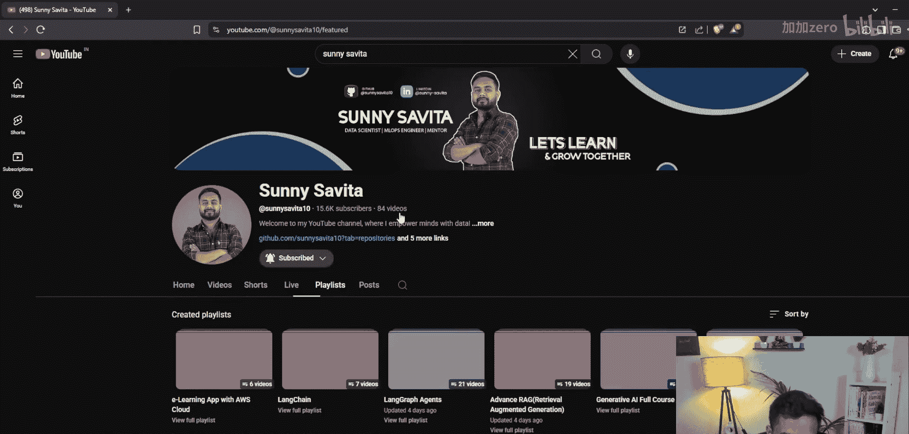
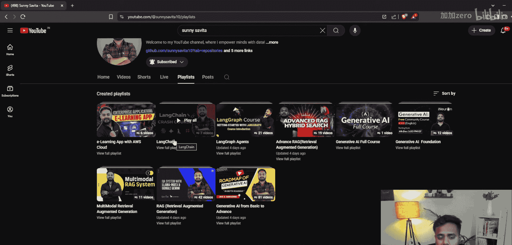
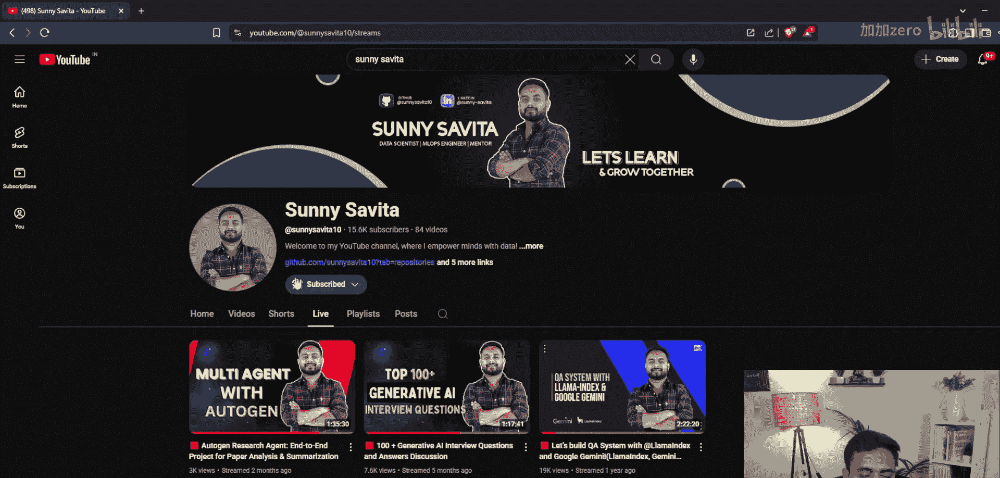
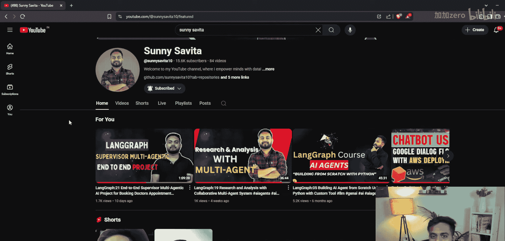
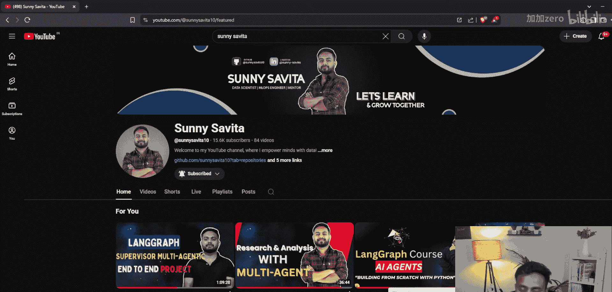
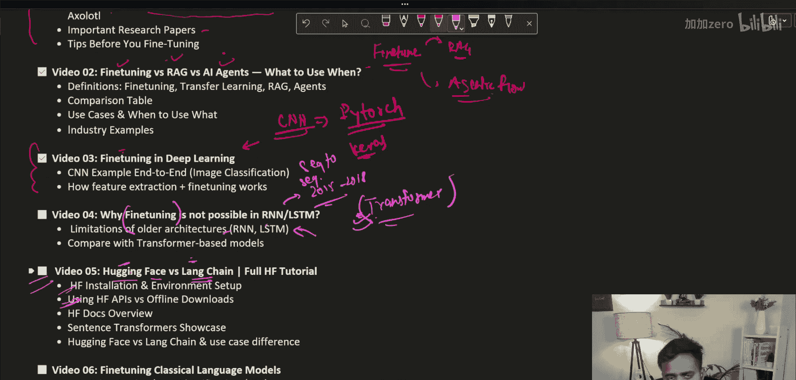

生成式AI：P82：LLM微调入门教程 🚀

在本节课中，我们将学习大型语言模型微调的基础知识。我们将从核心概念开始，逐步深入到实践框架，并探讨微调与其他技术的关系。

---

### **概述：什么是模型微调？**

上一节我们介绍了RAG和智能体，本节中我们来看看模型微调。模型微调是指在一个已经预训练好的模型基础上，使用特定领域的数据对其进行额外训练，使其适应新任务或提升在特定任务上的性能。其核心公式可以表示为：

**`微调后模型 = 预训练模型 + 领域特定数据 + 额外训练`**

这个过程不同于从头训练，它利用了预训练模型已学到的通用知识，因此通常更高效。

---







### **微调的重要性与框架**

微调是生成式AI的基础。它使企业能够定制模型以满足特定需求，例如客服、代码生成或内容创作。以下是当前流行的微调框架：

*   **PEFT**：参数高效微调，旨在以最小的参数量实现高效微调。
*   **LoRA**：低秩适应，一种高效的PEFT方法。
*   **QLoRA**：量化版的LoRA，进一步降低资源消耗。
*   **Unsloth**：一个旨在加速微调过程的框架。
*   **LLaMA Factory**：一个用于微调LLaMA系列模型的工具。

理解这些框架是进行实际微调操作的前提。





---

### **微调 vs. RAG vs. 智能体**

在构建AI应用时，我们面临多种技术选择。理解它们的区别和适用场景至关重要。

*   **微调**：改变模型自身的参数和知识。适用于需要模型掌握稳定、特定领域知识或风格的任务。
*   **RAG**：通过检索外部知识来增强模型的回答，不改变模型本身。适用于知识需要频繁更新或模型未训练过的领域。
*   **智能体**：具备规划、工具调用等能力的AI系统。可以在微调或RAG提供的模型基础上构建。

它们可以结合使用，例如，先微调一个领域模型，再为其构建RAG系统以接入最新数据，最后将其封装成智能体。

---

### **从深度学习看微调**

为了深入理解微调，我们需要回顾其在深度学习中的起源。在Transformer架构流行之前，循环神经网络及其变体LSTM是处理序列数据的主流。

以下是一个使用PyTorch训练简单CNN模型的代码片段，展示了基础训练流程：

```python
import torch
import torch.nn as nn
import torch.optim as optim

# 定义一个简单的CNN模型
class SimpleCNN(nn.Module):
    def __init__(self):
        super(SimpleCNN, self).__init__()
        self.conv1 = nn.Conv2d(1, 32, kernel_size=3)
        self.fc = nn.Linear(32*26*26, 10)

    def forward(self, x):
        x = torch.relu(self.conv1(x))
        x = x.view(-1, 32*26*26)
        x = self.fc(x)
        return x

# 初始化模型、损失函数和优化器
model = SimpleCNN()
criterion = nn.CrossEntropyLoss()
optimizer = optim.Adam(model.parameters(), lr=0.001)

# 训练循环（示例）
for epoch in range(num_epochs):
    for data, target in train_loader:
        optimizer.zero_grad()
        output = model(data)
        loss = criterion(output, target)
        loss.backward()
        optimizer.step()
```

这种在已有架构上针对新数据调整参数的思想，正是微调的核心。

---

### **Transformer为何取代RNN/LSTM？**

一个关键问题是：为什么微调在RNN/LSTM时代不流行，而Transformer改变了这一切？

主要原因是**并行化训练**和**长程依赖建模**。RNN/LSTM必须按序列顺序处理数据，难以并行，训练慢。同时，它们难以有效捕捉长距离词语间的关系。Transformer的自注意力机制完美解决了这两个问题，使得训练超大规模语言模型成为可能，从而让针对大模型的微调变得极具价值。

---

### **实践起点：Hugging Face生态**

现在，我们将进入实践环节。Hugging Face是当前使用和微调开源大模型的核心平台。

我们将学习：
1.  Hugging Face `transformers` 库的安装与使用。
2.  如何通过Hugging Face API加载预训练模型。
3.  模型与分词器的基本使用方法。
4.  了解与其他平台（如Replicate）的区别。

这是开始动手微调模型的第一步。

---

### **总结**



本节课中我们一起学习了LLM微调的基本概念。我们明确了微调的定义及其重要性，列举了关键的微调框架，并辨析了微调、RAG和智能体三种技术路径的差异。通过回顾深度学习基础，我们理解了微调思想的来源，并分析了Transformer架构成为微调主流载体的原因。最后，我们指明了实践起点——Hugging Face生态系统。接下来，我们将深入每一个环节，进行详细的讲解和实战。