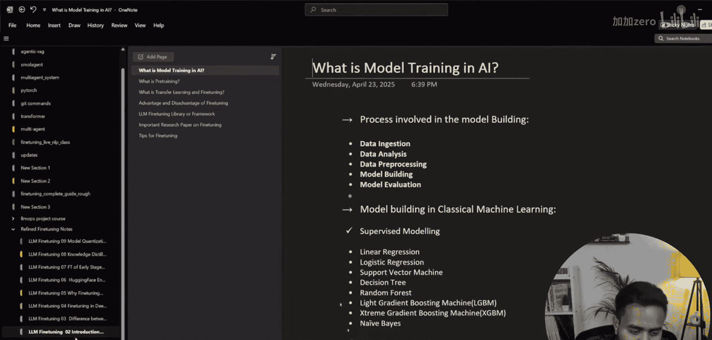
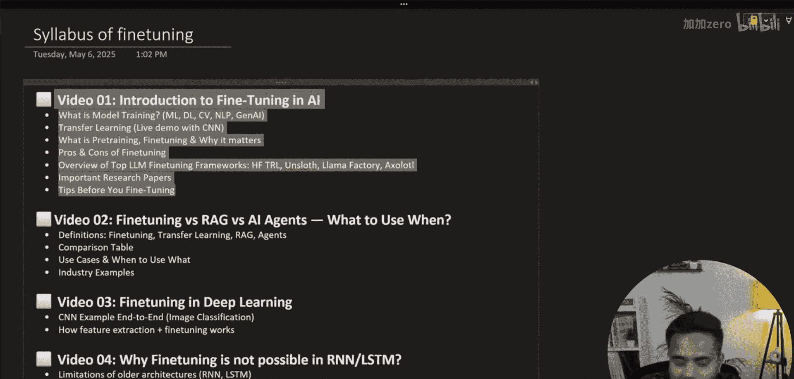
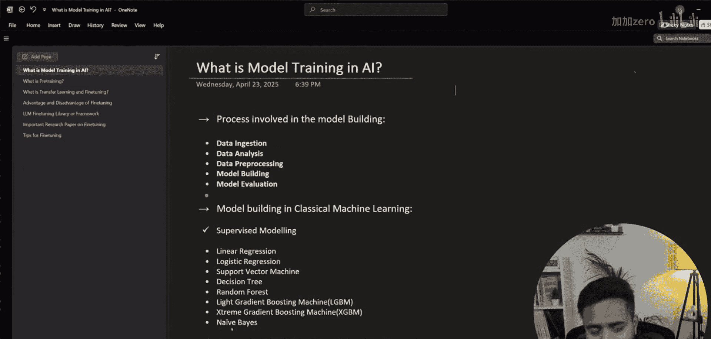
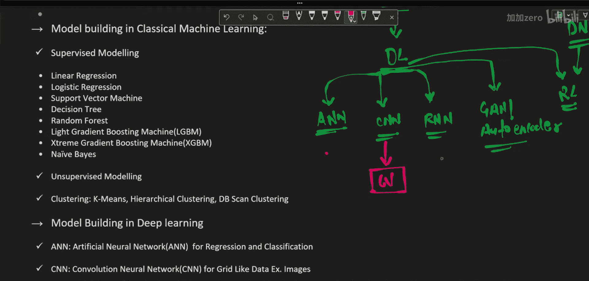

# 生成式AI：从初学者到专家：P83：理解模型预训练与训练

在本节课中，我们将深入探讨大语言模型微调的核心基础概念，特别是模型训练、预训练以及它们之间的关系。理解这些概念是掌握后续微调技术的关键。

上一节我们介绍了微调系列课程的大纲，本节中我们来看看模型训练与预训练的基本原理。

## 模型训练在AI中的位置

首先，我们需要理解“模型训练”在整个人工智能领域中的位置。

以下是人工智能领域的一个高层级划分：

*   **人工智能**：最顶层的概念。
*   **机器学习**：AI的一个子集，使计算机能够从数据中学习。
*   **深度学习**：机器学习的一个分支，使用神经网络架构。
    *   **人工神经网络**：基础的神经网络。
    *   **卷积神经网络**：用于处理图像类数据。
    *   **循环神经网络**：用于处理序列类数据。
    *   **生成对抗网络与自编码器**：用于数据生成，通常基于CNN架构。
    *   **强化学习**：基于奖励机制的学习，使用策略。结合深度神经网络时，称为**深度强化学习**。

## 什么是模型训练？

模型训练是指使用数据来调整模型内部参数（如权重和偏置）的过程，目的是使模型能够学习数据中的模式并做出准确的预测或生成内容。

在深度学习中，这个过程通常涉及定义一个损失函数 `L(θ)`，它衡量模型预测 `ŷ` 与真实标签 `y` 之间的差异。训练的目标是通过优化算法（如梯度下降）找到一组参数 `θ*`，以最小化这个损失函数。

其核心公式可以表示为：
`θ* = argmin_θ L(θ; X, y)`
其中，`X` 是训练数据，`y` 是对应的标签。

## 什么是预训练？

预训练是模型训练的一个特定阶段。它指的是在一个大规模、通用数据集上对模型进行初步训练，使其学习到广泛的基础知识和通用特征。

对于大语言模型，预训练通常采用**自监督学习**的方式。模型通过完成诸如“预测下一个词”的任务，在海量文本数据上学习语言的语法、语义、事实知识和推理能力。这个过程计算成本极高，但产出的模型（称为**基础模型**）具备了强大的通用能力。

## 预训练与微调：迁移学习

预训练模型虽然强大，但可能不直接适用于特定的下游任务（如法律文档分析、医疗问答）。这时就需要**微调**。

微调是**迁移学习**的一种具体技术。迁移学习是指将一个领域（源任务）上学到的知识，应用到另一个相关领域（目标任务）上。

以下是迁移学习的常见类型：

*   **特征提取**：冻结预训练模型的大部分层，仅将其作为特征提取器，然后在顶部训练一个新的分类器。
*   **微调**：不仅训练新添加的层，还会以较小的学习率继续训练预训练模型的部分或全部层，使其适应新任务。

因此，**微调** 位于 **迁移学习** 的范畴之内，是使通用预训练模型适应特定任务的关键步骤。

本节课中我们一起学习了模型训练与预训练的基本概念，并理解了微调如何作为迁移学习的一部分，将通用模型的能力迁移到特定任务上。下一节，我们将探讨为什么微调在Transformer架构中成为可能，而在传统的RNN/LSTM中却面临挑战。