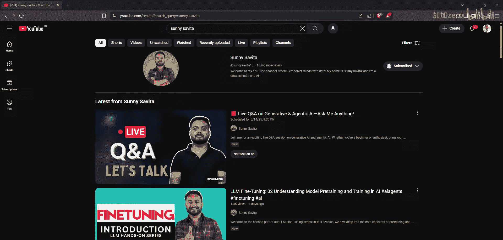
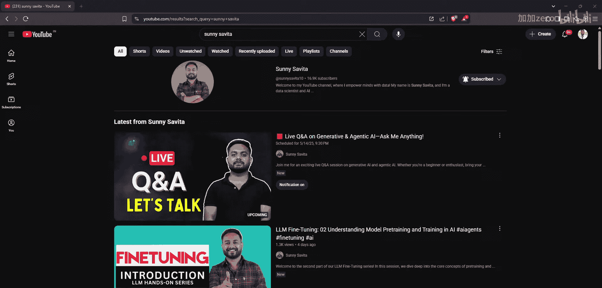
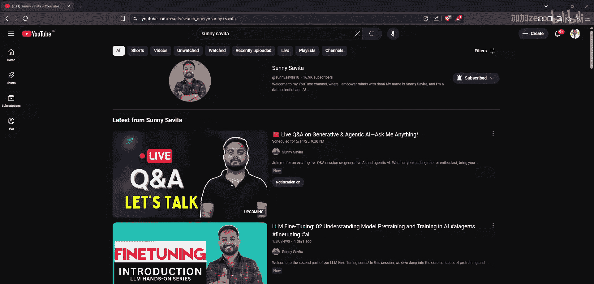
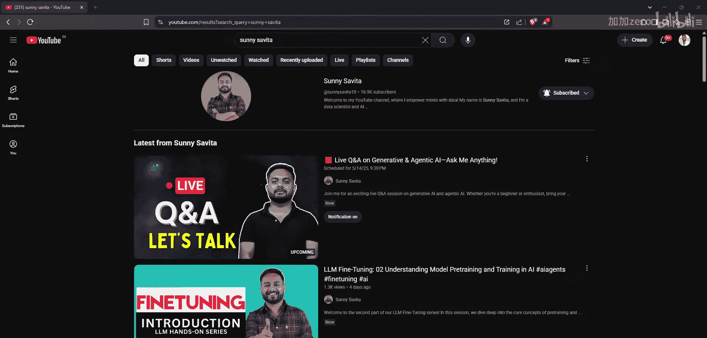

生成式AI：P84：生成式与智能体AI实时问答

大家好，我是Audible。大家能听到我说话吗？晚上好。

我希望大家都能看到我。如果能看到我，请在聊天区快速点赞或发个表情让我知道。

我先说明一下本次议程。我加入这次直播是为了解答大家关于生成式AI和智能体AI的疑问。你们可以询问关于我的YouTube视频、未来计划以及频道上即将涵盖的任何内容。我会在接下来的30分钟里尽力回答所有问题。我计划未来举办更多类似的互动直播，直接与大家交流，解答疑问，甚至尝试在直播中完成一些端到端的项目。如果你们查看我之前的直播，会发现我已经举办过关于面试准备、简历修改以及几个端到端项目讲解的课程。未来我也会继续这样做，以帮助大家解决疑惑，并做更多必要的事情，帮助你们成为生成式AI和智能体工程师。如果大家能看到我，请告诉我。

很好。大家心中有任何问题都可以提问，我会尽力回答。

你们可以在聊天区留言，我会查看并尽力回答每一个问题。

关于Crew AI和AutoGen的播放列表，我很快就会开始制作相关视频。这已经在我的待办清单中。我之所以从微调开始讲起，是想先让大家对LLM和Transformer架构有一个基础的理解。在完成微调系列后，或者同时，我也会着手制作关于Crew AI和AutoGen的视频。

学完生成式AI后，是否可以转向智能体AI？实际上，智能体AI本身就属于生成式AI的范畴。如果你应聘的是生成式AI工程师的职位，你的工作很可能就涉及创建RAG系统或纯粹的智能体系统。生成式AI和智能体AI并非截然不同的领域，你可以将它们视为一枚硬币的两面。无论是作为生成式AI工程师，还是深度学习工程师，只要你的工作涉及基于Transformer的模型，或者像LangChain、AutoGen这样的智能体框架，你本质上就是在从事智能体技术工程。

明白了。关于LLM微调播放列表的计划，我的目标是从最基础的部分开始教起。因此，我先从微调的介绍开始，然后深入探讨与深度学习直接相关的各种基础概念。我不会直接跳到LLM微调。在完成这四到五个基础视频后，我才会转向一些更高级的内容，比如LLM微调本身、不同的微调框架，以及如何进行多模态模型的微调。我们还会学习如何对齐偏好优化，例如DPO技术，这是一种可以在监督式微调之后进行的监督学习方法。所有这些内容都会按照教学大纲中讨论的顺序，在后续视频中逐步覆盖。

大家能听到我说话吗？能听到吗？我的声音和画面都正常吗？好的。

刚才可能有些网络问题导致我断线了，现在应该没问题了。好的，很好。关于微调播放列表，我想我已经提供了足够的信息。

关于如何评估RAG系统，我肯定会创建一个专门的播放列表来讲解评估部分。评估对于任何架构或我们实现的功能（如智能体技术）都至关重要。如果你想评估你的RAG系统，有一些现成的框架可以使用，比如Ragas、TruLens、Arize等。你可以查阅这些框架，了解评估RAG系统所用的具体指标和参数。我们也可以创建自定义的指标来评估RAG系统。是的，我肯定会为RAG评估创建一个单独的播放列表。

关于微调视频的上传时间，我承认目前的更新频率不高。以前我每周能上传三到四个视频，但现在每周只上传一个。这一点我接受批评。但请大家放心，我会努力增加更新频率，目标是每周至少上传三到四个视频，包括微调相关的视频。

关于如何创建一个大型智能体，是的，我有一个相关项目，正如我之前提到的。