# 2：统计学习导论 - 监督学习与无监督学习 📊

在本节课中，我们将学习统计学习的基本概念，特别是监督学习和无监督学习的定义、目标与区别。我们会通过简单的例子和核心公式来帮助你理解这些基础但至关重要的思想。

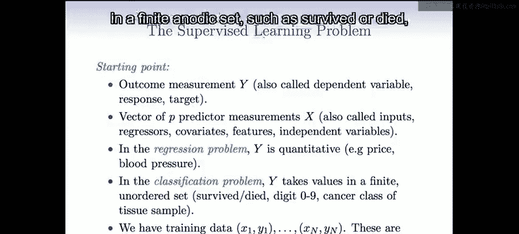

---

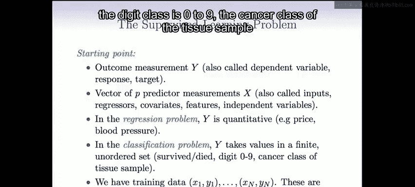

## 概述

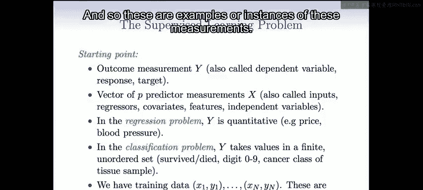

统计学习是数据科学的核心组成部分。本节课将首先介绍监督学习问题的基本框架和术语，然后对比介绍无监督学习。我们将通过一个著名的案例（Netflix竞赛）来展示这些概念的实际应用，最后探讨统计学习与机器学习的关系。

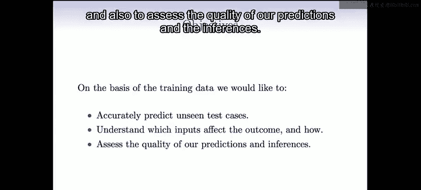

---

## 监督学习问题与符号表示 🎯

现在我们来讨论监督学习问题，并建立一些基本符号。

我们有一个结果测量值 **Y**，它有许多不同的名称：**因变量**、**响应变量**或**目标变量**。同时，我们有一个包含 **P** 个预测变量的测量向量，通常记为 **x**。这些预测变量被称为**输入**、**回归量**、**协变量**、**特征**或**自变量**。

我们区分两种情况：
1.  **回归问题**：此时 **Y** 是**定量**的，例如价格或血压。
2.  **分类问题**：此时 **Y** 取值于一个有限的、无序的集合，例如“存活”或“死亡”、数字0到9、组织样本的癌症类别。

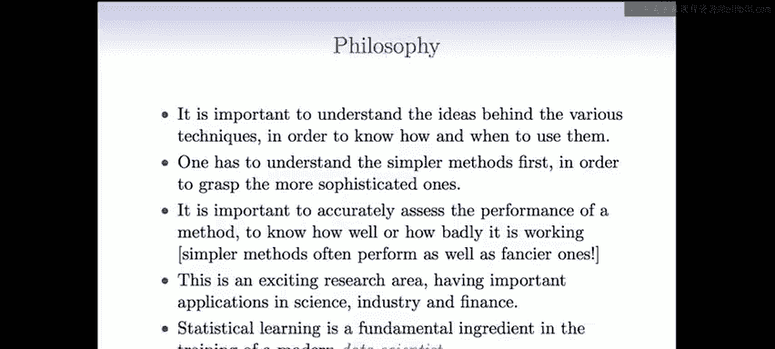

我们拥有训练数据对：**(x1, Y1), (x2, Y2), ..., (xN, YN)**。其中，**xi** 是一个包含 P 个测量值的向量，**Yi** 通常是单个响应变量。这些数据对就是这些测量的**样本**或**实例**。

监督学习的目标如下：
*   基于训练数据，我们希望能够**准确预测**未见过的测试案例。
*   **理解**哪些输入会影响结果，以及如何影响。
*   **评估**我们预测和推断的质量。

---

## 学习哲学与简单方法的重要性 💡

在学习本课程时，我们的目标不仅仅是给你一份方法的清单，更希望你能理解各种技术背后的思想。这样你才能知道在何时、何处使用它们。因为在你的工作中，你将会遇到前所未见的问题，你需要能够判断哪些方法可能有效，哪些可能无效。

此外，**预测准确性**并非唯一重要的事情。首先尝试简单的方法以掌握更复杂的方法，这一点非常重要。我们会在**线性模型**、**线性回归**和**线性逻辑回归**上花费相当多的时间。这些是简单的方法，但非常有效。

同样重要的是理解一个方法的性能。如今，应用一个算法很容易，你只需运行软件。但弄清楚方法实际运行得如何，既困难又非常重要。这样你才能告诉你的老板或合作者，当你应用这个方法时，预计明天会表现得多好。在某些情况下，如果表现不够好，你可能需要改进算法或收集更好的数据。

我们希望在本课程中，通过例子传达的另一点是，这是一个非常令人兴奋的研究领域。统计学习与机器学习正变得越来越重要。令人兴奋的是，这个领域远未固化，虽然已有许多好方法，但仍存在大量尚未解决的挑战性问题，尤其是在近年来，随着**大数据**的出现和**数据科学**这一术语的兴起。正如Trevor提到的，统计学习是这个新数据科学领域的基本组成部分。

---

## 监督学习与无监督学习的比喻 🧒

你可能会好奇“监督学习”和“无监督学习”这些术语从何而来。这实际上是一个非常巧妙的术语。

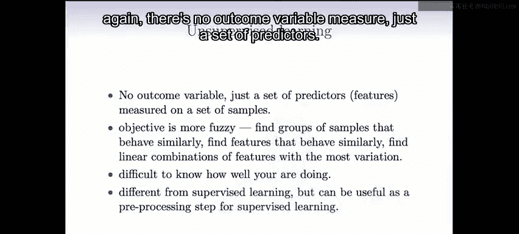

**监督学习**可以想象成幼儿园老师教孩子区分房子和自行车。老师会给孩子（比如Johnny）看一些房子的例子（比如用乐高积木搭的）和一些自行车的例子，并告诉他“这是房子，这是自行车”。孩子通过观察这些**带有标签的训练样本**来学习区分。这就是“监督”学习，因为孩子是在老师的监督和指导下，基于特征 **X** 和给定的标签 **Y** 进行学习的。

**无监督学习**则是另一种情况。假设Trevor在幼儿园，但这次没有人给他看房子和自行车的例子。他只是在地上看到很多东西，可能有一些房子、一些自行车和其他物品。这些数据是**没有标签**的，没有 **Y**。现在的问题是，孩子需要在没有监督的情况下，自己尝试在脑海中组织他所看到的共同模式。他可能会看着物体说：“这三个东西可能是一类（他可能不知道叫‘房子’），因为它们有共同的特征；那些其他物体是另一类。” 这就引出了根据特征的相似性对观测进行**分组**的思想，这将是本课程中**无监督学习**的一个主要话题。

更正式地说，无监督学习中没有结果变量 **Y**，只有一组预测变量 **X**。其目标更加模糊，不是预测 **Y**（因为没有 **Y**），而是**了解数据是如何组织的**，并**发现哪些特征对数据的组织是重要的**。我们将讨论**聚类**和**主成分分析**，这些是无监督学习的重要技术。

无监督学习的挑战之一是很难知道你做得好不好，因为没有黄金标准，没有 **Y**。当你完成聚类分析后，你并不真正知道效果如何。尽管如此，它仍然是一个极其重要的领域。原因之一是，无监督学习的思想是监督学习的重要**预处理步骤**。通常，基于 **X** 本身来组织你的特征、选择特征，然后将这些处理过或选择过的特征作为监督学习的输入，是非常有用的。

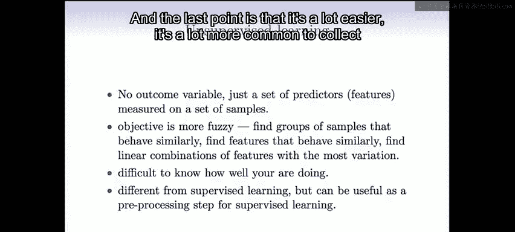

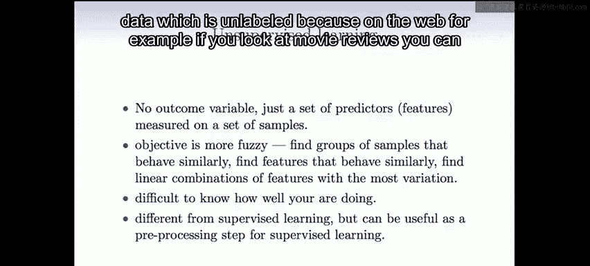

最后一点是，收集**未标记**的数据要容易得多，也常见得多。例如在网络上，计算机算法可以扫描网页并抓取影评，但要判断一篇影评是正面还是负面，通常需要人工干预。因此，标记数据的成本更高、更困难，而收集无监督的未标记数据则容易得多。

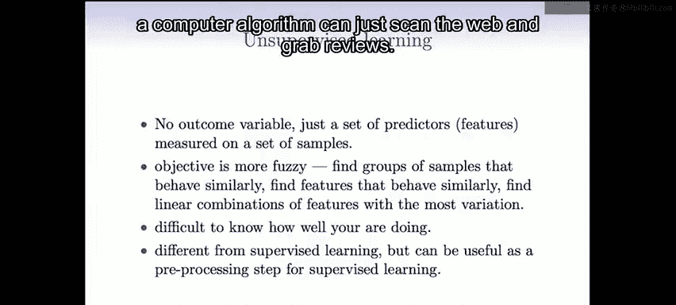

---

## 案例研究：Netflix 竞赛 🎬

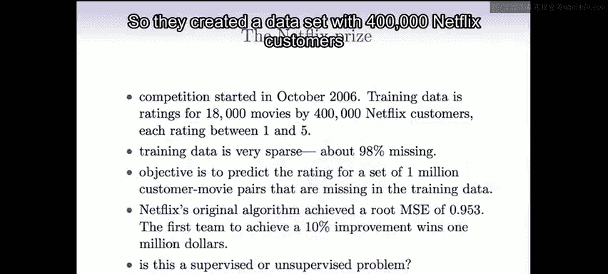

我们要展示的最后一个例子是一个精彩的案例：**Netflix竞赛**。Netflix是美国的一家电影租赁公司。他们设立了一项竞赛，旨在改进他们的推荐系统。

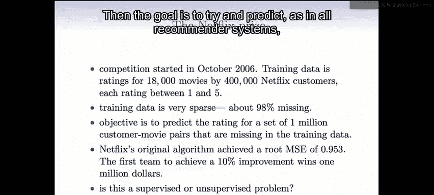

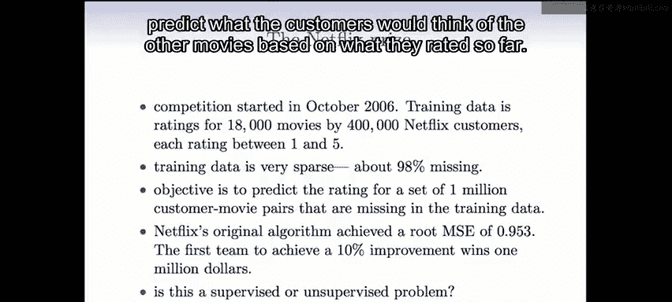

他们创建了一个数据集，包含40万Netflix用户和1.8万部电影。平均每个用户大约评价了200部电影。这意味着每个用户只看过（或评价过）大约1%的电影。

你可以把这想象成一个非常大的矩阵，其中稀疏地填充着1到5分的评分。目标就像所有推荐系统一样，试图根据用户迄今为止的评分，预测他们对其他电影的评价。

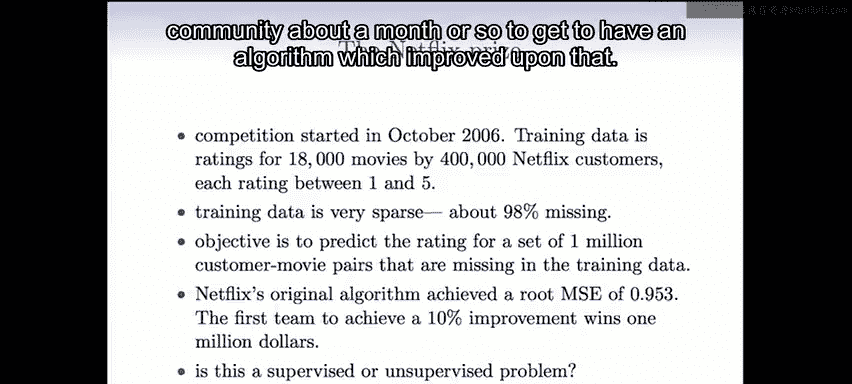

Netflix设立了一项竞赛，为第一个能将他们评分系统改进10%（按某种度量）的团队提供100万美元的奖金。竞赛的设计非常巧妙。原始算法的**均方根误差**大约是0.953（评分范围为1到5）。竞赛开始后，社区大约花了一个月时间就提出了改进该算法的方案。

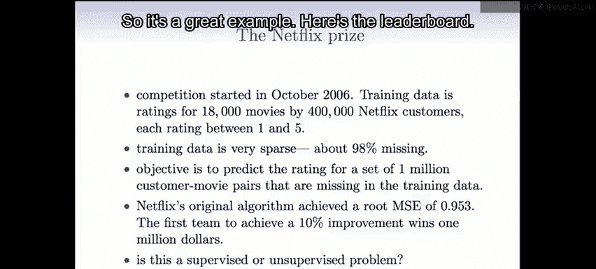

但随后，社区又花了大约三年时间才有人真正赢得比赛。这是一个极好的例子。最终，一个名为“BellKor‘s Pragmatic Chaos”的团队赢得了比赛，但一个名为“Ensemble”的团队以非常接近的成绩获得第二名（事实上，他们的分数在小数点后四位都相同），最终获胜者是由谁先提交最终预测结果决定的。

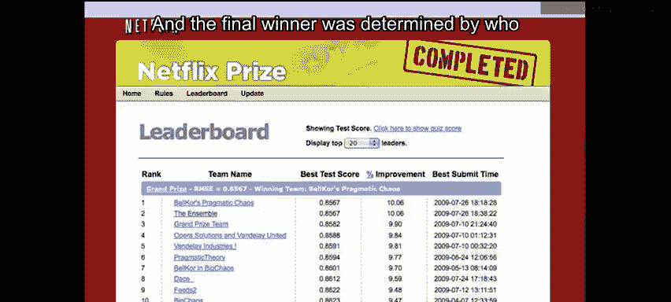

这是一场精彩的竞赛，但尤其精彩的是它催生了大量的研究。在三年期间，全球有成千上万的团队参加了这项竞赛，并在此过程中发明了许多新技术。许多获胜技术最终使用了**存在缺失数据情况下的主成分分析**的一种形式。

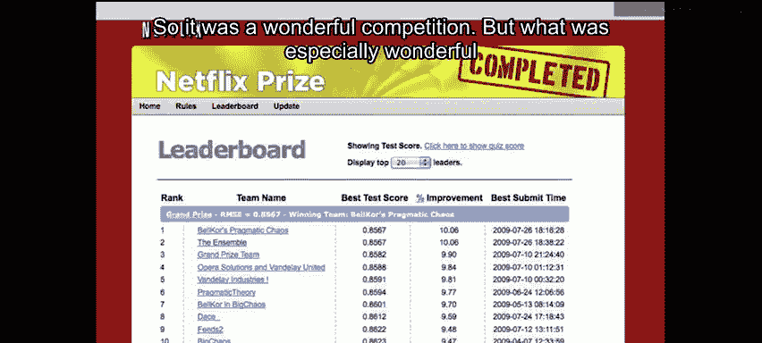

（关于我们为什么没有在获胜名单上：我们实际上在竞赛开始时与一名研究生尝试过，花了三四个月试图赢得比赛。但问题之一是数据太大，而我们的计算机速度不够快，尝试各种想法耗时太长。我们意识到这名研究生可能不会成功，可能会浪费他三年的研究生生涯，这对他的职业生涯不利。因此，我们很早就放弃了。）

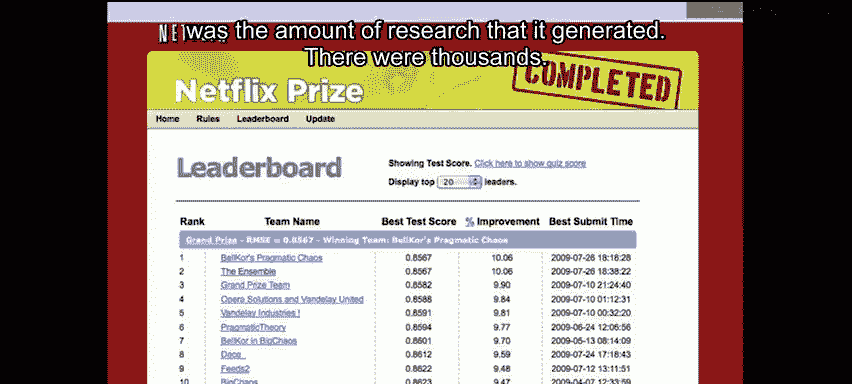

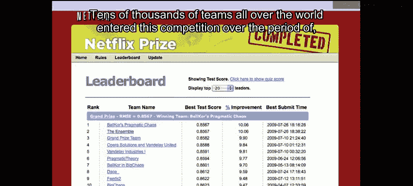

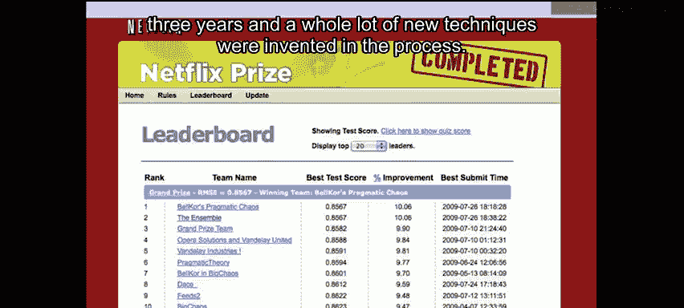

---

## 统计学习与机器学习的关系 🤝

我在开始时提到了**机器学习**领域，它实际上催生了我们在这门课程中讨论的**统计学习**领域。机器学习本身是**人工智能**的一个子领域，特别是在80年代神经网络兴起之后。因此，很自然地会想知道统计学习和机器学习之间的关系。

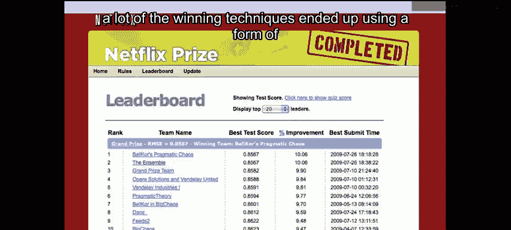

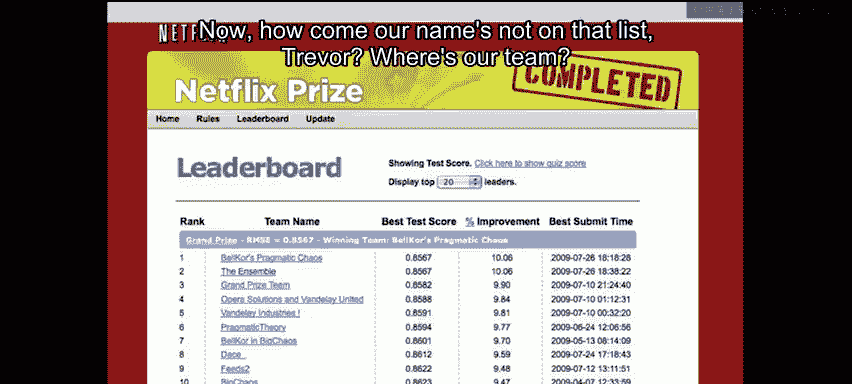

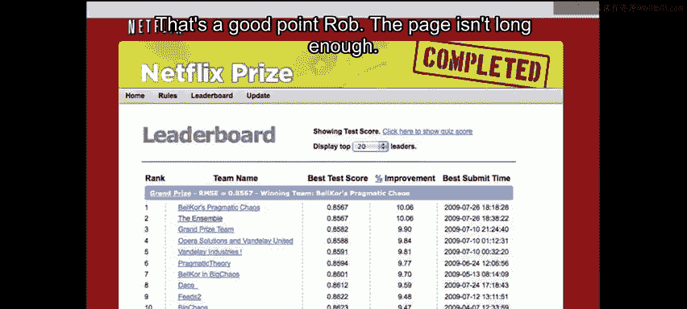

首先，这个问题很难回答。两者有很多重叠之处。机器学习倾向于处理更大规模的问题，尽管随着计算机速度越来越快、价格越来越便宜，这个差距正在缩小。

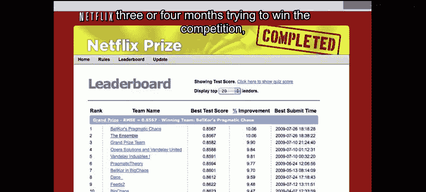

机器学习更关注**纯粹的预测**以及预测的效果。统计学习也关心预测，但同时关注**模型**，试图提出科学家和其他人可以解释的模型和方法。此外，在评估方法性能时，我们更关心**精确度和不确定性**。

但同样，这些区别越来越模糊，两种方法之间有很多交叉融合。显然，机器学习在市场营销方面占优势，他们往往能获得更大的资助，他们的会议地点也更好。但我们正试图通过这门课程来改变这一点。

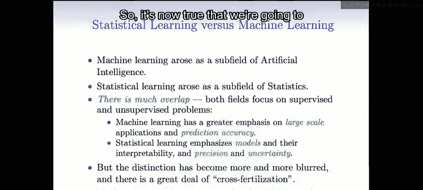

---

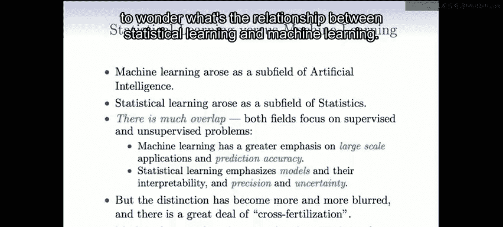

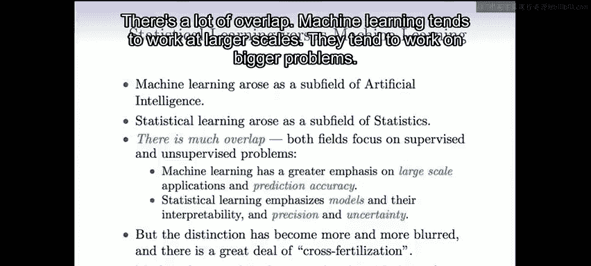

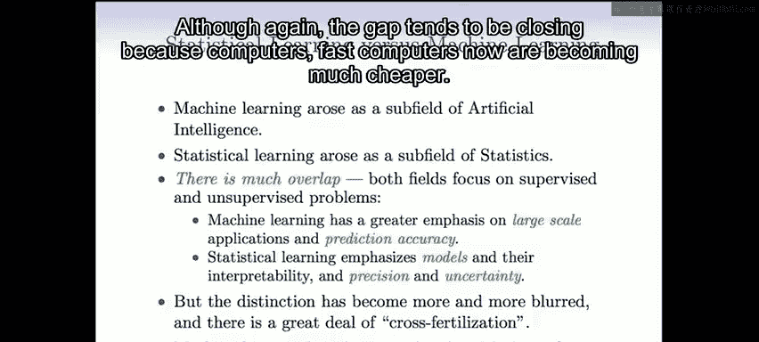

## 教材与资源 📚

这是我们的课程教材：《统计学习导论》。我们非常兴奋，这是一本由我们的两位过去的研究生Gareth James和Daniela Witten，以及Robert和我共同撰写的新书，于2013年8月刚刚出版。本课程将完整涵盖这本书的内容。

这本书的每一章末尾都有使用 **R 计算语言**运行的示例，我们也会安排R语言的课程。因此，当你学习这门课程时，你也会学习使用R。R是一个很棒的环境，它是免费的，是进行数据分析的绝佳方式。

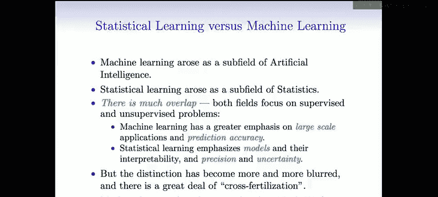

你还会看到第二本书：《统计学习基础》，这是一本更高级的教材，已经存在一段时间了。它将作为本课程的参考书，供那些希望更详细了解某些技术的人使用。

最棒的是，不仅这门课程是免费的，这些书也是免费的。《统计学习基础》一直是免费的，PDF版本可以在我们的网站上找到。而这本新书也将在1月份课程开始时免费提供（这是与出版商达成的协议）。当然，如果你想购买这本书也可以，拥有纸质版很不错，但如果你需要，PDF版本也是可用的。

---

## 总结

本节课中，我们一起学习了统计学习的核心基础。我们明确了**监督学习**（有标签数据，用于预测和解释）与**无监督学习**（无标签数据，用于发现数据结构）的定义与目标。我们通过Netflix竞赛的实例看到了这些概念的实际应用与挑战。最后，我们探讨了统计学习与机器学习之间既有重叠又各有侧重的密切关系。理解这些基本思想，是后续深入学习各种具体方法的关键。希望你能享受接下来的课程。