# 12：线性模型的扩展（交互作用与非线性） 📊

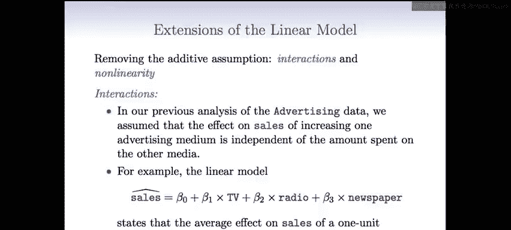

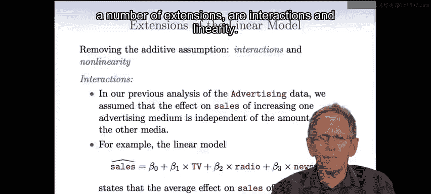

在本节课中，我们将学习线性回归模型的两种重要扩展：交互作用项和非线性关系。我们将探讨如何在模型中纳入这些扩展，以更准确地捕捉预测变量与响应变量之间的复杂关系。

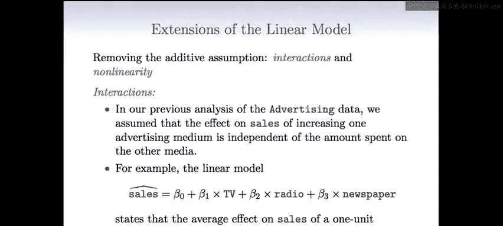

---

## 交互作用简介 🤝

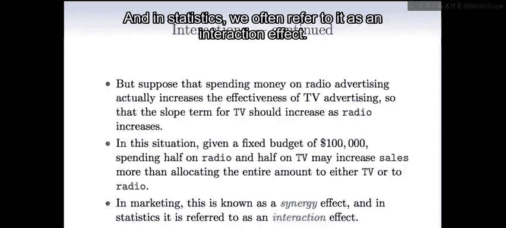

上一节我们介绍了多元线性回归模型。本节中我们来看看如何扩展模型以包含预测变量之间的交互作用。

交互作用是指一个预测变量对响应变量的影响，取决于另一个预测变量的水平。在市场营销中，这通常被称为协同效应。

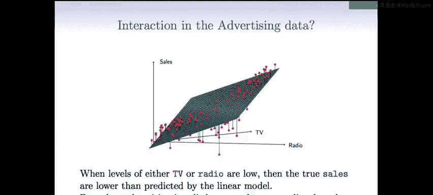

### 如何纳入交互作用

以下是处理交互作用并将其纳入模型的方法。

我们通过在模型中添加乘积项来实现。例如，考虑一个包含电视广告（TV）和广播广告（Radio）的模型：
```r
sales = β0 + β1*TV + β2*Radio + β3*(TV*Radio) + ε
```
我们直接将两个变量相乘，创建一个新变量，并为其分配一个系数β3。

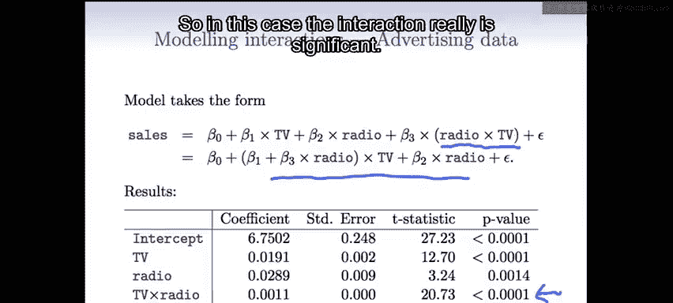

这个模型可以重新整理，以展示交互作用的效果：
```r
sales = β0 + (β1 + β3*Radio)*TV + β2*Radio + ε
```
这种写法表明，电视广告的系数（原为β1）现在会随着广播广告投入的变化而变化，变化量为β3乘以Radio的值。这是一种解释交互作用效果的直观方式。

### 交互作用的解释与重要性

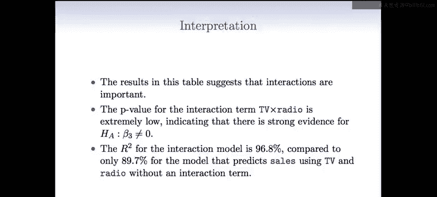

从模型摘要中，我们可以看到交互作用项非常显著（P值极低），这为备择假设（β3不为0）提供了强有力的证据。

此外，包含交互作用的模型的R²从89.7%跃升至96.8%。这意味着加法模型中未解释的销售变异性有69%被交互作用项所解释。

根据系数估计，我们可以进行具体解释：
*   电视广告增加1000美元所带来的销售增长为：`19 + 1.1 * Radio`（单位：千美元）。
*   广播广告增加1000美元所带来的销售增长为：`29 + 1.1 * TV`（单位：千美元）。

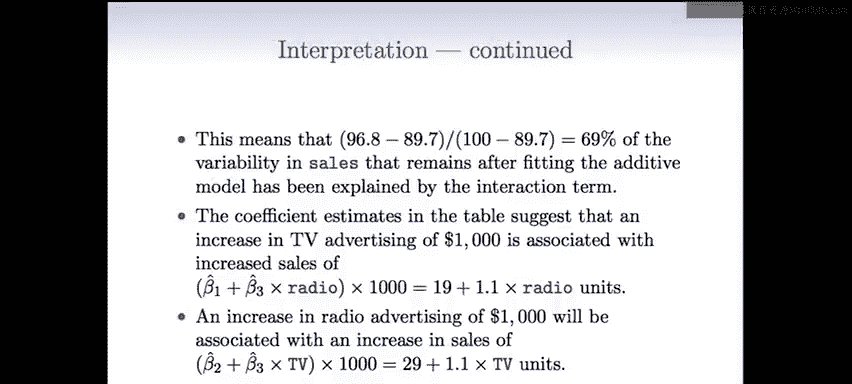

### 层次原则

有时会出现交互作用项非常显著，但与之相关的主效应（如TV和Radio）却不显著的情况。


在这种情况下，我们通常遵循**层次原则**：如果模型中包含了交互作用项，那么即使主效应的P值不显著，也应将其保留在模型中。


这样做的原因是，在没有主效应的情况下，交互作用的含义难以解释，模型也会变得更为繁琐。

---

## 定性变量与定量变量的交互作用 🧑‍🎓📈

现在，我们来看看如何在模型中纳入定性变量和定量变量之间的交互作用。这种情况下的解释实际上更为简单。

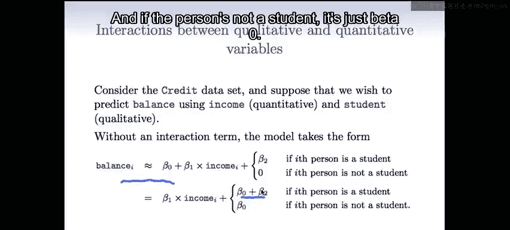

让我们再次使用信用卡数据集，假设我们想用收入（定量变量）和学生身份（定性变量）来预测余额。


### 无交互作用的模型

在没有交互作用的情况下，模型形式如下：
```r
balance ≈ β0 + β1*income + β2*student
```
其中，`student`是一个虚拟变量（学生为1，非学生为0）。这个模型可以理解为：对于学生和非学生群体，收入对余额的影响（斜率β1）是相同的，但截距不同（学生为β0+β2，非学生为β0）。

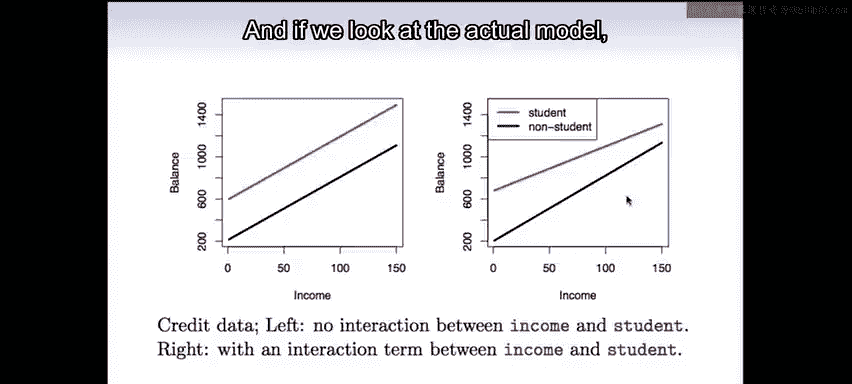

### 包含交互作用的模型

当我们纳入交互作用时，模型变为：
```r
balance ≈ β0 + β1*income + β2*student + β3*(income*student)
```
这个模型可以重新整理，以清晰地展示其含义：
```r
对于非学生： balance ≈ β0 + β1*income
对于学生： balance ≈ (β0 + β2) + (β1 + β3)*income
```
这意味着，包含交互作用后，学生和非学生群体不仅拥有不同的截距（β2），还拥有不同的收入斜率（β3）。与纯定量变量的交互作用相比，这种涉及分类变量的交互作用解释起来更加直观明了。


---

## 非线性关系的建模 🔄

线性模型的另一个重要扩展是纳入非线性效应。并非所有关系都是线性的。

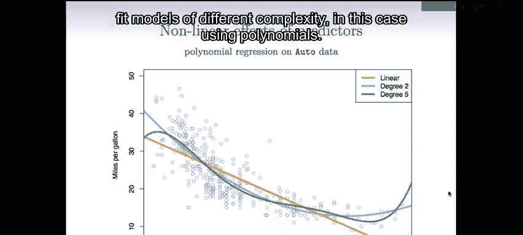

例如，在汽车数据集中，每加仑英里数（mpg）与马力（horsepower）的关系图显示存在明显的曲线模式。单纯的线性回归（橙色曲线）无法很好地捕捉这种结构。

### 使用多项式扩展

为了改进模型，我们可以拟合多项式模型。这是一种非常简便的方法，就像我们为分类变量创建虚拟变量一样，我们可以创建额外的变量来容纳多项式。

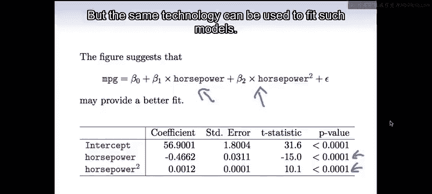

例如，要拟合一个二次（平方）模型，我们只需创建一个新变量`horsepower²`，然后将其纳入线性模型：
```r
mpg ≈ β0 + β1*horsepower + β2*horsepower²
```
模型摘要显示，`horsepower`和`horsepower²`的系数都非常显著，这表明二次项显著改善了拟合效果。我们还可以继续添加立方项等，以拟合更高阶的多项式（例如之前提到的5次多项式）。

我们仍然称之为**线性模型**，因为它在**系数**上是线性的，尽管作为变量的函数，它已经变成了非线性。相同的线性回归技术可以用来拟合此类模型，这极大地扩展了线性回归的应用范围。

---


## 总结与展望 🎯

本节课中我们一起学习了线性回归模型的两种关键扩展。

首先，我们探讨了**交互作用**，它允许一个预测变量的效应依赖于另一个预测变量的值，并通过在模型中添加乘积项来实现。我们还介绍了在包含交互作用时遵循的**层次原则**。

其次，我们学习了如何通过添加**多项式项**（如平方项、立方项）来建模**非线性关系**。这使我们能够用线性模型的技术来拟合更复杂的曲线模式。

本课程未涵盖线性回归的其他重要主题，如异常值处理、误差项的非恒定方差、高杠杆点以及共线性问题。这些内容在教材中有详细论述。

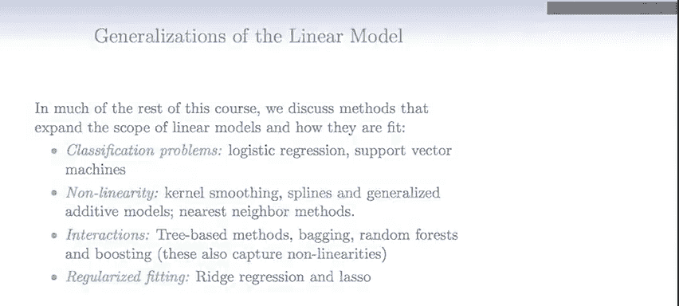

线性模型是一个强大的框架，我们将在后续课程中看到它的众多推广。接下来，我们将讨论用于分类问题的逻辑回归和支持向量机，它们本质上也是线性模型的扩展。我们还将介绍更灵活的非线性建模技术，如核平滑、样条和广义加性模型。此外，我们将系统性地学习捕捉交互作用和非线性的树类方法（如装袋法、随机森林和提升法），以及用于控制模型复杂度的正则化拟合方法（如岭回归和LASSO）。这些内容共同构成了现代统计学习的核心工具集。