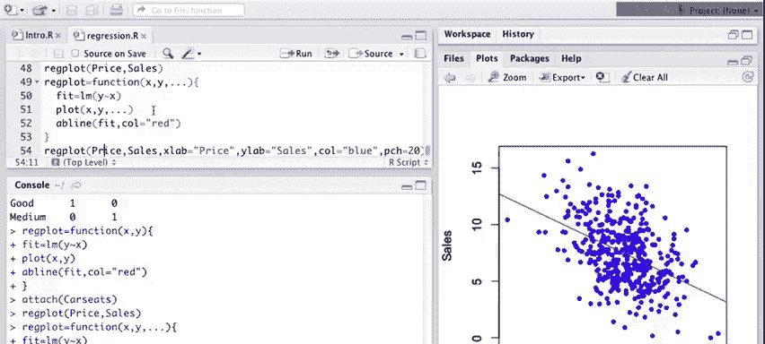

# 13：R语言线性回归建模实战 🧑‍💻

在本课程中，我们将学习如何在R语言中实现线性回归模型的拟合、诊断与可视化。我们将从简单的单变量回归开始，逐步过渡到包含多个预测变量、交互项和非线性项的复杂模型，并学习如何编写自定义函数来封装分析流程。

---

## 概述：R语言中的线性回归

上一节我们介绍了线性回归的理论基础，本节中我们来看看如何在R语言中实际操作。我们将使用`MASS`和`ISLR`包中的数据集，通过一系列代码示例，演示从数据探索、模型拟合、结果解读到图形展示的完整流程。

---

## 加载数据与简单线性回归

首先，我们需要加载必要的R包和数据。

```r
library(MASS)
library(ISLR)
```

我们使用`Boston`数据集，它包含了波士顿地区房屋价值及相关社会经济指标。

```r
names(Boston)
?Boston
```

`Boston`是一个数据框，包含506个观测值和14个变量。例如：
*   `medv`：业主自住房屋的中位数价值（单位：10万美元）。
*   `lstat`：较低社会地位人口的百分比。

我们先绘制`medv`（响应变量）与`lstat`（预测变量）的散点图。

```r
plot(medv ~ lstat, data = Boston)
```

图中显示，随着`lstat`增加，`medv`呈下降趋势。

现在，我们使用`lm()`函数拟合一个简单的线性回归模型。

```r
fit1 <- lm(medv ~ lstat, data = Boston)
fit1
summary(fit1)
```

`summary()`函数提供了详细的输出，包括：
*   系数估计值及其标准误。
*   t统计量和p值，用于检验系数的显著性。
*   模型拟合的R平方值。

`lstat`的系数为负且高度显著，这与散点图观察到的负相关关系一致。

我们可以使用`abline()`函数将拟合的回归线添加到散点图上。

```r
plot(medv ~ lstat, data = Boston)
abline(fit1, col="red")
```

---

## 模型诊断与预测

线性模型对象包含许多组件。`confint()`函数可以计算模型系数的置信区间。

```r
confint(fit1)
```

`predict()`函数用于基于拟合模型进行预测。我们可以为新数据点生成预测值及其置信区间。

```r
predict(fit1, data.frame(lstat=c(5,10,15)), interval="confidence")
```

以上是简单线性回归的基本操作。接下来，我们看看多元线性回归。

---

## 多元线性回归

在多元回归中，我们在公式右侧使用`+`号添加多个预测变量。

```r
fit2 <- lm(medv ~ lstat + age, data=Boston)
summary(fit2)
```

现在模型包含`lstat`和`age`两个预测变量。`summary`输出显示两者均显著，但`lstat`的显著性更强。

我们也可以使用`.`符号来包含数据框中除响应变量外的所有其他变量作为预测变量。

```r
fit3 <- lm(medv ~ ., data=Boston)
summary(fit3)
```

这个模型包含了许多预测变量。值得注意的是，之前在`fit2`中显著的`age`变量，在包含所有变量的`fit3`中变得不显著了。这表明其他变量与`age`高度相关，在它们的共同作用下，`age`的独立贡献不再显著。

`plot()`函数可以直接应用于线性模型对象，生成一系列诊断图。

```r
par(mfrow=c(2,2))
plot(fit3)
```

诊断图可以帮助我们评估模型的假设，例如：
*   残差与拟合值图：用于检测非线性模式。
*   尺度-位置图：用于检查方差齐性。
*   正态Q-Q图：用于检查残差的正态性。

`update()`函数提供了一种便捷的方式来修改现有模型。

```r
fit4 <- update(fit3, ~. -age -indus)
summary(fit4)
```

这行代码拟合了一个新模型，它在`fit3`的基础上移除了`age`和`indus`两个变量。

---

## 非线性与交互作用

线性模型也能处理预测变量间的交互作用和非线性关系。

在公式中，`*`表示包含交互项的主效应模型。

```r
fit5 <- lm(medv ~ lstat*age, data=Boston)
summary(fit5)
```

输出中，`lstat:age`项代表交互作用。结果显示交互作用显著。

为了拟合非线性关系，我们可以直接在公式中加入变量的多项式项。需要使用`I()`函数来保护算术运算符。

```r
fit6 <- lm(medv ~ lstat + I(lstat^2), data=Boston)
summary(fit6)
```

线性项和二次项都非常显著。我们可以将非线性拟合曲线添加到散点图中。

```r
attach(Boston)
plot(lstat, medv)
# 按lstat排序后，绘制拟合值以形成平滑曲线
points(lstat, fitted(fit6), col="red", pch=20)
```

`poly()`函数提供了另一种拟合多项式的简洁方法。

```r
fit7 <- lm(medv ~ poly(lstat, 4), data=Boston)
points(lstat, fitted(fit7), col="blue", pch=20)
```

四阶多项式的拟合曲线开始显现出过度拟合的迹象，特别是在数据分布的尾部。

---

## 分类预测变量

线性回归同样可以处理分类（定性）预测变量。我们使用`Carseats`数据集进行演示。

```r
names(Carseats)
summary(Carseats)
fix(Carseats) # 以表格形式查看数据
```

`summary`对于分类变量（如`ShelveLoc`）会显示其不同水平的频数。

拟合包含分类变量的模型与之前类似。R会自动将分类变量转换为虚拟变量。

```r
fit8 <- lm(Sales ~ . + Income:Advertising + Age:Price, data=Carseats)
summary(fit8)
```

`contrasts()`函数可以查看R是如何为分类变量创建虚拟变量的。

```r
contrasts(Carseats$ShelveLoc)
```

对于三水平的因子`ShelveLoc`，R会创建两个虚拟变量，分别对应`Good`和`Medium`水平，`Bad`水平作为参照组。

---

## 编写自定义R函数

最后，我们学习如何编写简单的R函数来封装和自动化分析步骤。

以下是一个基础函数，用于拟合回归模型并绘制图形。

```r
regplot <- function(x, y){
  fit <- lm(y ~ x)
  plot(x, y)
  abline(fit, col="red")
}
```

测试这个函数：

```r
attach(Carseats)
regplot(Price, Sales)
```

我们可以改进这个函数，通过`...`参数传递额外的图形参数。

```r
regplot <- function(x, y, ...){
  fit <- lm(y ~ x)
  plot(x, y, ...)
  abline(fit, col="red")
}
```

现在调用函数时，可以自定义图形标签和颜色。

```r
regplot(Price, Sales, xlab="Price", ylab="Sales", col="blue", pch=20)
```

---



## 总结

本节课中我们一起学习了在R语言中进行线性回归建模的完整流程。我们从加载数据、拟合简单和多元线性回归模型开始，学习了如何解读`summary`输出、绘制诊断图以及进行预测。接着，我们探索了如何在模型中纳入交互项和非线性项（多项式），并处理了分类预测变量。最后，我们通过编写自定义函数，将拟合和绘图步骤封装起来，提高了代码的复用性。


R语言的线性建模功能非常强大，本节只是入门。鼓励大家亲自动手练习，查阅帮助文件（`?lm`, `?formula`），并尝试分析不同的数据集，以加深理解。