# 22：使用R进行逻辑回归分类 📊

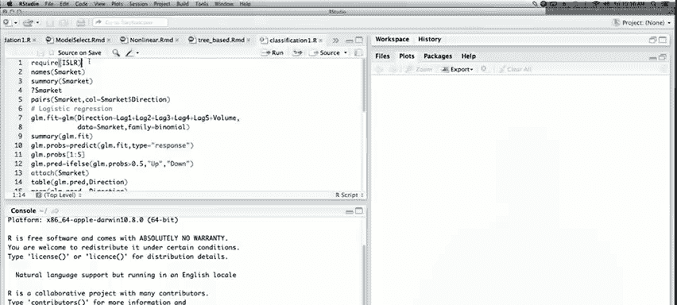

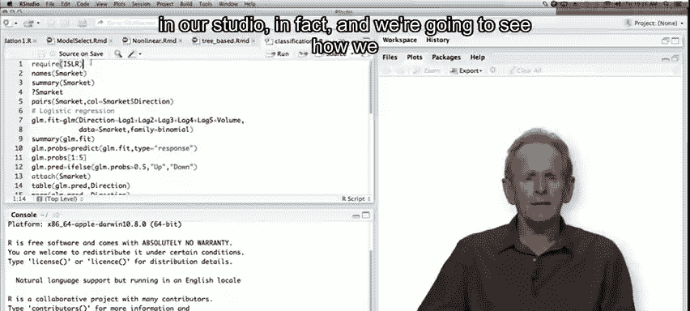

在本节课中，我们将学习如何在R语言中使用`glm`函数拟合逻辑回归模型。我们将使用`ISLR`包中的`Smarket`数据集，通过一个预测股市涨跌方向的实例，演示数据加载、模型拟合、预测和评估的全过程。

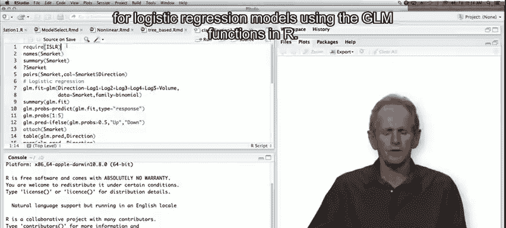

---

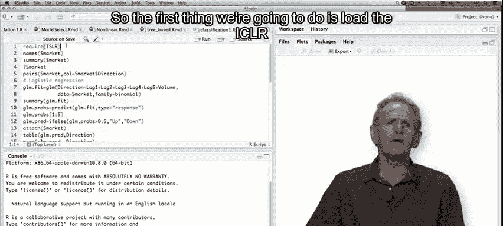

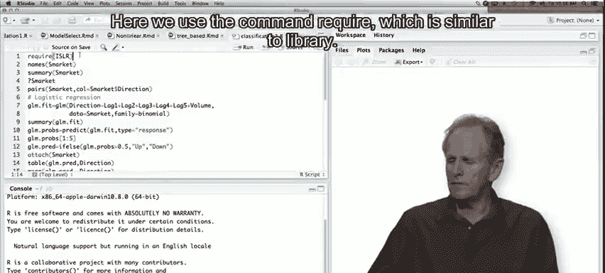

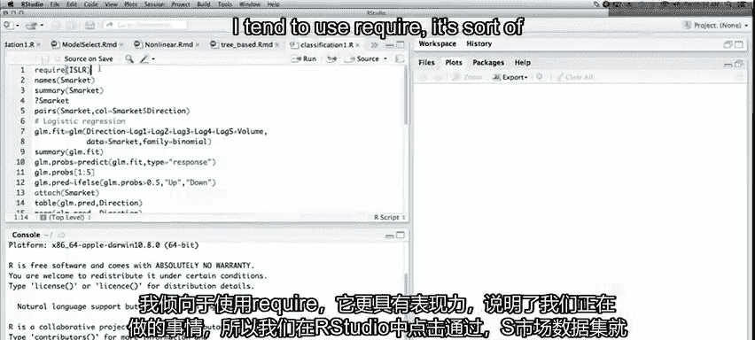

## 数据加载与探索 🔍

首先，我们需要加载包含所需数据集的`ISLR`包。我们使用`require`命令，其功能与`library`类似。

```r
require(ISLR)
```

加载完成后，`Smarket`数据集便可供使用。我们可以使用`names`函数查看数据框中的变量名，并使用`summary`函数获取每个变量的简要统计信息。

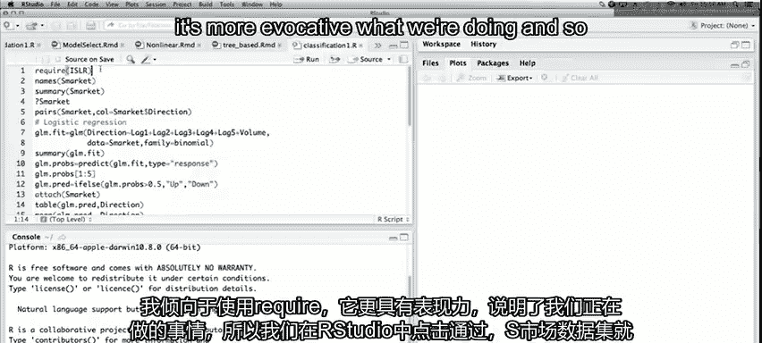

```r
names(Smarket)
summary(Smarket)
```

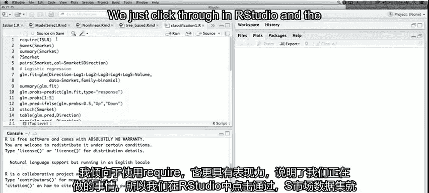

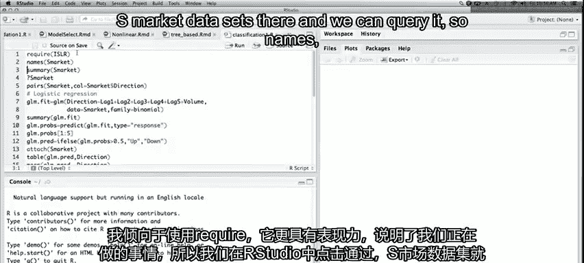

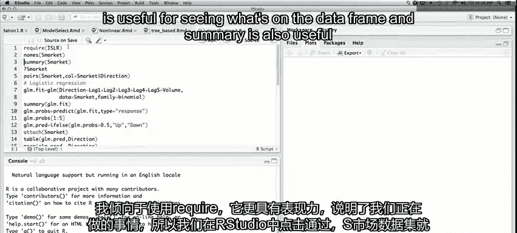

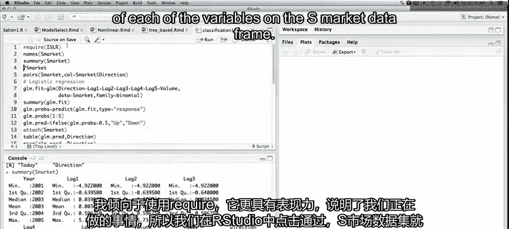

`Smarket`数据集中包含多个滞后变量（`Lag1`至`Lag5`）、交易量（`Volume`）、当日价格（`Today`）以及我们将用作响应变量的方向（`Direction`），它表示市场相较于前一日是上涨（Up）还是下跌（Down）。

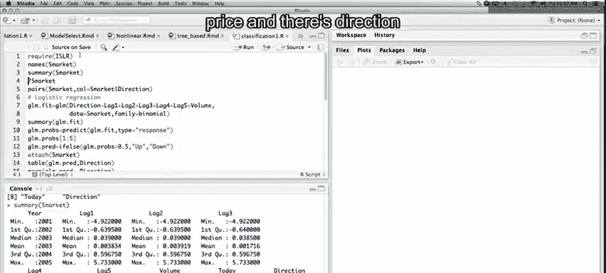

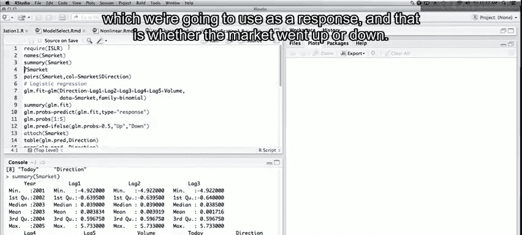

---

## 数据可视化 📈

为了直观了解数据，我们可以使用`pairs`函数绘制散点图矩阵。通过将二元响应变量`Direction`作为颜色指示，我们可以观察不同类别在图形中的分布。

```r
pairs(Smarket, col=Smarket$Direction)
```

从图中可以看出，除了`Direction`变量本身由`Today`变量衍生而来并形成明显分界外，其他变量之间似乎没有很强的相关性。这在股市数据中是常见的，因为如果市场很容易预测，人们早就从中获利了。

---

## 拟合逻辑回归模型 ⚙️

上一节我们探索了数据，本节中我们来看看如何拟合模型。我们使用`glm`函数来拟合一个逻辑回归模型。响应变量是`Direction`，预测变量我们使用五个滞后变量（`Lag1`至`Lag5`）以及`Volume`。通过设置`family = binomial`，我们指定拟合逻辑回归模型。

```r
glm.fit <- glm(Direction ~ Lag1 + Lag2 + Lag3 + Lag4 + Lag5 + Volume, data = Smarket, family = binomial)
summary(glm.fit)
```

模型摘要会显示每个系数的估计值、标准误、z值和p值。在这个例子中，似乎没有一个系数是显著的。这并不意外，摘要还给出了零偏差（仅包含截距的模型）和残差偏差（包含所有预测变量的模型），两者差异很小。

---

## 模型预测与评估 📊

模型拟合后，我们可以对训练数据进行预测。使用`predict`函数并设置`type = "response"`，可以得到预测的概率值。

```r
glm.probs <- predict(glm.fit, type = "response")
glm.probs[1:5]
```

这些概率值大多接近50%，表明模型预测能力不强。接下来，我们通过设定0.5为阈值，将概率转换为具体的类别预测（“Up”或“Down”）。

```r
glm.pred <- ifelse(glm.probs > 0.5, "Up", "Down")
```

为了评估模型在训练集上的表现，我们创建一个混淆矩阵并计算正确分类的比例。

```r
attach(Smarket)
table(glm.pred, Direction)
mean(glm.pred == Direction)
```

在训练数据上，我们得到了约52%的正确率，略高于随机猜测。但这可能存在过拟合。

---

## 划分训练集与测试集 🧱

为了更客观地评估模型，我们需要将数据划分为训练集和测试集。我们以2005年为界，将2005年之前的数据作为训练集，2005年及之后的数据作为测试集。

```r
train <- (Year < 2005)
glm.fit <- glm(Direction ~ Lag1 + Lag2 + Lag3 + Lag4 + Lag5 + Volume, data = Smarket, family = binomial, subset = train)
```

然后，我们在测试集上进行预测和评估。

```r
glm.probs <- predict(glm.fit, newdata = Smarket[!train, ], type = "response")
glm.pred <- ifelse(glm.probs > 0.5, "Up", "Down")
direction.2005 <- Direction[!train]
table(glm.pred, direction.2005)
mean(glm.pred == direction.2005)
```

在测试集上，正确率降至48%，低于50%的基准线，表明原模型可能过拟合。

---

## 拟合简化模型 ✂️

由于完整模型在测试集上表现不佳，我们尝试拟合一个更简单的模型，只使用`Lag1`和`Lag2`作为预测变量。

```r
glm.fit <- glm(Direction ~ Lag1 + Lag2, data = Smarket, family = binomial, subset = train)
glm.probs <- predict(glm.fit, newdata = Smarket[!train, ], type = "response")
glm.pred <- ifelse(glm.probs > 0.5, "Up", "Down")
table(glm.pred, direction.2005)
mean(glm.pred == direction.2005)
```

简化模型在测试集上的正确率提升至约56%，表现优于完整模型。尽管模型摘要显示系数仍不显著，但预测性能得到了改善。

---

## 总结 🎯

本节课中我们一起学习了在R中应用逻辑回归进行二元分类的完整流程。我们首先加载并探索了`Smarket`数据集，然后使用`glm`函数拟合了逻辑回归模型。通过划分训练集和测试集，我们评估了模型并发现了过拟合问题。最后，通过简化模型（仅使用`Lag1`和`Lag2`），我们在测试集上获得了更好的预测性能。这个过程展示了模型选择与评估的重要性。