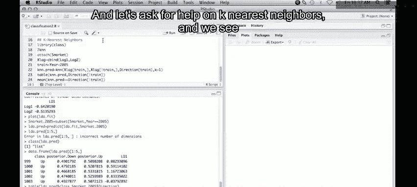

# 24：K最近邻分类法 🧮


在本节课中，我们将学习K最近邻（K-Nearest Neighbors， KNN）分类法。这是一种简单但非常有效的分类工具，有时甚至能提供最佳的分类性能。我们将通过R语言实践，使用与上一节线性判别分析（LDA）相同的数据集来演示其应用。

## 概述与准备工作

上一节我们介绍了线性判别分析，本节中我们来看看另一种非参数分类方法——K最近邻。首先，我们需要加载必要的R包并准备数据。

我们将使用 `class` 库中的K最近邻函数。以下是加载库和查看函数帮助的步骤：

```r
library(class)
help(knn)
```



帮助文件显示，`knn`函数的调用格式与之前使用的LDA不同。它不接收公式，而是需要指定训练集的预测变量、测试集的预测变量、训练集的类别标签以及K值。

## 数据准备

我们将继续使用股票市场数据集。为了在调用函数时能直接使用变量名，我们先附加这个数据框。

```r
attach(Smarket)
```

接下来，我们创建一个包含 `Lag1` 和 `Lag2` 两个变量的矩阵，作为我们的特征空间。

```r
xlag <- cbind(Lag1, Lag2)
```

然后，我们创建一个指示变量 `train`，用于划分训练集（2005年之前的数据）和测试集（2005年的数据）。

```r
train <- Year < 2005
```

## 应用K=1的最近邻分类

现在，我们准备调用KNN函数。我们设置K=1，这意味着分类时只考虑训练集中距离测试点最近的那个观测值。

```r
knn.pred <- knn(train = xlag[train, ], test = xlag[!train, ], cl = Direction[train], k = 1)
```

算法原理是：对于一个待分类的新观测点，在特征空间中找到训练集中与之欧氏距离最近的观测点，并将其类别赋予该新点。

我们可以通过混淆矩阵来评估分类性能：

```r
table(knn.pred, Direction[!train])
```

结果显示，当K=1时，分类准确率恰好为0.5，表现与随机猜测无异。

## 后续步骤与总结

本节课中我们一起学习了K最近邻分类的基本原理和在R中的实现。我们看到，在这个特定数据集上，使用K=1的最近邻分类器效果不佳。

以下是可能的改进方向：
*   可以尝试不同的K值（如K=3, 5, 10等），观察分类性能的变化。
*   可以探索对数据进行标准化处理，因为KNN对特征的尺度敏感。
*   可以结合交叉验证来为KNN选择最优的K值。

我们鼓励你查阅教材章节末尾的示例，那里提供了尝试多个K值的代码。K最近邻因其简单性，是分类工具箱中一个必备的基础工具。