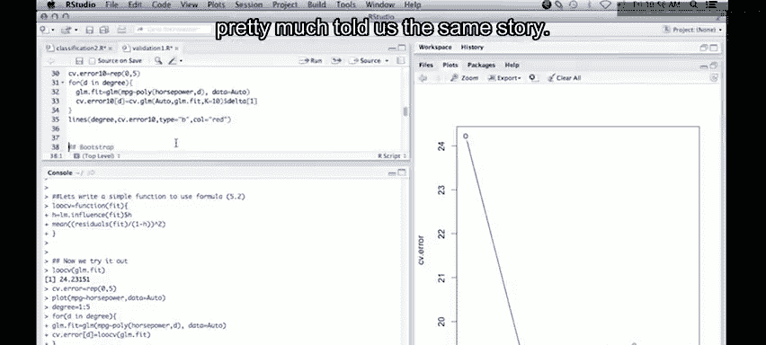

# 30：交叉验证方法在R中的实现 🧪


在本节课中，我们将学习如何使用R语言实现两种重要的模型评估方法：留一交叉验证（LOOCV）和K折交叉验证。我们将使用`ISLR`包中的`Auto`数据集，通过拟合不同次数的多项式回归模型，来比较这两种方法在估计测试误差上的表现。

---

## 1. 准备工作与数据探索

首先，我们需要加载必要的R包并查看数据。我们将使用`ISLR`包中的`Auto`数据集，并重点关注`mpg`（每加仑英里数）和`horsepower`（马力）这两个变量。

```r
require(ISLR)
require(boot)
```

接下来，我们绘制这两个变量的散点图，以直观了解它们之间的关系。

```r
plot(mpg ~ horsepower, data = Auto)
```

从图中可以观察到，随着马力的增加，每加仑英里数显著下降，这表明两者之间存在明显的非线性关系。

---

## 2. 留一交叉验证（LOOCV）

上一节我们观察了数据的基本关系，本节中我们来看看如何使用留一交叉验证来评估模型性能。留一交叉验证的方法是：对于包含n个观测值的数据集，依次将每一个观测值作为测试集，用剩余的n-1个数据拟合模型，并在被留出的观测点上进行预测，最终计算所有预测的均方误差。

### 2.1 使用`cv.glm`函数

首先，我们使用`glm`函数拟合一个简单的线性模型，然后使用`boot`包中的`cv.glm`函数进行留一交叉验证。

```r
# 拟合线性模型
glm.fit <- glm(mpg ~ horsepower, data = Auto)
# 进行留一交叉验证
cv.err <- cv.glm(Auto, glm.fit)
cv.err$delta
```

`cv.glm`函数会返回两个误差估计值。第一个是原始的留一交叉验证误差，第二个是经过偏差校正的版本。对于线性回归模型，存在一个更高效的计算公式。

### 2.2 利用公式高效计算LOOCV

对于最小二乘线性回归，留一交叉验证误差可以通过以下**公式**高效计算，而无需反复拟合模型：

\[
CV_{(n)} = \frac{1}{n} \sum_{i=1}^{n} \left( \frac{y_i - \hat{y}_i}{1 - h_{ii}} \right)^2
\]

其中，\(\hat{y}_i\) 是使用全部数据拟合模型后对第i个观测值的预测值，\(h_{ii}\) 是“帽子矩阵”的第i个对角线元素，它衡量了第i个观测值对其自身拟合值的影响。

以下是实现该公式的自定义函数：

```r
loocv <- function(fit) {
  h <- lm.influence(fit)$h
  mean((residuals(fit) / (1 - h))^2)
}
```

使用这个函数计算之前线性模型的误差，结果应与`cv.glm`的第一个输出值一致。

```r
loocv(glm.fit)
```

---

## 3. 比较不同复杂度模型

在了解了LOOCV的基本原理后，我们将其应用于更复杂的模型。我们将拟合1到5次的多项式回归模型，并使用LOOCV比较它们的性能。

以下是实现步骤：
1.  创建一个向量用于存储不同模型的交叉验证误差。
2.  使用循环，依次拟合不同次数的多项式模型。
3.  对每个模型应用我们的`loocv`函数计算误差。

```r
cv.error <- rep(0, 5)
degree <- 1:5

for (d in degree) {
  glm.fit <- glm(mpg ~ poly(horsepower, d), data = Auto)
  cv.error[d] <- loocv(glm.fit)
}

plot(degree, cv.error, type = "b")
```

从结果图中可以看到，一次多项式（直线）的误差最高。二次多项式（曲线）的误差显著下降，而更高次数的多项式并未带来明显改善。这与我们从散点图中观察到的非线性趋势是吻合的。

---

## 4. K折交叉验证

虽然LOOCV提供了几乎无偏的误差估计，但它的计算成本可能很高（尤其是没有快捷公式时），并且方差可能较大。因此，在实践中更常用的是K折交叉验证。

接下来，我们使用10折交叉验证来重复上面的模型比较。10折交叉验证将数据随机分成10份，依次将其中1份作为测试集，其余9份作为训练集，共拟合10次模型。

```r
set.seed(17) # 设置随机种子以保证结果可重现
cv.error.10 <- rep(0, 5)

for (d in degree) {
  glm.fit <- glm(mpg ~ poly(horsepower, d), data = Auto)
  cv.error.10[d] <- cv.glm(Auto, glm.fit, K = 10)$delta[1]
}

lines(degree, cv.error.10, type = "b", col = "red")
```

将10折交叉验证的结果（红色线条）与LOOCV的结果绘制在同一张图上，可以发现两者给出的结论非常相似：二次模型是最佳选择。10折交叉验证通常比LOOCV更稳定，计算效率也更高。

---

## 总结



本节课中我们一起学习了交叉验证的核心概念及其在R语言中的实现。我们重点掌握了：
1.  **留一交叉验证（LOOCV）** 的原理与实现，并学习了针对线性回归的高效计算公式。
2.  **K折交叉验证**（以10折为例）的实现方法及其相对于LOOCV在稳定性和计算效率上的优势。
3.  通过比较不同次数的多项式回归模型，我们实践了如何使用交叉验证误差作为标准来选择模型复杂度。

通常，我们更推荐使用5折或10折交叉验证来评估模型性能，它在偏差和方差之间取得了更好的平衡，并且计算速度更快。