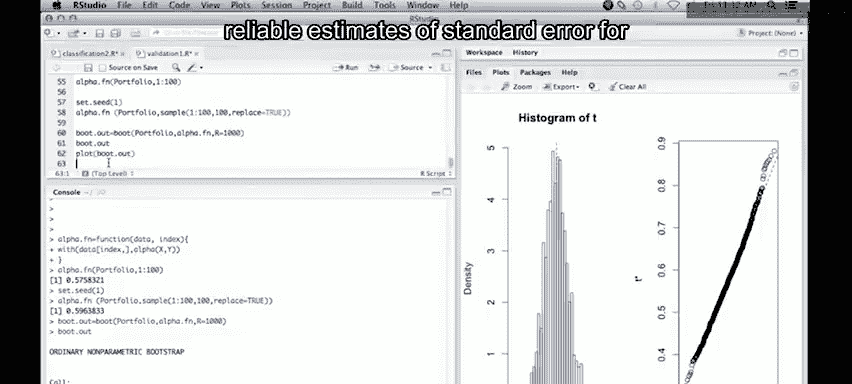

# 31：Bootstrap方法入门 🚀


在本节课中，我们将学习Bootstrap方法。这是一种强大的现代统计工具，由Brad Efron发明。它允许我们在难以推导理论分布的情况下，通过计算来估计统计量的抽样分布。

## 概述

Bootstrap方法的核心思想是通过对原始数据进行有放回的重复抽样，来模拟数据的抽样分布。当统计量的理论分布非常复杂或未知时，Bootstrap提供了一种简单有效的替代方案。

## 一个投资组合的例子

为了说明Bootstrap的应用，我们将使用教材5.2节中的一个例子。该例子涉及一个非线性公式，用于计算两种投资（X和Y）的最优组合比例。

假设两种投资的风险（方差）分别为 `Var(X)` 和 `Var(Y)`。如果我们计划将资金按比例 `α` 投资于X，`1-α` 投资于Y，那么使投资组合风险最小化的最优 `α` 由以下公式给出：

**α = [Var(Y) - Cov(X, Y)] / [Var(X) + Var(Y) - 2 * Cov(X, Y)]**

如果我们有X和Y的实际数据，就可以计算方差和协方差，然后代入公式得到α的估计值。

然而，问题在于：α的抽样变异性有多大？α的标准误是多少？由于α是X和Y的非线性函数，我们很难从理论上推导其分布。这正是Bootstrap可以大显身手的地方。

## 实现步骤

以下是使用Bootstrap估计α标准误的具体步骤。

### 第一步：编写计算α的函数

首先，我们需要一个函数，输入两个数据向量X和Y，输出计算得到的α值。

```r
alpha <- function(x, y) {
    var_x <- var(x)
    var_y <- var(y)
    cov_xy <- cov(x, y)
    alpha_val <- (var_y - cov_xy) / (var_x + var_y - 2 * cov_xy)
    return(alpha_val)
}
```

这个函数计算X的方差、Y的方差以及X和Y的协方差，然后代入上述公式并返回结果。

### 第二步：创建Bootstrap包装函数

为了使用Bootstrap函数，我们需要创建一个包装函数。这个函数接收一个数据框和一个索引向量，然后基于该索引（代表一个Bootstrap样本）计算统计量。

```r
alpha.fn <- function(data, index) {
    with(data[index, ], alpha(X, Y))
}
```

这里，`with` 函数非常方便，它允许我们直接使用数据框中的列名（如X和Y）。`index` 参数是一个从1到n（n为样本量）的整数向量，允许有重复值，这正对应了Bootstrap有放回抽样的特性。

我们可以用原始数据（索引为1:n）测试这个函数，确保它返回与直接计算相同的α值。

### 第三步：运行Bootstrap

现在，我们可以使用 `boot` 包中的 `boot` 函数来进行Bootstrap重抽样。为了结果可复现，我们先设置随机数种子。

```r
set.seed(1)
boot_results <- boot(data = portfolio, statistic = alpha.fn, R = 1000)
```

上述代码对名为 `portfolio` 的数据框进行了1000次Bootstrap重抽样，每次都用 `alpha.fn` 函数计算α值。

### 第四步：解读结果

运行 `boot` 函数后，我们可以查看结果摘要。

```r
print(boot_results)
```

输出会显示原始数据的α估计值（`original`）、Bootstrap估计的偏差（`bias`）以及我们最关心的标准误（`std. error`）。在本例中，标准误约为0.08，偏差可以忽略不计。

我们还可以绘制Bootstrap分布图来直观感受。

```r
plot(boot_results)
```

生成的图表通常包含两幅图：一幅是α值的直方图，另一幅是用于检验正态性的Q-Q图。从图中我们可以判断α的抽样分布是否近似正态（在本例中，它基本符合，右侧尾部可能稍厚一些）。

## 总结

本节课我们一起学习了Bootstrap方法。我们了解到，当统计量的理论分布难以推导时，Bootstrap通过有放回地重抽样原始数据，能够有效地估计该统计量的抽样分布、标准误和置信区间。

我们通过一个计算投资组合最优比例α的具体例子，演示了在R语言中实现Bootstrap的完整流程：
1.  定义计算目标统计量的函数。
2.  创建适用于 `boot` 函数的包装函数。
3.  使用 `boot()` 函数执行大量重抽样。
4.  解读结果，获取标准误，并通过绘图检查分布形态。




Bootstrap是一种极其灵活且强大的工具，是现代统计学和数据科学中不可或缺的技术之一。