# 32：模型选择与正则化 📊

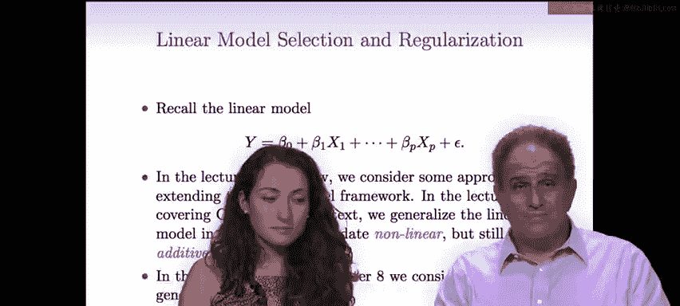

在本节课中，我们将学习模型选择与正则化的核心概念。我们将探讨如何在线性模型的框架下，通过选择或压缩特征系数来提升模型的解释性和预测能力。课程内容将涵盖子集选择、收缩方法和降维技术三大类方法。

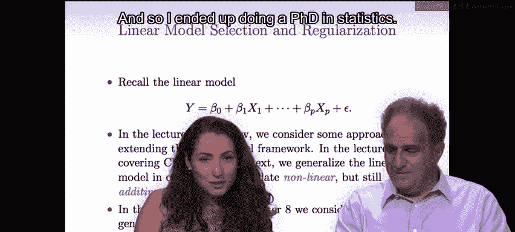

欢迎回来。今天我们将讲解模型选择与正则化，并且有一位特别嘉宾——我从前的研究生丹妮拉·威滕。丹妮拉目前在华盛顿大学任教。丹妮拉，请向学生们介绍一下自己。我在大学学习了数学和生物学。毕业时，我知道自己想攻读研究生，但无法确定未来要专门研究什么。最终，我选择了在斯坦福大学跟随罗布攻读统计学博士学位，并于2010年毕业。之后我搬到了西雅图，现在是华盛顿大学生物统计系的助理教授。

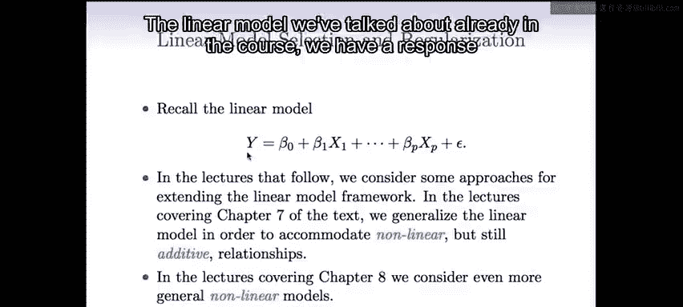

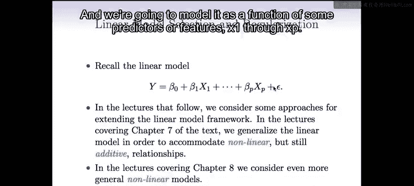

我邀请丹妮拉来这里，不仅因为她是一位优秀的学生和朋友，还因为她是本课程所基于的教科书的合著者。今天，丹妮拉和我将一起进行讲解。

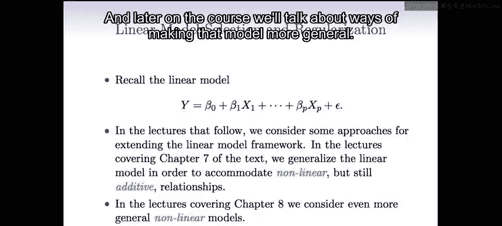

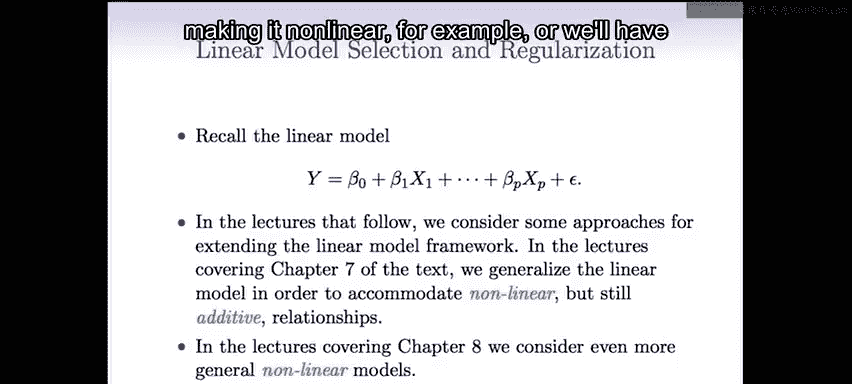

我们将讨论模型选择和正则化。让我们先回顾一下课程中已经介绍过的线性模型。我们有一个响应变量 **Y**，并将其建模为一些预测变量或特征 **x₁** 到 **xₚ** 的函数。我们在课程早期已经讨论过用于此目的的最小二乘法。

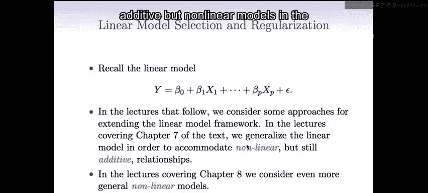

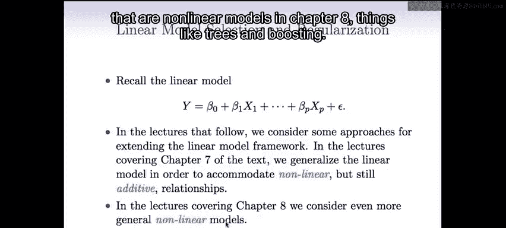

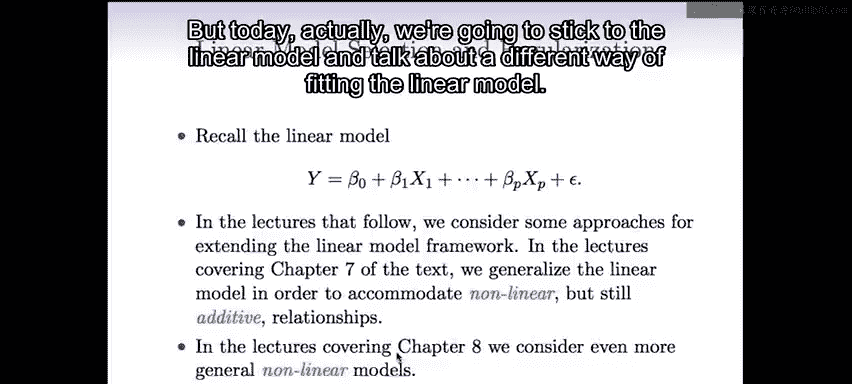

在课程后期，我们将讨论使该模型更通用的方法，例如使其非线性化，或者在涵盖第7章的讲座中考虑非线性模型。在第8章，我们将讨论诸如树和提升等方法。但今天，我们将坚持使用线性模型，并讨论拟合线性模型的不同方法。

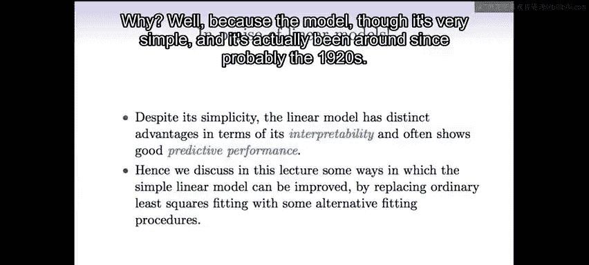

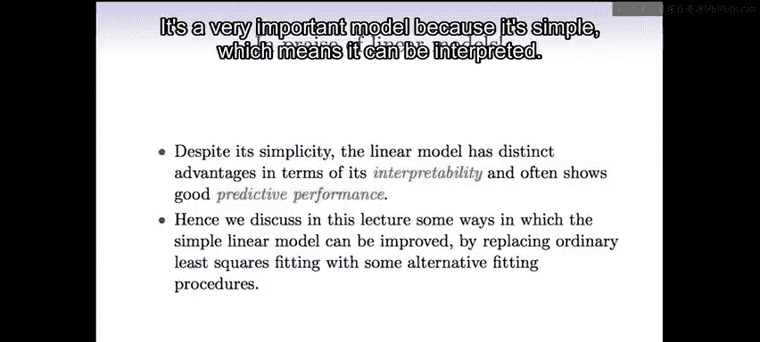

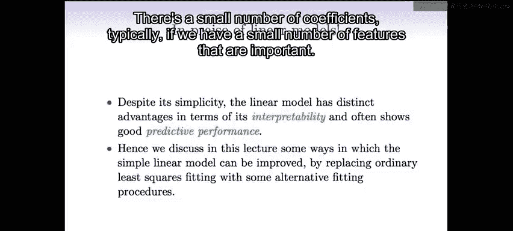

为什么？因为线性模型虽然非常简单（可能自20世纪20-30年代就已存在），但它是一个非常重要的模型。其简单性意味着它可以被解释。如果我们只有少量重要的特征，通常系数数量也较少。

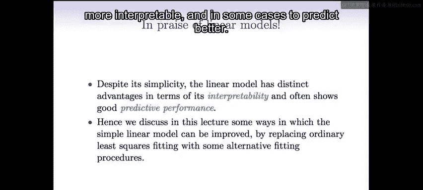

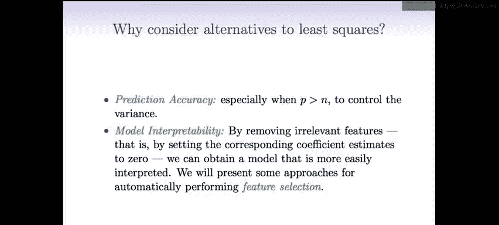

在许多情况下，尽管模型简单，但它能很好地预测未来数据。因此，我们今天要讨论的方法，旨在通过选择或压缩特征系数来改进最小二乘法，从而使模型更具解释性，并在某些情况下预测得更好。今天我们将讨论几种实现这一目标的方法。

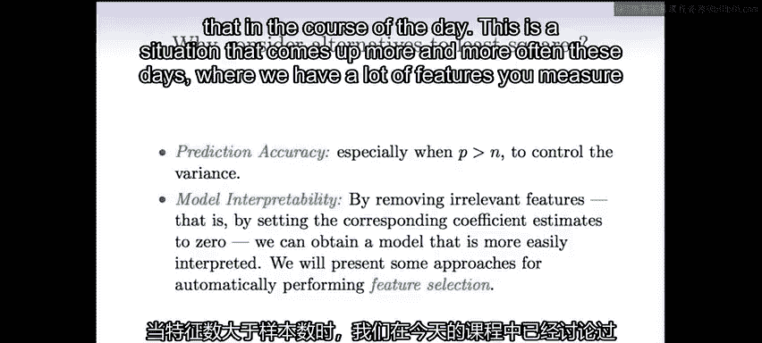

关于这两个目标，我再多说几句。

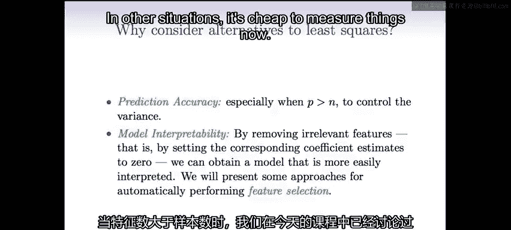

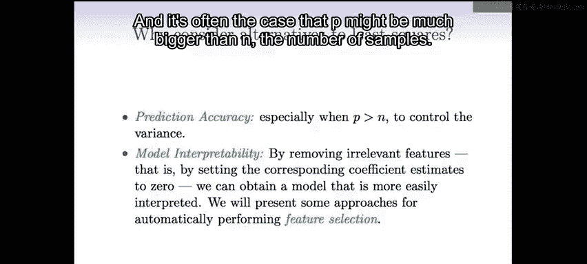

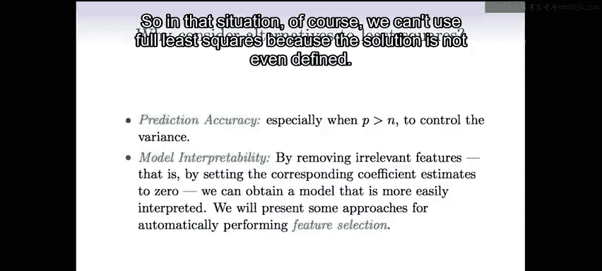

当特征数量大于样本数量时，我们已经在本课程中讨论过这种情况。如今这种情况越来越常见，我们拥有大量在患者、商业（如股票）或其他情况下测量的特征。现在测量事物成本低廉，因此 **P**（特征数）远大于样本数的情况经常发生。在这种情况下，我们当然不能使用普通最小二乘法，因为解甚至无法定义。因此，我们必须以某种方式减少特征数量。

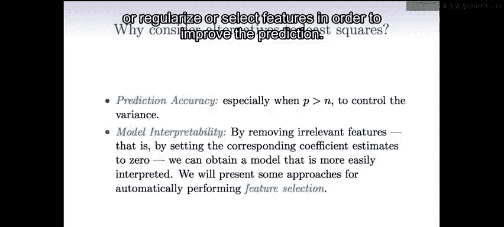

因此，不仅为了获得一个解，也为了避免对数据过度拟合，这一点变得越来越重要。当我们希望更好地预测时，我们将通过收缩、正则化或选择特征来改进预测。

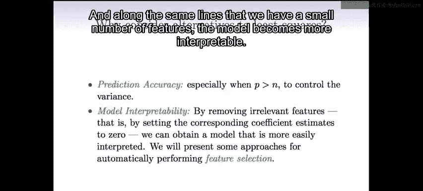

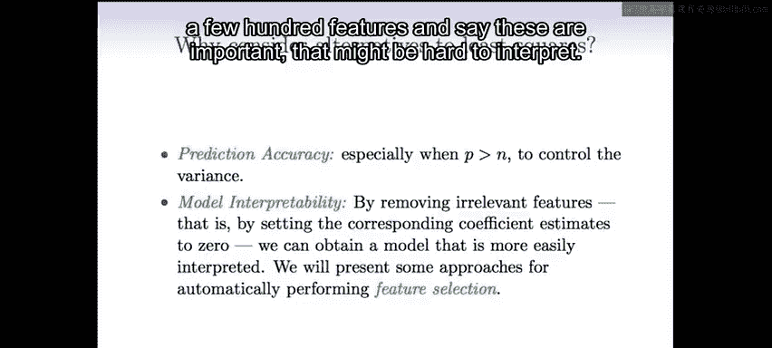

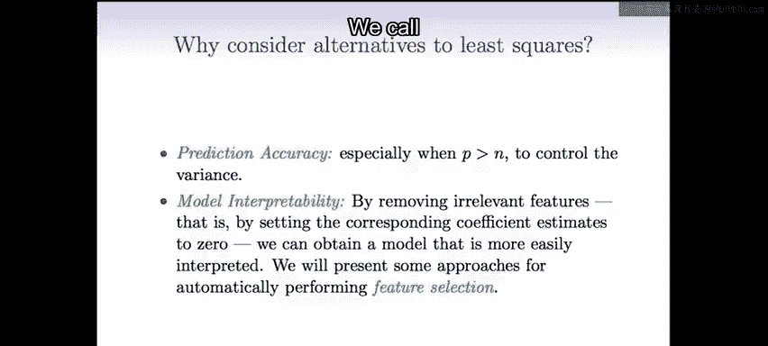

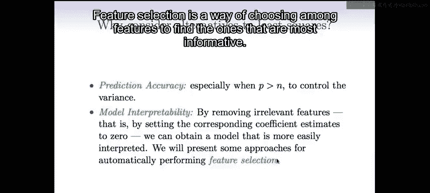

同样地，如果我们只有少量特征，模型会变得更具解释性。如果我们交给合作者几百个特征并说这些很重要，可能难以解释。如果我们将它们压缩到最重要的5个或10个，解释起来会更容易，从科学角度来看也更有用。

因此，我们将特征选择称为从特征中挑选出信息量最大的那些方法。

在今天的讲座中，我们将讨论三类技术。

*   **子集选择**：我们尝试在 **P** 个预测变量中找出与响应变量最相关的那些。我们将看到子集选择的不同形式。
*   **最佳子集选择**：我们尝试在所有可能的特征组合中寻找最具预测性的组合。
*   **前向和后向逐步选择方法**：这些方法并不试图在所有可能的组合中找到最佳组合，而是尝试在模型空间中进行智能搜索。这包括前向逐步选择、后向逐步选择和所有子集选择。

然后是一些更现代的技术，称为**收缩方法**。

在这些方法中，我们并不显式地选择变量，而是施加惩罚，以各种方式惩罚模型的系数数量或系数大小。因此，我们将在收缩方法部分讨论岭回归和套索回归。

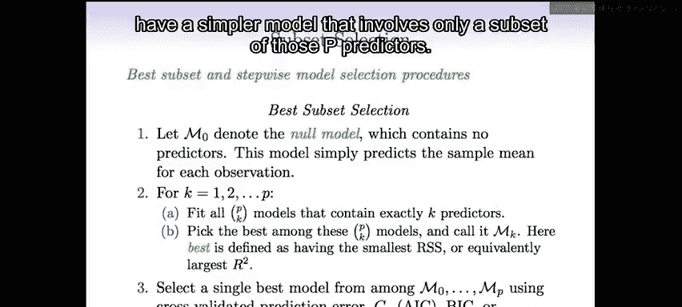

最后，在第三部分**降维**中，我们将讨论寻找变量组合、提取重要的变量组合，然后使用这些组合作为回归中的特征的方法。我们将讨论主成分回归和偏最小二乘法。

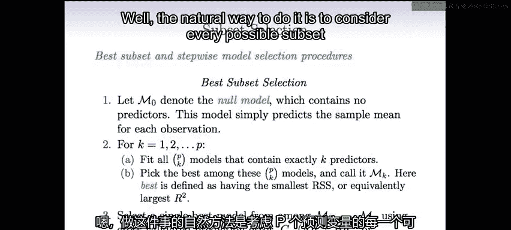

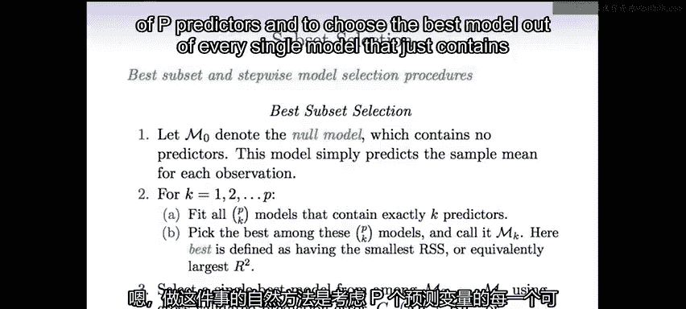

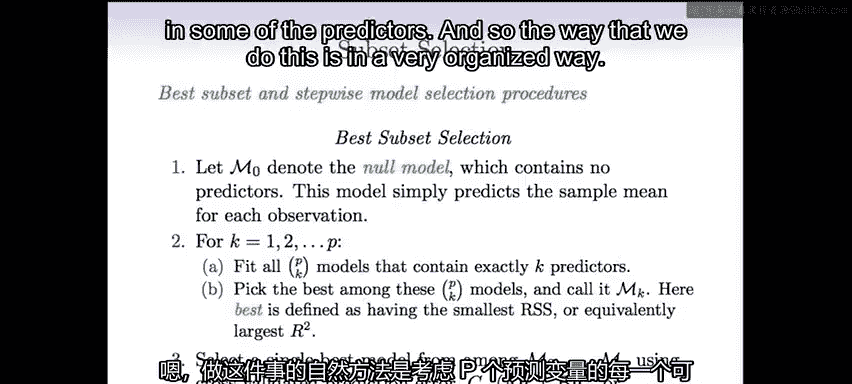

因此，我们今天将讨论三类不同的方法。

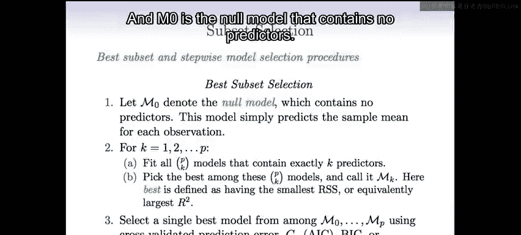

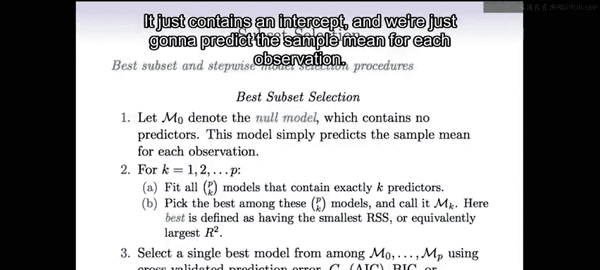

今天讲座的一个特点是，我们将在线性回归的背景下审视所有这些思想。因此，如果你试图预测某个定量响应，并希望拟合一个灵活性较低但可能预测性更强、也更具解释性的模型，这些方法可以在某种意义上“压缩”你通常的最小二乘解，以获得更好的结果。但这些概念同样可以应用于逻辑回归，或者根据你手头的数据集和试图预测的响应类型，应用于你喜欢的任何模型。因此，尽管我们这里主要讨论线性回归，但这些方法确实适用于逻辑回归和其他类型的模型。

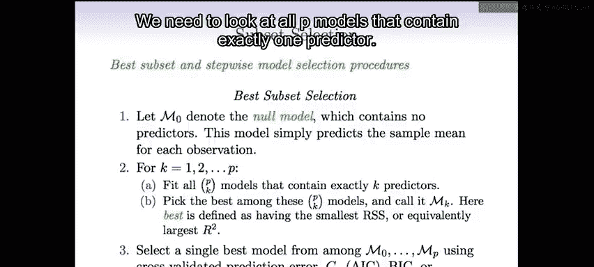

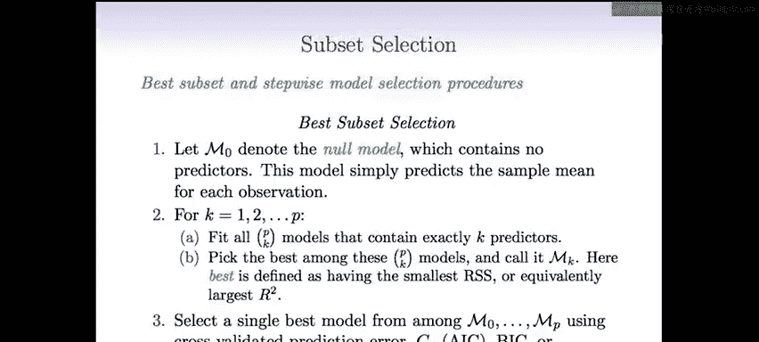

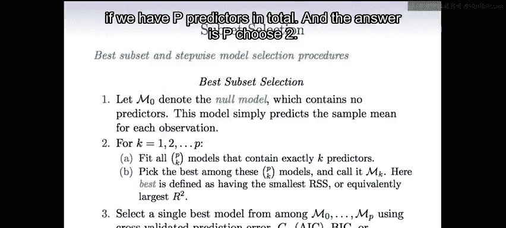

好的，丹妮拉将首先为我们介绍子集选择。

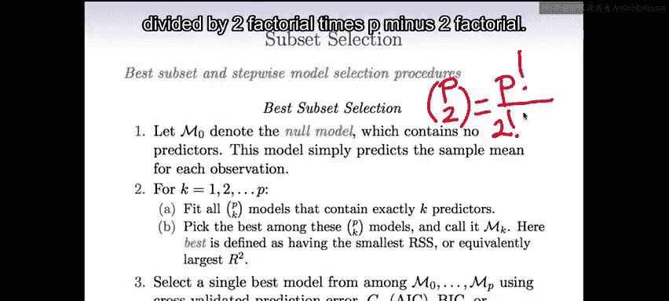

最佳子集选择是一个非常简单的想法。假设我们可以访问 **P** 个预测变量，但我们实际上希望拥有一个只涉及其中一部分预测变量的更简单模型。很自然的做法是考虑 **P** 个预测变量的每一个可能子集，并从只包含部分预测变量的每一个模型中选出最佳模型。

我们以非常有条理的方式进行。首先，我们创建一个称为 **M₀** 的模型。**M₀** 是包含零个预测变量的零模型，它只包含一个截距项，我们只是为每个观测值预测样本均值。

这样我们就得到了 **M₀**。现在，我们将尝试创建一个称为 **M₁** 的模型。**M₁** 将是恰好包含一个预测变量的最佳模型。为了得到 **M₁**，我们需要查看所有恰好包含一个预测变量的 **P** 个模型，并从中找出最佳的那个。

接下来，我们想找到一个称为 **M₂** 的模型，它将是包含两个预测变量的最佳模型。如果我们总共有 **P** 个预测变量，那么包含两个预测变量的模型有多少个？答案是 **P 选 2**。

如果你以前没见过这个符号，它写作 **P choose 2**，等于 **P! / (2! * (P-2)!)**。这实际上是我可以从总共 **P** 个预测变量中得到恰好包含两个预测变量的可能模型的数量。

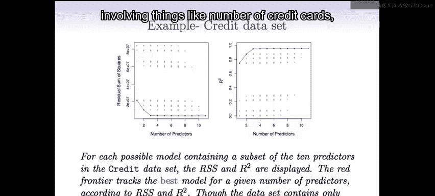

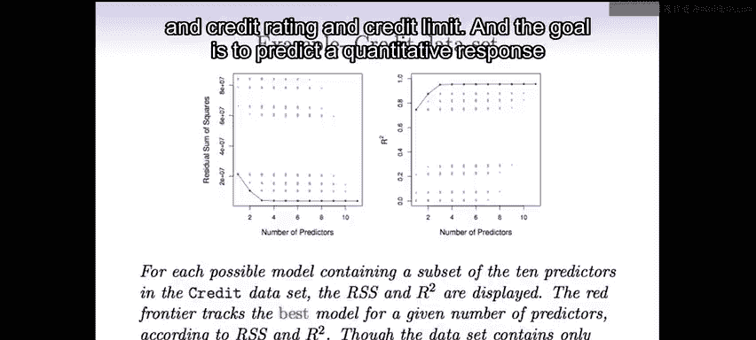

因此，我可以考虑所有 **P 选 2** 个包含两个预测变量的模型，选择最佳的一个，并称之为 **M₂**，依此类推。我可以继续得到包含三个、四个预测变量的最佳模型，直到包含 **P** 个预测变量的最佳模型。

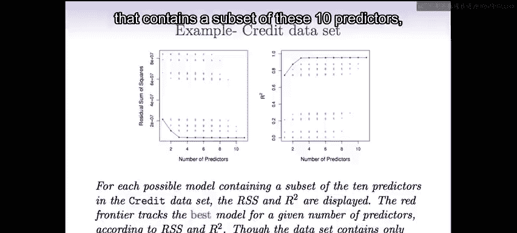

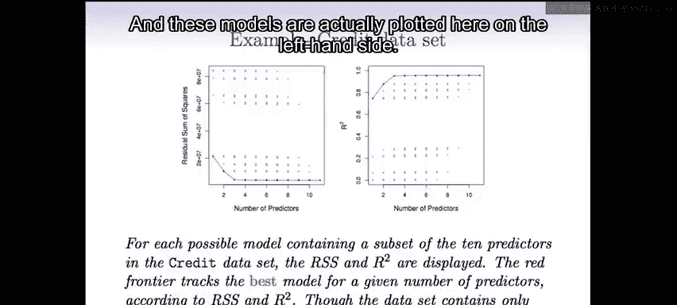

因此，为了得到 **M₃**，即从所有包含三个预测变量的模型中选择最佳模型，我可以以一种相当直接的方式进行，因为我可以直接说，在所有包含三个预测变量的模型中，最佳的是具有最小残差平方和或等价地最大 **R²** 的那个。

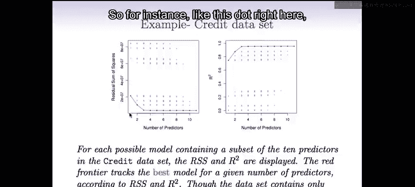

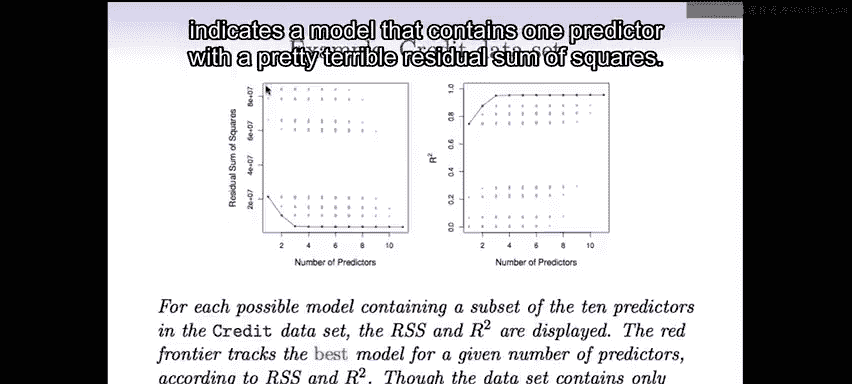

通过这种方式，我得到了包含 0、1、2 直到 **P** 个预测变量的最佳模型，我称它们为 **M₀, M₁, M₂, ..., Mₚ**。现在我进入第三步，在这最后一步中，我需要做的就是从 **M₀** 到 **Mₚ** 中选择最佳模型。实际上，这第三步有点微妙，因为我们需要非常小心，确保我们选择的模型确实具有最小的测试误差，而不是具有最小训练误差的模型。

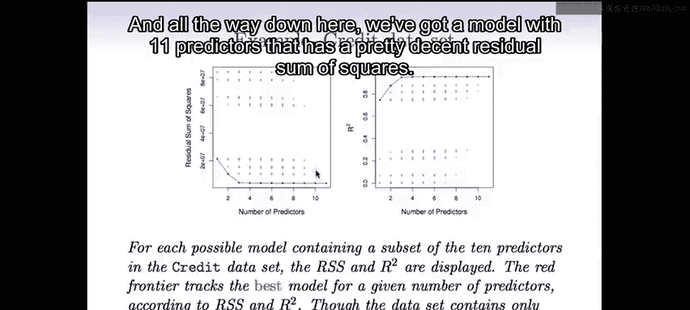

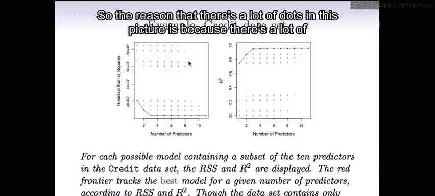

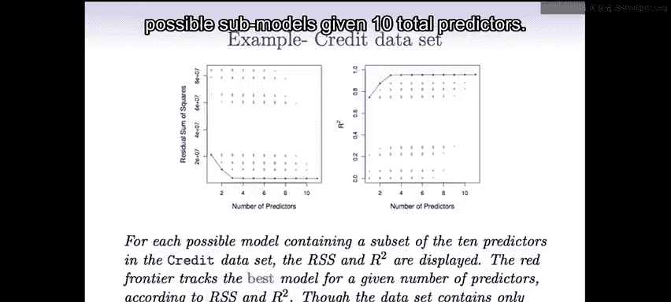

因此，我们可以使用多种技术从 **M₀** 到 **Mₚ** 中选择一个单一的最佳模型。这些技术包括通过交叉验证估计的预测误差，以及我们将在本讲座后面讨论的一些你可能以前没见过的其他方法，例如 **Cp**、**AIC**、**BIC** 和调整后的 **R²**。我们将在几分钟后回到其中一些主题。

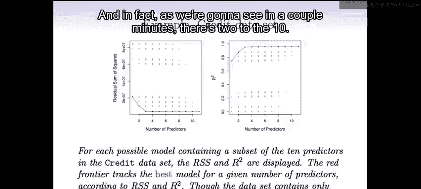

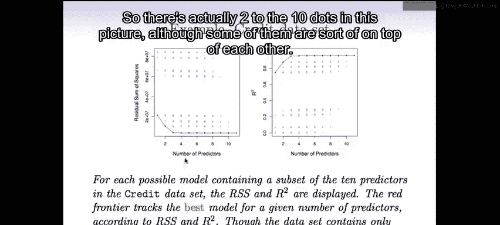

这是一个关于信用数据集的例子，我们在前面的章节中见过这个数据集。这个数据集包含 10 个预测变量，涉及信用卡数量、信用评级和信用额度等，目标是预测一个定量响应，即信用卡余额。

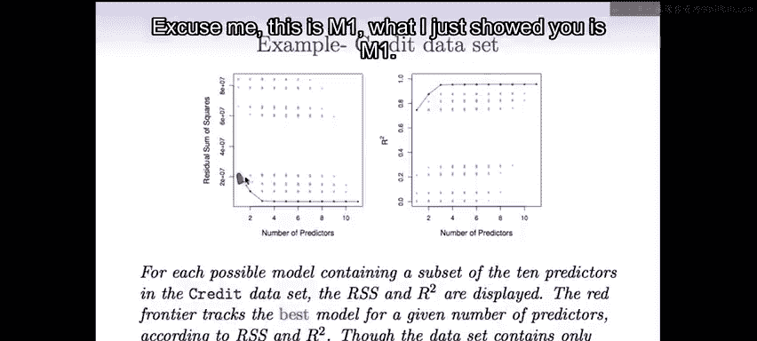

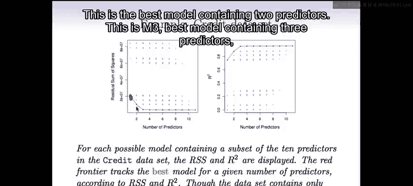

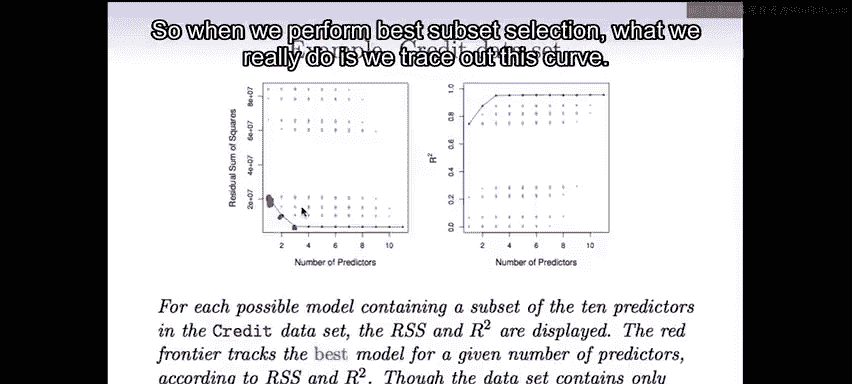

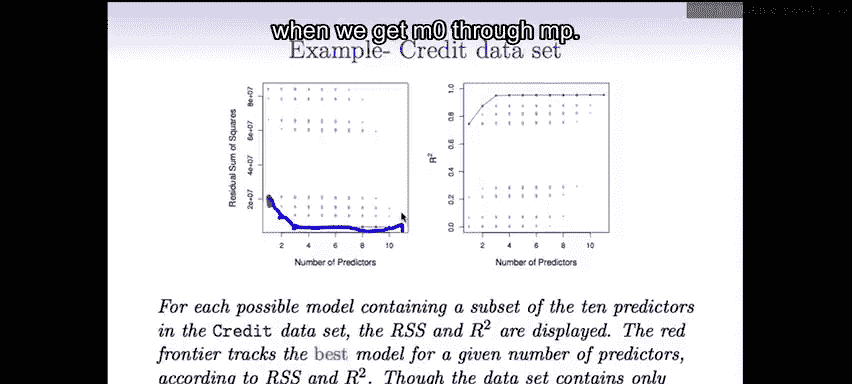

我们可以查看包含这 10 个预测变量子集的每一个模型。这些模型实际上绘制在左侧。这里的 x 轴是预测变量的数量，实际上是从 1 到 11，因为其中一个预测变量是具有三个水平的分类变量，因此我们使用了几个虚拟变量来编码它。y 轴是每个可能模型的残差平方和。

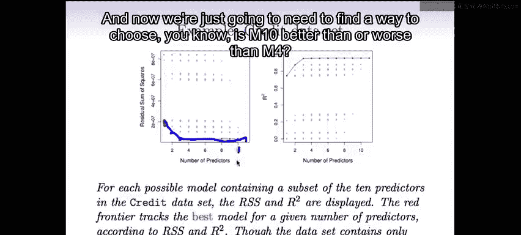

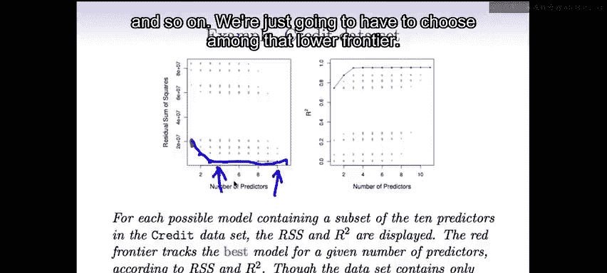


例如，这里的这个点表示一个包含一个预测变量且残差平方和相当糟糕的模型。而最下面这里，我们有一个包含 11 个预测变量且残差平方和相当不错的模型。这张图中有很多点，是因为有很多可能的子模型。事实上，正如我们将在几分钟后看到的，有 **2¹⁰** 个子模型，所以这张图中实际上有 **2¹⁰** 个点，尽管有些点相互重叠。


这里的红线表示每个大小的最佳模型。所以这个红点是 **M₁**，这是包含一个预测变量的最佳模型，因为它具有最小的残差平方和。这是包含两个预测变量的最佳模型，即 **M₂**。这是包含三个预测变量的最佳模型 **M₃**，依此类推。


因此，当我们执行最佳子集选择时，我们实际上就是描绘出这条曲线，得到 **M₀** 到 **Mₚ**。现在我们需要找到一种方法来选择，例如，**M₁₀** 比 **M₄** 更好还是更差。我们只需要在那个下边界中进行选择。


在左侧这里，我们看到预测变量数量与残差平方和的关系。在右侧，我们看到预测变量数量与 **R²** 的关系。正如我们在第3章看到的，**R²** 表示线性回归模型（最小二乘模型）解释的方差比例。再次，我们看到大量灰点表示包含这10个预测变量子集的每一个可能模型。然后红线显示每个大小的最佳模型。同样，这是我们之前看到的 **M₁**，这是 **M₂**，那边是 **M₁₀**。


我们注意到，随着模型变大，随着我们查看越来越大的模型，残差平方和会减少，而 **R²** 会增加。我们知道为什么会这样吗？也许罗布可以告诉我们。


我可以告诉你，是的，这是因为当你添加变量时，情况不会变得更糟。例如，如果你有一个大小为3的子集，然后你寻找大小为4的最佳子集，在最坏的情况下，你可以将第四个变量的系数设为0，这样你就得到了与三变量模型相同的误差。所以曲线永远不会变差，它可以是平的。如果你看这里的幻灯片，我们可以看到从大约3个预测变量到11个预测变量，它看起来实际上是平的。但它肯定不会上升。通过添加预测变量，我们不可能做得更差。

实际上，罗布刚才所说的与我们之前在第三步讨论最佳子集选择时的想法有关。我说过，为了在不同大小的最佳模型中进行选择，我们需要非常小心，必须使用交叉验证或 **Cp**、**BIC**、调整后的 **R²**。这确实与这里的情况有关。因为如果我问你，包含八个预测变量的最佳模型是哪个？你会说，好吧，这里是所有包含八个预测变量的模型，显然这是最好的一个，它具有最小的残差平方和，这没有争议。


但是，如果我问你，这个模型（比如四个预测变量的）和那个模型（比如八个预测变量的）哪个更好？突然之间就不那么直接了，因为你有点在比较苹果和橘子。你在比较一个有四个预测变量的模型和一个有八个预测变量的模型。你不能只看哪个残差平方和更小，因为当然有八个预测变量的那个残差平方和会更小。因此，为了以一种有意义的方式在不同预测变量数量的模型集合中进行选择，我们必须小心谨慎，我们将在几分钟后讨论这一点。


---


本节课中，我们一起学习了模型选择与正则化的基本概念，重点介绍了最佳子集选择方法。我们了解到，通过系统地评估不同大小的模型，可以找到预测变量与响应变量之间关系的有效子集。然而，直接比较不同复杂度模型的拟合优度（如残差平方和或 **R²**）是不合适的，需要借助交叉验证、信息准则等方法来选择在测试集上表现最佳且不过度拟合的模型。这为后续学习其他选择与正则化方法奠定了基础。