# 42：模型选择 🎯

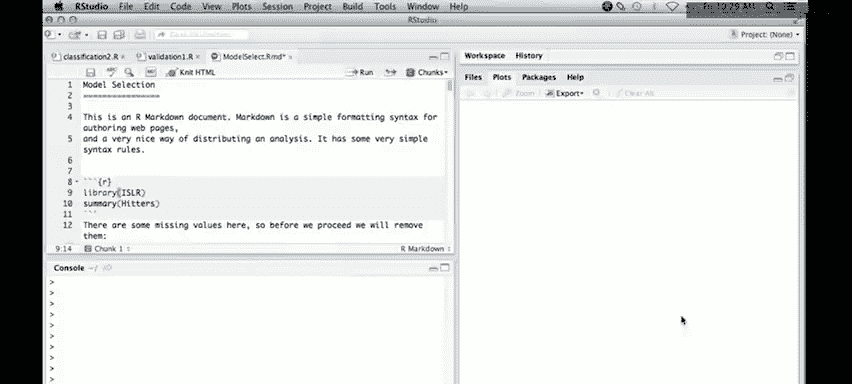

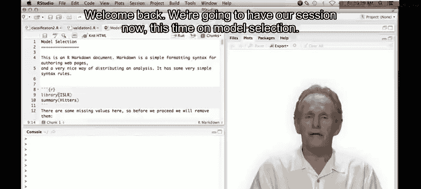

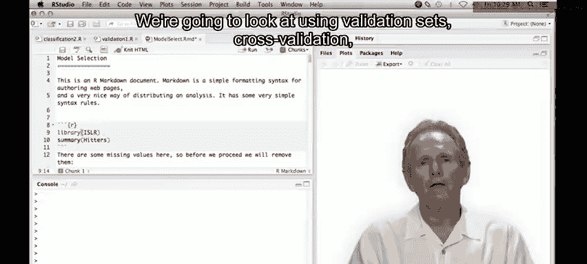

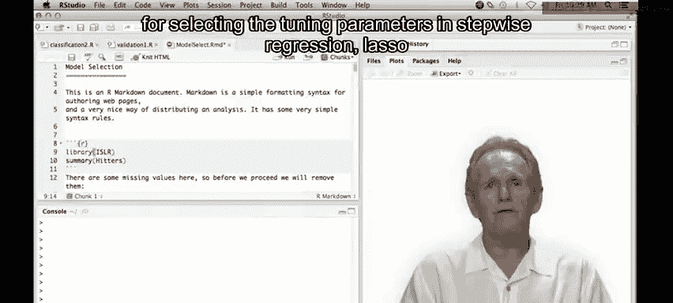

在本节课中，我们将学习如何使用验证集和交叉验证等方法，为逐步回归、岭回归等模型选择最佳的调优参数。我们将通过一个具体的例子，使用R语言和Markdown模式来演示整个过程。

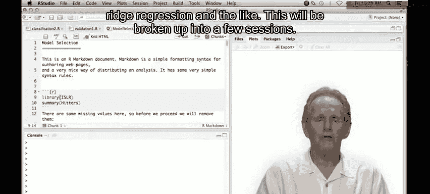

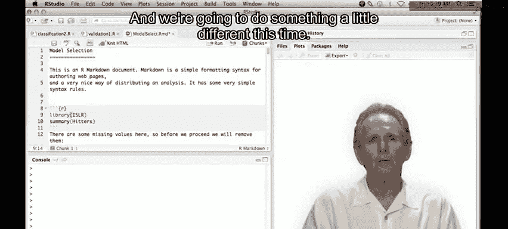

---

## 使用Markdown模式 📝

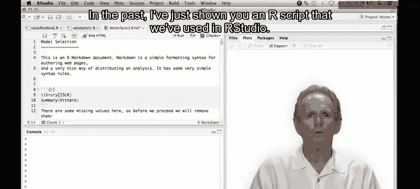

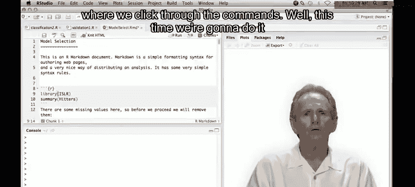

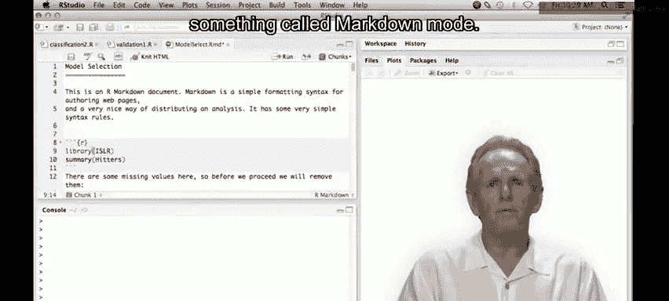

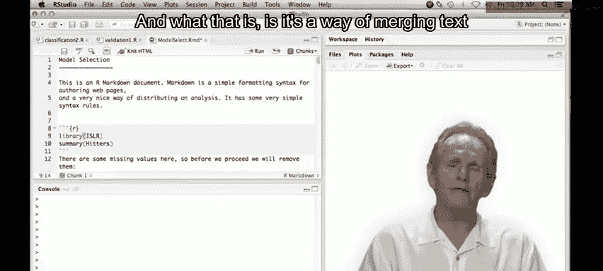

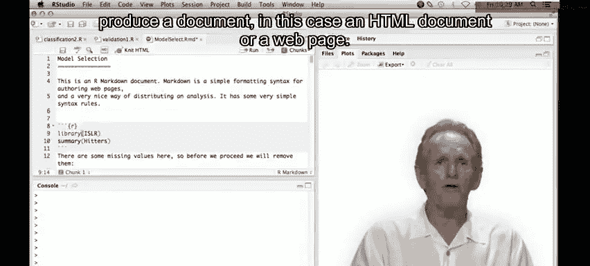

在之前的课程中，我们通常通过点击命令来运行脚本。本次课程我们将采用一种不同的方式，即在R Studio中使用Markdown模式。这种模式允许我们将文本与R代码合并，最终可以生成一个HTML格式的网页文档。这种方式不仅操作简便，而且对于制作演示文稿尤其有用。

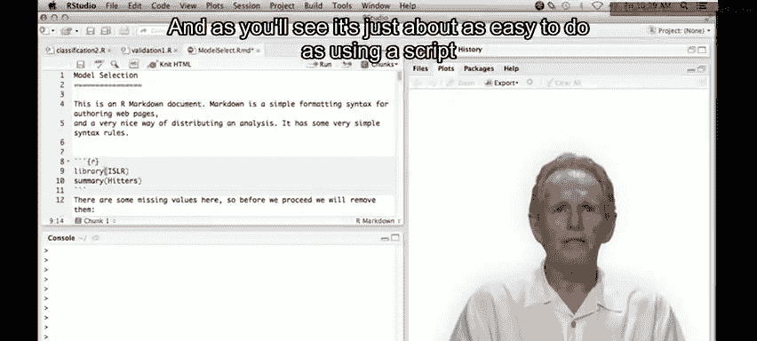

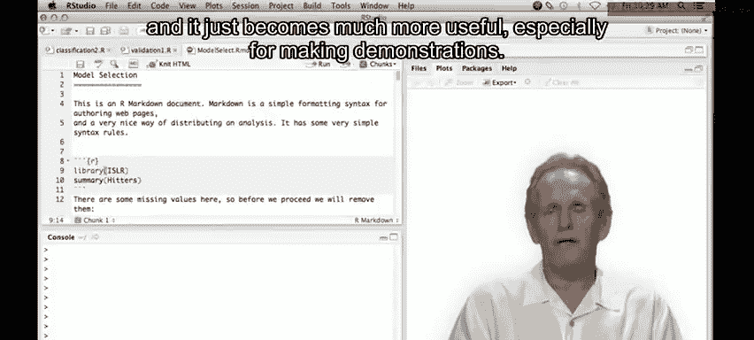

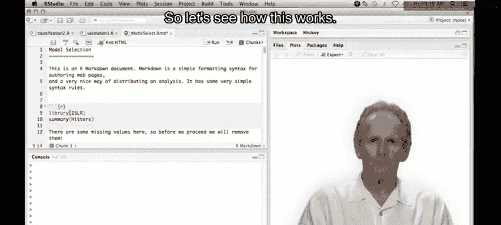

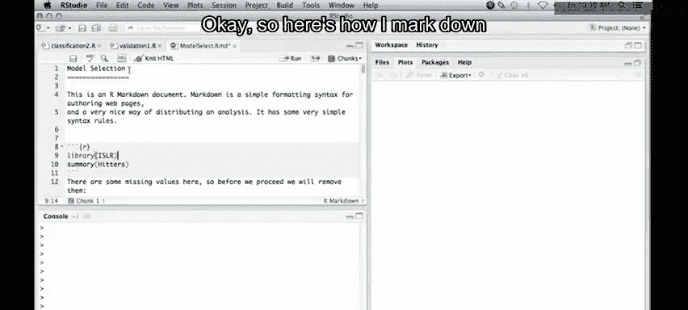

以下是Markdown模式的基本结构：

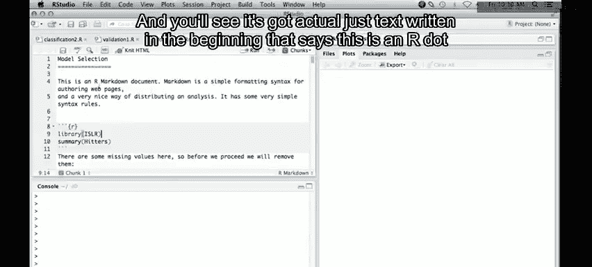

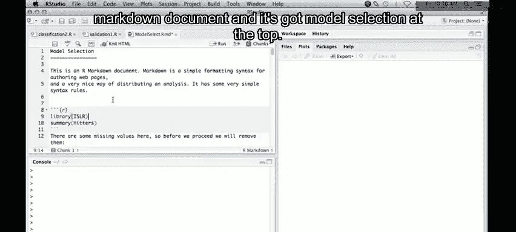

*   **文本部分**：直接编写说明性文字。
*   **代码块**：R代码被包含在特定的代码块中。代码块以三个反引号开头，并注明语言为R。我们可以像以前一样执行这些代码块中的命令。

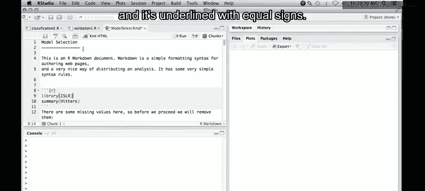

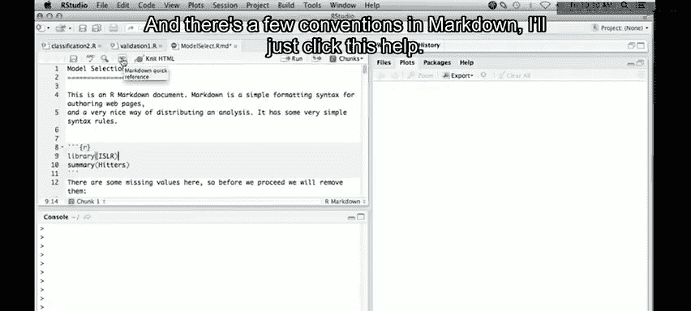

---

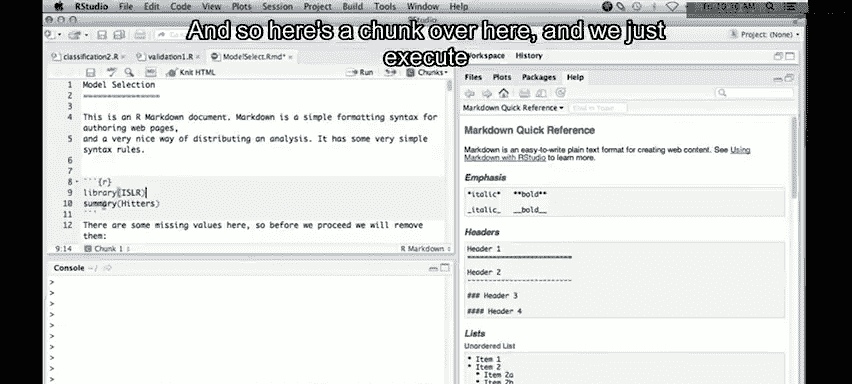

## 数据准备与探索 ⚾️

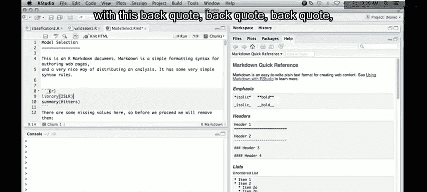

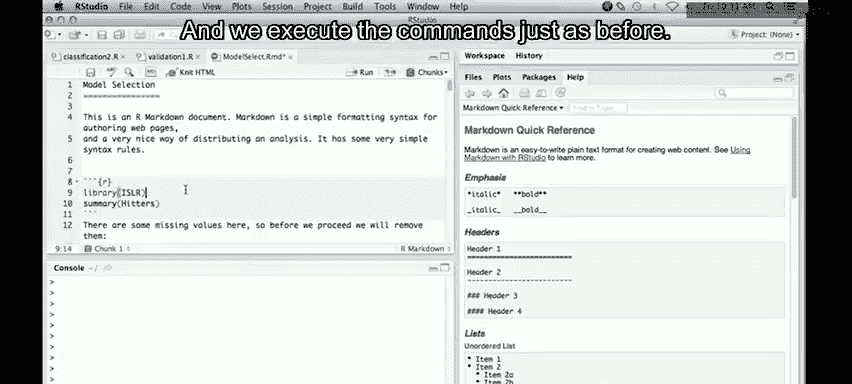

首先，我们需要加载数据并进行初步探索。我们将使用`ISLR`包中的`Hitters`数据集，这是一个关于棒球运动员的数据库，包含了许多统计指标以及一个响应变量——薪水。

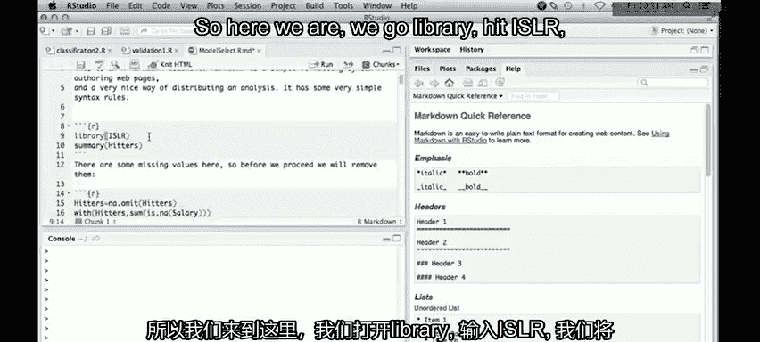

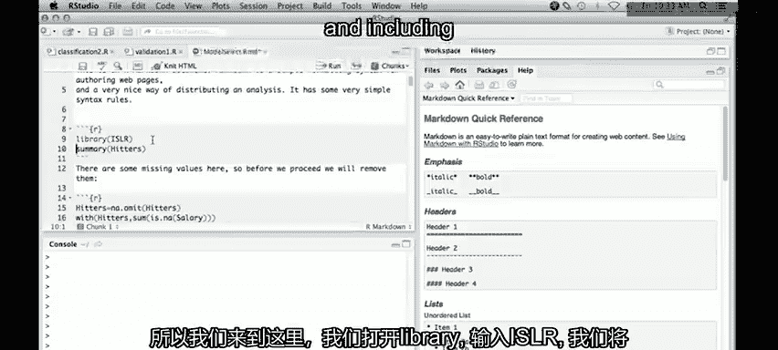

```r
library(ISLR)
data(Hitters)
names(Hitters)
summary(Hitters)
```

数据集中存在一些缺失值。为了简化处理，我们将直接删除包含任何缺失值的行。

```r
Hitters = na.omit(Hitters)
with(Hitters, sum(is.na(Salary)))
```

---

## 最佳子集回归 🔍

最佳子集回归会遍历所有可能的不同大小的预测变量子集，并找出每个子集大小下的最佳模型。这听起来计算量很大，但我们可以使用`leaps`包中的`regsubsets`函数轻松完成。

```r
library(leaps)
regfit.full = regsubsets(Salary ~ ., data = Hitters)
summary(regfit.full)
```

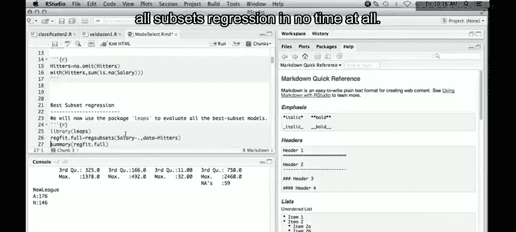

默认情况下，`regsubsets`只显示到包含8个变量的模型。为了查看所有可能性，我们可以指定最大变量数。

```r
regfit.full = regsubsets(Salary ~ ., data = Hitters, nvmax = 19)
reg.summary = summary(regfit.full)
names(reg.summary)
```

`summary`对象包含了每个最佳子集模型的多种统计量，如R平方、调整R平方、Cp统计量、BIC等，这些都可以帮助我们选择最终模型。

---

## 使用Cp统计量选择模型 📊

Cp统计量是预测误差的一个估计。通常，我们选择具有最小Cp值的模型。

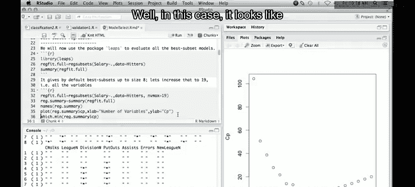

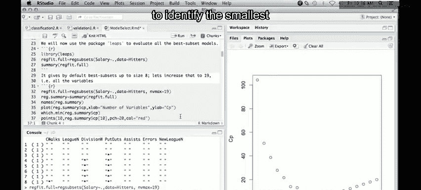

```r
which.min(reg.summary$cp)
plot(reg.summary$cp, xlab = "Number of Variables", ylab = "Cp", type = "l")
points(which.min(reg.summary$cp), reg.summary$cp[which.min(reg.summary$cp)], col="red", pch=20)
```

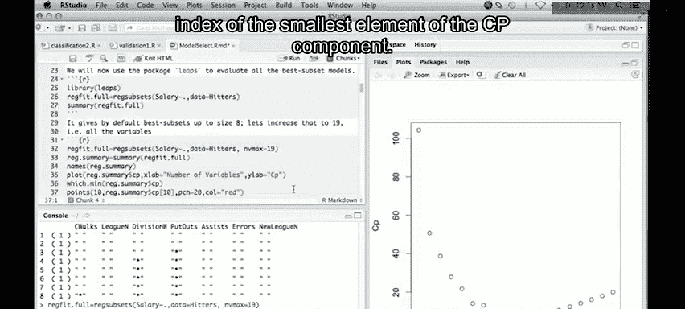

根据Cp图，包含10个变量的模型似乎是最佳选择。`regsubsets`对象还有一个内置的绘图方法，可以更直观地展示变量选择情况。

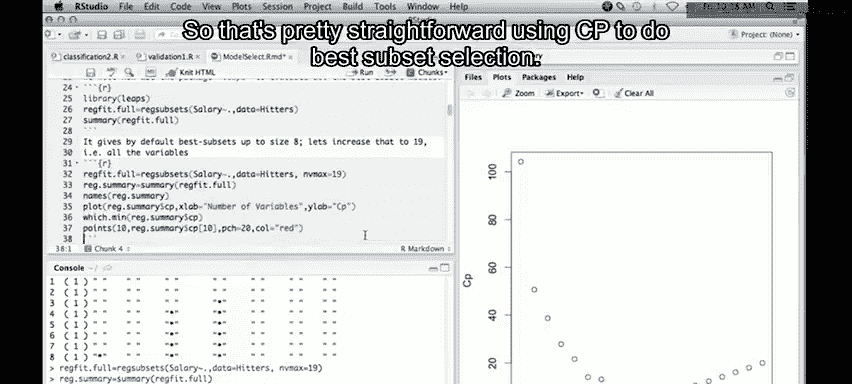

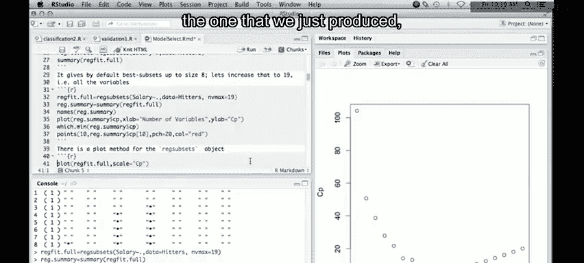

```r
plot(regfit.full, scale="Cp")
```

最后，我们可以提取出这个最佳模型的系数。

```r
coef(regfit.full, 10)
```

---

## 生成HTML报告 🌐

使用Markdown模式的一个主要优势是能够轻松生成格式美观的报告。在R Markdown文档中，我们可以通过“Knit”功能将整个分析过程（包括代码、输出结果和图表）编译成一个独立的HTML网页。

---

本节课中，我们一起学习了如何使用R语言进行模型选择。我们首先介绍了在R Studio中使用Markdown模式来整合代码与文档，然后以棒球运动员薪水数据为例，演示了如何通过最佳子集回归和Cp统计量来选择预测变量。在后续课程中，我们将继续探讨其他模型选择方法。