# 43：模型选择（二）——前向逐步选择法 📈

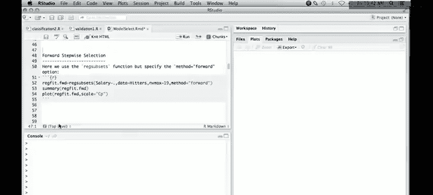

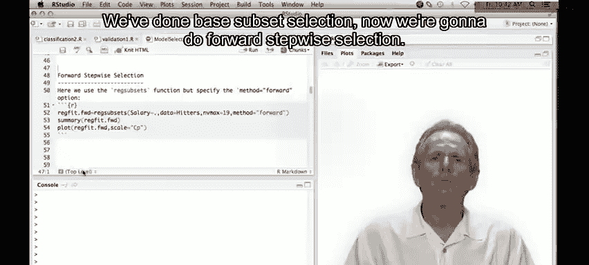

在本节课中，我们将继续学习模型选择方法。上一节我们介绍了最佳子集选择法，本节中我们来看看另一种更高效的策略——前向逐步选择法。

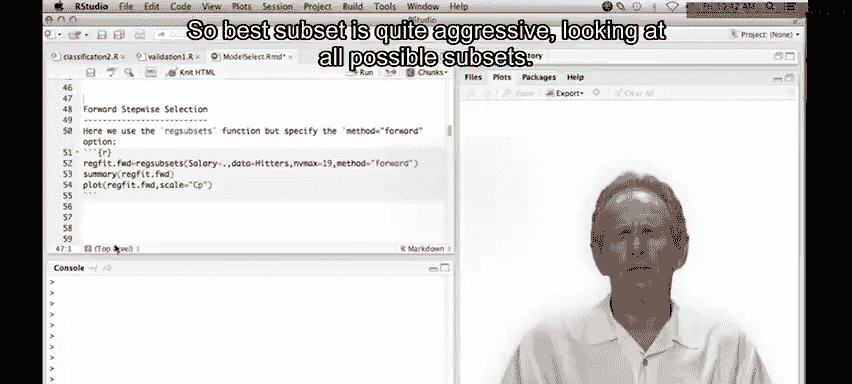

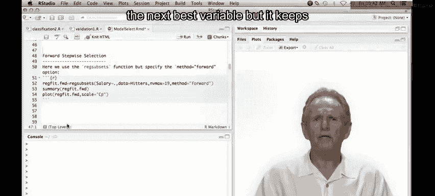

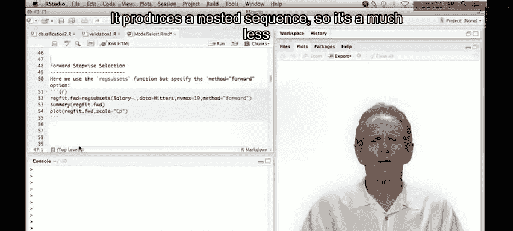

## 概述

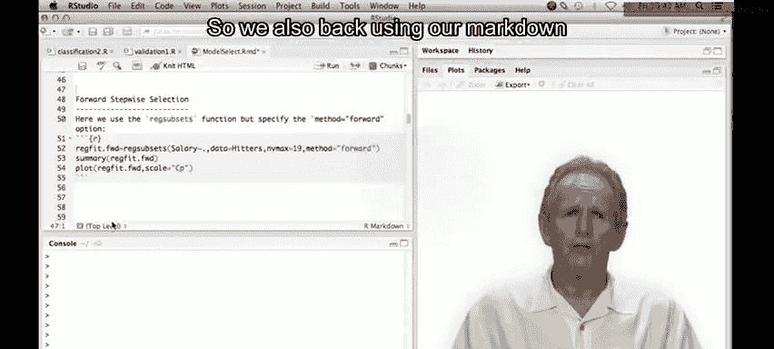

前向逐步选择法是一种贪婪算法。它从一个空模型开始，每次迭代只添加一个对模型拟合提升最大的变量，从而生成一个嵌套的模型序列。与考虑所有可能子集的最佳子集法相比，这种方法搜索范围更小，计算效率更高。

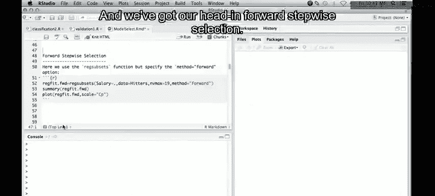

## 前向逐步选择法的原理

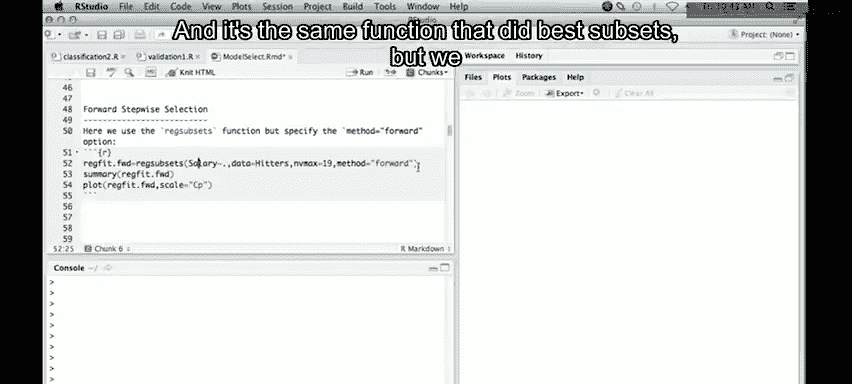

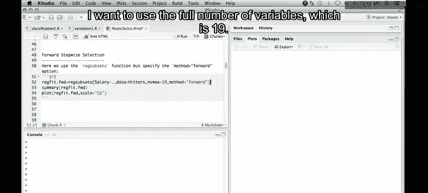

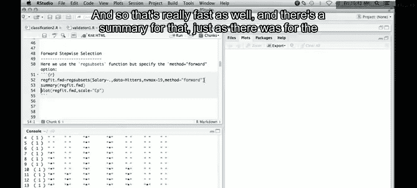

前向逐步选择法的工作流程如下：

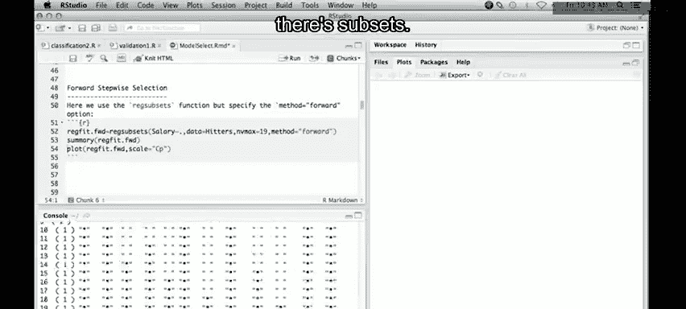

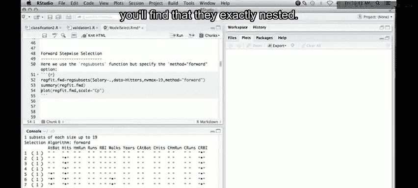

以下是其核心步骤：

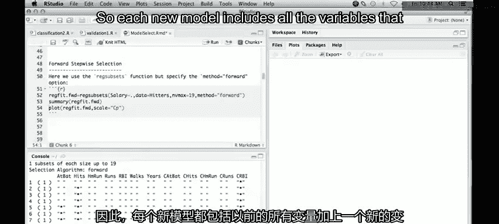

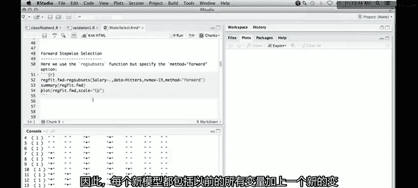

1.  从包含零个预测变量的模型（即空模型）开始。
2.  对于 `k=0, 1, 2, ..., p-1`，考虑所有 `p-k` 个可以向当前模型添加的变量。选择其中能最大程度提升模型拟合效果（例如，使残差平方和RSS下降最多）的变量。
3.  重复步骤2，直到所有变量都被加入模型，或达到预设的停止准则。

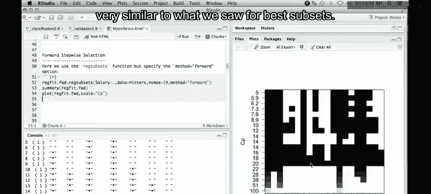

最终，我们得到一个嵌套的模型序列：`M0 ⊂ M1 ⊂ M2 ⊂ ... ⊂ Mp`。

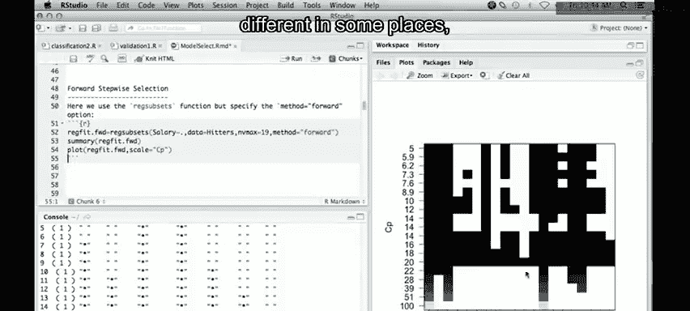

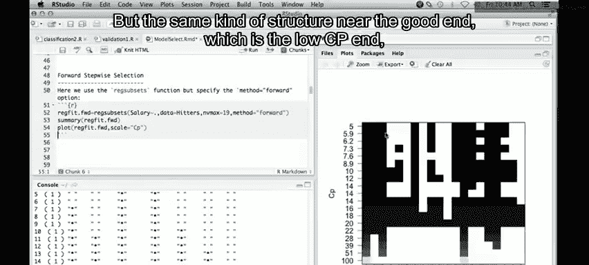

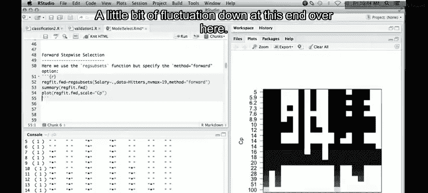


## 在R中实现前向逐步选择

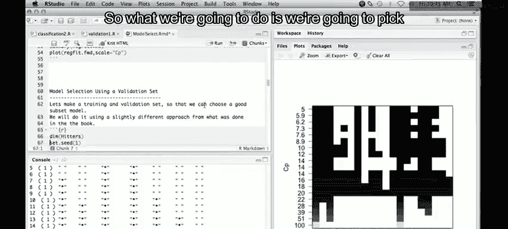

我们将使用 `leaps` 包中的 `regsubsets()` 函数，并通过设置 `method="forward"` 参数来执行前向逐步选择。

以下是具体操作代码：

```r
# 加载leaps包
library(leaps)

# 对Hitters数据集进行前向逐步选择，最多包含全部19个预测变量
forward_fit <- regsubsets(Salary ~ ., data = Hitters, nvmax = 19, method = "forward")

# 查看模型选择摘要
summary(forward_fit)
```

观察摘要结果，你会发现每个新模型都完全包含了前一个模型的所有变量，并新增一个变量，这正是“嵌套序列”的特征。

## 模型评估与验证集方法

我们可以像之前一样，使用Cp统计量等指标来评估不同大小的模型。但本节我们将采用另一种更直接的方法——验证集法。

验证集法的核心思想是将数据分为两部分：

1.  **训练集**：用于拟合模型。
2.  **验证集**：用于评估模型在未见数据上的预测性能（计算验证误差）。

以下是使用验证集评估前向逐步选择模型的步骤：

```r
# 1. 设置随机种子以保证结果可重现
set.seed(1)

# 2. 划分训练集（约2/3数据）和验证集
n <- nrow(Hitters) # 数据总行数，例如263
train_indices <- sample(seq(n), size = 180, replace = FALSE) # 随机抽取180个索引作为训练集
train_data <- Hitters[train_indices, ]
test_data <- Hitters[-train_indices, ] # 剩余数据作为验证集

# 3. 在训练集上运行前向逐步选择
forward_fit_train <- regsubsets(Salary ~ ., data = train_data, nvmax = 19, method = "forward")

# 4. 为验证集创建模型矩阵（设计矩阵）
test_matrix <- model.matrix(Salary ~ ., data = test_data)

# 5. 初始化一个向量，用于存储19个不同大小模型的验证均方误差（MSE）
validation_errors <- rep(NA, 19)

# 6. 循环计算每个模型的验证误差
for(i in 1:19) {
    # 提取第i个模型的系数
    coef_i <- coef(forward_fit_train, id = i)
    # 获取该模型在测试矩阵中对应的预测变量列
    pred_vars <- names(coef_i)[-1] # 去掉截距项
    # 进行预测： X_test * beta
    pred <- test_matrix[, pred_vars] %*% coef_i[-1] + coef_i[1]
    # 计算均方误差 (MSE)
    mse <- mean((test_data$Salary - pred)^2)
    validation_errors[i] <- mse
}

# 7. 绘制验证均方根误差（RMSE）随模型大小变化的曲线图
plot(sqrt(validation_errors), ylab = "Root MSE", xlab = "Model Size", type = "b", pch = 19)
```

从图中通常可以找到一个使验证误差最小的模型大小，这个模型在偏差-方差权衡上表现较好。

## 编写预测函数

由于 `regsubsets()` 对象没有内置的 `predict()` 方法，我们手动编写了一个函数来方便地进行预测。这个函数在后续使用交叉验证时会很有用。

```r
# 为regsubsets对象定义predict方法
predict.regsubsets <- function(object, newdata, id, ...) {
    # 从对象中提取最初拟合时使用的公式
    form <- as.formula(object$call[[2]])
    # 根据公式和新数据创建模型矩阵
    mat <- model.matrix(form, newdata)
    # 提取第id个模型的系数
    coef_i <- coef(object, id = id)
    # 找出模型矩阵中与系数对应的列（变量）
    x_vars <- names(coef_i)
    # 进行预测并返回结果
    pred <- mat[, x_vars] %*% coef_i
    return(pred)
}

# 使用示例：预测验证集上大小为10的模型
pred_10 <- predict(forward_fit_train, newdata = test_data, id = 10)
```

## 总结

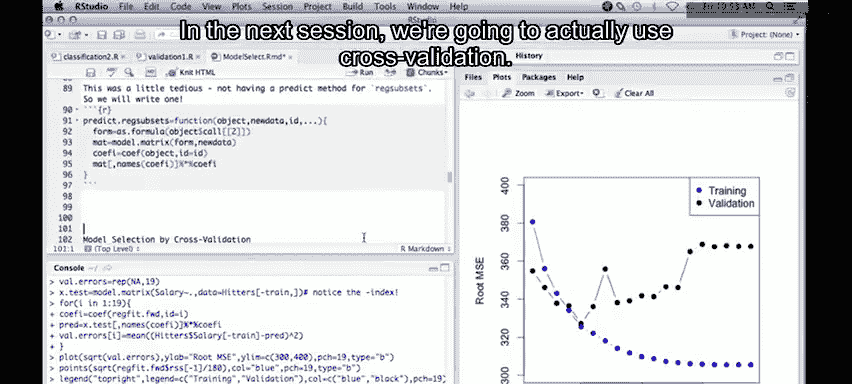

本节课中我们一起学习了前向逐步选择法。我们了解到它是一种计算高效的贪婪算法，通过每次添加一个最佳变量来构建嵌套的模型序列。我们不仅学会了如何在R中实现它，还掌握了使用验证集法来评估不同复杂度模型性能的实用技巧。最后，我们编写了一个自定义的预测函数，为后续更复杂的模型评估（如交叉验证）做好了准备。下一节，我们将探讨模型选择的另一种强大工具——交叉验证。