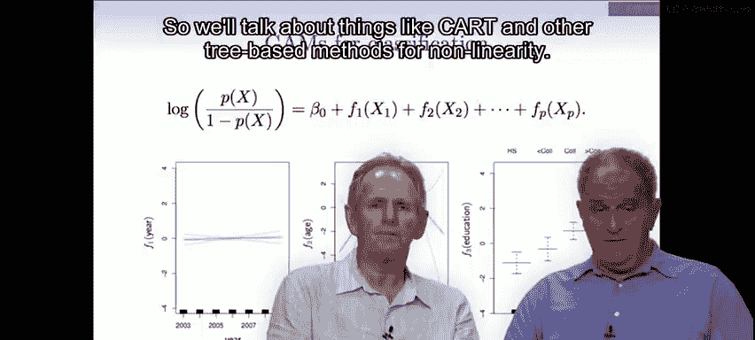

# 49：非线性建模方法（续）与广义可加模型 📊

在本节课中，我们将继续探讨拟合非线性函数的方法，重点介绍**局部回归**，并深入讲解一个强大的建模框架——**广义可加模型**。我们将学习如何将多个变量的非线性效应以可加的形式组合起来，从而构建既灵活又易于解释的模型。

## 局部回归 🎯

上一节我们介绍了一系列拟合非线性函数的方法。本节中，我们来看看另一种重要的方法家族：**局部回归**。

局部回归的核心思想是：在数据的每个局部区域（例如一个滑动窗口内），拟合一个简单的线性函数，而不是为整个数据集拟合一个全局的复杂函数。

以下是局部回归的工作原理：
1.  选择一个目标点（例如上图中的橙色圆点）。
2.  定义一个围绕该目标点的局部区域（例如通过一个核函数确定权重，距离目标点越近的数据点权重越高）。
3.  使用**加权最小二乘法**，仅用该局部区域内的数据点拟合一个线性函数。权重由核函数决定，公式可表示为：最小化 `Σ w_i (y_i - β_0 - β_1 x_i)^2`，其中 `w_i` 是权重。
4.  将该线性函数在目标点处的拟合值，作为该点的最终预测值。
5.  将目标点沿数据范围滑动，重复上述过程，从而得到一条连续的拟合曲线（上图中的橙色曲线）。

与简单的局部常数拟合（如移动平均）相比，局部线性拟合在边界处有更好的外推表现。在R语言中，可以使用 `lowess()` 或 `loess()` 函数来执行局部回归。

## 广义可加模型 ➕

局部回归专注于单变量的局部拟合。现在，我们将视野扩展到多变量情形，介绍**广义可加模型**。GAM的核心目标是同时拟合多个变量的非线性函数，同时保留线性模型的可加性，这使得模型结果易于解释。

一个标准的GAM模型形式如下：
`Y = β_0 + f_1(X_1) + f_2(X_2) + ... + f_p(X_p) + ε`
其中，每个 `f_j()` 都是一个平滑的非线性函数。

### 如何拟合GAM

你可以轻松地使用之前学过的工具（如自然样条）来拟合GAM。以下是一个在R中使用 `lm()` 函数拟合加性模型的示例：

```r
lm(wage ~ ns(year, df=5) + ns(age, df=5) + education, data=dataset)
```

在这个模型中：
*   `ns(year, df=5)` 为 `year` 变量生成一个5自由度的自然三次样条基。
*   `ns(age, df=5)` 为 `age` 变量生成一个5自由度的自然三次样条基。
*   `education` 是因子变量，模型会自动为其拟合分段常数函数。

拟合后，我们通常不关心每个基函数对应的系数，而是关注每个变量整体的拟合函数形状。可以使用 `plot.gam()` 函数来可视化每个变量的贡献。

### 灵活的GAM设定

GAM非常灵活，允许混合不同类型的项：

```r
# 使用 gam 包拟合，混合使用平滑样条和局部回归
library(gam)
gam.model <- gam(wage ~ s(year, df=5) + lo(age, span=0.5) + education, data=dataset)
```

*   `s(year, df=5)`：对 `year` 使用平滑样条，自由度为5。
*   `lo(age, span=0.5)`：对 `age` 使用局部回归（loess），窗口跨度（span）为0.5（即使用50%的数据进行局部拟合）。
*   `education`：作为因子变量处理。

你还可以使用ANOVA来比较模型，检验某个项应该是线性还是非线性。此外，GAM可以包含交互项，通过**双变量平滑器**或**张量积基**来实现多个变量的联合非线性拟合。

### 用于分类的GAM

GAM同样可以应用于分类问题，其思路与逻辑回归类似，只是将对数几率（logit）建模为可加形式：

```r
gam.binary <- gam(I(wage>250) ~ year + s(age, df=5) + education, family=binomial, data=dataset)
```

这里，`family=binomial` 指定了模型为二项分布（逻辑回归）。绘图时，`plot.gam()` 会显示各个变量对**对数几率**的贡献。

## 总结 📝

本节课中我们一起学习了两种高级的非线性建模技术。
*   **局部回归**通过在数据的滑动窗口内进行局部线性拟合，来捕捉非线性趋势，特别擅长处理边界问题。
*   **广义可加模型**则提供了一个强大的框架，能够以可加的形式组合多个变量的非线性效应，在保持模型预测灵活性的同时，也提供了类似于线性模型的**可解释性**。我们可以使用 `lm()` 配合样条基，或专门的 `gam`、`mgcv` 包来拟合GAM。




这些工具极大地扩展了我们处理复杂数据关系的能力。在接下来的课程中，我们将转向**基于树的方法**（如CART），这类方法擅长捕捉变量之间的交互效应和非线性组合。