# 50：使用 R 探索非线性函数 📊

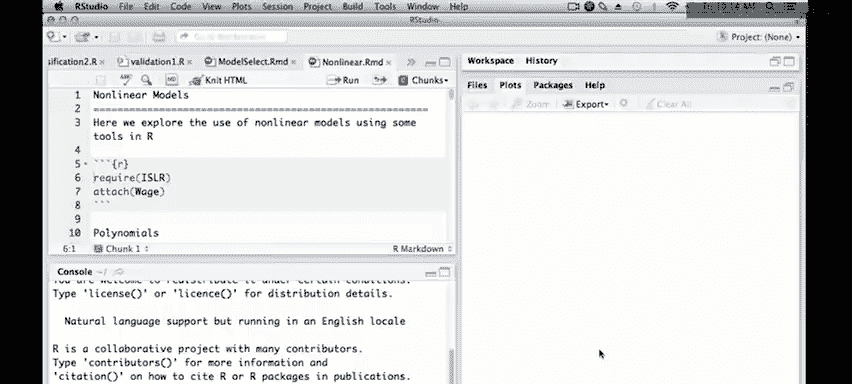

在本节课中，我们将学习如何使用 R 语言来探索和拟合非线性函数。我们将重点介绍多项式回归，并学习如何拟合模型、评估系数、绘制拟合曲线及其置信区间，以及如何将多项式应用于逻辑回归等广义线性模型。课程将使用 R Markdown 环境，以便清晰地记录分析过程和结果。

---

## 1. 准备工作与环境设置

首先，我们需要加载必要的库和数据。我们将使用《统计学习导论》配套的 `ISLR` 包中的 `Wage` 数据集。

```r
# 加载 ISLR 包和数据
library(ISLR)
# 加载 Wage 数据框
attach(Wage)
```

---

## 2. 多项式回归

上一节我们设置了工作环境。本节中，我们来看看如何使用 R 进行多项式回归。多项式回归是拟合非线性关系的一种基本方法。

### 2.1 使用 `poly` 函数拟合多项式

在 R 中，我们可以使用 `poly` 函数方便地生成多项式基，并配合 `lm` 函数进行拟合。以下代码拟合了一个以 `age` 为预测变量、`wage` 为响应变量的四次多项式模型。

```r
# 使用 poly 函数拟合四次多项式
fit <- lm(wage ~ poly(age, 4), data = Wage)
# 查看模型摘要
summary(fit)
```

模型摘要会显示各项的系数及其显著性。`poly` 函数生成的是正交多项式，这意味着各个预测变量之间是不相关的，因此我们可以独立地评估每个多项式项的显著性。从结果来看，一次项和二次项非常显著，三次项显著，而四次项不显著，这表明三次多项式可能就足够了。

### 2.2 绘制拟合曲线与置信区间

我们通常更关心多项式拟合出的整体函数形状，而非单个系数。以下是绘制拟合曲线及 ±2 倍标准误置信区间的步骤。

首先，生成用于预测的 `age` 值网格。

```r
# 获取 age 的范围
agelims <- range(age)
# 生成一个从最小值到最大值的序列作为预测网格
age.grid <- seq(from = agelims[1], to = agelims[2])
```

接着，使用模型在新网格上进行预测，并计算标准误。

```r
# 在新数据上进行预测，并返回标准误
preds <- predict(fit, newdata = list(age = age.grid), se = TRUE)
# 计算置信区间的上下界
se.bands <- cbind(preds$fit + 2 * preds$se.fit, preds$fit - 2 * preds$se.fit)
```

最后，绘制原始数据散点图、拟合曲线和置信区间。

```r
# 绘制原始数据
plot(age, wage, col = "darkgray")
# 添加拟合曲线
lines(age.grid, preds$fit, lwd = 2, col = "blue")
# 添加置信区间（虚线）
matlines(age.grid, se.bands, lwd = 1, col = "blue", lty = 2)
```

### 2.3 直接指定多项式项

除了 `poly` 函数，我们也可以直接在公式中指定 `age` 的各次方项。需要注意的是，公式中的 `^` 符号有特殊含义，需要用 `I()` 函数保护。

```r
# 直接指定多项式项进行拟合
fit2 <- lm(wage ~ age + I(age^2) + I(age^3) + I(age^4), data = Wage)
summary(fit2)
```

使用不同的基（如原始幂次基而非正交基）会导致系数估计值和 p 值不同，但最终的拟合函数是相同的。我们可以通过比较两个模型的拟合值来验证这一点。

```r
# 验证两个模型的拟合值是否相同
plot(fitted(fit), fitted(fit2))
# 如果点都在对角线上，则说明拟合函数相同
```

---

## 3. 模型比较与选择

上一节我们学习了如何拟合多项式。本节中，我们来看看如何比较不同复杂度的模型，以选择最合适的多项式阶数。

### 3.1 使用 `anova` 进行嵌套模型比较

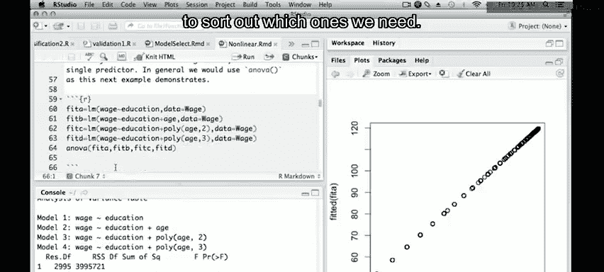

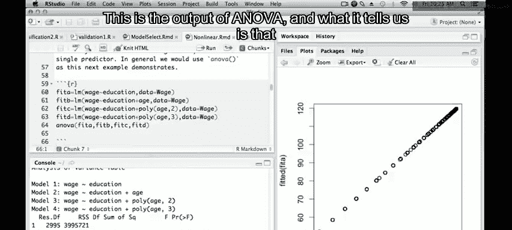

当模型之间存在嵌套关系（即简单模型是复杂模型的特殊情形）时，可以使用 `anova` 函数进行方差分析，以检验增加高阶项是否显著改善了模型。

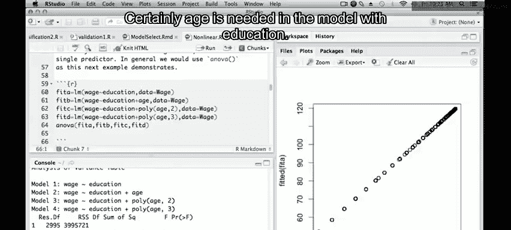

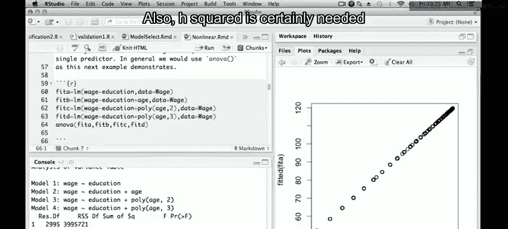

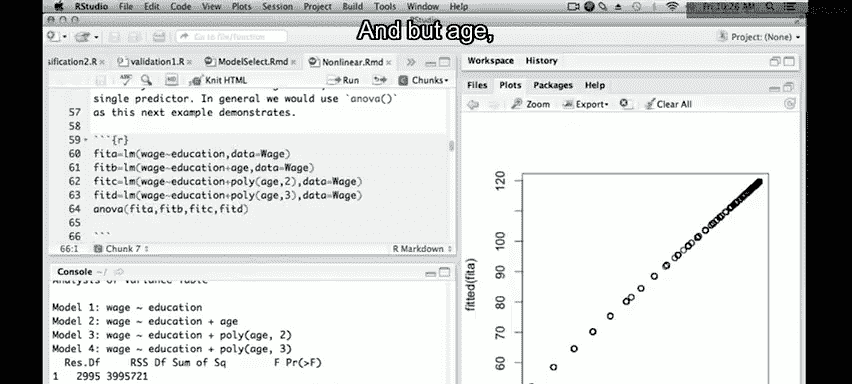

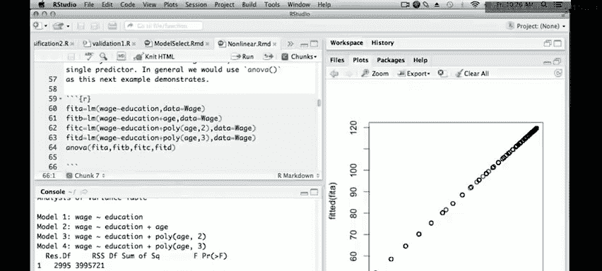

以下是拟合一个包含 `education` 和不同阶数 `age` 多项式的嵌套模型序列，并进行比较的示例。

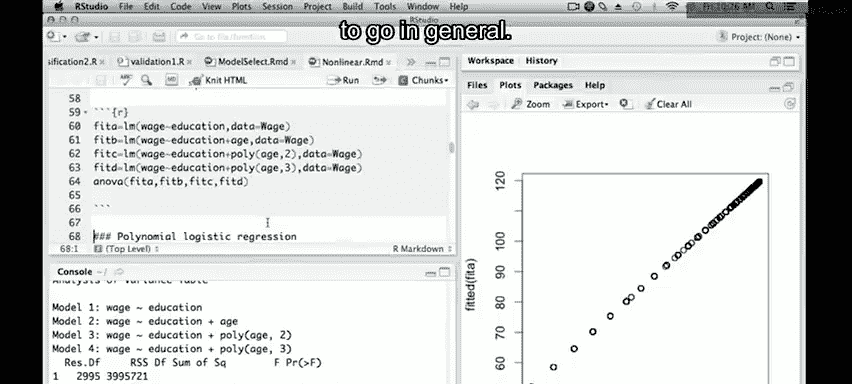

```r
# 拟合一系列嵌套模型
fit.1 <- lm(wage ~ education, data = Wage)
fit.2 <- lm(wage ~ education + age, data = Wage)
fit.3 <- lm(wage ~ education + poly(age, 2), data = Wage)
fit.4 <- lm(wage ~ education + poly(age, 3), data = Wage)
# 使用 anova 进行比较
anova(fit.1, fit.2, fit.3, fit.4)
```

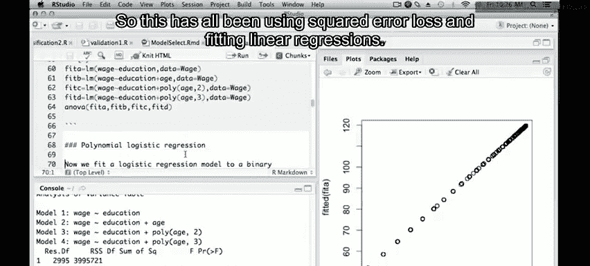

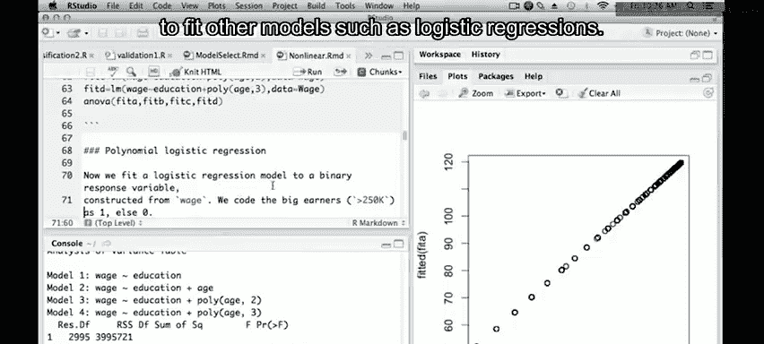

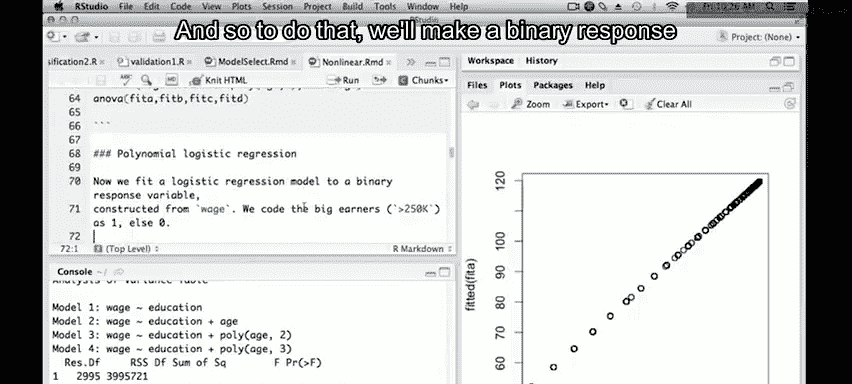

`anova` 的输出会提供 F 检验结果，帮助我们判断是否需要在模型中添加 `age`、`age^2` 或 `age^3`。例如，结果可能显示添加 `age` 和 `age^2` 是必要的，而 `age^3` 的贡献在统计上可能不显著或处于边缘。

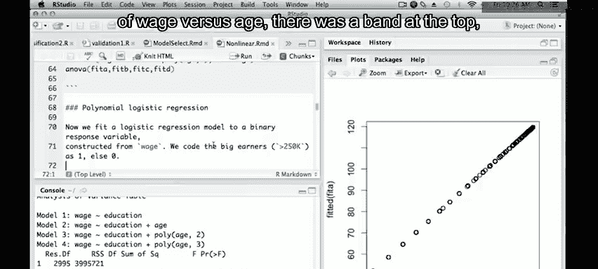

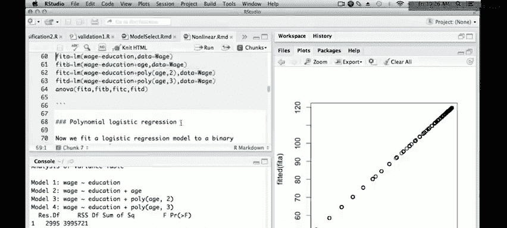

---

## 4. 在广义线性模型中使用多项式

多项式不仅可用于线性回归，也可用于逻辑回归等广义线性模型。接下来，我们将创建一个二值响应变量，并拟合一个多项式逻辑回归模型。

### 4.1 创建二值响应变量并拟合模型

我们根据 `wage` 是否大于 250 来创建一个新的二值变量 `high.earner`。

```r
# 创建二值响应变量：工资是否高于 250k
high.earner <- as.numeric(wage > 250)
# 使用三次多项式拟合逻辑回归模型
fit.glm <- glm(high.earner ~ poly(age, 3), data = Wage, family = binomial)
summary(fit.glm)
```

### 4.2 绘制概率尺度上的拟合曲线

对于逻辑回归，我们更关心事件发生的概率。因此，我们需要将线性预测器（logit 尺度）的预测值转换回概率尺度，并绘制其置信区间。

首先，在 logit 尺度上进行预测并计算标准误。

```r
# 预测 logit 值及标准误
preds.glm <- predict(fit.glm, newdata = list(age = age.grid), se = TRUE)
```

计算 logit 尺度上的置信区间，然后通过逆 logit 函数（即 logistic 函数）将其转换到概率尺度。逆 logit 函数的公式为：
$$ p = \frac{e^{\eta}}{1 + e^{\eta}} $$
其中，$\eta$ 是线性预测值。

```r
# 计算 logit 尺度上的置信区间上下界
logit.se.bands <- cbind(0, preds.glm$fit + 2 * preds.glm$se.fit, preds.glm$fit - 2 * preds.glm$se.fit)
# 应用逆 logit 变换，转换到概率尺度
prob.se.bands <- exp(logit.se.bands) / (1 + exp(logit.se.bands))
# 提取中间列（拟合值）作为概率曲线的中心
prob.fit <- prob.se.bands[, 2]
# 提取第一和第三列作为置信区间的上下界
prob.upper <- prob.se.bands[, 1]
prob.lower <- prob.se.bands[, 3]
```

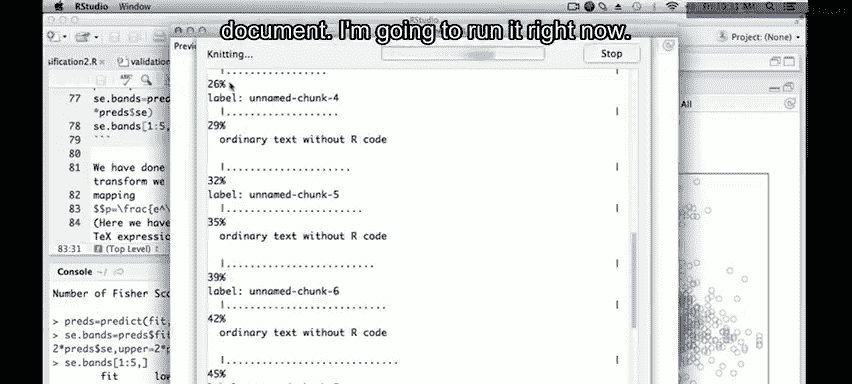

现在，我们可以绘制概率拟合曲线及其置信区间。为了更清晰地展示数据分布，我们对 `age` 添加了轻微的随机扰动（jitter）。

```r
# 绘制概率拟合曲线，限制 y 轴范围以聚焦于低概率区域
plot(jitter(age), high.earner, pch = ".", ylim = c(0, .1))
lines(age.grid, prob.fit, lwd = 2, col = "blue")
lines(age.grid, prob.upper, lwd = 1, col = "blue", lty = 2)
lines(age.grid, prob.lower, lwd = 1, col = "blue", lty = 2)
```

这张图展示了高收入概率随年龄变化的估计，以及其 95% 置信区间。在概率尺度上计算置信区间可以确保其值始终在 0 到 1 之间。

---

## 5. 总结

在本节课中，我们一起学习了在 R 中使用多项式进行非线性建模的核心技能。

我们首先介绍了如何使用 `poly` 函数便捷地拟合多项式回归模型，并解释了正交多项式系数的独立性。接着，我们详细讲解了如何绘制拟合曲线及其置信区间，这是评估模型效果的关键可视化手段。

然后，我们探讨了模型比较，学习了如何使用 `anova` 函数对嵌套模型进行假设检验，从而为多项式选择最合适的阶数。

最后，我们将多项式的应用扩展到了广义线性模型，特别是逻辑回归。我们演示了如何将 logit 尺度上的预测转换回概率尺度，并绘制出有意义的置信区间图。

通过本节课，你已经掌握了使用 R 实施多项式回归、进行模型诊断和比较、以及将方法扩展到更广泛模型家族的基本工作流程。在接下来的课程中，我们将学习更灵活的非线性建模工具——样条函数。