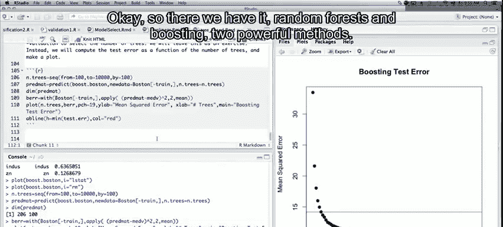
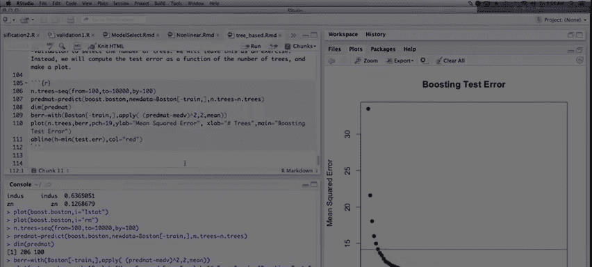

# 58：随机森林与提升法 🌲🚀

在本节课中，我们将学习如何将决策树应用于更强大的集成学习方法：随机森林和提升法。我们将使用R语言中的相关包，通过波士顿房价数据集进行实践，并比较这两种方法的性能。

---

## 加载数据与包

首先，我们需要加载必要的R包和数据。我们将使用`randomForest`包进行随机森林建模，使用`gbm`包进行梯度提升建模，并使用`MASS`包中的波士顿房价数据集。

```r
# 加载必要的包
library(randomForest)
library(gbm)
library(MASS)

# 设置随机种子以确保结果可重现
set.seed(1)

# 加载数据
data(Boston)
# 查看数据结构
str(Boston)
```

数据包含506个观测值，每个观测值代表波士顿的一个郊区，包含诸如犯罪率、房间数、房龄等多个预测变量。我们的响应变量是`medv`，即该郊区业主自住房屋的中位数价值。

我们将数据分为训练集（300个观测值）和测试集（206个观测值）。

```r
# 创建训练集索引
train <- sample(1:nrow(Boston), 300)
```

---

## 构建随机森林 🌲🌲

上一节我们介绍了决策树，本节中我们来看看如何通过构建大量树并平均其预测来创建随机森林，以此降低方差。

以下是构建随机森林模型的代码：

```r
# 在训练集上拟合随机森林模型
rf.boston <- randomForest(medv ~ ., data = Boston, subset = train)
# 查看模型摘要
rf.boston
```

模型摘要会显示生成的树的数量（默认为500）、均方残差以及解释的方差百分比。随机森林的一个关键概念是**袋外误差**，它是每个观测值用未包含该观测值的树进行预测的平均误差，可以作为预测误差的无偏估计。

随机森林的主要调优参数是`mtry`，它代表在每次分裂节点时随机选择的变量数量。接下来，我们将通过循环不同的`mtry`值来探索其对性能的影响。

```r
# 初始化向量以记录误差
oob.err <- numeric(13)
test.err <- numeric(13)

# 循环不同的mtry值（1到13）
for(mtry in 1:13) {
  # 拟合随机森林，限制树的数量为400以加快速度
  fit <- randomForest(medv ~ ., data = Boston, subset = train, mtry=mtry, ntree=400)
  # 获取袋外误差
  oob.err[mtry] <- fit$mse[400]
  # 在测试集上进行预测并计算误差
  pred <- predict(fit, Boston[-train, ])
  test.err[mtry] <- mean((Boston[-train, "medv"] - pred)^2)
  # 打印进度
  cat(mtry, " ")
}
```

完成循环后，我们可以绘制袋外误差和测试误差随`mtry`变化的曲线。

```r
# 将两种误差合并为矩阵以便绘图
matplot(1:mtry, cbind(test.err, oob.err), pch=19, col=c("red", "blue"),
        type="b", ylab="均方误差", xlab="mtry（每次分裂选择的变量数）")
# 添加图例
legend("topright", legend=c("测试误差", "袋外误差"), pch=19, col=c("red", "blue"))
```

从图中可以看出，`mtry`值在4到8之间时，模型性能最佳，误差达到一个相对平坦的平台期。与单棵决策树（误差约26）相比，随机森林将误差降低到了14左右，性能提升显著。

---

## 使用GBM进行梯度提升 🚀

随机森林通过平均大量深树来降低方差，而提升法则通过顺序添加大量浅树来偏置。接下来，我们使用`gbm`包来构建梯度提升模型。

以下是构建梯度提升模型的代码和关键参数：
*   `n.trees`: 树的数量（我们设为10000）。
*   `interaction.depth`: 每棵树的深度（分裂次数），我们设为4，意味着是浅树。
*   `shrinkage`: 收缩参数（学习率），我们设为0.01，用于控制每棵树对最终模型的贡献程度。

```r
# 在训练集上拟合梯度提升模型
boost.boston <- gbm(medv ~ ., data = Boston[train, ], distribution="gaussian",
                    n.trees=10000, interaction.depth=4, shrinkage=0.01)
# 查看模型摘要（包含变量重要性）
summary(boost.boston)
```

`summary`函数会输出一个变量重要性图。在波士顿房价数据中，`rm`（房间数）和`lstat`（低收入人口比例）是两个最重要的预测变量。

我们还可以绘制这两个变量的**偏依赖图**，以查看它们与响应变量之间的大致关系。

```r
# 绘制偏依赖图
par(mfrow=c(1,2))
plot(boost.boston, i="rm")
plot(boost.boston, i="lstat")
```

图显示，房间数越多，房价中位数越高；而低收入人口比例越高，房价中位数越低，这与常识相符。

---

## 评估与比较 📊

现在，我们来评估提升模型在测试集上的性能，并将其与随机森林的最佳结果进行比较。

首先，我们计算提升模型在不同树数量下的测试误差。

```r
# 创建一个树数量的序列（从100到10000，步长为100）
n.trees <- seq(from=100, to=10000, by=100)
# 使用模型对测试集进行预测（针对每个树数量）
predmat <- predict(boost.boston, newdata=Boston[-train, ], n.trees=n.trees)
# 计算每个树数量对应的测试均方误差
# 这里利用R的循环规则，用向量减去矩阵
test.err.boost <- apply((predmat - Boston[-train, "medv"])^2, 2, mean)
```

然后，我们可以绘制测试误差随树数量变化的曲线。

```r
# 绘制提升法的测试误差曲线
plot(n.trees, test.err.boost, pch=19, col="blue", type="b",
     ylab="测试均方误差", xlab="树的数量")
# 在图上添加随机森林的最佳测试误差（作为参考线）
abline(h=min(test.err), col="red", lwd=2, lty=2)
# 添加图例
legend("topright", legend=c("梯度提升", "随机森林（最佳）"), col=c("blue", "red"), lty=c(1,2))
```

从图中可以看到，梯度提升法的误差随着树的数量增加而下降，并最终稳定在一个低于随机森林最佳测试误差的水平。这表明，通过仔细调优（如树的数量、深度和学习率），提升法通常能够获得比随机森林更好的预测性能。

---

## 总结 🎯



本节课中我们一起学习了两种强大的集成学习算法：

1.  **随机森林**：通过构建大量决策树并平均其预测来工作。它主要减少模型的方差，对过拟合不敏感，且调参简单（主要关注`mtry`）。
2.  **梯度提升法**：通过顺序添加浅层决策树来工作，每一棵新树都试图修正前一棵树的残差。它主要减少模型的偏差，性能通常更优，但需要调优的参数更多（如树的数量、深度`interaction.depth`和学习率`shrinkage`）。



两种方法都是提升预测模型性能的有效工具。随机森林因其简单性和稳健性而易于使用，而梯度提升法则在愿意投入更多调优努力时，往往能提供更卓越的预测精度。