# 63：支持向量机（SVM）实战教程 📊


在本节课中，我们将学习支持向量机（SVM）的基本概念，并通过R语言进行实战演示。我们将生成模拟数据，拟合线性支持向量分类器，并可视化决策边界和支持向量。课程将重点展示如何绘制结果图，而非交叉验证等高级调参技巧。

---

## 数据生成与可视化 📈

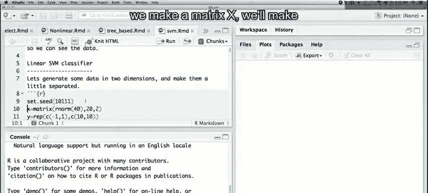

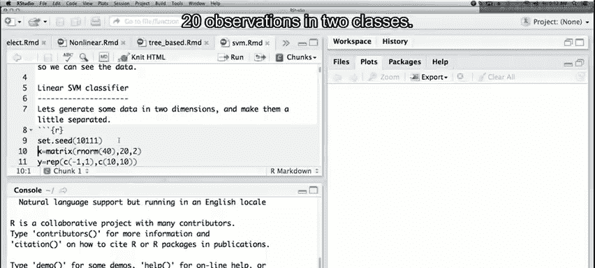

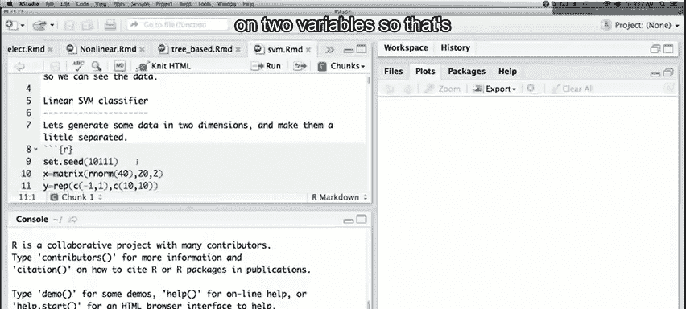

首先，我们生成一个包含20个观测值的数据集。数据集有两个预测变量（X1, X2）和一个二分类响应变量（Y，取值为-1或+1）。每个类别有10个观测点。对于Y=+1的类别，我们将其坐标均值从0移动到1，以使两类数据分离。

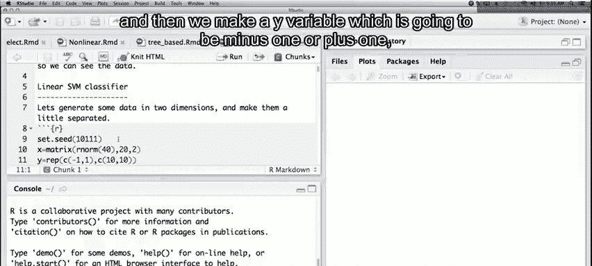

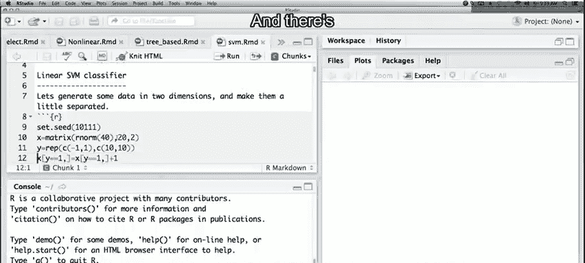

以下是生成数据的R代码：


```r
set.seed(1)
x <- matrix(rnorm(20*2), ncol=2)
y <- c(rep(-1,10), rep(1,10))
x[y==1,] <- x[y==1,] + 1
```

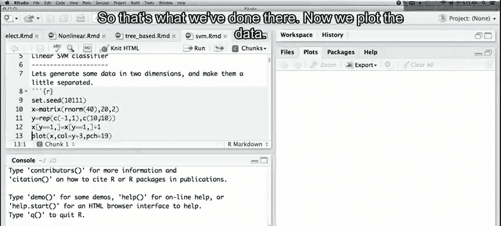

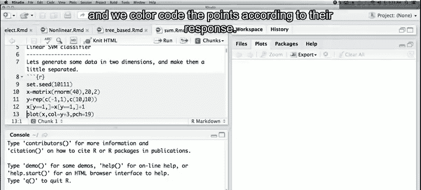

数据生成后，我们将其可视化。根据响应变量Y的值，用红色（Y=-1）和蓝色（Y=+1）区分数据点。

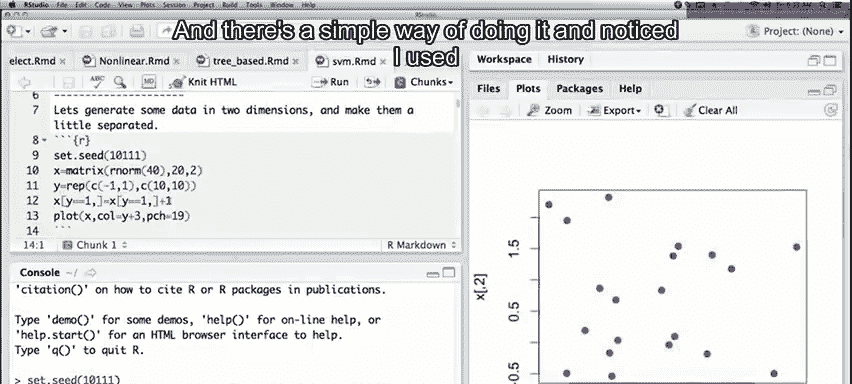

```r
plot(x, col=(3-y), pch=19)
```

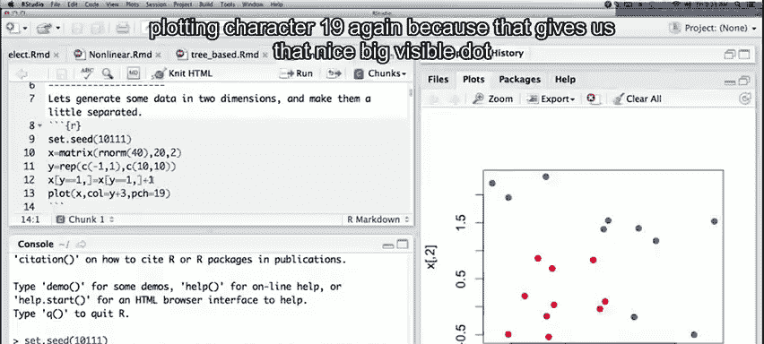

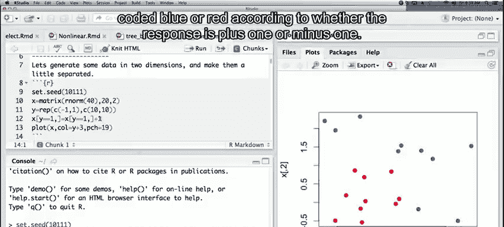

---

## 拟合线性支持向量分类器 ⚙️

上一节我们生成了数据并进行了可视化。本节中，我们将使用`e1071`包中的`svm`函数来拟合一个线性支持向量分类器。

首先，需要加载`e1071`库。然后，将数据转换为数据框格式，并将响应变量`y`转换为因子变量。接着，调用`svm`函数进行拟合。我们指定使用线性核（`kernel="linear"`），并将成本参数`cost`设置为10。同时，要求模型不对变量进行标准化（`scale=FALSE`）。

以下是拟合模型的R代码：

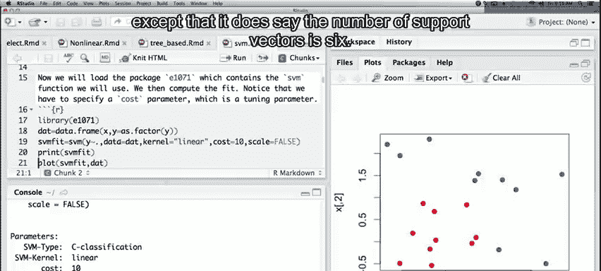

```r
library(e1071)
dat <- data.frame(x=x, y=as.factor(y))
svmfit <- svm(y ~ ., data=dat, kernel="linear", cost=10, scale=FALSE)
```

拟合完成后，可以打印模型摘要。摘要信息显示，此模型使用了6个支持向量。

---

## 创建网格并进行预测 🗺️

在上一节中，我们拟合了SVM模型。为了可视化决策边界，我们需要在整个数据范围内创建一个精细的网格点阵，并对每个网格点进行预测。

我们定义一个名为`make.grid`的函数来创建这个网格。该函数接收数据矩阵`x`和每个方向的网格点数`n`作为参数，并返回一个覆盖数据范围的均匀网格。

以下是创建网格和进行预测的R代码：

```r
make.grid <- function(x, n=75) {
  grange <- apply(x, 2, range)
  x1 <- seq(from=grange[1,1], to=grange[2,1], length=n)
  x2 <- seq(from=grange[1,2], to=grange[2,2], length=n)
  expand.grid(X1=x1, X2=x2)
}
xgrid <- make.grid(x)
ygrid <- predict(svmfit, xgrid)
```

现在，`xgrid`包含了5625个网格点，`ygrid`包含了模型对这些点的分类预测。

---

## 可视化决策边界与支持向量 🎨

在获得网格预测结果后，我们可以绘制决策边界。首先，根据预测结果`ygrid`的颜色为所有网格点上色。然后，将原始数据点叠加在图上。最后，突出显示支持向量。

SVM拟合对象中有一个名为`index`的组件，它标识了哪些点是支持向量。我们将用更大的符号将这些点标记在图上。

以下是绘制图形的R代码：

```r
plot(xgrid, col=c("red","blue")[as.numeric(ygrid)], pch=20, cex=.2)
points(x, col=y+3, pch=19)
points(x[svmfit$index,], pch=5, cex=2)
```

从图中可以清晰地看到决策边界，以及靠近边界或位于错误一侧的支持向量。

---

## 提取决策边界系数 📐

`svm`函数本身不直接提供描述线性决策边界的系数。但我们可以根据拟合对象中的信息自行计算。

决策边界的方程形式为：**β₀ + β₁X₁ + β₂X₂ = 0**。通过一些代数运算，可以从该方程中推导出直线的斜率和截距。

以下是提取系数并绘制决策边界及间隔的R代码：

```r
beta <- drop(t(svmfit$coefs) %*% x[svmfit$index,])
beta0 <- svmfit$rho
plot(xgrid, col=c("red","blue")[as.numeric(ygrid)], pch=20, cex=.2)
points(x, col=y+3, pch=19)
points(x[svmfit$index,], pch=5, cex=2)
abline(beta0/beta[2], -beta[1]/beta[2])
abline((beta0-1)/beta[2], -beta[1]/beta[2], lty=2)
abline((beta0+1)/beta[2], -beta[1]/beta[2], lty=2)
```

最终图形清晰地展示了决策边界（实线）以及上下间隔（虚线）。可以看到，部分支持向量正好落在间隔线上，而另一些则位于间隔内部。

---

## 总结 ✨

本节课中，我们一起学习了支持向量机（SVM）的基本应用。我们从生成模拟二分类数据开始，使用`e1071`包拟合了线性支持向量分类器。为了深入理解模型，我们创建了预测网格来可视化决策区域，并学会了如何从拟合结果中提取决策边界的系数，从而精确绘制出决策边界和分类间隔。整个过程展示了SVM作为线性分类器的核心机制，即寻找最大间隔超平面，并识别出对定义该平面至关重要的支持向量。