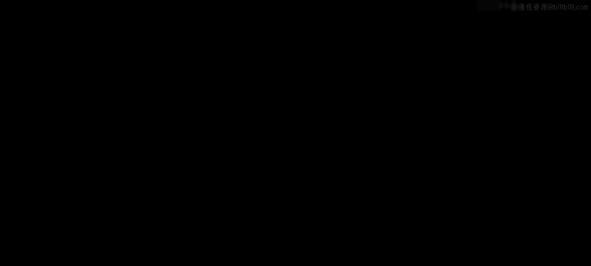
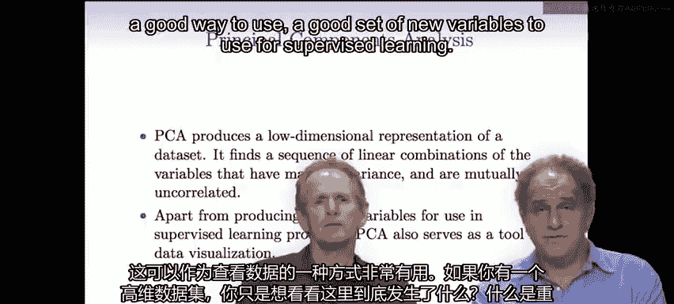
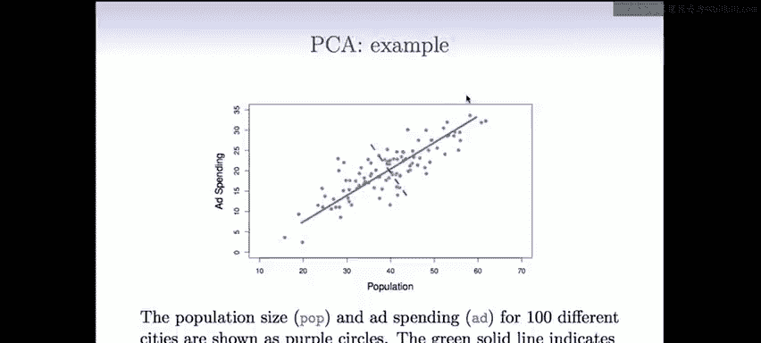

# 65：无监督学习入门 🧠

在本节课中，我们将要学习无监督学习的基本概念，并将其与有监督学习进行对比。我们将重点介绍两种核心的无监督学习方法：主成分分析和聚类分析。

---

欢迎回来。今天的课程是关于无监督学习。

首先，让我们回顾一下有监督学习的含义，并将其与无监督学习进行对比。在有监督学习中，“监督”一词指的是存在一个目标或标签，我们需要从训练数据中预测它。我们拥有特征，并试图预测标签，这个标签“监督”着学习过程。

例如，可以想象一个幼儿园老师向孩子展示一些例子，比如“约翰尼，这是五个用乐高搭的房子例子，这是五个汽车例子”，并告诉他哪些是房子，哪些是汽车。老师在进行监督学习，孩子则观察并找出房子的特征和汽车的特征。

相比之下，在无监督学习中，没有标签。这位幼儿园老师只会给约翰尼看一堆东西，但不告诉他哪些是汽车，哪些是房子。孩子观察这些物体，试图找出一些模式。他可能会意识到，这五个看起来相似，也许应该归为一组；另外五个看起来也彼此相似，可以归为另一组。

这意味着，在有监督学习中，我们有一个Y（标签）；而在无监督学习中，我们没有。两者都有特征，但正如特雷弗所说，在有监督学习中，训练数据里有一个真实的Y标签。无监督学习在某种意义上更难，因为我们没有实际的标签。

---

## 无监督学习的目标与挑战

现在让我们转到幻灯片一。正如我们所见，本课程大部分内容集中在第一个练习——有监督学习上，即我们有标签的情况。

但今天我们将讨论没有标签的情况，即无监督学习。我们只观察特征，像之前一样称之为X1到XP。我们想知道特征之间是如何相互关联的。

具体来说，无监督学习的目标是什么？它们不像有监督学习那样明确，后者的目标是从X预测Y。现在我们没有Y，所以目标有些模糊。

例如，我们可能希望在观测值中发现子群，就像在我的幼儿园例子中，孩子可能试图在他看到的物体中发现子群。我们可能想知道，是否有好的方式来查看数据，以找到最重要的特征或在不同物体间变化最大的特征？

我们将讨论许多无监督学习方法，但在这简短的讲座中，我们只讨论其中最重要的两种。第一种是**主成分分析**，它是一种查看数据或为后续有监督学习预处理特征的工具。第二种是**聚类**，这是一类将对象分组到不同子群的方法。

今天我们将讨论这两种方法。但让我们再稍微谈谈无监督学习挑战的普遍性。正如我提到的，它有点模糊，因为没有像预测那样简单的目标。没有可用的Y。我们不是在预测。目标，正如我们在前几张幻灯片中看到的，更加模糊。

尽管如此，无监督学习实际上正变得越来越重要，原因有很多。

---

## 无监督学习的重要性与应用

首先，让我们看一些例子。实际上，在讲座最后你会看到一个真实例子：我们拥有通过基因芯片测量了基因表达的乳腺癌患者数据，我们希望根据这些数据将患者分成不同的乳腺癌亚组。这些亚组在生物学特征和患者生存率方面实际上有很大不同。

另一个例子是市场营销：如果我们有购物者，并可以记录他们的浏览和购买历史，我们可以将购物者分组或细分到不同的群体，然后可能针对不同群体投放不同类型的广告，因为他们的行为不同。

另一个非常流行的例子是根据电影观众给出的评分对电影进行分组，比如惊悚片、爱情片等。

使无监督学习越来越重要的另一个原因是，有更多未标记的数据可用。这是因为，为数据获取标签可能成本高昂或耗时。例如，网络上有海量图片，人们不断上传图片到谷歌等地方，但大多数都没有标签，没有人确切告诉我们图片里有什么。我们可以通过机器收集特征（图片），但实际的标注通常需要人工干预，这更耗时耗力。另一个例子是网络上的电影评论，很多人试图将影评与电影质量关联起来并对电影分组。一个问题是，如果一篇影评是由人写的，机器很难判断它到底是好评还是差评，因为影评可能带有讽刺意味。对人来说，读一段文字很容易判断作者是否喜欢这部电影，但对计算机来说则不那么容易。这就是一个获取真实标签可能相当困难和耗时的例子。

---

## 方法一：主成分分析 📊

好的，让我们从第一种主要的无监督学习方法——主成分分析开始。这可能要追溯到20世纪30年代的统计学，当时它首次被发明。

PCA生成数据集的低维表示。它找出一系列变量或特征的线性组合，这些组合具有最大方差，同时彼此不相关。

我们将看到，第一个主成分在整个数据中具有最高的方差，它是特征的线性组合。然后是第二个成分，它与第一个不相关，并在该约束下具有最高的方差，依此类推。

想象一下，你有很多变量，其中许多是相关的。这可能是一个难以管理的集合。主成分分析试图做的是，将集合精简为一些重要的变量，这些变量总结了数据中的所有信息，这些就是主成分。这作为一种查看数据的方式非常有用，如果你有一个高维数据集，你只是想看看这里真正发生了什么，什么是重要的，主成分视图是展示数据的最重要方式之一。其次，如果你有很多特征想用于有监督学习，这些变量的主成分摘要可以成为一组用于有监督学习的新变量的好选择。

与主成分分析相关的技术是统计学和数据分析中使用最广泛的工具之一。

---

### 定义与计算主成分

那么，让我们来实际定义主成分。我们有一组变量X1到Xp。第一个主成分Z1是这些变量的一个线性组合。它被定义为在整个数据集中具有最高方差的线性组合。

当然，我们需要选择权重。它由一组权重V1到Vp定义。但如果允许我将这些权重设得任意大，我就可以让Z1的方差任意大。所以我们需要对权重施加一些约束。

自然的约束是将其标准化，使其平方和为1。这使得选择一组具有最高方差的权重成为一个合理的问题。

这些权重在某些统计学和社会科学领域被称为**载荷**。

因此，P11到P1p是第一个主成分的载荷，载荷向量就是这P个数字的集合。如果不加约束，你当然可以把它们设得更大，但这只会让方差更高。所以你需要精确地约束它们。

---

在讨论如何实际计算成分之前，这里有一个例子。这个数据是关于广告支出与人口的。红点是数据点，我根据这两个变量绘制了它们（在这个例子中p=2）。第一个主成分由数据在这条线上的投影给出。这个方向在所有特征组合中具有该数据的最高方差。相应地，另一个方向具有最低的方差。这里只有两个成分，所以我得到了最高方差的第一个主成分。第二个成分也具有最高方差，但约束条件是必须与第一个成分不相关，这意味着它必须与第一个成分成直角。如果你只有两个变量，你最多只能得到两个成分，这里只是为了说明，我们展示两个变量。

---

那么，我们如何实际计算这些成分呢？假设我们有数据，即n x p的特征矩阵X。由于我们只对方差感兴趣，我们可以将变量中心化，使其均值为零。换句话说，具体来说，我们使X的列均值为0。

然后，我们想找到具有最高方差的变量组合。记住，高方差是在载荷平方和为1的约束下。

由于数据在第一步已调整为均值为零，这意味着Z的均值为零，因此方差就是Z的平方和。

继续计算，我们有Z，我们将其定义为载荷乘以特征的和。现在，我们可以用上一张幻灯片的表达式替换Z，我们想找到最高方差，也就是这个表达式，但要满足载荷必须标准化的条件。

这是一个计算问题，未知数是这些权重，优化可以通过**奇异值分解**完成，这是数值分析中的标准技术，我们不会涵盖。但如果你想自己阅读，它非常有趣，在统计学的许多领域都非常重要，例如在我们的《统计学习导论》书中有所介绍。

当我们解决了这个问题，我们就得到了最佳载荷。得到的Z值就是第一个主成分，我们将其写为z11到zn1。这就像我们创建了一个新变量。我们原来有P个变量，现在我们创建了一个新变量C1，它有n个值，就像我们原来的每个变量一样。

我们可以从几何角度思考。让我们回到刚才的图片。载荷向量是特征空间中的一个方向，将数据投影到该方向上具有最高方差。投影数据的值被称为主成分得分。

让我们回到二维示例的图片。我说这是第一个主成分。这意味着载荷向量指向从中心到东北的方向。所以这里可能类似于(1, 1)或大致如此。这就是我们使用主成分计算出的特征组合。实际计算值是数据点在这条线上的投影。我们可以设定原点在这里，然后测量每个点，取它在这条线上的投影，测量它离原点有多远。所以对于这些点，Z值为正；对于这些点，Z值为负。这样，我们用每个点沿这条线的距离替换了原来的点。这就是第一个主成分。

---

## 总结

本节课中，我们一起学习了无监督学习的基本概念，并将其与有监督学习进行了对比。我们探讨了无监督学习模糊但重要的目标，例如发现子群和识别重要特征。我们重点介绍了两种核心方法：主成分分析和聚类分析。我们详细讨论了主成分分析，了解了它如何通过寻找具有最大方差且互不相关的线性组合来生成数据的低维表示，并学习了其计算的基本思想。在接下来的课程中，我们将继续探讨聚类分析等其他无监督学习方法。