# 72：层次聚类详解 📊

在本节课中，我们将学习层次聚类。层次聚类是另一种聚类方法，其工作原理与之前介绍的方法有所不同。我们将使用R语言进行演示，并解释其核心概念和操作步骤。

## 概述

层次聚类是一种自底向上的聚类技术。它从每个数据点作为一个单独的簇开始，逐步合并最相似的簇，直到所有数据点合并为一个簇。这种方法生成一个树状图，称为**系统树图**，直观展示数据点之间的层次关系。

## 计算距离矩阵

层次聚类基于距离矩阵工作。我们使用相同的数据集，并计算其距离矩阵。

```r
dist_matrix <- dist(x)
```

上述代码计算一个100x100的成对距离矩阵。`dist()`函数用于计算数据点之间的距离。

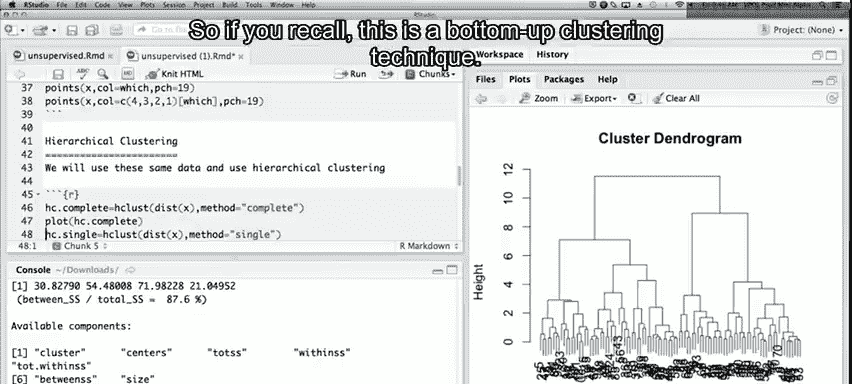

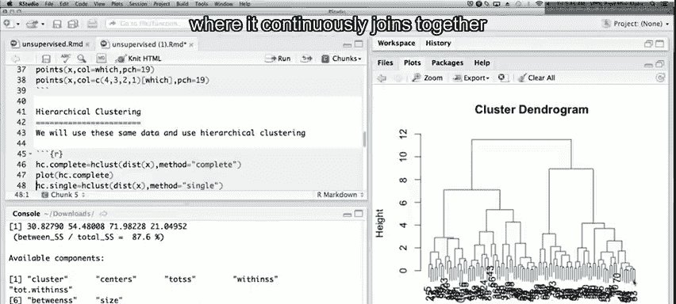

## 进行层次聚类

我们使用`hclust()`函数进行层次聚类。该函数是R中执行层次聚类的主要工具。

```r
hc_complete <- hclust(dist_matrix, method = "complete")
```

`method = "complete"`指定使用**完全连接**方法。该方法在决定两个簇的接近程度时，使用一个簇中任意点与另一个簇中任意点之间的最大距离。

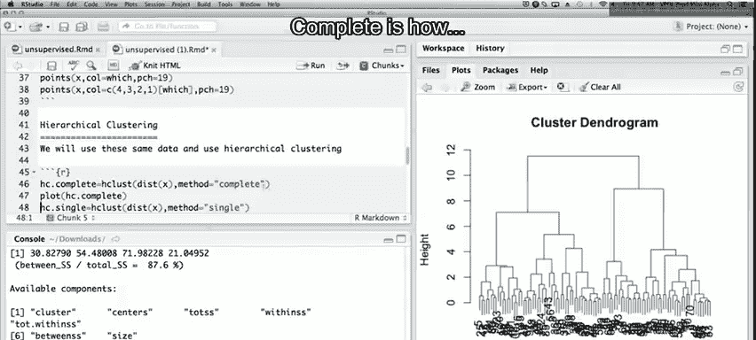

## 绘制系统树图

绘制系统树图可以直观地看到聚类过程。

```r
plot(hc_complete)
```

系统树图从底部开始，显示较小的簇如何逐步合并成较大的簇。在本例中，数据包含四个自然簇，从系统树图的分支高度可以明显看出这四个主要簇。

## 不同连接方法的比较

除了完全连接，还有其他连接方法，如**单连接**和**平均连接**。

以下是使用单连接方法的代码：

```r
hc_single <- hclust(dist_matrix, method = "single")
plot(hc_single)
```

单连接方法使用两个簇之间最近点之间的距离。它倾向于发现细长、延伸的簇，可能无法形成我们期望的紧凑球状簇。

平均连接方法介于两者之间：

```r
hc_average <- hclust(dist_matrix, method = "average")
plot(hc_average)
```

对于当前数据，`method = "complete"`（完全连接）可能是更合适的选择。

## 切割树状图以获取聚类

为了获得具体的簇分配，我们需要在指定高度切割系统树图。我们希望得到四个簇。

```r
cluster_cut <- cutree(hc_complete, k = 4)
```

`cutree()`函数根据指定的簇数量（`k = 4`）切割树状图，并返回一个向量，其中包含每个数据点的簇分配标签。

## 评估聚类结果

我们可以将层次聚类的结果与已知的真实簇标签进行比较。

```r
table(cluster_cut, true_labels)
```

交叉表会显示一个大数字集中在对角线上的矩阵，表示正确分类；非对角线上的小数字则表示错误分类。在本例中，层次聚类出现了三个错误分类。

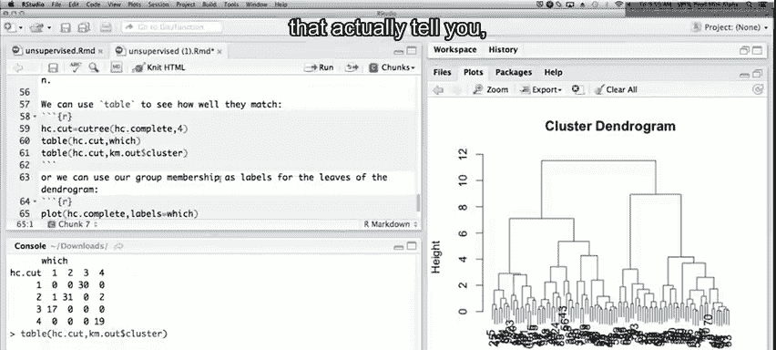

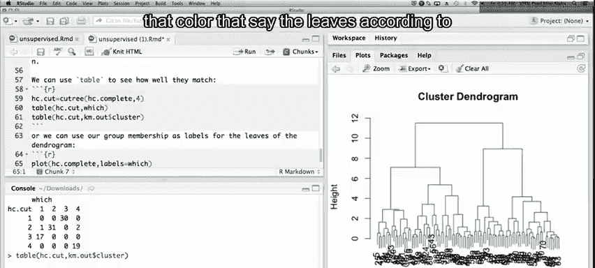

我们还可以将其与K均值聚类的结果进行比较。K均值聚类在本数据上有两个错误分类。两种方法的结果大体一致，但在少数数据点上存在分歧。

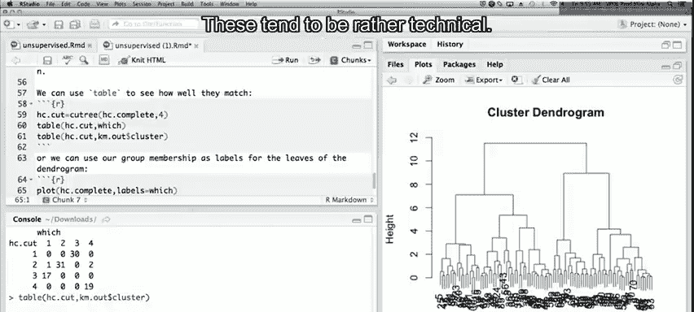

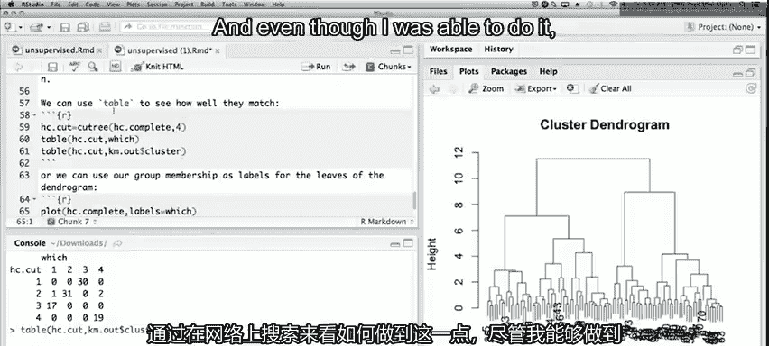

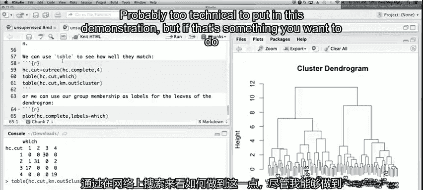

## 标记系统树图

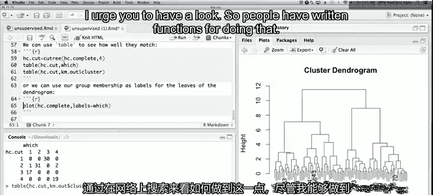

为了更清晰地展示，我们可以根据原始簇分配为系统树图的叶子节点添加标签。

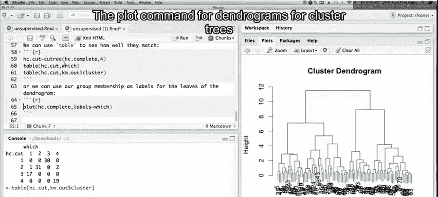

```r
plot(hc_complete, labels = true_labels)
```

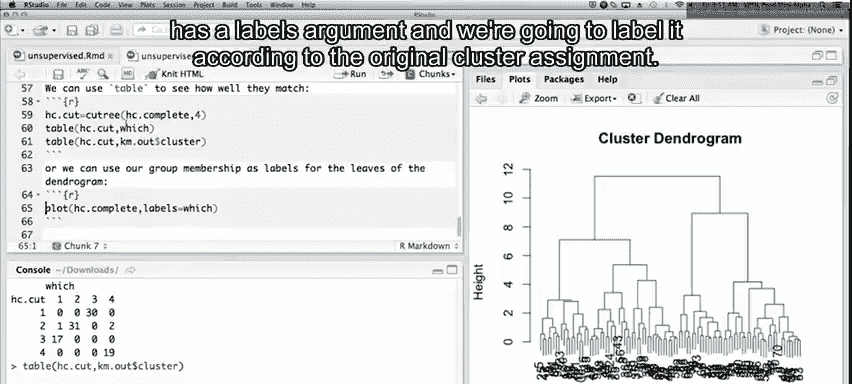

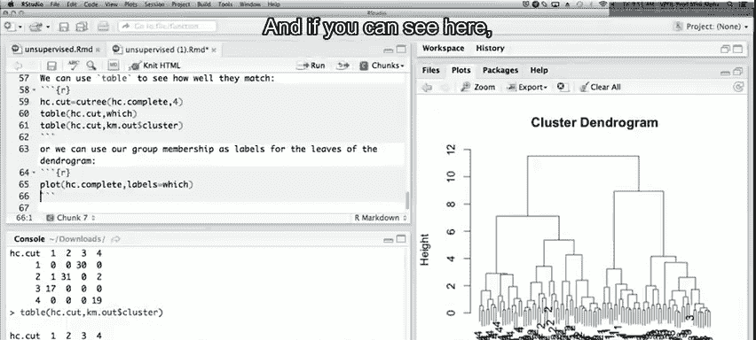

虽然在小图中可能不够清晰，但在更大的绘图区域中，可以清楚地看到哪些点被错误分配。

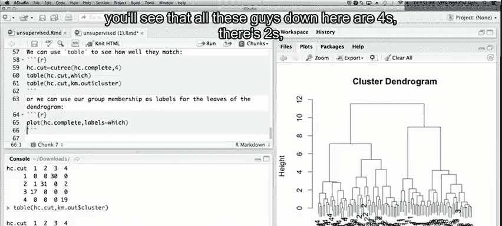

## 寻求帮助与资源

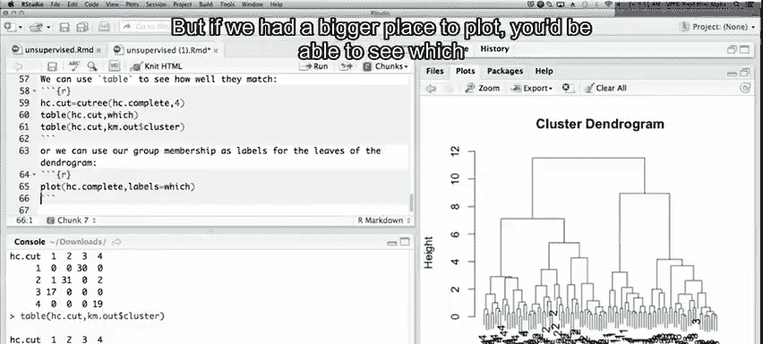

如果您想了解更多关于`hclust()`函数或层次聚类的信息，可以使用R的帮助功能：

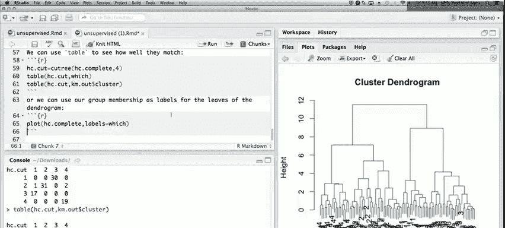

```r
?hclust
```

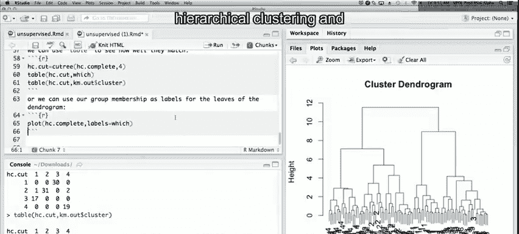

此外，在网络上搜索R相关查询也是获取信息和解决方案的有效途径。

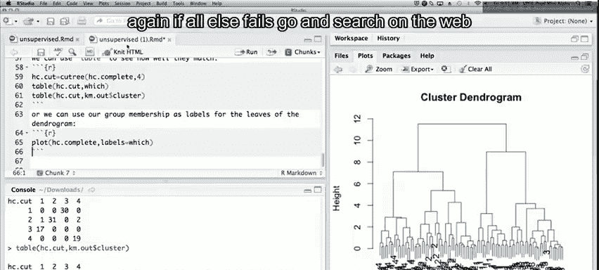

## 生成可分享的报告

最后，我们可以将整个分析过程、代码和图形整合到一个R Markdown文档中。通过“编织”该文档，可以生成一个包含结果摘要和所有图形的HTML报告，便于与同事分享或用于演示。

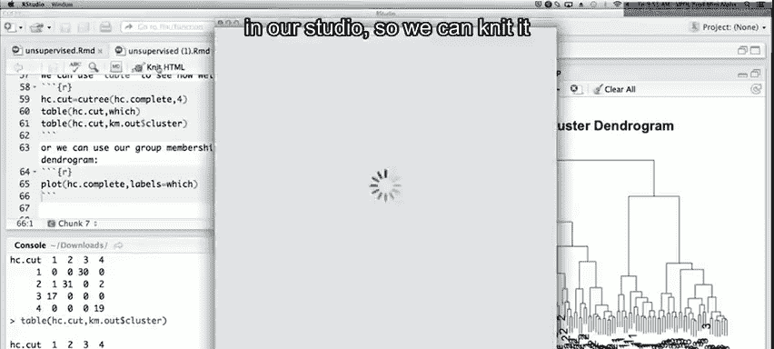

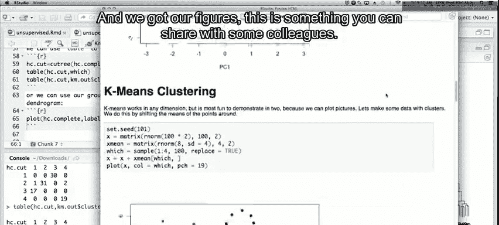

## 总结

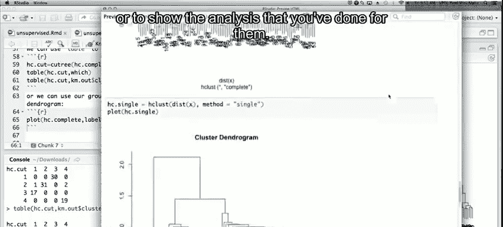

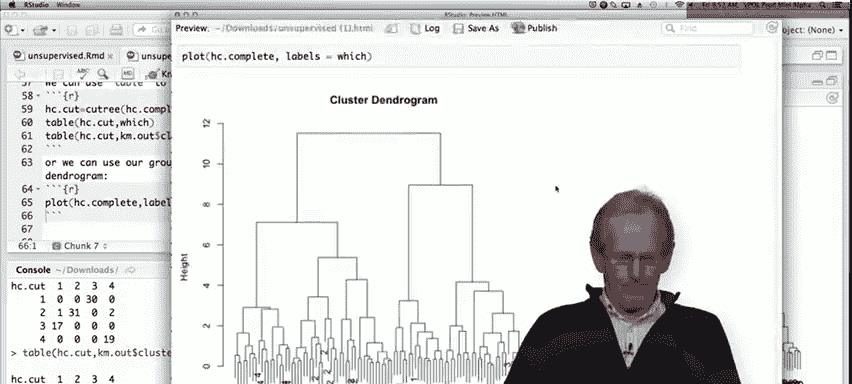

本节课我们一起学习了层次聚类。我们介绍了其自底向上的工作原理，演示了如何使用`hclust()`函数进行聚类，并比较了完全连接、单连接和平均连接等不同方法。我们还学习了如何通过`cutree()`函数获取具体的簇分配，并评估聚类效果。层次聚类通过系统树图提供了数据层次结构的直观视图，是探索性数据分析的有力工具。