# 001：课程介绍与团队见面 🚗

在本节课中，我们将要学习无人驾驶汽车纳米学位项目的整体介绍，并认识负责教授这门课程的专家团队。我们将了解课程的目标、涵盖的核心主题，以及为谁而设计。

我是塞巴斯蒂安，与优达学城及行业合作伙伴的优秀团队一起，我将担任本纳米学位项目的指导老师。

我们共同设计了这门课程，旨在让无人驾驶汽车的基础知识变得易于理解。你将有机会学习数据结构、基础数学、不同编程语言、规划、感知与控制等基于规则的内容，并亲手编写代码来实现一个非常基础的无人驾驶汽车版本。

当你完成课程后，你可以认为自己已经对无人驾驶汽车有了深入的了解，因为你已经掌握了所有基础知识。优达学城还提供了一个更深入的进阶版本，我稍后会提及。你可以将自己视为学习无人驾驶汽车技术的首批先驱者之一。

接下来，让我们认识一下团队。

大家好，我是安东尼，是优达学城“无人驾驶汽车入门”课程的产品负责人。我很高兴能帮助你开启成为无人驾驶汽车工程师的旅程。打造这个优秀的纳米学位项目需要大量工作，我们想花点时间向你介绍为此做出贡献的团队。

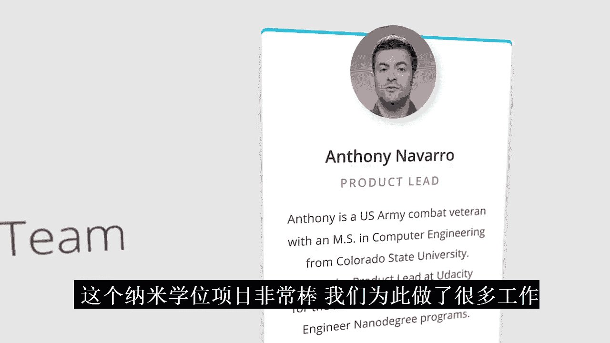

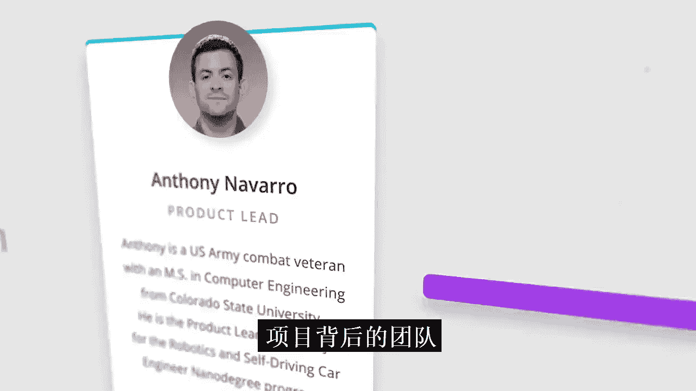

大家好，我是安迪，是本项目的课程负责人。我在优达学城从事教学与学习已有五年。无人驾驶汽车是一项改变世界的技术，其背后的数学和计算机科学原理非常迷人。我迫不及待地想带你进入这个精彩的世界。

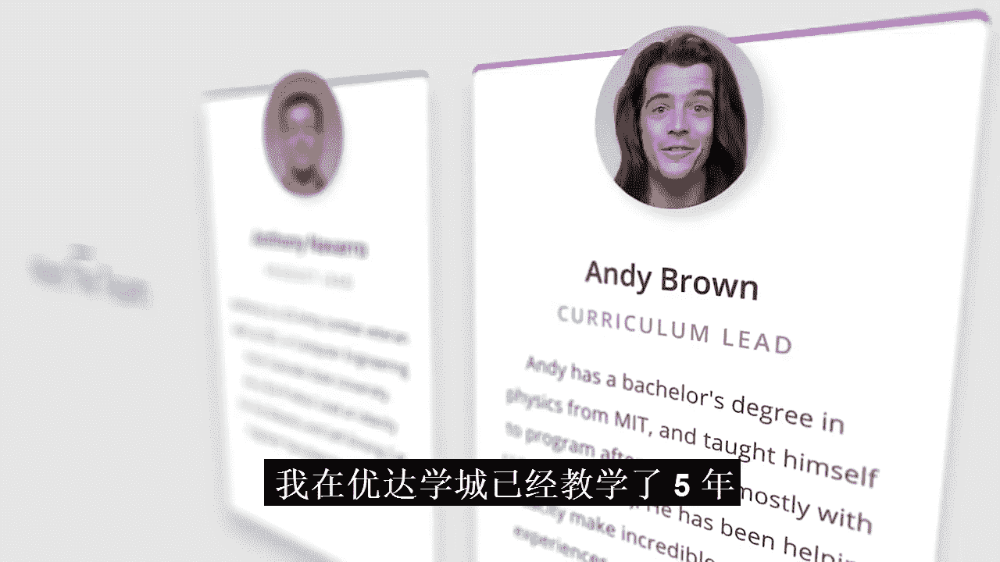

大家好，我是卡桑·卡马乔，是优达学城的内容开发专家。我专攻计算机视觉，这是像无人驾驶汽车这样的机器如何视觉感知并响应世界的方式。我很高兴能教你关于视觉，以及其他所有无人驾驶汽车在路上做决策时所依赖的基础编程和数学概念。

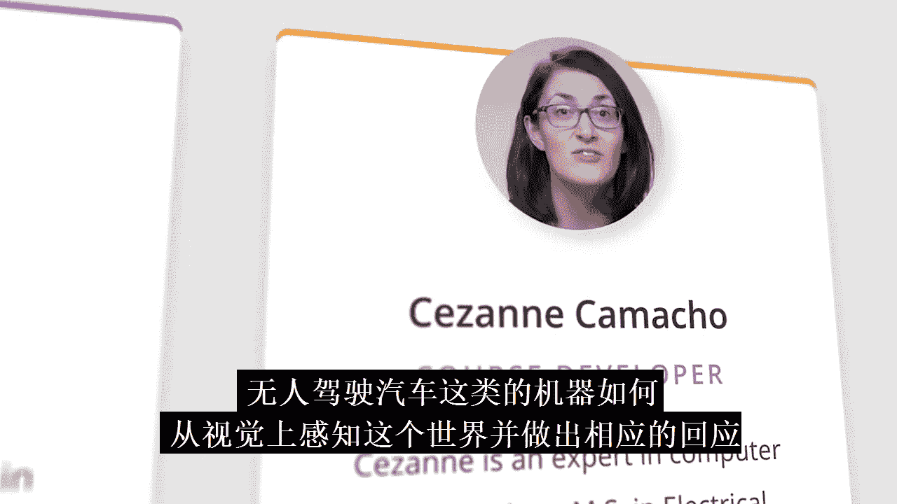

大家好，我是艾丽西亚·怀特，是一名拥有超过20年跨行业经验的嵌入式系统工程师。我为O‘Reilly编写嵌入式系统，并主持一档名为“嵌入式.FM”的播客，探讨工程的各个方面。我在这里帮助你理解为什么C++对于无人驾驶汽车的开发如此重要。

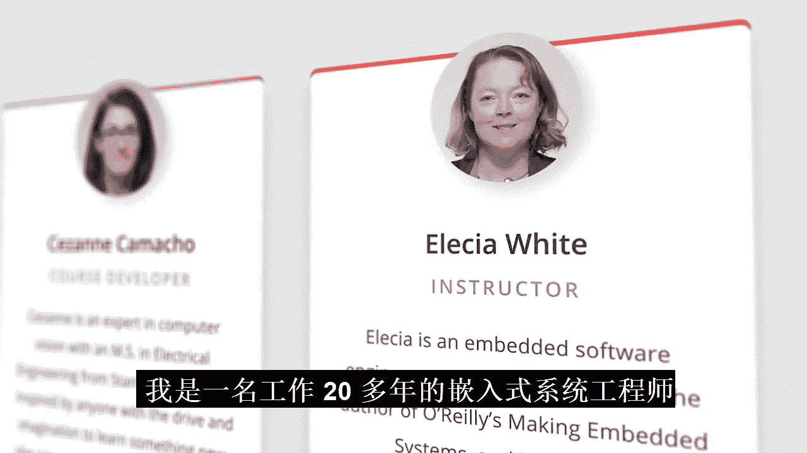

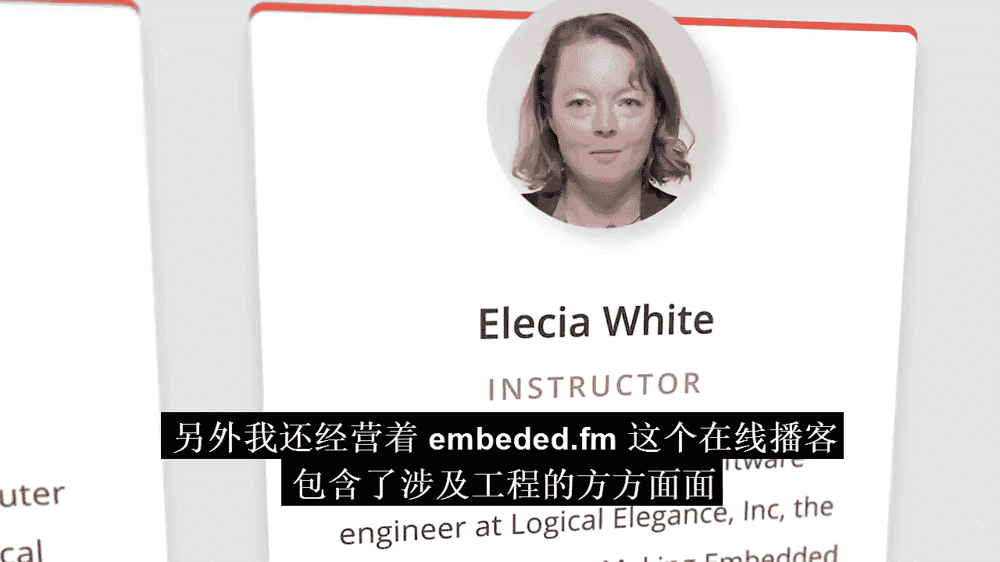

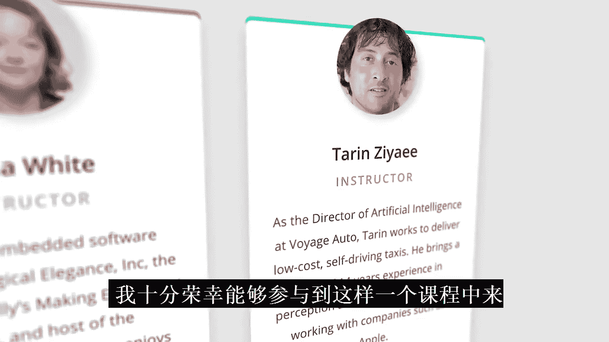

大家好，我是特兰，是Voyage公司的人工智能总监。我非常高兴能加入课堂，教授你关于机器学习和计算机视觉的知识。

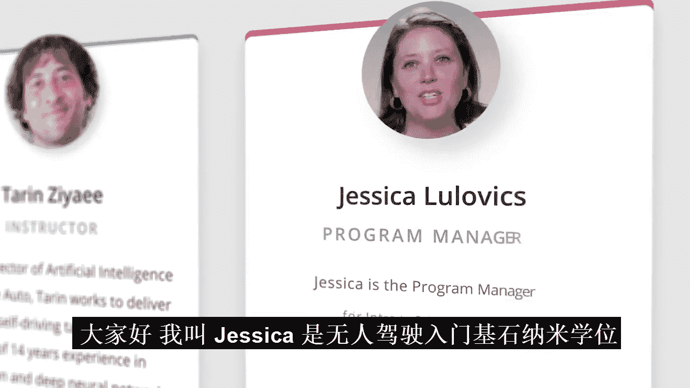

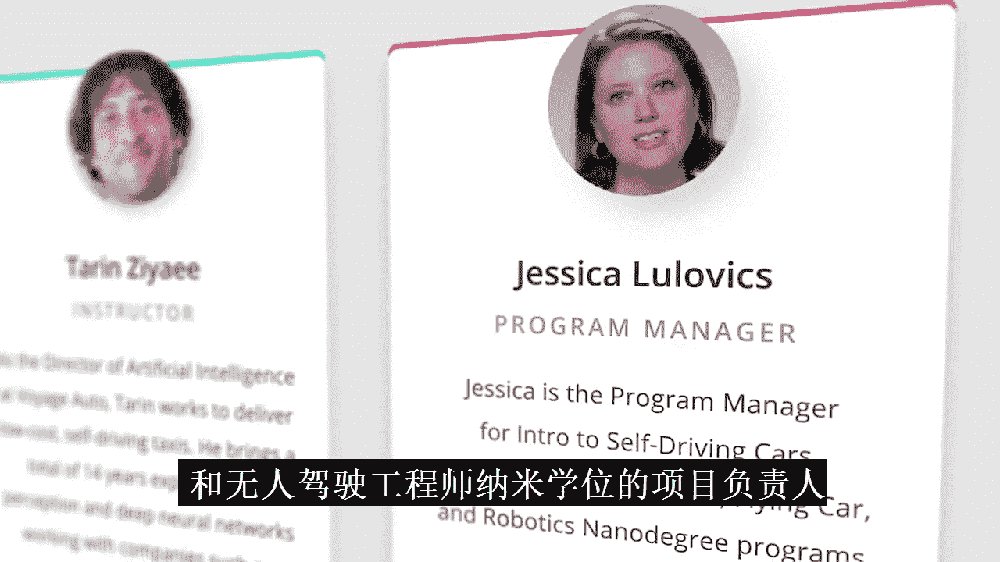

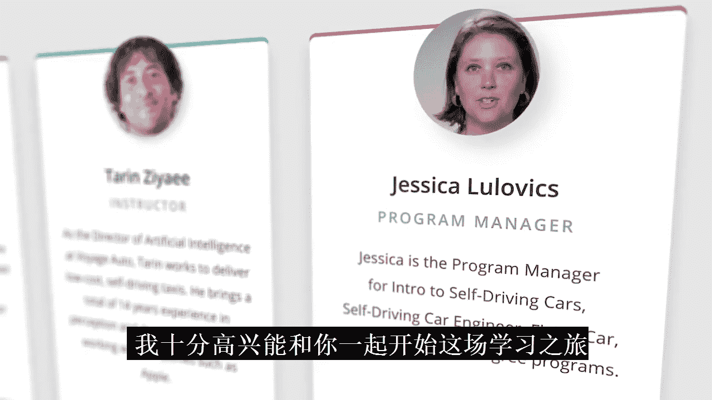

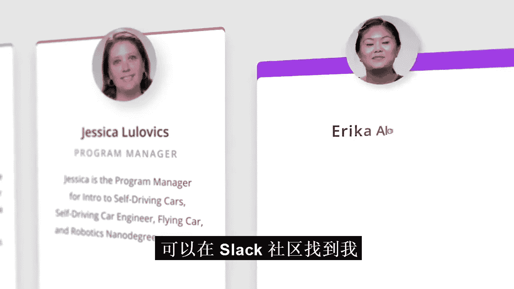

大家好，我是杰西卡，是你的纳米学位项目以及无人驾驶汽车工程师纳米学位项目的项目经理。我非常期待你加入这个项目，并对你开启这段旅程感到兴奋。如果你有任何需要，可以在Slack社区中找到我。

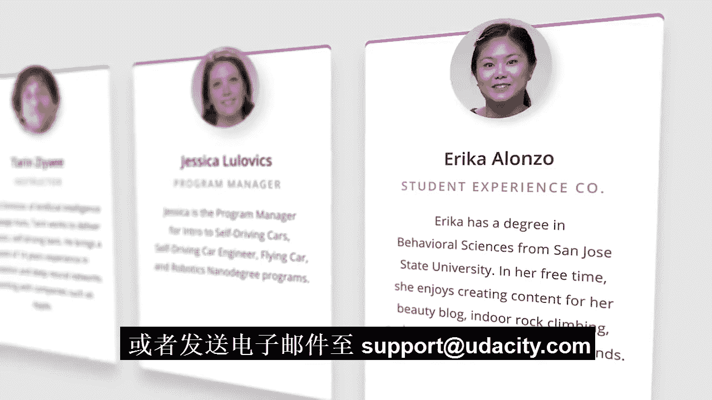

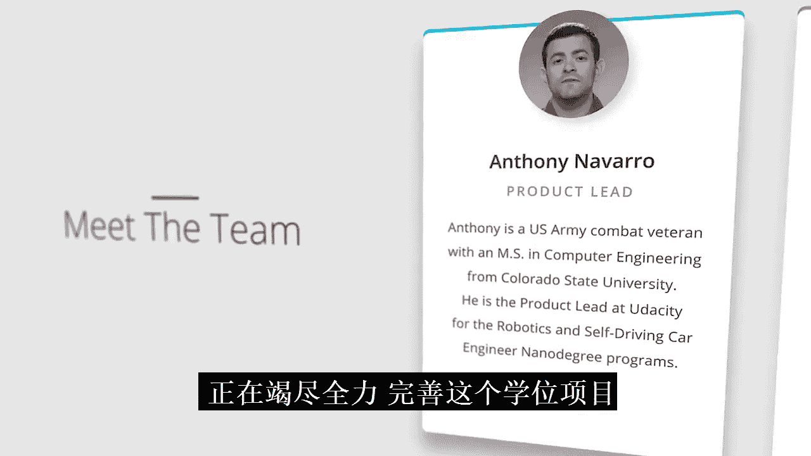

大家好，我是埃里卡，是学生体验协调员。欢迎随时在Slack上联系我或发送邮件至 support@udacity.com。

幕后还有更多人在尽一切努力使这个项目变得出色。现在，我们开始吧？

欢迎来到纳米学位项目。我们两人都曾参与无人驾驶汽车纳米学位项目的独立工作。我负责的课程是路径规划和定位，而我负责的则是车道线检测和计算机视觉。当我们发布无人驾驶汽车纳米学位项目时，引起了学生和业界的极大兴趣。

但事实证明，构建一辆无人驾驶汽车并不容易，因此许多课程都是从非常技术性的角度出发的。一些报名该项目的学员发现自己被数学符号、编程概念和编程语言等内容所阻碍。

那么安迪，我们这门课程是为谁设计的呢？我们在设计这门课程时，心目中的目标学员具备一些编程经验（大约40小时左右），熟悉代数，并且希望他们能从思考和解决难题中获得乐趣，即使这些难题涉及数学。如果这描述的就是你，并且你希望填补知识空白，或者只是想获得更多关于无人驾驶汽车背后编程和数学的经验，那么这门课程将为你学习更高级的课程做好准备。所以，让我们开始吧。

在深入学习之前，我们想花点时间给你一个热身技能的机会。我们创建了一个有趣的漫画和一系列问题，将帮助你评估对自己能力的信心程度。别担心，这不是分级测试，仅供你个人使用，并帮助你为课程做好准备。

本节课中我们一起学习了无人驾驶汽车入门课程的整体框架、教学目标以及强大的讲师团队。课程旨在通过实践编程和数学基础，让你掌握无人驾驶汽车的核心概念，并为后续深入学习打下坚实基础。现在，你已经准备好开启这段激动人心的学习旅程了。