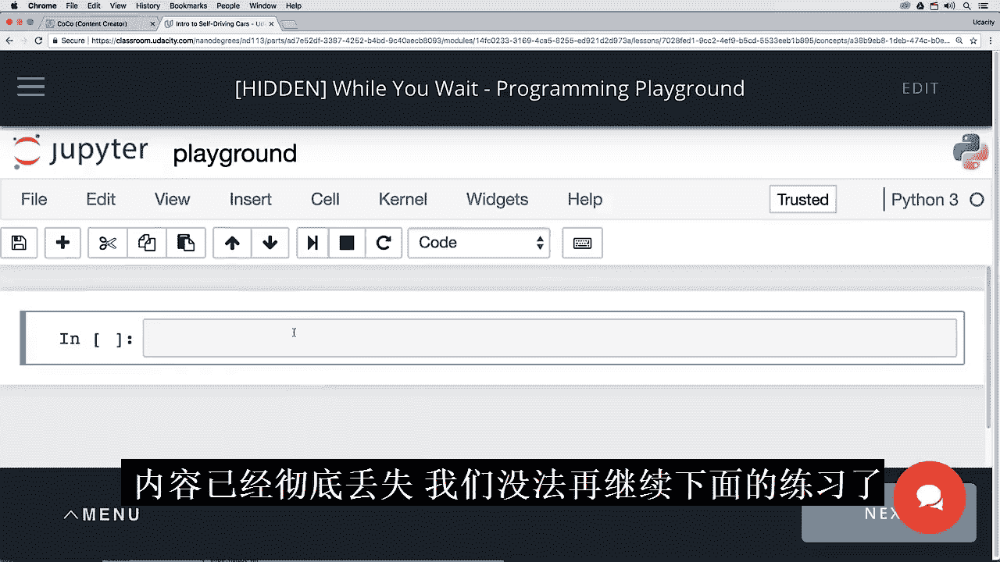
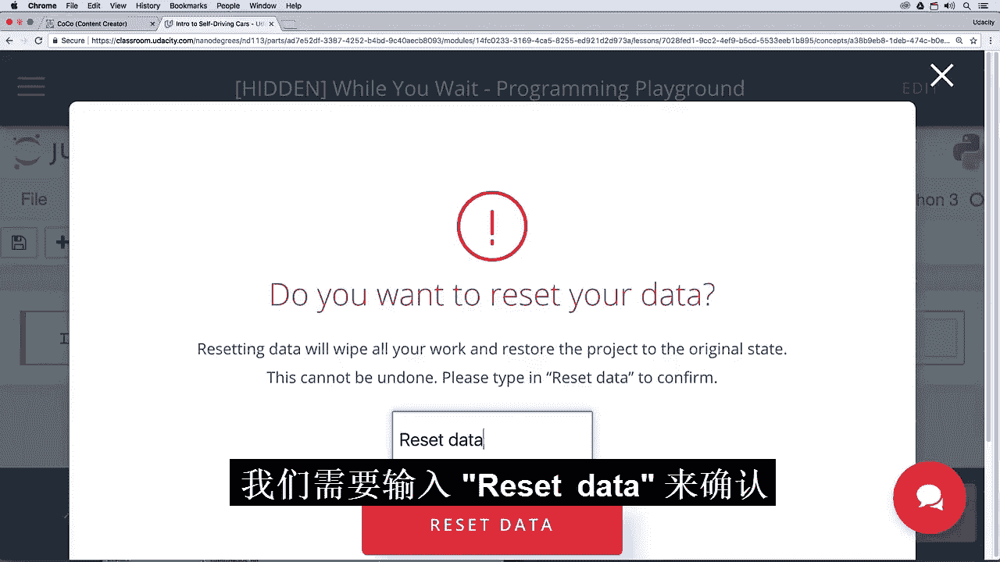
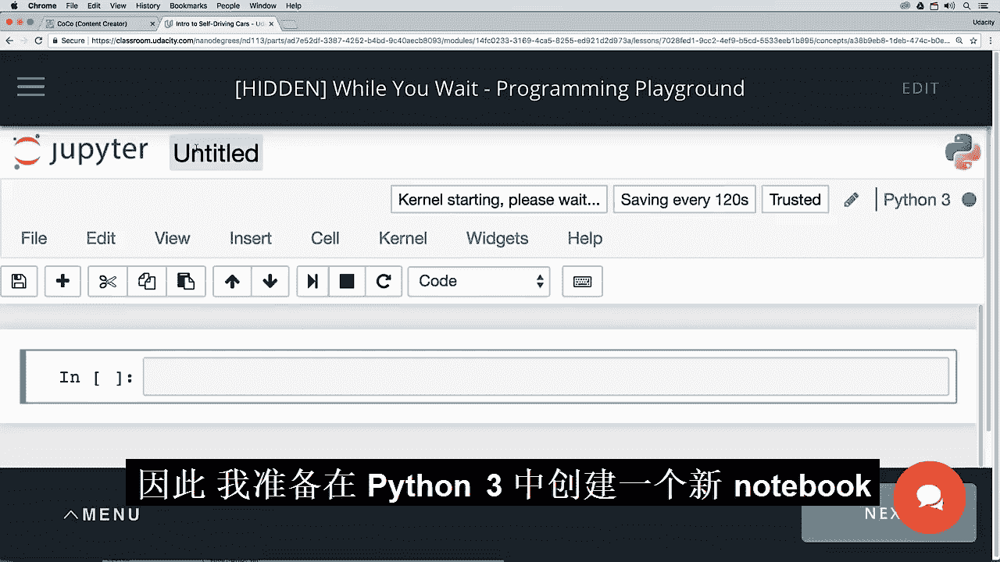
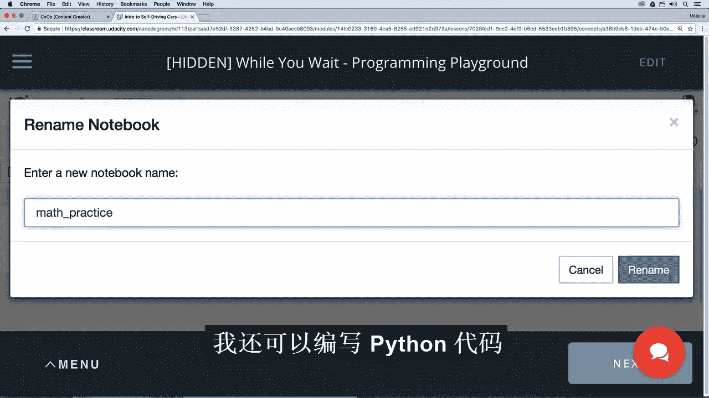
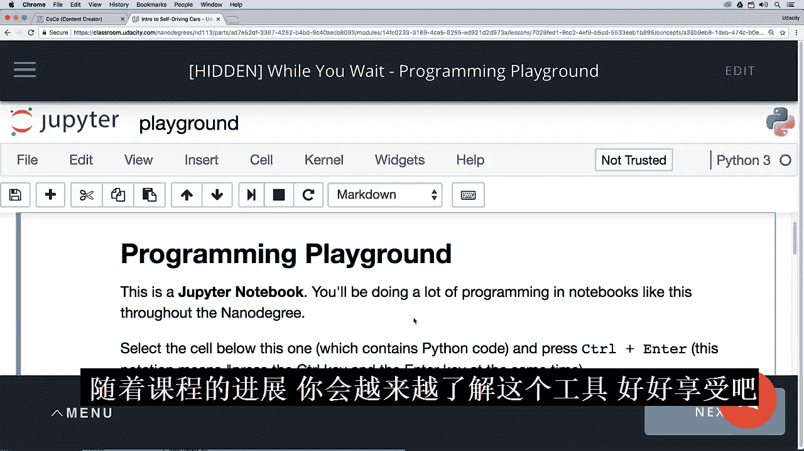

# 002：准备开始 🚗

在本节课中，我们将学习如何使用课程的核心工具——Jupyter Notebook。这是一个用于编写和记录Python代码的强大环境。我们将了解其基本操作，并打消你可能对“破坏”学习环境的顾虑。

---

希望你喜欢之前的冒险故事，并且对自己的技能有了一些了解。如果你觉得那些内容很简单，这很好，说明你已经准备好深入学习。如果你感到有些困难，不用担心，这正是我们在这里的原因。在本引导课程结束时，我们会提供一些资源，供你在正式课程开始前查阅。你可以利用这些资源来复习数学和编程技能。重申一次，这些都不是强制要求的，我们只是希望帮助你顺利完成这个项目。

紧接着这个视频，你会看到一个类似这样的界面。这被称为Jupyter Notebook，它是一个用于编写和记录Python代码的绝佳工具。

## 认识Jupyter Notebook 📓

如你所见，这个笔记本由一个个单元格构成。我现在高亮显示了一个单元格，可以使用方向键在单元格之间上下导航。

这个单元格，如你所见，是一个Markdown单元格。关于它，我不想说太多，只想说明Markdown是一种让文本看起来更美观的“高级”方式。

有时你会看到单元格处于这种格式，这可能有点烦人，如果你不知道如何处理，甚至会成为一个大问题。基本上，这种格式向你展示了编辑模式，在这里你可以看到设置标题的语法，在这里你可以看到设置加粗的语法。

如果你不小心进入了这种模式，并想回到更美观的显示模式，只需按`Control` + `Enter`即可。

## 运行代码单元格 ▶️

上一节我们介绍了Markdown单元格，本节中我们来看看代码单元格。

这里我们有一个Python注释，后面跟着一个打印语句。我可以在这里按`Control` + `Enter`。果然，它打印出了“hello world”。

实际上，还有另一种运行单元格的方法，那就是按`Shift` + `Enter`。它的效果相同，但还会将光标移动到下方的单元格。这非常方便。所以，当你看到像这样的笔记本时，可以从顶部开始，通过按`Shift` + `Enter`、`Shift` + `Enter`、`Shift` + `Enter`来逐步执行。

我鼓励你自己多尝试。但首先，有两点重要事项需要说明。

## 重要事项一：这是你的工作区 🔧

第一点，这是你的工作区。你可以在这些笔记本中做任何你想做的事情，不会造成任何永久性的损害，没有什么会被“弄坏”。

例如，我可以来到这里，假设出于某种原因，我想删除每一个单元格。我可以按两次`D`键来删除一个单元格。我可以对每一个单元格都这样做。

好了，我所有的单元格都消失了。我甚至可以保存它。

你可能认为我们造成了永久性损害，再也无法回到这个练习的初始状态了，但事实并非如此。在底部这里，我们选择菜单，然后点击“重置数据”。



它看起来有点吓人，但没关系。我们只需输入“reset data”来确认。



之所以删除操作设置得这么“困难”，是因为这是你的工作区，你可能在上面做了很多不想删除的工作。所以我们只是想确保你不会做出任何你不想做的事情。果然，在重置数据之后，我们又回到了起点。

所以，这是我想说的第一点：你无法造成永久性损害。

## 重要事项二：自由探索与创建 🆕


第二点我想说的是，这确实是你的工作区，你甚至可以创建新文件，可以做任何你想做的事情。


所以，我要创建一个新的Python 3笔记本，也许我把它命名为“math practice”。



我可以在里面练习Python代码。让我们试试`2 + 2`。

```python
2 + 2
```



果然，它等于`4`。我可以通过点击这个Jupyter标志来浏览我所有的文件。哦，它提示我保存更改，因为我还没有保存。这很好。让我完成保存更改的过程。我可以再次点击Jupyter标志。


然后我就能看到我所有的文件，“math practice”和“playground”都在这里，所以我可以点击“Playground”。


我又回到了这里。

好了，我只是想向你展示这几件事。你将在编程游乐场中通过实践学到更多，并且在整个纳米学位课程中，你会更深入地了解如何使用这个工具。

祝你玩得开心！



---

## 总结 📝


本节课中，我们一起学习了Jupyter Notebook的基本使用方法。我们了解了如何区分和操作Markdown与代码单元格，掌握了运行单元格的两种快捷键（`Control` + `Enter` 和 `Shift` + `Enter`）。最重要的是，我们明白了Jupyter环境是一个安全的工作区，你可以自由探索、创建甚至“破坏”，因为随时可以通过“重置数据”功能恢复到初始状态。现在，你已经准备好在这个强大的工具中开始你的编程之旅了。