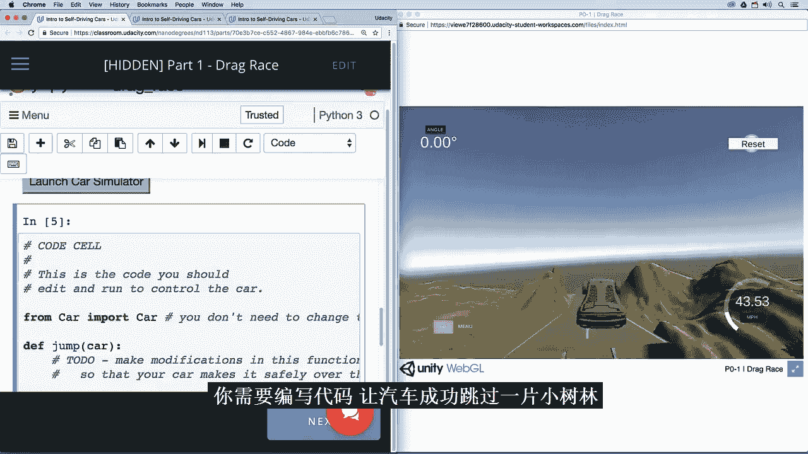
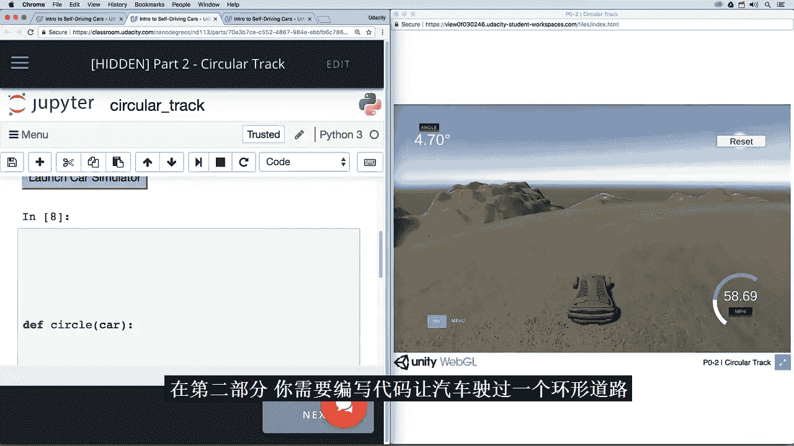
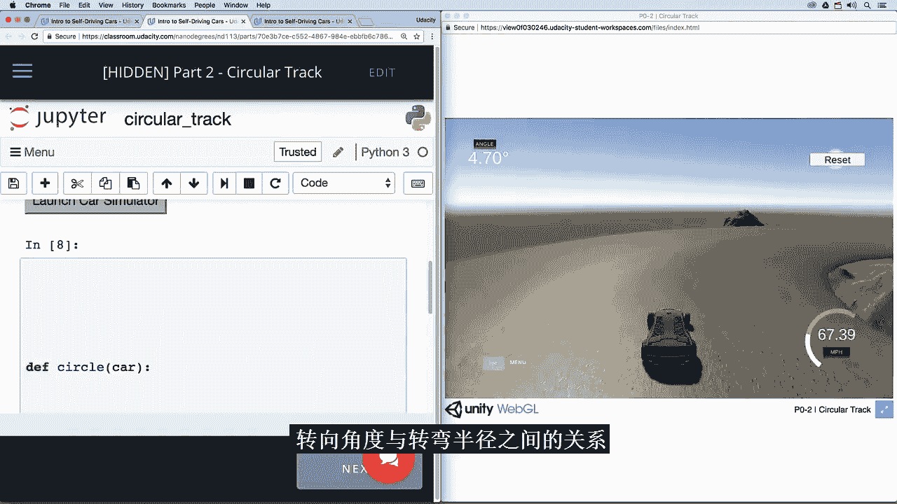

# 004：欢乐驾驶项目 🚗

在本节课中，我们将学习一个名为“欢乐驾驶”的快速实践项目。该项目旨在让你通过编写代码来控制一辆模拟汽车，从而初步体验自动驾驶编程。项目包含三个部分，每个部分对应一个特定的驾驶场景。

## 项目概述 🎯

欢迎来到“欢乐驾驶”项目。这是一个让你亲自动手编写代码来控制模拟汽车的快速实践项目。项目包含三个部分，每个部分你需要编写代码来解决一个特定的驾驶场景。

## 第一部分：飞跃树林 🌳

在第一部分，你需要编写代码让一辆汽车成功飞跃一小片树林。虽然这不是一个常见的自动驾驶问题，但此部分的真正目标是让你熟悉后续将使用的编程接口。

以下是实现飞跃的关键步骤：

1.  **初始化车辆状态**：设置汽车的初始位置、速度和方向。
2.  **计算加速时机**：在接近树林前，为汽车提供足够的加速度以获得飞跃所需的动能。
3.  **控制空中姿态**：在飞跃过程中，保持车辆稳定，避免翻滚。
4.  **平稳着陆**：确保汽车落地时速度适中，姿态平稳，以继续行驶。

## 第二部分：环形赛道驾驶 🔄

上一节我们让汽车完成了飞跃，本节中我们来看看如何让汽车在环形赛道上行驶。通过完成这个任务，你将探索**转向角**与**转弯半径**之间的关系。

转向角（`steering_angle`）与转弯半径（`turning_radius`）的关系可以近似用以下公式描述：
`turning_radius = wheelbase / tan(steering_angle)`
其中，`wheelbase`是汽车的轴距。

以下是实现环形驾驶的步骤：

1.  **设定恒定转向角**：为汽车设置一个固定的转向角，使其能够持续转弯。
2.  **保持适当速度**：控制油门，使汽车保持一个既能顺利过弯又不会失控的速度。
3.  **循环控制逻辑**：编写循环代码，让汽车能够持续绕圈行驶。

我们暂时不深入探讨其背后的数学原理，但在后续课程中，我们会更深入地研究这些数学知识，并回顾项目中的这一部分。

## 第三部分：平行泊车 🅿️

在第三部分，你将编写一个函数，执行一系列步骤来完成一项许多人类驾驶员都感到困难的操作：将汽车**平行泊入**车位。

以下是平行泊车的基本步骤序列：

1.  **初始定位**：将汽车与目标车位平行对齐，并保持适当距离。
2.  **倒车入库**：向一侧打满方向盘，开始倒车，使车尾进入车位。
3.  **调整姿态**：当汽车与路边成一定角度时，回正方向盘继续倒车，或向反方向打方向盘以摆正车身。
4.  **最终微调**：前后移动车辆，使其完全停入车位中央，并与前后车辆保持安全距离。

## 总结 📝

本节课中我们一起学习了“欢乐驾驶”项目。我们首先编写代码让汽车完成飞跃树林的任务以熟悉环境。接着，我们探索了转向角与转弯半径的关系，并实现了汽车在环形赛道上的行驶。最后，我们编写了执行平行泊车操作的函数序列。通过这三个实践环节，你初步掌握了通过代码控制车辆基本运动的方法，为后续更复杂的自动驾驶算法学习打下了基础。