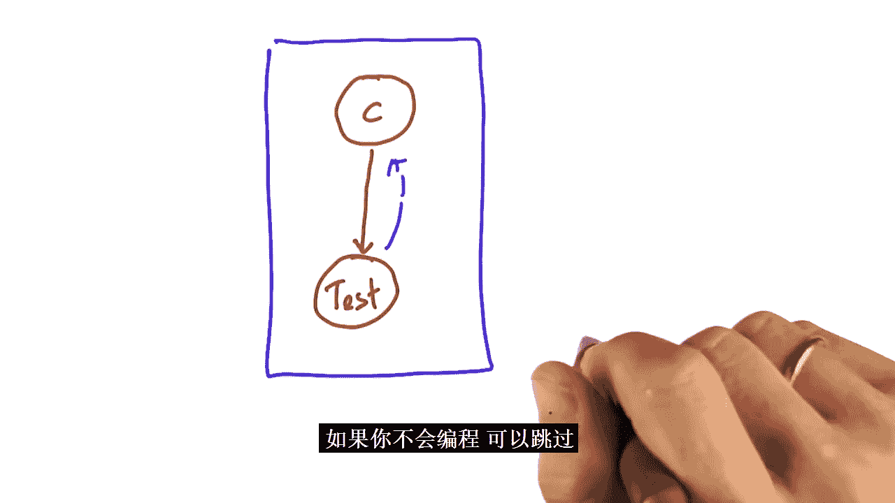

# 008：贝叶斯法则 🧠

在本节课中，我们将要学习贝叶斯法则。贝叶斯法则是概率论和机器人学中的一个核心概念，它允许我们利用新的测量数据来更新对某个事件（例如汽车的位置）的初始信念。这对于处理传感器数据中存在的不确定性至关重要。

## 为什么不确定性很重要？🤔

上一节我们介绍了概率在机器人学中的重要性，本节中我们来看看不确定性为何如此关键。

我们知道，测量汽车的速度、方向和位置是具有挑战性的。我们无法完美地测量它们，每个测量都存在一些不确定性。

我们还知道，许多测量值是相互影响的。例如，如果我们对汽车的位置不确定，可以通过收集关于汽车周围环境和其运动的数据来减少这种不确定性。

自动驾驶汽车使用传感器来测量从车速到周围场景和物体的所有信息。虽然这些传感器测量并不完美，但当它们提供的信息通过条件概率和贝叶斯法则结合起来时，可以形成对汽车位置、运动及其环境的可靠表示。

## 什么是贝叶斯法则？📈

贝叶斯法则在机器人学中极其重要，可以用一句话来描述：给定一个初始预测，如果我们收集到额外的相关数据（即我们的初始预测所依赖的数据），我们就可以改进这个预测。

例如，假设我们的初始预测（也称为先验信念）是对汽车在道路上位置的估计。这可能是一个略微不准确的GPS信号给出的位置。然后，我们使用传感器收集关于汽车周围环境和汽车如何运动的数据。

你认为这些传感器数据如何帮助我们改进初始的位置预测？

一旦我们收集了关于汽车周围环境和运动的传感器数据，我们就可以利用这些信息来改进我们的初始位置预测。例如，假设我们感知到车道线和特定的地形，并且我们知道，根据先前收集的数据，如果我们在汽车两侧附近感知到车道线，汽车很可能位于车道的中心。我们还知道，如果我们感知到轮胎指向右侧，我们很可能在道路的弯曲路段。

因此，这些传感器数据，结合我们已经知道的关于道路和汽车的信息，为我们提供了更多关于我们位置最可能在哪里的信息。利用这些传感器信息，我们可以改进初始预测，更好地估计汽车的位置。

贝叶斯法则为我们提供了一种数学方法来修正我们的测量，让我们能够从一个不确定的先验信念转向越来越可能的事物。你会在机器人学中反复看到贝叶斯法则。在本课中，你将更深入地理解贝叶斯法则。

## 贝叶斯法则详解：一个医学例子 🏥

这个单元有些难度。我们将讨论概率推断的“圣杯”——贝叶斯法则。贝叶斯法则以托马斯·贝叶斯牧师命名，他使用这个原理来推断上帝的存在。但在这个过程中，他创造了一个全新的方法家族，极大地影响了人工智能和统计学。

让我们深入探讨。让我们使用上一个单元中的癌症例子。

假设有一种特定癌症在人群中的发生率为1%。对这种癌症的检测，如果我们患有这种癌症C，有90%的几率呈阳性。这通常称为检测的**灵敏度**。但即使你没有C，检测有时也会呈阳性。具体来说，如果我们没有C，检测有90%的几率呈阴性，这通常称为检测的**特异度**。

我的问题是：在没有其他症状的情况下，你接受了检测，并且检测结果呈阳性。你认为患有这种特定类型癌症的概率是多少？

为了回答这个问题，让我们画一个图。暂停一下，这里代表所有人。其中恰好有1%的人患有癌症。99%的人没有癌症。我们知道有一个检测：如果你有癌症，它能以90%的几率正确诊断。所以，如果你画出检测呈阳性的区域（癌症且检测阳性），那么这个区域占癌症圈的90%。然而，这还不是全部事实。即使人没有癌症，检测有时也会呈阳性。在我们的案例中，这发生在所有情况的10%中。所以，如果你必须添加更多区域，这个区域的大小是这里大区域（减去小的癌症圈）的10%。在这个区域里，检测可能呈阳性，但人没有癌症。显然，这些圆圈之外的所有区域对应的情况是没有癌症且检测呈阴性。

让我再问你一次：假设你有一个阳性检测结果。你认为你的新机会是多少？在先验癌症概率为1%、灵敏度和特异度均为90%的情况下，你认为你现在的概率是90%、8%，还是仍然是1%？

我认为大约是8%。事实上，正如我们将看到的，数学上你会得出8又1/3%。

在这个图中看到这一点的方法是：这是检测呈阳性的区域。通过获得阳性检测结果，你知道你在这个区域内，其他都不重要。你知道你在这个圆圈里。但在这个圆圈内，癌症区域相对于整个区域的比例仍然很小。显然，拥有阳性检测结果改变了你的癌症概率，但它只增加了大约8倍，我们马上会看到。

这就是贝叶斯法则的本质，我马上会给你公式。存在某种**先验**，我们指的是在你进行检测之前的概率。然后你从检测本身获得一些**证据**。这引导你得到所谓的**后验概率**。不，这实际上不是一个加法操作。事实上，在现实中它更像是一个乘法，但从语义上讲，贝叶斯法则所做的是将检测中的一些证据纳入你的先验概率，从而得出后验概率。

具体到我们的癌症例子：我们知道癌症的先验概率 `P(C)` 是 `0.01`，即1%。在给定检测呈阳性（这里缩写为“阳性”）的情况下，癌症的后验概率 `P(C|阳性)` 是先验乘以我们的检测灵敏度（即给定我有癌症时得到阳性结果的几率 `P(阳性|C)`）的乘积。你可能会记得这个和是 `0.9` 或 `90%`。

现在要警告你，这并不完全正确。为了使其正确，我们还必须计算非癌症选项的后验概率，即 `P(非C|阳性)`。我们知道 `P(非C)` 是 `0.99`（即 `1 - P(C)`），乘以在没有癌症的情况下得到阳性检测结果的概率 `P(阳性|非C)`。注意这两个方程是相同的，只是将C换成了非C。这个需要一点时间来计算。我们知道，如果检测对象没有癌症，我们的检测给出阴性结果的几率是 `0.9`。因此，在无癌症的情况下，它给出阳性结果的几率是 `10%`。

现在有趣的是，这大约是正确的方程，但概率加起来不等于1。为了说明，我要求你计算这些。请使用我们上面的例子给出第一个表达式和第二个写在这里的表达式的确切数字。

显然，`P(C) * P(阳性|C) = 0.01 * 0.9 = 0.009`。而 `P(非C) * P(阳性|非C) = 0.99 * 0.1 = 0.099`。

我们在这里计算的是这里的绝对面积（`0.009`）和这里的相反面积（`0.099`）。归一化过程分两步进行。我们只是将这些值归一化，保持比例相同，但确保它们加起来等于1。所以首先计算这两个值的和。请告诉我这个和。是的，答案是 `0.108`。从技术上讲，`P(阳性)` 意味着阳性检测结果的概率，它仍然是标记你的圆圈内的面积，根据我们上次学到的，它只是这里这两项的和，即 `0.108`。

现在，最后，我们可以得到实际的后验概率。而这里的这个通常被称为两个事件的**联合概率**，后验是通过将这里的这个除以这个归一化因子得到的。

所以让我们在这里做这个除法。让我们将这个数字除以这个归一化因子，得到在收到阳性检测结果的情况下患有癌症的后验分布。将这个数字除以这个，我们得到 `0.0833`。对于非癌症版本也是一样，取这里的数字除以相同的分母，答案大约是 `0.9167`。

为什么你不花一秒钟时间把这两个数字加起来，然后告诉我结果？答案是 `1`，正如你所期望的那样。

这确实很有挑战性。你可以在这张幻灯片上看到很多数学。所以让我再回顾一遍，让它对你来说容易得多。

## 贝叶斯法则算法 📝

贝叶斯说我们有一个情况：有一个先验，一个检测有一定的灵敏度和特异度。当你收到一个阳性检测结果时，你所做的是取你的先验，乘以给定C时这个检测结果的概率，并乘以给定非C时这个检测结果的概率。所以这是你考虑患有癌症的分支，这是你考虑没有癌症的分支。

当你完成这些后，你得到一个数字。这个数字结合了癌症假设与检测结果，既针对癌症假设也针对非癌症假设。现在，你做什么？你把它们加起来，然后通常它们加起来不等于1。你得到一个特定的量，这个量恰好是检测结果为阳性的总概率 `P(阳性)`。

接下来你要做的就是将这里的这个除以这里的和。在右侧，除数对两种情况是相同的，因为这是你的癌症分支，你的非癌症分支。但这个除数不再依赖于癌症变量。你现在得到的是期望的后验概率，并且它们加起来等于1，如果你一切都做对了的话，如上所示。

**这就是你的贝叶斯法则算法。**

现在，如果你的检测结果是阴性，同样的算法也适用。我们马上练习一下。

假设你的检测结果是阴性。你仍然可以问同样的问题：现在我患有癌症或不患癌症的概率是多少？但现在这里所有的阳性都变成了阴性。总和是阴性检测结果的总概率 `P(阴性)`，然后现在除以这个值，你现在得到在假设你有阴性检测结果的情况下，癌症和非癌症的后验概率。当然，这对你来说会有利得多，因为我们没有人想得癌症。

所以看一会儿这个。现在让我们使用我之前给你的相同数字为阴性情况进行计算。这次我将一步一步地进行，这样我可以真正指导你完成这个过程。

我们首先给出先验概率、灵敏度和特异度。我希望你首先填写所有缺失的值。所以 `P(非C)` 是没有癌症的概率，`P(阴性|C)` 是给定癌症时阴性的概率（即阳性的否定），`P(阴性|非C)` 是给定非癌症时阴性的概率。显然，这些仍然是之前的 `0.99`、`0.1` 和 `0.9`。我希望你做对了。

现在假设检测结果呈阴性。应用与之前相同的逻辑，请给出在给定阴性检测结果的情况下，患有癌症的联合概率 `P(C, 阴性)` 和没有癌症的联合概率 `P(非C, 阴性)`。

这里的数字是 `0.001`。它是我的癌症先验 `0.01` 和在癌症情况下得到阴性结果的概率（即这里的 `0.1`）的乘积。如果我将这两项相乘，我得到 `0.001`。这里的概率是 `0.891`。我相乘的是没有癌症的先验概率 `0.99` 和在未患癌症的情况下看到阴性结果的概率（即这里的 `0.9`）。所以如果我们将 `0.99` 乘以 `0.9`，我实际上得到 `0.891`。

让我们计算归一化因子，你知道记住这是什么。答案是 `0.892`。你只需将这里的这两个值相加。

最后，告诉我，在已知我们有阴性检测结果的情况下，癌症的后验概率 `P(C|阴性)` 是多少，以及在已知我们有阴性检测结果的情况下，没有癌症的概率 `P(非C|阴性)` 是多少。请在这里给出你的数字。

这大约是 `0.0011`，我们通过将 `0.001` 除以归一化因子 `0.892` 得到。检测后没有癌症的后验概率大约是 `0.9989`。这是通过将这里的这个概率除以归一化因子得到的。

毫不奇怪，这两个值确实加起来等于 `1`。现在，这个结果值得注意的地方在于它的真正含义。在检测之前，我们有 `1%` 的几率患有癌症。现在我们患有癌症的几率大约是九分之一 percent。所以我们的癌症概率下降了大约 `9` 倍。因此，检测确实帮助我们获得了对没有癌症的信心。相反，之前我们有 `99%` 的几率没有癌症，现在是 `99.89%`。所以所有的数字都完全按照你期望的方式工作。

## 更复杂的例子 🔄

让我让你的生活变得更难一些。假设某种其他疾病的概率是 `0.1`，所以 `10%` 的人口患有它。我们的检测在阳性情况下确实信息量很大，但有 `0.5` 的几率，如果我没有癌症，检测确实会这么说。所以灵敏度高，特异度较低。

让我们从填写前三个开始。显然，这些只是 `1` 减去那些：`P(非C) = 0.9`，`P(阴性|C) = 0.1`，`P(阳性|非C) = 0.5`。注意这两个数字可能非常不同。这里没有矛盾。这些家伙必须加起来等于 `1`。所以给定非C，阳性和阴性的概率必须加到 `1`，但这些家伙不需要。需要大量练习才能理解哪些数字必须加起来等于 `1`，但我以你应该做对的方式设置了它。

现在困难的部分来了。`P(C, 阴性)` 是多少？答案是 `0.01`。`P(C)` 是 `0.1`，`P(阴性|C)` 也是 `0.1`。所以如果你把它们相乘，得到 `0.01`。

`P(非C, 阴性)` 是多少？答案是 `0.45`。`P(非C)` 是 `0.9`，`P(阴性|非C)` 是 `0.5`。所以 `0.9 * 0.5 = 0.45`。

这里的这个归一化因子 `P(阴性)` 是多少？嗯，你只需将这两个数字相加得到 `0.46`。

所以告诉我最后两个数字是什么。第一个是 `0.01` 除以归一化因子 `0.46`，这给我们 `0.0217`。第二个是这个曲线，`0.45` 除以 `0.46`，给我们 `0.9783`。

这些是正确的后验概率。我们开始时患有癌症的几率是 `10%`，我们得到了一个阴性结果，我们下降到大约 `2%` 的几率患有癌症。

现在让我们考虑检测结果呈阳性的情况，我希望你只给我这里的两个数字，而不是其他的。

所以再一次，我们这里有 `0.9`、`0.1` 和 `0.5`。很快地将这个家伙乘以这里的这个家伙：`0.09`。将这个家伙乘以这里的这个家伙：`0.45`。相加得到 `0.54`。相应地相除：`0.09` 除以 `0.54` 给我们 `0.166...`，`0.45` 除以 `0.54` 给我们 `0.833...`。

这意味着，有了阳性检测结果，我们的癌症几率从 `0.1` 增加到 `0.16`。显然，我们没有癌症的几率相应下降。你明白了吗？

## 总结贝叶斯法则 🎯

在贝叶斯法则中，你有一个你关心的隐藏变量（例如，是否患有癌症）。我们无法直接测量它。相反，我们有一个检测。我们有一个关于这个变量为真的频率的先验。检测通常通过当变量为真时它说阳性的频率（灵敏度）和当变量为假时它说阴性的频率（特异度）来表征。

基于我们的先验，乘以测量值（在本例中 soon to be 阳性测量值），为我们新的变量（联合概率）给出结果，并对我们关于隐藏变量（癌症）的相反假设下的实际测量值做同样的事情。

这个乘法给了我们这里的这个家伙。我们将这两项相加，它给了我们一个新的变量 `P(测量)`。然后我们除以这些家伙，得出在给定我们的检测结果的情况下，对隐藏变量 `C` 的最佳估计。在这个例子中，我使用阳性作为检测结果。但你也可以用阴性例子做同样的事情。

这与我们的图表完全一样。一开始，有一个所有情况中这个特定变量为真的先验。我们注意到在这个先验内部，有一个检测结果适用的区域（真阳性）。我们注意到检测结果也可能在条件未满足时适用（假阳性）。所以这里的这个表达式和这里的这个表达式完全对应于这里的红色区域和绿色区域。

但然后我们注意到这两个区域加起来不等于 `1`，原因是外面还有很多东西。所以我们计算了总面积，也就是这里的这个表达式 `P(测量)`。然后我们通过将这里的这两项除以总面积来归一化，得到分配给红色事物和绿色事物的相对面积。这是通过除以这个区域的总面积来完成的，从而摆脱了任何其他情况。

现在，我应该说，如果你理解了这一点，你就学到了关于统计学和概率的一些非常重要的东西。这完全是非平凡的，但它非常方便。

## 机器人定位例子 🤖

所以我要用第二个例子和你一起练习。在这种情况下，你是一个机器人。这个机器人生活在一个恰好有两个地方的世界里：一个红色地方和一个绿色地方，`R` 和 `G`。

现在，假设最初，这个机器人不知道它在哪里。所以对于任何一个地方（红色或绿色）的先验概率是 `0.5`。它也有传感器（你可以通过它的眼睛看到），但它的传感器往往有些不可靠。所以在红色网格单元看到红色的概率是 `0.8`，在绿色单元看到绿色的概率也是 `0.8`。

现在，假设机器人看到了红色。现在机器人位于红色单元的后验概率是多少，给定它刚刚看到了红色？相反，即使它看到了红色，它位于绿色单元的概率是多少？

现在，你可以应用贝叶斯法则并计算出来。这个例子给了我们有趣的数字。红色的联合概率 `P(R, 见红)` 是 `0.4`，绿色的联合概率 `P(G, 见红)` 是 `0.1`。`0.4` 加 `0.1` 等于 `0.5`。如果你现在将 `0.4` 除以 `0.5` 归一化，你得到 `0.8`，如果你将 `0.1` 除以 `0.5` 归一化，你得到 `0.2`。

如果我改变一些参数，比如机器人知道它在红色单元的先验概率是 `0`，因此在绿色单元的先验概率是 `1`。请再次使用贝叶斯法则计算这些后验概率。我必须警告你，这是一个有点棘手的情况。

答案是：先验不受测量的影响。所以如果它在红色的概率是 `0`，在绿色的概率是 `1`，尽管它看到了红色。要看到这一点，你发现位于红色且看到红色的联合概率是 `0 * 0.8 = 0`。绿色的相同联合概率是 `1 * 0.2 = 0.2`。所以我们必须将 `0` 和 `0.2` 归一化，它们的和是 `0.2`。所以 `0` 除以 `0.2` 仍然给我们 `0`，`0.2` 除以 `0.2` 给我们 `1`。这些正是这里的数字。

让我们进一步改变这个例子。让我们把这里的这个改为 `0.5`，并恢复到均匀先验。请继续计算我们的后验概率。

现在，答案大约是 `0.615` 和 `0.385`。这些是近似值。再一次，`0.5 * 0.8 = 0.4`。`0.5 * (1 - 0.8) = 0.5 * 0.2 = 0.1`。把它们加起来 `0.5`。归一化：`0.4 / 0.5 = 0.8`，`0.1 / 0.5 = 0.2`。等等，我犯了一个错误。让我纠正：先验是 `0.5` 和 `0.5`。`P(见红|R) = 0.8`, `P(见红|G) = 0.2`。所以联合概率：`P(R, 见红) = 0.5 * 0.8 = 0.4`；`P(G, 见红) = 0.5 * 0.2 = 0.1`。总和 `P(见红) = 0.5`。后验：`P(R|见红) = 0.4 / 0.5 = 0.8`；`P(G|见红) = 0.1 / 0.5 = 0.2`。这和我之前得到的一样。抱歉，我之前的计算有误。对于 `P(见红|G)` 是 `0.2` 的情况，后验确实是 `0.8` 和 `0.2`。

现在，如果我改变 `P(见红|G)` 为 `0.5` 呢？那么联合概率：`P(R, 见红) = 0.5 * 0.8 = 0.4`；`P(G, 见红) = 0.5 * 0.5 = 0.25`。总和 `P(见红) = 0.65`。后验：`P(R|见红) = 0.4 / 0.65 ≈ 0.615`；`P(G|见红) = 0.25 / 0.65 ≈ 0.385`。所以现在你明白了。

## 扩展到多个状态 🌐

我现在要让你的生活变得非常困难。世界上有三个地方，而不仅仅是两个：一个红色的和两个绿色的。为简单起见，称它们为 `A`、`B` 和 `C`。让我们假设它们都有相同的先验概率 `1/3` 或 `0.333...`。假设机器人看到红色，并且和以前一样，在单元格 `A` 中看到红色的概率是 `0.9`，在单元格 `B` 中看到绿色的概率是 `0.9`，在单元格 `C` 中看到绿色的概率也是 `0.9`。

所以我改变的是，我给了隐藏变量（有点像癌症和非癌症变量）三个状态。它不像以前那样只有两个（A 或 B），而是 A、B 或 C。

让我们一起解决这个问题，因为它遵循与以前完全相同的步骤，即使可能不明显。所以让我问你：在看到红色之后，位于单元格 `A` 的联合概率 `P(A, 见红)` 是多少？这和之前的联合概率一样。和以前一样，我们将先验乘以这里的这个家伙。得到 `0.333... * 0.9 = 0.3`。

单元格 `B` 的联合概率 `P(B, 见红)` 是多少？嗯，答案是我们乘以 `1/3` 的先验乘以在单元格 `B` 中看到红色的概率。现在看到绿色的概率是 `0.9`，所以红色是 `0.1`。所以 `0.1` 乘以这里的这个得到 `0.0333...`。

最后，当你看到红色时，位于 `C` 的概率 `P(C, 见红)` 是多少？答案和这里的这个家伙完全一样，因为 `B` 和 `C` 的先验相同，并且这些概率对于 `B` 和 `C` 是相同的，所以这应该完全相同。所以使用十万美元的问题：我们的归一化因子 `P(见红)` 是多少？

答案是你只需将这些加起来。现在我们计算所有三种可能结果的期望后验概率。所以请把它们代入这里。

像往常一样，我们将这里的这个家伙除以归一化因子，这给我们 `0.3 / (0.3 + 0.0333 + 0.0333) = 0.3 / 0.3666 ≈ 0.818`。意识到这里的所有数字都有点近似。

对于这个家伙也一样，大约是 `0.091`。这是完全对称的，`0.091`。毫不奇怪，这些家伙加起来等于 `1`。

## 你学到了什么？📚

在贝叶斯法则中，可能不止有两个潜在原因（癌症、非癌症），可能有 `3`、`4` 或 `5` 个，任何数字。你可以应用完全相同的数学，但你必须跟踪更多的值。

事实上，世界也可能不止有两个检测结果（这里是红色或绿色），它可能是红色、绿色或蓝色。这意味着我们的测量概率将更加复杂，必须给你更多信息，但数学保持完全相同。我们现在可以处理具有许多可能隐藏原因（世界可能在哪里）的非常大的问题，并且我们仍然可以应用贝叶斯法则来找到所有这些数字。

## 最终测试：旅行者问题 ✈️

让我给你一个最后的测试。这个测试实际上是直接取自我的生活，当你看到我的问题时你会微笑。我过去经常旅行。有一段时间情况很糟，以至于我发现自己躺在床上，不知道自己在哪个国家。我不是在开玩笑。

所以说我 `60%` 的时间在外旅行，只有 `40%` 的时间在家。现在是夏天。我住在加利福尼亚，夏天通常不下雨。而在我旅行的许多国家，下雨的几率要高得多。

现在说我躺在床上。我在这里躺在床上，我醒来，我打开窗户，我看到正在下雨。现在应用贝叶斯法则。你认为我在家的概率是多少，既然我看到正在下雨？只给我这一个数字。

我得到 `0.0217`，这是一个非常小的数字。我得到这个的方式是取 `P(家) * P(下雨|家)`，用同样的数字在这里加上在外旅行时相同概率的计算来归一化：`P(旅行) * P(下雨|旅行) = 0.6 * 0.3`。那是 `0.0217`，或更好的 `2%`。你算出来了吗？

如果是这样，你现在理解了一些非常有趣的东西。你能够观察一个隐藏变量，理解一个检测如何能给你关于这个隐藏变量的信息反馈，这真的很酷，因为它允许你将相同的方案应用到世界上许多实际问题上。

恭喜！在我们的下一个单元（这是可选的）中，我让你编程所有这些。所以你可以尝试在实际的编程界面中做同样的事情，并编写实现诸如贝叶斯法则之类的东西的软件。但不用担心，这是可选的。如果你不知道如何编程，只需跳过下一个单元。

---

**本节课中我们一起学习了贝叶斯法则**。我们从理解不确定性在机器人学和自动驾驶中的重要性开始，然后深入探讨了贝叶斯法则的核心思想：利用新的证据更新先验信念。我们通过医学检测、机器人定位和旅行者问题等多个例子，逐步推导并应用了贝叶斯公式。你学会了如何处理二分类乃至多分类问题，并理解了归一化在计算后验概率中的关键作用。贝叶斯法则为我们提供了一种强大的数学工具，用于在存在不确定性的世界中做出更明智的决策。